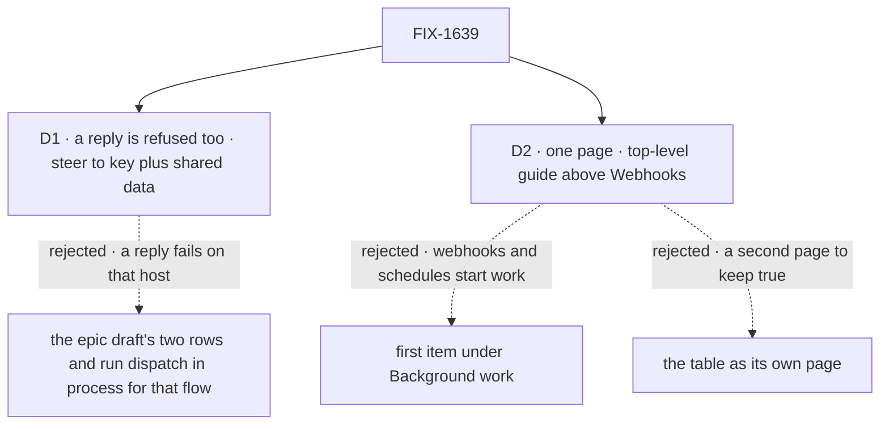

# FIX-1639 · Decisions

[Spec](SPEC.md) · **Decisions** · [Rules](BUSINESS-RULES.md) · [Plan](PLAN.md) · [Docs](DOCS.md) · [Evolution](EVOLUTION.md)

Two calls. The epic already made the big ones (one page, a new page rather than a nav entry,
only shipped doors in the event row); this spec inherits them and doesn't reopen them. D1 is
what the page tells a queue-host builder, corrected by running it. D2 is where the page lives
and what shape it takes.

## The tree

Solid edges are what you're signing. Dashed edges lost, and the label says why.

## D1 · On a queue-backed host, the page says a reply is refused too, and steers hand-offs to a key plus data both sides read

| | |
|---|---|
| **Instead of** | The epic's draft: a two-row table (`{ key }` works, `{ id }` refused) and *"run dispatch in process for that flow, or design the hand-off so the receiving side starts from a key"*, which the epic asked this issue to confirm before publishing |
| **Because** | Confirming it found two gaps. A `{ from: true }` reply is a delivery into an existing session and is refused `external-dispatcher` on the same host ([poc F3](poc/page-facts/README.md)), so a builder following the draft would start work with a key and then fail reporting back. And there is no per-flow way to "run dispatch in process": the queue is set on the whole host. What works on every host is a `{ key }` hand-off whose result lands in state both sides read (a user- or org-scoped resource, a board), which the conversation reads or finds with `listChildSessions`. Goal 4 says state a limitation plainly; stated one row short, it isn't |
| **Locks in** | The page publicly names three session choices and says two are refused on a queue host. Builders on BullMQ will design hand-offs as fire-and-collect rather than call-and-reply until FIX-1634 ships; when it does, FIX-1634 rewrites the paragraph and the table's third column. The reference refusal table gets the same wording (one row) so the two pages agree |

It comes down to the reply: under the draft, a builder's report-back fails on the very host it warns about.

**What would change my mind:** a reply taking a different path from `{ id }` on a queue host.
F3 says it doesn't; the closure re-checks it on a real Redis.

## D2 · One page, a top-level guide above *Webhooks*; the table and the terms are sections of it

| | |
|---|---|
| **Instead of** | The epic draft's placement, first item under *Background work* · the table as its own linkable page, which D1 of the epic allowed |
| **Because** | The page starts with webhooks and schedules, which *start* work rather than outlive it; the epic's own D2 used that argument to keep them out of *Work that outlives the turn*, and filing the page under *Background work* would undo it. Above *Webhooks* it sits over the three sections it links. One page is one URL to share, one place for the closure to start from, and one place to keep true; the table reads against the steps above it, and a linkable anchor (`#where-each-setting-lives`) gives it an address without a second page |
| **Locks in** | A new top-level entry in the guides nav, and a page of about 1,500 words. If the table later needs a life of its own (FIX-453's architecture work, say), splitting it out is a move plus a redirect |

It comes down to what the page opens with: filed under *Background work*, webhooks and schedules sit where they don't belong.

## Decided, not asked

- **One `billing` flow in every example**, the flow the webhook and schedule reference pages
  use, so a reader who clicks through meets the same names.
- **A verified caller in every sample** (PR-1): a webhook verifier on the host, a bearer secret
  for the scheduler. Body `userId` appears once, as the named local-development default.
- **"Later" is a stored schedule** (`schedules.resolve`); no delay on a dispatch (ER-11).
- **`worker-only` is described, not recommended**: its runs aren't durable.
- **No wake-exploration example is linked**: none is merged, and the owner parked them.
- **`epic-wake` gets one line in `docs/contributing/orchestration.md`**, never `apps/docs`.

## Considered and dropped

| Alternative | Why not |
|---|---|
| Publish the epic's draft unchanged | It passes the names check and fails the fence: the reply row is missing |
| Offer a `worker-only` process as the way into an existing session | True, and a trap: no retries, and the web tier must run `dispatch-only` |
| Re-teach each reference page on this one | ER-9: they are right; the page gives the smallest working code and links |

## Settled

- **A `{ from: true }` reply is refused `external-dispatcher` on a queue host, like `{ id }`** —
  **CONFIRMED** on the shipped runtime, with an in-process control that delivers it.
  [poc/page-facts F3](poc/page-facts/fence.evidence.txt).
- **A webhook whose `sessionId` names an existing session still runs on a queue host** —
  **CONFIRMED**, F4. The refusal is a flow-to-flow delivery rule, not a transport one.
- **Every name the draft uses resolves on `main` at `c63ee231c`** — **CONFIRMED**, 54 spans,
  72 checks, three controls each failing on what was planted.
  [poc/page-facts names](poc/page-facts/names.evidence.txt).

## How it got here

- **Draft** — framed as the epic's whole path on one page (D1 fold); reconciled the epic's
  `DOCS.md` against `main` with two checkers, which confirmed every name and found the reply
  row the draft lacked; placed the page above *Webhooks*; one docs PR.

**Open: none.**
