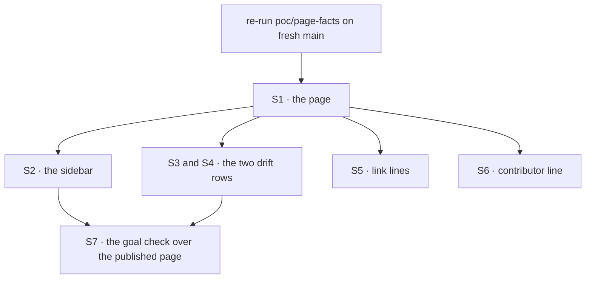

# FIX-1639 · Plan

[Spec](SPEC.md) · [Decisions](DECISIONS.md) · [Rules](BUSINESS-RULES.md) · **Plan** · [Docs](DOCS.md) · [Evolution](EVOLUTION.md)

Written for the implementing agent. IDs cross-reference [BUSINESS-RULES.md](BUSINESS-RULES.md)
(BR-n), [DECISIONS.md](DECISIONS.md) (D-n) and the epic's rules (ER-n). Docs only, `tdd` does
not apply: the discipline is *check the page, then publish it*. One PR, no changeset (no
package changes; BP-022).

## Surfaces

| ID | Where | Change | Rules |
|---|---|---|---|
| S1 | `apps/docs/guides/keeping-a-flow-running.md` | **Create** from [DOCS.md](DOCS.md), through `docs-writer` then `docs-editor` | BR-1–BR-18 |
| S2 | `apps/docs/sidebarsGuides.ts` | Insert the page as a top-level item directly before the `Webhooks` category (D2) | BR-1 |
| S3 | `apps/docs/docs/advanced/inbound-transports.md` · *Known sources* | Reword the `notification` row; keep the value in the list above it | BR-20 |
| S4 | `apps/docs/docs/server/background-work.md` · refusal table | `external-dispatcher` row names `id` and a `{ from: true }` reply (D1) | BR-21 |
| S5 | `background-work.md` guide, `webhooks.md`, `scheduled.md` | One link each, nothing else | BR-22 |
| S6 | `docs/contributing/orchestration.md` · the `epic-wake` bullet | Append the one sentence in DOCS.md | BR-15 |
| S7 | `goals/keeping-a-flow-running/follows-as-written/` | **Create** the goal check: `goal.md` + `run.mts` (the fixture leg) calling the two page-facts scripts | the goal |

Nothing is removed. No runtime file changes (ER-6).

## Sequence



## Checks

| ID | Runs after | Passes when |
|---|---|---|
| V0 | start | `names.mts` and `fence.mts` pass on fresh `main` against DOCS.md. A failure means `main` moved: fix the draft first |
| V1 | S1, and every later edit to the page | `PAGE=apps/docs/guides/keeping-a-flow-running.md` `names.mts` passes with zero failures and zero unclassified spans. A new span the editor added gets a classification, never a skip. Also run over S3 and S4's edited files |
| V2 | S1 | `fence.mts` F1–F4 pass, and fail under `CONTROL=in-process`. The page's fence paragraph, table column and S4's row say what F1–F4 show |
| V3 | S1 | `grep -rniE 'epic-wake|conductor|devforce|heartbeats?\b|FIX-[0-9]|#[0-9]{3,}|route:|subscribe|wakes:' apps/docs/guides/keeping-a-flow-running.md` prints only the one *Heartbeat* line in *Terms* (BR-15–BR-17) |
| V4 | S2 | `pnpm --filter @flow-state-dev/docs build` succeeds with no broken links; the page is in the guides nav above *Webhooks* |
| V5 | S3–S6 | `git diff --stat` touches only S1–S7; S3–S5 diffs are the stated rows and lines |
| VG | S7 | [The goal](SPEC.md#the-goal-and-how-well-know-its-met): `pnpm exec tsx goals/keeping-a-flow-running/follows-as-written/run.mts` PASSES all three legs, after the same run FAILED under `GOAL_CONTROL=planted-option` on the names leg |

Second path (BP-035): the fixture leg also runs the schedule dispatch **without** the bearer
secret and expects `401`, and swaps Stripe for GitHub as the provider.

## Pinned names

| Where | Name | Why pinned |
|---|---|---|
| Page file | `apps/docs/guides/keeping-a-flow-running.md` | The closure (FIX-1642) starts from it; links point at `/guides/keeping-a-flow-running` |
| Page title and label | *Keeping a flow running* | The closure finds it in the nav by name |
| Table anchor | `#where-each-setting-lives` | D2 gives the table an address without a second page |
| Goal path | `goals/keeping-a-flow-running/follows-as-written/` | `SPEC.md` names it |

Everything else, including section wording after the editor pass, is yours, as long as V1–V3
stay green.

## Guardrails

| Rule | Because |
|---|---|
| Every code span on the page is classified in `names.mts` before merge | The page's value is that its names are real. A span nobody checks is the one that rots (tenet 7) |
| The fence paragraph is written from `fence.mts`'s output, not from memory or the epic's draft | The draft was one row short; the runtime is the authority (ER-4) |
| Examples show a verified caller: a webhook verifier on the host, a bearer secret for the scheduler | PR-1. A copied sample becomes production code |
| The page links; it doesn't re-teach | The reference pages are right (ER-9). A second explanation is a second thing to keep true |
| No example or name from FIX-1641/1643/1644/1645 | Parked explorations, not framework surface (ER-6) |
| `docs-writer` then `docs-editor` write the prose from DOCS.md; you don't | CLAUDE.md: context leaks into prose written while holding a spec |

## Docs

This issue *is* the docs. Publish [DOCS.md](DOCS.md)'s operations as S1–S6 once V0 passes,
and reconcile anything the editor changes back through V1. No README or changeset: no package
API changes.

## POC

**[`poc/page-facts/`](poc/page-facts/README.md)** — two scripts on the spec branch.
`names.mts` resolves every name on the draft against `main` (54 spans, 72 checks; three
controls fail on what they plant). `fence.mts` runs the queue-host paragraph on the shipped
runtime with an external dispatcher (F1–F4 pass; all four fail under the in-process control).
**It moved the design:** F3 showed a `{ from: true }` reply is refused too, which the epic's
draft lacked, and D1 follows from it. The names premise held.

## Sketch · the goal check's fixture leg, illustrative

```
fixture host  ← the page's billing flow, both samples merged, one resolvePrincipal
                branching on ctx.source (the page says to), in-memory stores
POST webhook  → expect 202; wait; expect the recordPayment run completed
POST schedule dispatch with bearer  → expect 202; without  → expect 401
run an action whose block is the page's dispatcher({ key })
              → the action's request completes BEFORE the dispatched run does
names leg     ← names.mts with PAGE=<published page>     (GOAL_CONTROL=planted-option → CONTROL=false-option)
fence leg     ← fence.mts
```

## At implement time

- **Re-check the epic's amendment #2394.** If it merged with changes to D1's fold, the ER
  ownership, or the epic's `DOCS.md`, reconcile before publishing.
- **Re-run V0 on fresh `main`.** The draft was checked at `c63ee231c`.
- **FIX-1634 may have moved.** If `{ id }` works on a queue host by then, the fence paragraph,
  the table's third column and S4 change with it, and this plan's F2/F3 expectations flip.
- **The sidebar may have changed.** If a *Webhooks* category no longer leads that part of
  `sidebarsGuides.ts`, keep D2's intent: top level, above the webhooks and schedules material.

## Follow-ups

- `names.mts` is a reusable shape: a docs page whose every code span is classified and checked.
  If the closure or `polish-docs` wants it for other guides, lift it into a shared script. Not
  in scope here.
