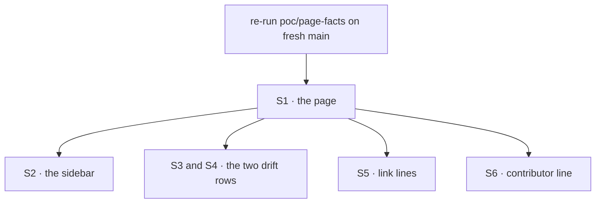

# FIX-1639 · Plan

[Spec](SPEC.md) · [Decisions](DECISIONS.md) · [Rules](BUSINESS-RULES.md) · **Plan** · [Docs](DOCS.md) · [Evolution](EVOLUTION.md)

Written for the implementing agent. IDs cross-reference [BUSINESS-RULES.md](BUSINESS-RULES.md)
(BR-n), [DECISIONS.md](DECISIONS.md) (D-n) and the epic's rules (ER-n). Docs only, `tdd` does
not apply: the discipline is *check the page, then publish it*. One PR, no changeset (no
package changes; BP-022).

## Surfaces

| ID | Where | Change | Rules |
|---|---|---|---|
| S1 | `apps/docs/guides/keeping-a-flow-running.md` | **Create** from [DOCS.md](DOCS.md), through `docs-writer` then `docs-editor` | BR-1–BR-14, BR-18 |
| S2 | `apps/docs/sidebarsGuides.ts` | Insert the page as a top-level item directly before the `Webhooks` category (D2) | BR-1 |
| S3 | `apps/docs/docs/advanced/inbound-transports.md` · *Known sources*, and `docs/architecture/inbound-transports.md` · the same table | Reword the `notification` row in both, same words; keep the value in the list above it | ER-9 |
| S4 | `apps/docs/docs/server/background-work.md` · refusal table | `external-dispatcher` row names `id` and a `{ from: true }` reply from a process that enqueues (D1) | ER-9 |
| S5 | `background-work.md` guide, `webhooks.md`, `scheduled.md` | One link each, nothing else | ER-9 |
| S6 | `docs/contributing/orchestration.md` · the `epic-wake` bullet | Append the one sentence in DOCS.md | ER-8 |

Nothing is removed. No runtime file changes (ER-6).

## Sequence

## Checks

| ID | Runs after | Passes when |
|---|---|---|
| V0 | start | `names.mts`, `compile.mts` and `fence.mts` pass on fresh `main` against DOCS.md. A failure means `main` moved: fix the draft first |
| V1 | S1, the final page | With `PAGE=apps/docs/guides/keeping-a-flow-running.md`: `names.mts` passes with zero failures and zero unclassified spans, and fails under `CONTROL=false-option`; a new span the editor added gets a classification, never a skip. `compile.mts` compiles every code fence, strict, against package source, and fails under `CONTROL=unminted`. For S3 and S4, a targeted check instead: each edited row in the three files matches DOCS.md's row verbatim (`grep -F`), and nothing else in those files changed |
| V2 | S1, the final page | `fence.mts` F1–F5 pass, and fail under `CONTROL=in-process`. The page's fence paragraph, table column and S4's row say what F1–F5 show |
| V3 | S1 | `grep -rniE 'epic-wake|conductor|devforce|heartbeats?\b|FIX-[0-9]|#[0-9]{3,}|route:|subscribe|wakes:' apps/docs/guides/keeping-a-flow-running.md` prints only the one *Heartbeat* line in *Terms* (ER-6–ER-8) |
| V4 | S2 | `pnpm --filter @flow-state-dev/docs build` succeeds with no broken links; the page is in the guides nav above *Webhooks* |
| V5 | S3–S6 | `git diff --stat` touches only S1–S6; S3–S5 diffs are the stated rows and lines |

V0, V1 and V2 each run once, in the implementation PR: V0 on DOCS.md before writing, V1 and V2
on the final page. No goal check: docs only ([SPEC](SPEC.md#the-goal-and-how-well-know-its-met)).

Second path (BP-035): F5 is the other topology (a `worker-only` worker), and `names.mts`'s
`CONTROL=wrong-segment` checks a route addressed by something other than the flow's `kind`.

## Pinned names

| Where | Name | Why pinned |
|---|---|---|
| Page file | `apps/docs/guides/keeping-a-flow-running.md` | The closure (FIX-1642) starts from it; links point at `/guides/keeping-a-flow-running` |
| Page title and label | *Keeping a flow running* | The closure finds it in the nav by name |
| Table anchor | `#where-each-setting-lives` | D2 gives the table an address without a second page |

Everything else, including section wording after the editor pass, is yours, as long as V1–V3
pass.

## Guardrails

| Rule | Because |
|---|---|
| Every code span on the page is classified in `names.mts` before merge | The page's value is that its names are real. A span nobody checks is the one that rots (tenet 7) |
| The fence paragraph is written from `fence.mts`'s output, not from memory or the epic's draft | The draft was one row short; the runtime is the authority (ER-4) |
| Examples show a verified caller: a webhook verifier on the host, a bearer secret for the scheduler | PR-1. A copied sample becomes production code |
| The page links; it doesn't re-teach | The reference pages are right (ER-9). A second explanation is a second thing to keep true |
| No example or name from FIX-1641/1643/1644/1645 | Parked explorations, not framework surface (ER-6) |
| `docs-writer` then `docs-editor` write the prose from DOCS.md; you don't | CLAUDE.md: context leaks into prose written while holding a spec |

## Docs

This issue *is* the docs. Publish [DOCS.md](DOCS.md)'s operations as S1–S6 once V0 passes,
and reconcile anything the editor changes back through V1. No README or changeset: no package
API changes.

## POC

**[`poc/page-facts/`](poc/page-facts/README.md)** — three one-time checks: every name
resolves, every code fence compiles, and the queue-host paragraph matches the runtime. What
each showed is in the README, the one home for it. **It moved the design:** F3 and F5 showed
where a `{ from: true }` reply is refused, which the epic's draft lacked, and D1 follows from it.

## At implement time

- **Re-check the epic's amendment #2394.** If it merged with changes to D1's fold, the ER
  ownership, or the epic's `DOCS.md`, reconcile before publishing.
- **Re-run V0 on fresh `main`.** The draft was checked at `07df7f9d0`.
- **FIX-1634 may have moved.** If `{ id }` works on a queue host by then, the fence paragraph,
  the table's third column and S4 change with it, and this plan's F2/F3/F5 expectations flip
  ([FIX-1656](https://linear.app/fixpoint-labs/issue/FIX-1656)).
- **The sidebar may have changed.** If a *Webhooks* category no longer leads that part of
  `sidebarsGuides.ts`, keep D2's intent: top level, above the webhooks and schedules material.
