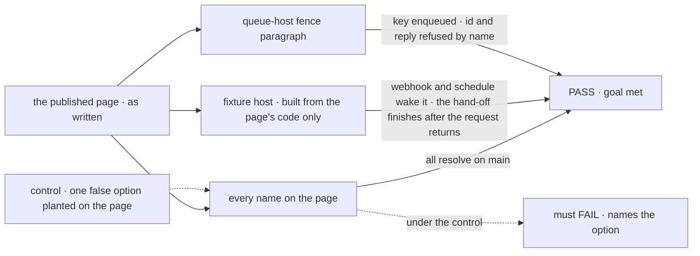

# FIX-1639 · Keeping a flow running: one guide page from an outside event to work that keeps going

**Spec** · [Decisions](DECISIONS.md) · [Rules](BUSINESS-RULES.md) · [Plan](PLAN.md) · [Docs](DOCS.md) · [Evolution](EVOLUTION.md)

Docs only · `apps/docs` + one contributor line · small · 1 PR · epic
[FIX-1637](https://linear.app/fixpoint-labs/issue/FIX-1637) ([spec](../../epics/FIX-1637/SPEC.md),
[#2368](https://github.com/fixpoint-labs/flow-state-dev/pull/2368); D1 fold recorded in
[#2394](https://github.com/fixpoint-labs/flow-state-dev/pull/2394)) · blocks the closure
[FIX-1642](https://linear.app/fixpoint-labs/issue/FIX-1642)

## Five builders, before and after

| A builder who… | Today | After |
|---|---|---|
| **wants a flow to react to an outside service** | Finds *Webhook receivers*. Nothing joins it to schedules or to work that keeps going | One guide walks webhook, schedule, hand-off: the smallest working code for each, then a link |
| **wants a flow to run on a clock** | Reads six pages to learn which parts are theirs | One table: what goes in the flow, what goes on the host, what their scheduler calls |
| **runs on a queue-backed host (BullMQ)** | Meets the refusal as one table row naming only `id`, or as a channel that never answers | Reads before building: `{ key }` works, `{ id }` is refused by name, **so is a reply**, and what to do instead |
| **meets *wake*, *dispatch*, *tick*** | Sees the words everywhere, defined nowhere. *Heartbeat* here means a live stream's liveness | Each defined once, in a sentence |
| **uses Workforce channels and boards** | Reads an 800-line channels page to tell the conversation from the work list | One paragraph: a channel holds the talk, a board holds the work |

**The kill line doesn't fire.** Of the page's five steps, four are "here is how" with shipped
code. The fifth is mostly how too (`{ key }` works on every host); its "not yet" is one
paragraph about delivering into a session that already exists on a queue host
([BR-8 to BR-14](BUSINESS-RULES.md#on-a-queue-backed-host)). A nav entry alone can't carry the table, the
fence or the terms (epic [D2](../../epics/FIX-1637/DECISIONS.md#d2)).

## The goal, and how we'll know it's met

**A builder who wants a flow to start from a webhook or a clock, and to hand work off past the
request that started it, can do it from one guide page: which shipped door to use, what goes in
the flow, on the host and in their own infrastructure, and what a queue-backed host refuses,
with every name on the page real.**

| Is it the right goal? | |
|---|---|
| **The real need** | The epic's: *"one coherent published path so builders know how a flow stays alive 24/7 without inventing product nouns"* ([FIX-1637](../../epics/FIX-1637/SPEC.md#the-goal-and-how-well-know-its-met)). After the D1 fold, this issue carries all of it |
| **Smaller, and rejected** | "Publish the epic's draft as written." It would teach a two-row session table and let a reader plan to report back with a reply, which fails on exactly the host the section warns about ([poc F3](poc/page-facts/README.md)) |
| **Bigger, and not this issue's** | `{ id }` working on BullMQ (FIX-1634, under FIX-1635) · the QA run from the nav on a real Redis (the closure, FIX-1642) · per-cloud deploy how-tos |
| **Not done if** | A name on the page doesn't resolve on `main` · the fence paragraph disagrees with the runtime · the fixture needed something the page didn't say · `epic-wake`, a Heartbeats noun or an issue number reaches `apps/docs` · a wake-POC shape is taught as a framework feature |



The check reads the published page, not the draft, and a false option planted on it must turn
the run red.

| How we verify | |
|---|---|
| **Goal check** | `goals/keeping-a-flow-running/follows-as-written/` · model n/a · run by the implementer at completion · verdict in the implementation PR. The QA run from the nav on a real BullMQ host is the closure's, not this |
| **Signal** | Three legs, all green. Names: [`names.mts`](poc/page-facts/README.md) over the published page, zero failures. Fixture: a host assembled only from the page's samples answers the webhook `202` and the schedule dispatch `202` (and `401` without the secret), and the handed-off work finishes after the request that started it has returned. Fence: [`fence.mts`](poc/page-facts/README.md) F1–F4 pass |
| **Input** | The page as merged. A second provider (GitHub instead of Stripe) or a second schedule id must pass the fixture leg too |
| **Anti-game** | No reading package source to fill a gap the page left; a fix goes on the page. No asserting on the spec's draft instead of the published file |
| **Control that must fail** | `GOAL_CONTROL=planted-option`: the page gains `dispatcher({ delay })`. The names leg must FAIL on *`delay` does not resolve*, before the PASS counts |

## What changes

![What changes: one new guide page at the top of the webhooks, background work and schedules sections of the guides nav, in order webhook, schedule, work that keeps going, new session or existing, channel or board, where each setting lives, terms. It links, not rewrites, the eight reference pages and the scheduler guides. Four one-line edits: the notification source row, the external-dispatcher refusal row, three link lines, and the epic-wake contributor line. Below a fence, not built: the id fix, a Heartbeats noun, new nouns, the wake-POC shapes, a per-cloud guide](figures/what-changes.svg)

One page in the nav, four one-line edits beside it, and everything below the fence left alone.

**What a builder on a queue host reads, against the epic's draft:**

```diff
  | `session` | Runs in | On a host that hands work to a queue |
  | `{ key: (input) => string }` | a session derived from the key | Works |
  | `{ id: (input) => string }` | a session that already exists | Refused before anything starts |
+ | `{ from: true }` | the session that dispatched this run, as a reply | Refused before anything starts |

- If your work has to reach a session that already exists, run dispatch in process for that
- flow, or design the hand-off so the receiving side starts from a key.
+ Start the work with a `{ key }`, have it write what it found somewhere both sides can read,
+ and read it from the conversation. If the flow really has to deliver into an existing
+ session, serve it from a host with no queue worker, and accept that its runs aren't retried.
```

## What stays as it is

- **The refusal.** The page states it; FIX-1634 owns changing it.
- **The reference pages and guides** it links: linked, and fixed only where they disagree with
  `main` (two rows).
- ***Work that outlives the turn*** stays the map for side chains, queues and dispatch.
- **The wake explorations** (FIX-1641, 1643, 1644, 1645): parked; nothing from them is taught
  or linked.

## Sign off

**[The goal](#the-goal-and-how-well-know-its-met), at that size:** the whole epic path on one
page, proven by building from it, with the queue-host gap stated one row wider than the epic
drafted it. If wrong: a page nobody can build from, or one that tells queue-host builders a
route that fails.

1. **[D1](DECISIONS.md#d1) · On a queue host, the page says a reply is refused too, and steers
   hand-offs to a key plus data both sides read.** If wrong: builders on queue hosts plan
   around a limitation stated wider than it is, or narrower and hit it in production.
2. **[D2](DECISIONS.md#d2) · One page, a top-level guide above *Webhooks*; the table and the
   terms are its sections.** If wrong: a long page, or a guide filed where readers of
   webhooks and schedules don't look.

**Open: none.** D1 is the one to weigh. Reasoning: [DECISIONS.md](DECISIONS.md). Cases:
[BUSINESS-RULES.md](BUSINESS-RULES.md). Order: [PLAN.md](PLAN.md). The page itself:
[DOCS.md](DOCS.md).
