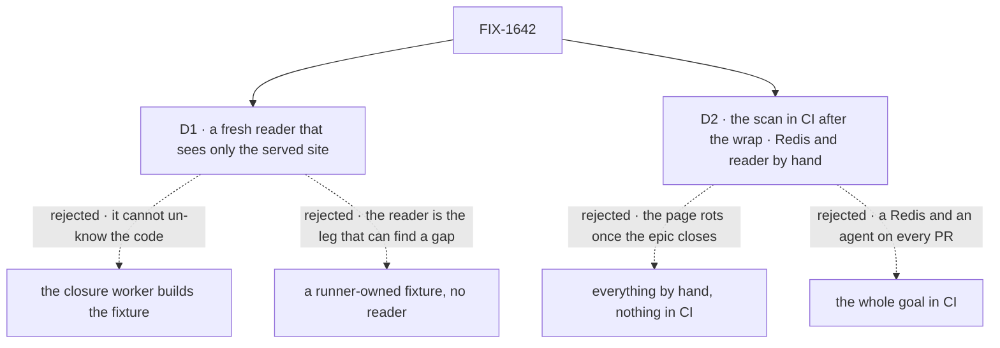

# FIX-1642 · Decisions

[Spec](SPEC.md) · **Decisions** · [Rules](BUSINESS-RULES.md) · [Plan](PLAN.md) · [Docs](DOCS.md)

The [closure rule](../../../docs/contributing/orchestration.md#the-closure-issue-every-epic-ends-in-qa)
fixes the plan's four parts and their order, and the epic's
[ER-15](../../epics/FIX-1637/BUSINESS-RULES.md#the-closure) fixes what the goal check proves.
These cards are the calls left open: who reads the page, and what outlives the wrap.

## The tree

Solid edges are what was chosen. Dashed edges lost, and the label says why.

## D1 · The page is followed by a fresh agent that can see only the served docs site

It comes down to a gap on the page: the worker fills it from memory, and the run passes anyway.

| | |
|---|---|
| **Instead of** | (a) The closure worker builds the fixture from the page. (b) A fixture the runner owns, checked against the page, with no reader at all |
| **Because** | The epic's anti-game is *no reading the source to fill a gap the page left*, and its *not done if* includes a reader who must leave the page's links. Only a reader that never had the source can fail those. (a) The worker has read the code for this plan and can't un-know it. (b) Proves the runtime, not that the page gets a builder there; it is the smaller goal SPEC.md rejects |
| **Locks in** | Each full run dispatches one reader with a pinned brief, packed packages in a scratch project outside the workspace, and the site served locally. Its transcript is audited: a read under `node_modules` or the workspace, or a page more than one link from the page, voids the run. The reader keeps a gap log, and every entry is a finding. One reader per run: the planted controls go to the scan, not to a second reader |

**What would change my mind:** a runnable example project, linked from the page and built in
CI. Then the reader leg shrinks to "the example matches the page".

## D2 · The name scan stays in CI after the wrap; the Redis and reader run stays a by-hand goal, once per `main` commit

It comes down to a rename next year: only the CI scan fails it before the page lies.

| | |
|---|---|
| **Instead of** | (a) Everything by hand, as goals are. (b) The whole goal in CI, with a Redis service and an agent |
| **Because** | The coordinator's note asks for the tiers, and the POC shows the scan needs no model, no Redis and no reader. The page's value is that it stays true (Goal 4); the orchestration rule asks a clean run to commit its checks where they keep running. (a) Lets the page drift silently. (b) Puts an agent on every PR, and the engine's own tests already keep the refusal in CI |
| **Locks in** | One CI step over the keeping-flows-alive page and its table only, resolving each key against the type it is passed to. A PR that renames a name the page uses fails until the page changes. The reader, the fixture and the Redis fence are run by hand, once per `main` commit, as goals are |

**What would change my mind:** the step reddening PRs that didn't change the page's meaning
more often than it catches drift. Then it moves to the by-hand tier.

## Decided, not asked

- **The run starts from Linear, not from the set table.** Every issue Linear lists as blocking
  this one is merged or closed, and CI is green on the chosen commit. FIX-1638 and FIX-1640
  are canceled as folded and add nothing; epic amendment
  [#2394](https://github.com/fixpoint-labs/flow-state-dev/pull/2394) records that, and this spec
  merges after it. Linear is read again just before the closure PR opens.
- **The wake POCs are not checked.** FIX-1641, 1643, 1644 and FIX-1645 are parked by the owner
  and may leave the epic. While Linear lists one as blocking, the run waits for it; it never
  runs one's check.
- **The fixture is model-free.** Wakes and hand-off are the point; handler blocks keep the run
  keyless and repeatable.
- **The fence runs in one mode, the reader's own host.** That is what the epic's Proof asks:
  `{ id }` refused by name and `{ key }` runs, plus a `{ from: true }` reply as FIX-1639's page
  states its topology rule (not refused from a `worker-only` consumer). A colocated refusal, if
  the page states one, is the one extra assertion. The other topologies and the channel sentence
  are runtime claims the engine and workforce tests already own
  (`dispatch-delivery-guards.test.ts`, `channel-post-fences.test.ts`).
- **The noun sweep is the epic's *not done if*.** `epic-wake` and Heartbeats nouns, whole word,
  over `apps/docs`. The wider ER-8 bans are FIX-1639's review.

## Considered and dropped

| Option | Why it lost |
|---|---|
| A flat name index as the scan | The [POC](poc/page-key-scan/README.md) passed `schedules.static.<id>.priority`, a real option on the wrong object |
| Assert the webhook's 202 and a later effect | A hand-off run inside the request, or a `.sideChain()`, passes that too. The hand-off waits on a latch the runner opens only after the response |
| Parse the fence prose into claims each run | Brittle. The claims are pinned once, each with the page text it anchors to, so a changed sentence fails the anchor rather than passing silently |
| A reader per journey | One reader carries the app brief and the two part-2 journeys; separate readers cost more and share the same site |

## Open / Settled

**Open:** none.

**Settled:** *A page's names can be resolved mechanically, with a totality rule.* Held for
invented names and failed for a real name on the wrong owner, on `main` c63ee231
([POC](poc/page-key-scan/README.md)). Resolved: the scan resolves against the owning type.

## How it got here

- **Draft** — the closure's QA plan, framed as the epic's goal check run by a reader who can't
  see the code; four parts on one commit, a POC showing why the name scan must resolve against
  the owning type, and the scan kept in CI after the wrap.
- Restraint pass (coordinator, 2026-09-29): trimmed to the approved Proof; see PR comment.
