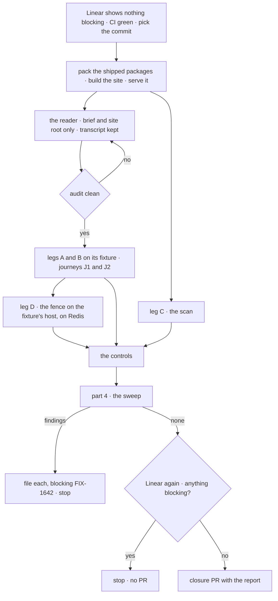

# FIX-1642 · Plan

[Spec](SPEC.md) · [Decisions](DECISIONS.md) · [Rules](BUSINESS-RULES.md) · **Plan** · [Docs](DOCS.md)

Written for the closure worker. It starts when Linear shows nothing blocking this issue (QR-1)
and adds only the goal check and one CI step. The page is FIX-1639's; its path and section
anchors bind once FIX-1639's spec merges. The page draft is the epic's
[DOCS.md](../../epics/FIX-1637/DOCS.md#create--appsdocsguideskeeping-a-flow-runningmd).

**Prerequisite.** This spec merges after epic amendment
[#2394](https://github.com/fixpoint-labs/flow-state-dev/pull/2394), which records the epic's D1 as
the fold and FIX-1638 and FIX-1640 as canceled. Until #2394 merges, the epic spec still says
otherwise, and this plan's start conditions rest on it.

## Surfaces

| ID | Where | Change |
|---|---|---|
| S1 | `goals/keeping-flows-alive/follows-the-page-as-written/` | `goal.md` from [SPEC.md's goal](SPEC.md#the-goal-and-how-well-know-its-met); `reader-brief.md`, the app brief; `claims.json`, the fence's three claims (`{ id }` refused by name, `{ from: true }` refused by name, `{ key }` runs), each with its page anchor; `run.mts`, which builds the site and the packs, serves them, then runs legs A to D, the journeys' mechanical parts and part 4 on the reader's fixture |
| S2 | The scan | One implementation, called by leg C and by CI. Reads the published page only. Totality: every inline code token and every code fence is classified, or it fails. Keys resolve against the type they are passed to; routes by method and path together ([below](#the-scan)) |
| S3 | `.github/workflows/ci.yml`, the job that builds packages | One step running S2 over the page ([D2](DECISIONS.md#d2)) |
| S4 | S1's controls | Each acts on a scratch copy of the page or of the fixture, never the tree |
| S5 | The closure PR | Only after a run that files nothing: S1 with the reader's fixture, gap log and verdict row, S2, S3, and the report as its body. No changeset |

## Sequence

## Checks

The reader gets the site's root URL, [`reader-brief.md`](#the-reader-brief) and an empty
scratch project with the packed packages installed. It returns the fixture, its page trail
and its gap log.

| ID | Passes when |
|---|---|
| A | The reader's trail starts at the site root and reaches the page from the nav. Every other page it read is linked from the page. Its gap log is empty |
| B1 | **Webhook.** A delivery signed as the page's provider signs it, with this run's token and customer, answers as the page says; the customer's session then carries the token |
| B2 | **Schedule.** A tick on the page's dispatch route with the scheduler's secret runs the schedule; the effect carries the tick's id |
| B3 | **Hand-off.** After B1's and B2's responses arrive, each follow-up's effect is absent. The runner then opens the latch the brief names; each effect appears within 30 s, carrying its token. The fixture runs as the brief asks, `dispatch-only` with a worker process |
| B4 | **Into an existing session.** The brief's note reaches the customer's existing session by the route the page gives instead of `{ id }` on this host |
| C | S2 over the published page: every token resolved on its owning type; totality line printed |
| D | On the reader's own fixture host (`dispatch-only` with a worker, per the brief), each of the three claims in `claims.json` holds and its anchor is on the page: `{ id }` throws `DispatchRefusedError` with `refused: "external-dispatcher"`, the queue's job counts and the target session unchanged; `{ from: true }`, a reply into the sending conversation, is refused the same way; `{ key }` enqueues and completes. The other topologies and the channel sentence are runtime claims their own tests own: `packages/engine/test/context/dispatch-delivery-guards.test.ts` and `packages/workforce/test/channel-post-fences.test.ts` |
| J1 | **Terms.** The page defines *wake*, *dispatch* and *schedule tick* once each. The reader answers the brief's three term questions with the page's own sentence |
| J2 | **Channel or board.** The reader answers the brief's question with a channel for the conversation and a board for the work, reaching both linked pages within one link |

**Part 3 · the children's checks.** The closure rule's item 3 skips a child check that item 1
already walks, and part 1 walks FIX-1639's. Once FIX-1639's spec merges, only the parts of its
check the reader leg doesn't reach are re-run, if any. Any other child Linear lists as merged
and blocking has its own check re-run; canceled ones have none.

## Controls

Each must fail its own leg, at its own claim, and leave the rest green.

| Control | Plants | Must fail | Stays green |
|---|---|---|---|
| `planted-invented` | An option that exists nowhere, in the webhook row the brief makes the reader use (`bullmqWorker({ connection, inlineDispatch: true })` shape) | C, naming it | D |
| `planted-wrong-owner` | A real option on the wrong object (`schedules.static.<id>.priority`) | C, naming it on the schedule | D |
| `flipped-fence` | The fence sentence flipped to say `{ id }` runs on a queue host | D, at the `{ id }` claim's anchor text | C |
| `inline-handoff` | The reader's hand-off swapped for `.sideChain()` at the seam it wrote | B3: the response never arrives before the latch opens | B1 · B2 · D |

The POC shows why both planted kinds: a flat lookup fails the first and passes the second.
Each plant goes into a scratch copy of the page, and only the scan reads it. One reader runs per
full run, and it never sees a plant.

## The scan

Code fences are typechecked in the scratch project, so a wrong-owner option in an object
literal fails. Inline tokens resolve by kind: a package entry against its `exports`; a route
against the mounted route table, method and path together (a `GET` on a POST-only path fails),
parameters matched by position (the scheduled route mounts
`*scheduleId`); a quoted literal against the union it belongs to; a key path against the type
its root names, through a small table of roots (the flow definition, `createFlowState`'s
options, `dispatcher()`'s, `bullmqWorker()`'s). A root the table lacks fails. Evidence for the
shape: [POC](poc/page-key-scan/README.md).

## Part 4 · gap sweep

Four things that parts 1 and 2 don't grade. Re-auditing the page rule by rule is FIX-1639's
review, not this sweep.

| Check | Passes when |
|---|---|
| **Seams** | The epic's seams that touch the page: the fence is leg D. *Work that outlives the turn* is linked and its table not repeated. The `notification` row is reworded and `InboundSource` still lists the value. The page names none of `wakes:`, `WORKER.md` wake frontmatter, a `subscribe` table or `route:` rules as a framework feature; a link to an example is allowed |
| **The epic's *not done if* nouns** | A grep of `apps/docs` finds no `epic-wake` and no Heartbeats noun, whole word |
| **Terms agree (ER-3)** | No page the page links contradicts its definition of *wake*, *dispatch* or *schedule tick*. The report lists contradictions only |
| **Verified caller (PR-1)** | Every wake row assumes one; a body `userId` appears only as the local-development escape, linking Authentication |

## The reader brief

Pinned in S1, held-out per run: a provider from the page's webhook section and an event, a
customer id, a schedule id and cron, a token, and a latch URL. The app records each delivery in
the customer's session, records each tick, hands off a follow-up that waits for the latch and
then writes the token, and puts a note into the customer's existing session. It runs on BullMQ,
`dispatch-only`, with a worker process. Three term questions and one channel-or-board question
follow. The brief names no API.

## Pinned names

| Where | Name |
|---|---|
| Goal check | `goals/keeping-flows-alive/follows-the-page-as-written/` |
| Controls | `GOAL_CONTROL=planted-invented · planted-wrong-owner · flipped-fence · inline-handoff` |
| The page | FIX-1639's; the epic drafts `apps/docs/guides/keeping-a-flow-running.md` |
| Redis | `REDIS_URL`, or a `redis-server` the runner starts on a free port |

## Guardrails

| Rule | Because |
|---|---|
| No edit to the page, a package or the runtime | The closure proves what shipped; a gap is filed |
| The reader never gets the repository | The one leg that can find a gap needs a reader who can't fill it |
| Claims are pinned with page anchors, never read off the runtime | A claim derived from the runtime cannot disagree with it |
| Never assert a 202 alone; hand-off is proved by the latch | Fire-and-forget answers 202 whether or not work continues |
| Every check on the one commit | A pass elsewhere proves nothing about the set |
| The CI step reads the one page only | D2's cost is bounded to it |

## Docs

No reader-facing change: [DOCS.md](DOCS.md).

## POC

[`poc/page-key-scan/`](poc/page-key-scan/README.md): the draft's 36 tokens resolve; invented
names fail by name; a real option on the wrong object passes a flat lookup. Settled in
[DECISIONS.md](DECISIONS.md#open--settled).

## At implement time

- Bind the page path and the three fence anchors when FIX-1639's spec merges, and name which
  parts of its check, if any, the reader leg doesn't reach (part 3).
- Query Linear's blocked-by list for FIX-1642 again after part 4, immediately before opening
  the closure PR. Any blocker now open stops the PR (QR-2).
- `claims.json` tracks FIX-1639's merged page wording: its spec (#2403) widens the fence to
  `{ from: true }`, so the claims are the page's sentences as merged, not this plan's paraphrase.
- If FIX-1634 ships first, `claims.json` follows the page as FIX-1634's docs work leaves it.
- The reader is a general-purpose agent with a shell in the scratch project; keep its transcript.

## Follow-ups

- `goals/README.md` has no pattern for an agent-reader leg. If this one holds, it earns one.

## Notes from review

For the implementer to weigh against real code. These are below the spec bar and are not folded
into the design.

- **The scan's shape** ([Cursor](https://github.com/fixpoint-labs/flow-state-dev/pull/2402#discussion_r4138837093)):
  *"one TS program per invocation, reuse post-`packages:build` `.d.ts`/exports, targeted route
  table from engine mounts only"*. Don't port `scan.mjs`'s whole-repo property and literal
  harvest. Promote the scan to `scripts/validate-page-keys.mjs`.
- **`run.mts`, once per run or per control** ([Cursor](https://github.com/fixpoint-labs/flow-state-dev/pull/2402#discussion_r4138837102)):
  one site build, one serve and one Redis per run; a control swaps only the page copy or the
  fixture. `run.mts` says which steps are which.
- **Void reader runs** ([Cursor](https://github.com/fixpoint-labs/flow-state-dev/pull/2402#discussion_r4138837089)):
  *"add an implementation cap on transcript-audit retries so a void loop doesn't burn unbounded
  agent time."* At most two re-runs after a void (QR-6), then report INCONCLUSIVE to the owner.
- **Part 4's greps** ([Cursor](https://github.com/fixpoint-labs/flow-state-dev/pull/2402#discussion_r4138837097)):
  the literal checks run as one `rg` pass over `apps/docs`.
