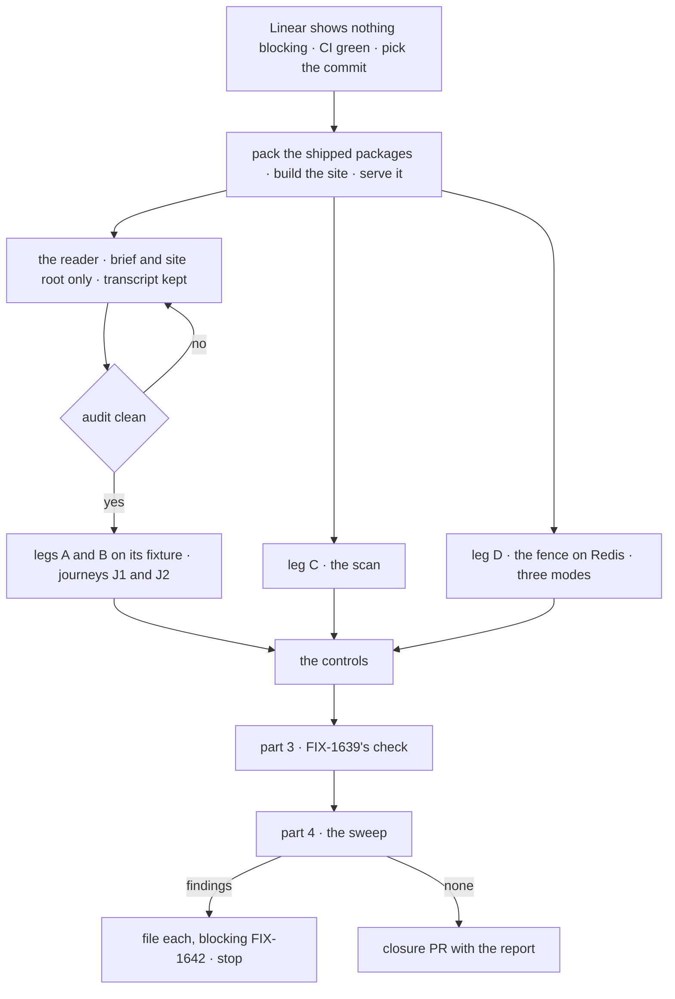

# FIX-1642 · Plan

[Spec](SPEC.md) · [Decisions](DECISIONS.md) · [Rules](BUSINESS-RULES.md) · **Plan** · [Docs](DOCS.md)

Written for the closure worker. It starts when Linear shows nothing blocking this issue (QR-1)
and adds only the goal check and one CI step. The page is FIX-1639's; its path, section
anchors and goal check bind once FIX-1639's spec merges. The page draft is the epic's
[DOCS.md](../../epics/FIX-1637/DOCS.md#create--appsdocsguideskeeping-a-flow-runningmd).

## Surfaces

| ID | Where | Change |
|---|---|---|
| S1 | `goals/keeping-flows-alive/follows-the-page-as-written/` | `goal.md` from [SPEC.md's goal](SPEC.md#the-goal-and-how-well-know-its-met); `reader-brief.md`, the app brief; `claims.json`, the fence's claims each with its page anchor; `run.mts`, which builds the site and the packs, serves them, then runs legs A to D, the journeys' mechanical parts and part 4 on the reader's fixture |
| S2 | The scan | One implementation, called by leg C and by CI. Reads the published page only. Totality: every inline code token and every code fence is classified, or it fails. Keys resolve against the type they are passed to ([below](#the-scan)) |
| S3 | `.github/workflows/ci.yml`, the job that builds packages | One step running S2 over the page ([D2](DECISIONS.md#d2)) |
| S4 | S1's controls | Each acts on a scratch copy of the site, the page or the fixture, never the tree |
| S5 | The closure PR | Only after a run that files nothing: S1 with the reader's fixture, gap log and verdict row, S2, S3, and the report as its body. No changeset |

## Sequence

## Checks

The reader gets the site's root URL, [`reader-brief.md`](#the-reader-brief) and an empty
scratch project with the packed packages installed. It returns the fixture, its page trail
and its gap log.

| ID | Passes when |
|---|---|
| A1 | The served site's nav links the page from the guides sidebar, and the docs build passes with broken links failing it |
| A2 | The reader's trail starts at the site root and reaches the page from the nav. Every other page it read is linked from the page. Its gap log is empty |
| B1 | **Webhook.** A delivery signed as the page's provider signs it, with this run's token and customer, answers as the page says; the customer's session then carries the token. A forged signature is refused and changes nothing |
| B2 | **Schedule.** A tick on the page's dispatch route with the scheduler's secret runs the schedule; the effect carries the tick's id. Without the secret it is refused and changes nothing |
| B3 | **Hand-off.** After B1's and B2's responses arrive, each follow-up's effect is absent. The runner then opens the latch the brief names; each effect appears within 30 s, carrying its token. The fixture runs as the brief asks, `dispatch-only` with a worker process |
| B4 | **Into an existing session.** The brief's note reaches the customer's existing session by the route the page gives instead of `{ id }` on this host |
| C | S2 over the published page: every token resolved on its owning type; totality line printed |
| D | Per mode, each claim in `claims.json` holds and its anchor is on the page. In `colocated` and in `dispatch-only` with a worker: `{ id }` throws `DispatchRefusedError` with `refused: "external-dispatcher"`, the queue's job counts and the target session unchanged; `{ key }` enqueues and completes; a webhook delivery and a schedule tick run. In `worker-only`, while the page says so: `{ id }` from a run it executes delivers. While the page keeps its channel sentence: a client's post is written and wakes no member, and a post from another flow is refused the same way |
| J1 | **Terms.** The page defines *wake*, *dispatch* and *schedule tick* once each. The reader answers the brief's three term questions with the page's own sentence. Every use of the three words on the pages the page links is listed in the report, and none contradicts the definition |
| J2 | **Channel or board.** The reader answers the brief's question with a channel for the conversation and a board for the work, reaching both linked pages within one link |
| P3 | FIX-1639's own goal check, as its merged spec names it, with its control failing. Any other merged child Linear lists as blocking, its own check |

## Controls

Each must fail its own leg, at its own claim, and leave the rest green.

| Control | Plants | Must fail | Stays green |
|---|---|---|---|
| `planted-invented` | An option that exists nowhere, in the webhook row the brief makes the reader use (`bullmqWorker({ connection, inlineDispatch: true })` shape) | C, naming it · the reader's gap log names it | D · A1 |
| `planted-wrong-owner` | A real option on the wrong object (`schedules.static.<id>.priority`) | C, naming it on the schedule | D · A1 |
| `flipped-fence` | The fence sentence saying `worker-only` refuses | D, at that claim's anchor | C · A1 |
| `inline-handoff` | The reader's hand-off swapped for `.sideChain()` at the seam it wrote | B3: the response never arrives before the latch opens | B1 · B2 · D |
| `no-nav-entry` | The page's sidebar entry removed | A1 | C · D |

The POC shows why both planted kinds: a flat lookup fails the first and passes the second.
The reader sees `planted-invented` only, on a second site served for it; it stops at the plant.

## The scan

Code fences are typechecked in the scratch project, so a wrong-owner option in an object
literal fails. Inline tokens resolve by kind: a package entry against its `exports`; a route
against the mounted route table, parameters matched by position (the scheduled route mounts
`*scheduleId`); a quoted literal against the union it belongs to; a key path against the type
its root names, through a small table of roots (the flow definition, `createFlowState`'s
options, `dispatcher()`'s, `bullmqWorker()`'s). A root the table lacks fails. Evidence for the
shape: [POC](poc/page-key-scan/README.md).

## Part 4 · gap sweep

Only what parts 1 to 3 don't grade:

| Check | Passes when |
|---|---|
| **Order (ER-1)** | The page's sections run webhooks, schedules, work that keeps going, new or existing session, channel or board |
| **The table (ER-2, ER-5, D3)** | Rows for a webhook, a schedule, another flow and another system; the event rows name only `dispatcher()` and a custom inbound adapter, never `.notify`, `NotificationFlow` or a topic bus |
| **Verified caller (PR-1)** | Every wake row assumes one; a body `userId` appears only as the local-development escape, linking Authentication |
| **Names (ER-7, ER-8)** | `epic-wake`, Conductor, DevForce, Relay and `FIX-` ids appear in no `apps/docs` file, whole word. *Heartbeat* appears on the set's pages only in its liveness sense |
| **Scope (ER-9, ER-10, ER-11)** | The set's `apps/docs` diff creates one page; the rest are link lines and the `notification` row. No per-cloud page. No delay or send-later on `dispatcher()`, no live UI |
| **Seams** | The fence is leg D. *Work that outlives the turn* is linked and its table not repeated. The `notification` row is reworded and `InboundSource` still lists the value. The page names none of `wakes:`, `WORKER.md` wake frontmatter, a `subscribe` table or `route:` rules as a framework feature; a link to an example is allowed |
| **Changed pages, as written** | Webhooks, Scheduled actions and the background-work guide each link the page, and the link lands |
| **Contributor line** | `docs/contributing/orchestration.md`'s `epic-wake` bullet says it is not the product's *wake* |

## The reader brief

Pinned in S1, held-out per run: a provider from the page's webhook section and an event, a
customer id, a schedule id and cron, a token, and a latch URL. The app records each delivery in
the customer's session, records each tick, hands off a follow-up that waits for the latch and
then writes the token, and puts a note into the customer's existing session. It runs on BullMQ,
`dispatch-only`, with a worker process. Three term questions and one channel-or-board question
follow. The brief names no API.

## Pinned names

| Where | Name |
|---|---|
| Goal check | `goals/keeping-flows-alive/follows-the-page-as-written/` |
| Controls | `GOAL_CONTROL=planted-invented · planted-wrong-owner · flipped-fence · inline-handoff · no-nav-entry` |
| The page | FIX-1639's; the epic drafts `apps/docs/guides/keeping-a-flow-running.md` |
| Redis | `REDIS_URL`, or a `redis-server` the runner starts on a free port |

## Guardrails

| Rule | Because |
|---|---|
| No edit to the page, a package or the runtime | The closure proves what shipped; a gap is filed |
| The reader never gets the repository | The one leg that can find a gap needs a reader who can't fill it |
| Claims are pinned with page anchors, never read off the runtime | A claim derived from the runtime cannot disagree with it |
| Never assert a 202 alone; hand-off is proved by the latch | Fire-and-forget answers 202 whether or not work continues |
| Every check on the one commit | A pass elsewhere proves nothing about the set |
| The CI step reads the one page only | D2's cost is bounded to it |

## Docs

No reader-facing change: [DOCS.md](DOCS.md).

## POC

[`poc/page-key-scan/`](poc/page-key-scan/README.md): the draft's 36 tokens resolve; invented
names fail by name; a real option on the wrong object passes a flat lookup. Settled in
[DECISIONS.md](DECISIONS.md#open--settled).

## At implement time

- Bind the page path, the fence anchors and FIX-1639's check when its spec merges.
- If FIX-1634 ships first, `claims.json` follows the page as FIX-1634's docs work leaves it.
- The reader is a general-purpose agent with a shell in the scratch project; keep its transcript.

## Follow-ups

- `goals/README.md` has no pattern for an agent-reader leg. If this one holds, it earns one.

## Notes from review

None yet.
