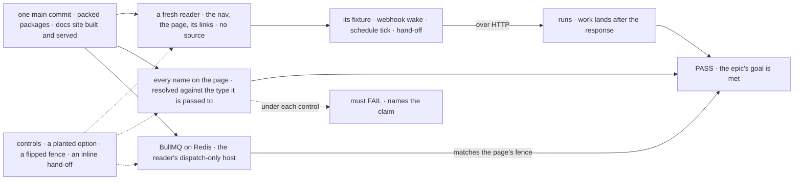

# FIX-1642 · Closure: keeping-flows-alive page followed as written

**Spec** · [Decisions](DECISIONS.md) · [Rules](BUSINESS-RULES.md) · [Plan](PLAN.md) · [Docs](DOCS.md)

Improvement · closure (QA) · `goals/` + one CI step · medium, repeats per finding · 1 PR after
a clean run · epic [FIX-1637](https://linear.app/fixpoint-labs/issue/FIX-1637), closure ·
required · runs after every child Linear lists as blocking it

## Five people, before and after

| Someone who… | Today | After this closes |
|---|---|---|
| **decides whether the epic is done** | FIX-1639's own check, on its draft, on its own commit | One report on one `main` commit: the page followed from the nav by a reader who can't see the code, every name resolved, the fence run on Redis, each control's FAIL |
| **wants a flow woken by a webhook and a clock, with work that keeps going** | Nobody has built one from the published docs alone | Proven: a fixture built from the page and its links answers a signed webhook and a schedule tick, and its handed-off work finishes after the request returned |
| **runs on BullMQ** | The page's refusal sentence is checked by nobody against the runtime | Proven on real Redis, on the reader's own host (a `dispatch-only` producer and a worker): `{ id }` refused by name, nothing enqueued; a `{ from: true }` reply as the page's topology rule says; `{ key }` runs |
| **meets *wake*, *dispatch*, *tick*, or a channel and a board** | Each child checks its own words | Proven: the reader answers from the page alone, and no page it links contradicts it |
| **renames an export next year** | Nothing notices the page now lies | CI fails the rename until the page is fixed ([D2](DECISIONS.md#d2)) |

## The goal, and how we'll know it's met

**On one `main` commit with every blocking child merged, a builder who starts at the docs site
nav and reads only the keeping-flows-alive page and the pages it links can build a flow that a
webhook and a schedule wake and that hands off work finishing after the request returns;
every name the page gives resolves to what ships, and its queue-host statement matches the
runtime.**

| Is it the right goal? | |
|---|---|
| **The real need** | The [epic's goal](../../epics/FIX-1637/SPEC.md#the-goal-and-how-well-know-its-met), proved the way the [closure rule](../../../docs/contributing/orchestration.md#the-closure-issue-every-epic-ends-in-qa) asks: a real app, the real path, the surface a builder touches |
| **Smaller, and rejected** | "Check every name on the page resolves." It proves the page names real things, not that a builder can get from them to a running flow; the [POC](poc/page-key-scan/README.md) shows a flat check also passes a real option on the wrong object |
| **Bigger, and not this issue's** | Making `{ id }` work on BullMQ (FIX-1634) · checking the wake POCs (FIX-1641, 1643, 1644, FIX-1645) · a per-cloud deploy run |
| **Not done if** | The reader reads the source, or leaves the page's links, to finish · a name resolves only by a flat lookup · the handed-off work could have run inside the request · a control never failed · checks on different commits · a finding deferred |

Every leg reads what a builder would see: the site as served, the fixture's HTTP answers, the
queue's own job counts.

| How we verify | |
|---|---|
| **Goal check** | `goals/keeping-flows-alive/follows-the-page-as-written/`: one reader (leg A), then [PLAN.md → Checks](PLAN.md#checks) legs B to D on its fixture, on one commit |
| **Model** | None for the fixture, which uses handler blocks. The reader is an agent dispatched per run ([D1](DECISIONS.md#d1)) |
| **Signal** | The fixture's effects read back over HTTP and from its store, after the response that started them; the fence's outcome on the fixture's host against the page's three claims; the scan's totality line |
| **Input** | A held-out app brief the reader builds to: a provider, a schedule id, a token per run, a latch the hand-off waits on |
| **Anti-game** | The reader has no checkout and no package source, and its transcript is audited. Nothing asserts on a child's own test, a 202 alone, or the reader's claim that it worked |
| **Control that must fail** | A planted option, of both kinds the POC found; a flipped fence sentence; an inline hand-off. Each fails its own leg, by name ([PLAN.md → Controls](PLAN.md#controls)) |

Part 2 walks the terms and the channel-or-board journeys. Part 3 skips FIX-1639's check, which
part 1 already walks. Part 4 sweeps four things: the seams, the epic's *not done if* nouns, the
terms' agreement and the verified caller. All on the same commit.

## What changes

Read the commit line: today one child's check sits on its own commit; after, every check sits
on one, and the scan keeps running once the epic is closed.

## What stays as it is

- **No page edits and no runtime change.** A gap is filed as a child of the epic that blocks
  this issue, fixed on its own route. The refusal is stated, never worked around (epic ER-6).
- **The set comes from Linear at run time**, not from the epic's set table. The wake POCs are
  parked by the owner, and this plan checks none of them.

## Sign off

**[The goal](#the-goal-and-how-well-know-its-met), at that size:** the page followed by a
reader who can't see the code, on one commit, with the fence run on real Redis. If wrong: the
epic wraps on a page nobody has built from, or waits on a bar nobody asked for.

1. **[D1](DECISIONS.md#d1) · The page is followed by a fresh agent that can see only the served
   docs site, not by the worker who knows the code.** If wrong: an agent run and a transcript
   audit per full run, spent on a check the worker could have done.
2. **[D2](DECISIONS.md#d2) · The name scan stays in CI after the wrap; the Redis and reader run
   stays a by-hand goal, once per `main` commit.** If wrong: PRs that rename a name the page
   uses turn red and must touch the docs.

**Open: none.** Reasoning and what lost: [DECISIONS.md](DECISIONS.md). The cases:
[BUSINESS-RULES.md](BUSINESS-RULES.md).
