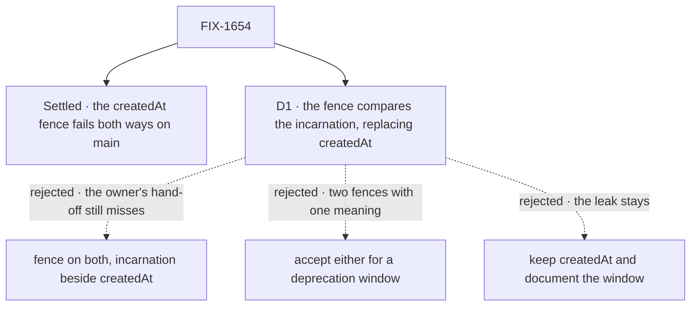

# FIX-1654 · Decisions

[Spec](SPEC.md) · **Decisions** · [Rules](BUSINESS-RULES.md) · [Plan](PLAN.md) · [Docs](DOCS.md) · [Evolution](EVOLUTION.md)

One decision is the sign-off. The rest follow from FIX-1286's
[D1](../FIX-1286/DECISIONS.md#d1), which already made the incarnation the request's identity;
this issue moves the one check still reading a timestamp onto it.

## The tree

Solid edges are what you're signing. Dashed edges lost, and the label says why.

## D1 · The fence names a request by its incarnation, replacing `createdAt` outright

| | |
|---|---|
| **Instead of** | Adding the incarnation as a second fence beside `createdAt` · accepting either for a deprecation window · keeping `createdAt` and documenting the same-millisecond window |
| **Because** | The [POC](PLAN.md#sketch-and-poc) shows `createdAt` failing in both directions: a same-millisecond reuse lets the cancel land on another tenant's request, and a same-owner hand-off, which rewrites `createdAt` and keeps the incarnation, makes the owner's own cancel miss. Any option that still compares `createdAt` keeps the second failure. FIX-1286 made the incarnation the identity; a second notion of "the same request" in the store contract is the incoherence tenet 1 warns against |
| **Locks in** | `RequestStore.setFieldsIfStatus`'s fifth argument is the caller's resolved incarnation, and every store compares it with the stored record's, deriving a legacy record's the one way `resolveRequestIncarnation` does. An out-of-tree store fails to compile until it follows; an untyped one fails closed (every fenced cancel answers 404) and the conformance suite names the case |

![D1, what the cancel fence compares. Chosen: the incarnation, replacing createdAt. Instead of: fencing on both, or keeping createdAt. It comes down to the first row, the owner's retry handing the record off mid-cancel: the chosen option records the cancel, both others answer 404 while the request runs on. Second row, another tenant taking the id in the same millisecond: the chosen option and fencing on both miss correctly, keeping createdAt stops the other tenant's request. Third row, what an out-of-tree store pays: the chosen option and fencing on both each change the adapter signature, keeping createdAt changes nothing. Locks in: the store contract names a request by its incarnation. Flips if: an out-of-tree store exists that we must not break in this release](figures/d1-fence-on-incarnation.svg)

It comes down to the owner's hand-off: only dropping `createdAt` lets that cancel land.

**What would change my mind:** a known out-of-tree request store we must not break this release.
Then the incarnation goes in as an options field the old signature ignores, and the break moves to
the next minor.

**If wrong:** an adapter author meets a compile error for a window only a same-millisecond reuse
opens. The other way, cancel keeps two failure modes, one of them cross-tenant.

## Decided, not asked

- **The caller passes the resolved value.** The route passes `resolveRequestIncarnation(record)`,
  so a legacy record's fence is `legacy_<createdAt>` and behaves exactly as today's (BP-030).
- **Stores resolve the stored side the same way.** `resolveRequestIncarnation` is exported from
  `@flow-state-dev/engine` so the SQLite and out-of-tree stores call it rather than copy it.
  Postgres states the rule in SQL, and the conformance suite's legacy case is what holds the two
  forms equal.
- **A miss is reported as absent**, `{ applied: false, status: undefined }`, as today. The route's
  404 is unchanged.
- **No column, no index, no migration on Postgres.** The predicate reads the locked row's body by
  primary key, as it already does for `createdAt`.
- **The fence stays optional.** Callers that pass no fence (the CLI's cancel, tests) are unchanged.
- **No backfill of legacy records.** Deriving on read is what FIX-1286 settled; writing on a cancel
  would be a second writer of an identity field.
- **Minor changeset for `engine`**, naming the signature change for store authors; patch for the
  SQLite and Postgres stores.

## Considered and dropped

| Alternative | Why not |
|---|---|
| Fence on both | Still compares `createdAt`, so the owner's hand-off still misses. It only fixes the stranger half |
| Accept a number or a string for a window | Two fences under one name, and a store that honours only the old form looks correct |
| Keep `createdAt`, document the window | The window is cross-tenant: a cancel that stops someone else's run |
| Stop the hand-off rewriting `createdAt` | Fixes the owner half only, and `createdAt` still can't split a millisecond. It also changes a field request listings sort on, outside this issue |
| Put the incarnation in its own Postgres column | Buys an index this primary-key lookup doesn't use, at the cost of a migration |

## Settled

- **`createdAt` lets a same-millisecond reuse take the cancel** — **CONFIRMED** on `main`
  `70f777def`: 202, and the other tenant's request carried the intent.
  ([POC](poc/abort-fence-createdat/README.md))
- **`createdAt` makes a same-owner hand-off miss** — **CONFIRMED** on the same commit, through
  the real `claimRequestRecord`: 404 while the request stayed `in_progress`, incarnation kept.
- **The Postgres fence reads the record body, not the `created_at` column** — code read: its
  predicate is `(data->>'createdAt')::bigint`. So moving to the incarnation needs no schema change.

## How it got here

- **Draft** — framed as FIX-1286's identity reaching the last `createdAt` check; a POC showed the
  fence failing both ways on `main`; the fence argument is replaced across all four stores. One PR.

**Open: none.**
