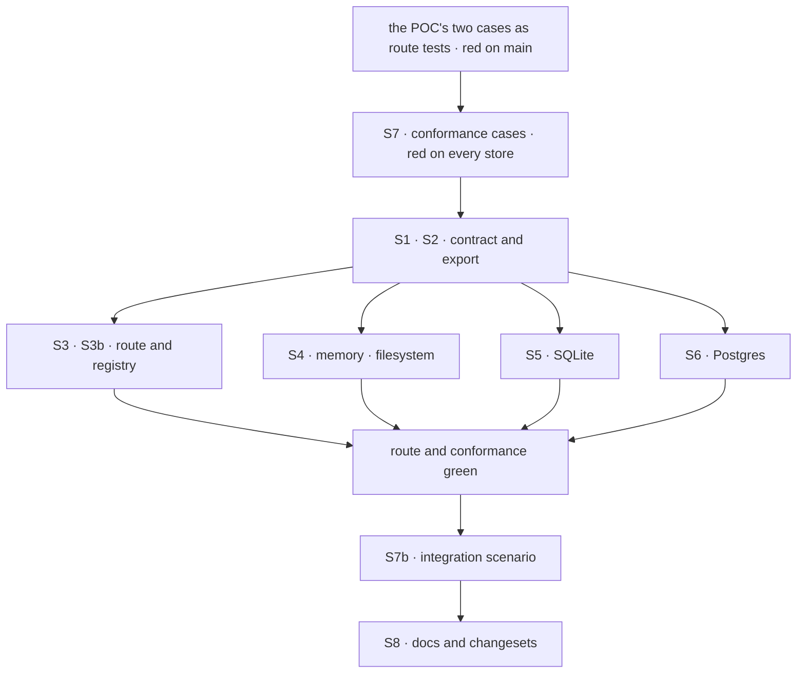

# FIX-1654 · Plan

[Spec](SPEC.md) · [Decisions](DECISIONS.md) · [Rules](BUSINESS-RULES.md) · **Plan** · [Docs](DOCS.md) · [Evolution](EVOLUTION.md)

Written for the implementing agent. IDs cross-reference [BUSINESS-RULES.md](BUSINESS-RULES.md)
(BR-n) and [DECISIONS.md](DECISIONS.md) (D-n). `tdd`. One PR from `main`.

## Surfaces

| ID | Package · role | Change | Rules |
|---|---|---|---|
| S1 | `engine` · `RequestStore.setFieldsIfStatus` contract (`stores/types.ts`) | The fifth argument becomes the expected incarnation (D1). Rewrite its doc: a record whose resolved incarnation differs is reported as absent. **Remove** the "open follow-up" paragraph | BR-1 BR-3 BR-10 |
| S2 | `engine` · the public barrel | Export `resolveRequestIncarnation`, the rule's one definition, for engine and out-of-tree TypeScript stores | BR-6 to BR-9 |
| S3 | `engine` · the cancel route | Pass `resolveRequestIncarnation(record)` instead of `record.createdAt` to the store, **and to the in-process delivery** (S3b); update its comment | BR-1 BR-3 BR-12 |
| S3b | `engine` · the in-process abort registry | Each controller carries the incarnation of the record its run claimed or adopted (`runAction` has it from `claimRequestRecord`'s return or the admitted record). The route's local check and fire take an optional expected incarnation and act only on a match; no expectation keeps today's behaviour for other callers. A controller registered before its record is claimed (the host's queued pre-registration) is tagged once claimed; until then a fenced fire does not match it and the cancel answers 202, which the run picks up when it starts | BR-12 BR-13 |
| S4 | `engine` · memory and filesystem stores | Compare `resolveRequestIncarnation(current)` with the expected value, where each compares `createdAt` today, inside the same atomic step | BR-1 BR-3 BR-6 to BR-9 |
| S5 | `store-sqlite` | Same, on the record parsed inside the IMMEDIATE transaction. **The legacy rule is restated locally**: `store-sqlite` may import only types from `engine` (`scripts/validate-package-boundaries.mjs`), as its other mirrored helpers already do. The conformance legacy cases hold it equal | same |
| S6 | `store-postgres` | The locked CTE selects the resolved incarnation from the body, `COALESCE(data->>'incarnation', 'legacy_' \|\| (data->>'createdAt'))`, and the UPDATE and the post-check compare it. **Remove** the `created_at` alias | same |
| S7 | `engine` · request-store conformance suite | Replace the `createdAt` fence case with the incarnation cases in [Checks](#checks). Every first-party store already runs the suite | BR-1 BR-3 BR-6 to BR-11 |
| S7b | `integration-tests` · a scenario under `src/scenarios/` | The request-lifecycle scenario `AGENTS.md` requires for a store-contract change: a real flow through `runAction` on a shared store, cancelled through the flow router's abort route, (a) after its owner's retry handed the record off, ending `aborted`; (b) after a later request took the id, leaving that request running and unmarked | BR-3 BR-1 BR-12 |
| S8 | Docs and changesets | Per [DOCS.md](DOCS.md). `engine` minor, `store-sqlite` and `store-postgres` patch | BR-11 |

## Sequence



Write the red first: the POC's assertions, inverted, in `abort.test.ts`.

## Checks

| ID | Runs after | Passes when |
|---|---|---|
| V1 | S3 | Route, memory store: BR-1 with equal `createdAt`s answers 404 and the other request has no intent. BR-3 through `claimRequestRecord` answers 202 and the owner's request carries the intent. Both FAILED on `main` `70f777def` |
| V2 | S4 to S7 | Conformance, on every store: equal `createdAt`, different incarnation → absent, nothing written (BR-1); rewritten `createdAt`, same incarnation → applied (BR-3) |
| V3 | S4 to S7 | Conformance, legacy: a record with no incarnation hits on `legacy_<createdAt>` and misses on `legacy_<createdAt + 1>` (BR-6); a handed-off legacy record hits on its stored value (BR-7); a stamped record never matches a `legacy_` fence (BR-8); `incarnation: null` behaves as absent (BR-9) |
| V4 | S6 | V2 and V3 pass on Postgres through PGlite, exercising the SQL, not a JS path |
| V5 | S2 S5 | Typecheck across the workspace, and `node scripts/validate-package-boundaries.mjs` passes: `store-sqlite` still imports only types from `engine` |
| V6 | S8 | Docs build |
| V7 | S3b | Route, memory store: after the fence applied to request A, a request B under the same id registers a controller in this process before the local fire. B's controller is not fired and the route answers 202, not 204 (BR-12). A controller registered untagged (queued, not yet claimed) is not fired by a fenced cancel; an unfenced `abortRequest(id)` still fires it (BR-13) |
| V8 | S7b | The integration scenario passes both legs; leg (a) FAILED on `main` `70f777def` |

**Control.** V2 and V3 must fail on today's stores before S4 to S6 land. Run them against `main`'s
adapters first and keep the output for the PR.

## Pinned names

| Where | Name | Why pinned |
|---|---|---|
| The store contract | `expectedIncarnation` (fifth argument) | Public; out-of-tree stores implement it |
| The engine barrel | `resolveRequestIncarnation` | Public; the legacy rule's one definition |

Everything else is yours.

## Guardrails

| Rule | Because |
|---|---|
| The fence compares inside the same atomic step as the status predicate, in every store | Deciding outside it reopens the read-then-write race the verb exists to close |
| One legacy rule. Engine stores call `resolveRequestIncarnation`; SQLite's local copy and Postgres's SQL are held to it by the conformance legacy cases | Two derivations that drift make a legacy cancel miss on one store only |
| Package boundaries hold: no value import from `engine` into `store-sqlite` | The boundary script enforces it; a runtime import fails CI |
| Every place the route delivers a cancel is fenced, the store write and the local fire alike | A fenced store write followed by an unfenced fire by id still stops the later request (BR-12) |
| No second fence. `createdAt` leaves the contract | D1: a store honouring only one of two fences looks correct and isn't |
| The interleave tests use equal `createdAt`s | With different ones today's fence already passes; the test would prove nothing (tenet 7) |

## Docs

Reconcile and publish [DOCS.md](DOCS.md) after V1 to V8 pass. Two updates, no new page.

## Sketch and POC

```
cancel route:
    record ← read by id; owner check
    setFieldsIfStatus(id, intent, [in_progress], now, resolve(record))
every store, inside its atomic step:
    stored ← the record at id
    absent, or resolve(stored) ≠ expected  → report absent, write nothing
    status outside the predicate            → report that status
    else write
cancel route, after an applied write:
    fire the local controller only if its incarnation = resolve(record)
resolve(r) = r.incarnation ?? "legacy_" + r.createdAt
```

**POC:** [`poc/abort-fence-createdat/`](poc/abort-fence-createdat/README.md), on `main`
`70f777def`. Both premises held: a same-millisecond reuse took the cancel (202 on the other
tenant's request), and a same-owner hand-off made the owner's cancel miss (404, still running).
Run it with `bash specs/issues/FIX-1654/poc/abort-fence-createdat/run.sh`.

## At implement time

- FIX-1647 (#2393) edits the same four request stores' `delete`. Different member, so a textual
  conflict at most; rebase on whichever lands first.
- Check that no other caller passes the fifth argument: at drafting, only the cancel route does.
- If FIX-1128 has moved the stale-request sweep onto `setFieldsIfStatus` by then, it takes the
  same fence; don't hand it `createdAt`.

- The cascading child abort (`createFlowState`) and the CLI fire by id with no fence. Their ids
  are ones they just started, not ones a caller chose; leave them unfenced unless implementation
  shows otherwise.

## Follow-ups

- None filed. The sweep's adoption is FIX-1128's.

## Notes from review

Recorded verbatim for the implementer (round 1, Cursor simplify review on `9803956`); none
changes the approach.

- SPEC.md:58 · "Simplify nit: this 2×2 figure mostly restates the **Four people** table (and the figure's long alt text is a third copy). For a small fix, consider dropping `what-changes.svg` and keeping the table + D1 figure only—or the reverse if you prefer visuals at the gate."
- SPEC.md:35 · "The control / anti-game story also appears in PLAN (V1 + control paragraph) and in the POC README. If you want a leaner spec, this mermaid could be a one-liner pointer to PLAN §Checks rather than a third diagram of the same pass/fail shape."
- DECISIONS.md:60 · "Three listings of rejected options (mermaid X1–X3, D1 \"Instead of\", and this table) overlap. Merging table rows into the D1 section—or dropping the dashed mermaid leaves—would cut repetition without changing the decision."
- BUSINESS-RULES.md:14 · "BR-2 doesn't change under this issue (FIX-1021 already covers later-ms reuse). Folding it into a footnote on BR-1 would shrink the rule table slightly; keeping it is fine if you want explicit traceability to existing tests."
- PLAN.md:46 · "V3's legacy matrix is thorough and matches BP-030 / Postgres parity needs—that's the right default. *If* you want a smaller implementation PR later, the optional trim is: lean on `packages/engine/test/request-incarnation.test.ts` for BR-6–BR-9 derivation and keep conformance focused on the two fence interleaves (BR-1/BR-3). I wouldn't do that unless you're comfortable that SQL and TS paths can't drift."
- poc/abort-fence-createdat/abort-fence-createdat.poc.test.ts:1 · "The file header largely duplicates `poc/abort-fence-createdat/README.md`. A 3–4 line pointer to the README would be enough; the interleave helpers (`abortWithInterleave`, `record`) are appropriately small and worth keeping."
