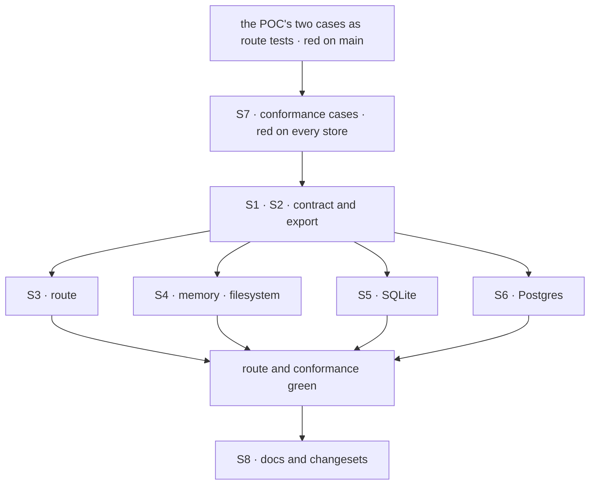

# FIX-1654 · Plan

[Spec](SPEC.md) · [Decisions](DECISIONS.md) · [Rules](BUSINESS-RULES.md) · **Plan** · [Docs](DOCS.md) · [Evolution](EVOLUTION.md)

Written for the implementing agent. IDs cross-reference [BUSINESS-RULES.md](BUSINESS-RULES.md)
(BR-n) and [DECISIONS.md](DECISIONS.md) (D-n). `tdd`. One PR from `main`.

## Surfaces

| ID | Package · role | Change | Rules |
|---|---|---|---|
| S1 | `engine` · `RequestStore.setFieldsIfStatus` contract (`stores/types.ts`) | The fifth argument becomes the expected incarnation (D1). Rewrite its doc: a record whose resolved incarnation differs is reported as absent. **Remove** the "open follow-up" paragraph | BR-1 BR-3 BR-10 |
| S2 | `engine` · the public barrel | Export `resolveRequestIncarnation` so stores derive the legacy form one way | BR-6 to BR-9 |
| S3 | `engine` · the cancel route | Pass `resolveRequestIncarnation(record)` instead of `record.createdAt`; update its comment | BR-1 BR-3 |
| S4 | `engine` · memory and filesystem stores | Compare `resolveRequestIncarnation(current)` with the expected value, where each compares `createdAt` today, inside the same atomic step | BR-1 BR-3 BR-6 to BR-9 |
| S5 | `store-sqlite` | Same, on the record parsed inside the IMMEDIATE transaction | same |
| S6 | `store-postgres` | The locked CTE selects the resolved incarnation from the body, `COALESCE(data->>'incarnation', 'legacy_' \|\| (data->>'createdAt'))`, and the UPDATE and the post-check compare it. **Remove** the `created_at` alias | same |
| S7 | `engine` · request-store conformance suite | Replace the `createdAt` fence case with the incarnation cases in [Checks](#checks). Every first-party store already runs the suite | BR-1 BR-3 BR-6 to BR-11 |
| S8 | Docs and changesets | Per [DOCS.md](DOCS.md). `engine` minor, `store-sqlite` and `store-postgres` patch | BR-11 |

## Sequence



Write the red first: the POC's assertions, inverted, in `abort.test.ts`.

## Checks

| ID | Runs after | Passes when |
|---|---|---|
| V1 | S3 | Route, memory store: BR-1 with equal `createdAt`s answers 404 and the other request has no intent. BR-3 through `claimRequestRecord` answers 202 and the owner's request carries the intent. Both FAILED on `main` `70f777def` |
| V2 | S4 to S7 | Conformance, on every store: equal `createdAt`, different incarnation → absent, nothing written (BR-1); rewritten `createdAt`, same incarnation → applied (BR-3) |
| V3 | S4 to S7 | Conformance, legacy: a record with no incarnation hits on `legacy_<createdAt>` and misses on `legacy_<createdAt + 1>` (BR-6); a handed-off legacy record hits on its stored value (BR-7); a stamped record never matches a `legacy_` fence (BR-8); `incarnation: null` behaves as absent (BR-9) |
| V4 | S6 | V2 and V3 pass on Postgres through PGlite, exercising the SQL, not a JS path |
| V5 | S2 | Typecheck across the workspace; the SQLite store imports the exported helper |
| V6 | S8 | Docs build |

**Control.** V2 and V3 must fail on today's stores before S4 to S6 land. Run them against `main`'s
adapters first and keep the output for the PR.

## Pinned names

| Where | Name | Why pinned |
|---|---|---|
| The store contract | `expectedIncarnation` (fifth argument) | Public; out-of-tree stores implement it |
| The engine barrel | `resolveRequestIncarnation` | Public; the one legacy rule stores call |

Everything else is yours.

## Guardrails

| Rule | Because |
|---|---|
| The fence compares inside the same atomic step as the status predicate, in every store | Deciding outside it reopens the read-then-write race the verb exists to close |
| One legacy rule. TypeScript stores call `resolveRequestIncarnation`; Postgres's SQL is held to it by the conformance legacy case | Two derivations that drift make a legacy cancel miss on one store only |
| No second fence. `createdAt` leaves the contract | D1: a store honouring only one of two fences looks correct and isn't |
| The interleave tests use equal `createdAt`s | With different ones today's fence already passes; the test would prove nothing (tenet 7) |

## Docs

Reconcile and publish [DOCS.md](DOCS.md) after V1 to V4 pass. Two updates, no new page.

## Sketch and POC

```
cancel route:
    record ← read by id; owner check
    setFieldsIfStatus(id, intent, [in_progress], now, resolve(record))
every store, inside its atomic step:
    stored ← the record at id
    absent, or resolve(stored) ≠ expected  → report absent, write nothing
    status outside the predicate            → report that status
    else write
resolve(r) = r.incarnation ?? "legacy_" + r.createdAt
```

**POC:** [`poc/abort-fence-createdat/`](poc/abort-fence-createdat/README.md), on `main`
`70f777def`. Both premises held: a same-millisecond reuse took the cancel (202 on the other
tenant's request), and a same-owner hand-off made the owner's cancel miss (404, still running).
Run it with `bash specs/issues/FIX-1654/poc/abort-fence-createdat/run.sh`.

## At implement time

- FIX-1647 (#2393) edits the same four request stores' `delete`. Different member, so a textual
  conflict at most; rebase on whichever lands first.
- Check that no other caller passes the fifth argument: at drafting, only the cancel route does.
- If FIX-1128 has moved the stale-request sweep onto `setFieldsIfStatus` by then, it takes the
  same fence; don't hand it `createdAt`.

## Follow-ups

- None filed. The sweep's adoption is FIX-1128's.
