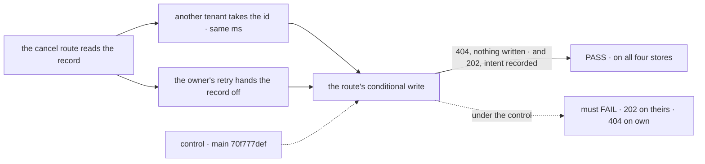

# FIX-1654 · Abort fence should compare the request's incarnation, not createdAt

**Spec** · [Decisions](DECISIONS.md) · [Rules](BUSINESS-RULES.md) · [Plan](PLAN.md) · [Docs](DOCS.md) · [Evolution](EVOLUTION.md)

Improvement · `engine` + `store-sqlite` + `store-postgres` · small · 1 PR · epic
[FIX-1635](../../epics/FIX-1635/SPEC.md) · builds on FIX-1021 (the fence) and
[FIX-1286](../FIX-1286/SPEC.md) (the incarnation), both on `main`

## Four people, before and after

| Someone who… | Today | After |
|---|---|---|
| **cancels their request just as another user's request takes the freed id, in the same millisecond** | The cancel lands on the other user's request and stops it. The [POC](PLAN.md#sketch-and-poc) did this on `main` | The cancel misses: "no such request", and the other request runs on |
| **cancels their request while their own retry hands the record over** | Told the request does not exist, while it keeps running. Also shown by the POC | The cancel is recorded on the request they own |
| **runs a request recorded before incarnations existed** | Cancel works | Cancel works the same way |
| **maintains their own request store** | Compares a timestamp | Compares the request's incarnation. Their build breaks until they do, and the shared store test says what's missing |

"Cancel" is `POST …/requests/:id/abort`; the fence keeps its write on the request its owner
check read. The cases: [BR-1 to BR-13](BUSINESS-RULES.md).

## The goal, and how we'll know it's met

**A cancel lands on exactly the request its owner check read, never on another request that took
the id in between, even in the same millisecond, and never misses that request because its own
owner's retry rewrote the record, on all four first-party stores, legacy records included.**

| Is it the right goal? | |
|---|---|
| **The real need** | The issue: "An abort aimed at one incarnation of a request never lands on another incarnation that reuses the id, including within the same millisecond. Records written before the incarnation existed keep working" |
| **Why the hand-off half belongs here** | The same fence, failing the other way: a same-owner hand-off rewrites `createdAt` and keeps the incarnation. Fixing only strangers ships a fence still wrong for owners |
| **Smaller, and rejected** | "Fix the route only." The route already passes the right record; the comparison is in each store, so a route-only change can't reach it |
| **Bigger, and not this issue's** | Other writers that could fence on a request (the stale-request sweep, FIX-1128). They adopt this fence when they move onto the verb |
| **Not done if** | A store is skipped · the check stubs the store's conditional write · the interleave uses records with different `createdAt`s, which today's fence already catches · legacy records are only tested on one store |



Both interleaves run through the real route and real store writes; only the timing is forced.

| How we verify | |
|---|---|
| **Goal check** | Route cases in `packages/engine/test/abort.test.ts`, including the in-process fire; fence cases in the request-store conformance suite every first-party store runs (memory, filesystem, SQLite, Postgres on PGlite); a `runAction` scenario in `packages/integration-tests` |
| **Signal** | Same-millisecond reuse: `404`, the other request unmarked. Hand-off: `202`, intent recorded. Legacy record: hit on its own derived value, miss on a neighbour's |
| **Anti-game** | No stubbed `setFieldsIfStatus`; the hand-off is the engine's own `claimRequestRecord`; Postgres runs its SQL, not a JS copy of the rule |
| **Control that must fail** | The [POC](PLAN.md#sketch-and-poc) on `main` `70f777def`: 202 on the other tenant's request, 404 on the owner's. The PR names that commit |
| **Why not over HTTP** | The window is between two store calls inside one handler. HTTP can't hit it on demand. The epic's shared suite ([ER-16](../../epics/FIX-1635/BUSINESS-RULES.md#what-no-child-may-do)) names other children, not this one |

## What changes


Same route, same interleaves. Today both cells go wrong in opposite directions; the incarnation
gets both right. The route's in-process fire, which stops a run in the same process at once, is
fenced the same way, so a later request under the id can't be stopped there either.

No app code changes. A store adapter's signature does:

```diff
  setFieldsIfStatus(
    id: string,
    fields: ConditionalRequestFields,
    allowedStatuses: readonly RequestStatus[],
    updatedAt: number,
-   expectedCreatedAt?: number
+   expectedIncarnation?: string   // compared with the stored record's resolved incarnation
  ): Promise<ConditionalWriteResult>;
```

## What stays as it is

- The route's answers: `204`, `202`, `404`, `409`, and when each is given.
- The status predicate, and how each store makes predicate and write one step.
- How the incarnation is minted and derived for legacy records (FIX-1286's).
- No schema change. Postgres reads the incarnation from the record body, where it already
  reads `createdAt` today.

## Sign off

**[The goal](#the-goal-and-how-well-know-its-met), at that size:** both directions, on all four
stores, legacy records included. If wrong: a fence that's right for strangers and still tells an
owner their running request is gone.

1. **[D1](DECISIONS.md#d1) · The fence names a request by its incarnation, replacing `createdAt`
   outright rather than sitting beside it.** Out-of-tree request stores stop compiling until they
   compare the incarnation. If wrong: we broke an adapter we didn't know about, for a window only
   a same-millisecond reuse opens.

**Open: none.** D1 is the one to weigh. Reasoning and what lost: [DECISIONS.md](DECISIONS.md).
The cases: [BUSINESS-RULES.md](BUSINESS-RULES.md).
