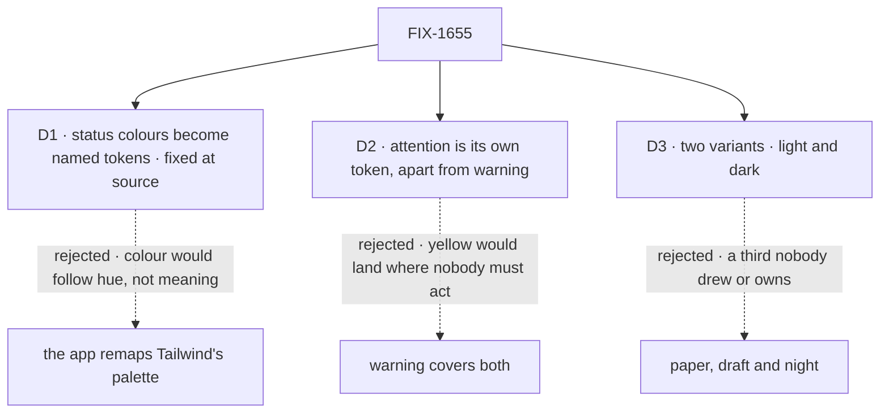

# FIX-1655 · Decisions

[Spec](SPEC.md) · **Decisions** · [Rules](BUSINESS-RULES.md) · [Plan](PLAN.md) · [Docs](DOCS.md) · [Evolution](EVOLUTION.md)

What was considered, what was chosen, and what each choice locks in. D1 to D3 are the sign-off
surface. The epic already decided the shape around them ([FIX-1649 D2](../../epics/FIX-1649/DECISIONS.md#d2)):
one skin through the existing contracts, neutral defaults beside the components, a private
package outside FSD, gaps fixed at the source. This issue decides only what that left open.

## The tree

Solid edges are what you're signing. Dashed edges lost, and the label says why.

## D1 · Status colours become named tokens, fixed at each component's source, with today's hues as the defaults

| | |
|---|---|
| **Instead of** | App Lab remapping Tailwind's palette colours (`--color-amber-500` and friends) in its own stylesheet, leaving the registry as it is |
| **Because** | A palette remap recolours by hue, not meaning: the stuck-request banner, a blocked task and a tool call awaiting approval are all amber or yellow today, so a remap paints them the same, and paints any amber the app uses elsewhere too. The epic says a component that can't take the skin is fixed at its source (ER-6), and FSD's registry already reads meaning-named tokens (`destructive`, `muted-foreground`); status is the one family it never named (tenet 2: sharpen the primitive, don't route around it) |
| **Locks in** | Four new public token names in the registry: `success`, `warning`, `info`, `attention`, each with a `-foreground`. Every registry user's stylesheet must define them; the token item arrives with `fsdev ui add`, and an app that copied components before re-adds it once. Renaming one later breaks every copy that uses it |

It comes down to what a colour means: a remap follows hue, so every amber becomes one thing.

**What would change my mind:** no registry consumer but App Lab ever wanting to skin these
parts. Then a remap in one app costs less than four public names.

## D2 · "A person must act" gets its own token, `attention`, apart from `warning`

| | |
|---|---|
| **Instead of** | Four tokens by hue family (success, warning, info, destructive), with App Lab's highlighter on `warning` |
| **Because** | App Lab's one product rule for colour, from the design kit: yellow means a person must act, and is removed when they have. Today the registry uses one amber or yellow family for both *a person must act* (a tool call awaiting approval, a task parked for review) and *something is off* (a blocked task, a stuck request, an audit warning). With one token, App Lab's yellow lands on the second group. "Waiting on a person" is FSD's own idea, not Workforce's: it is a suspension, and a parked row is the board's *waiting on a human* state (`docs/architecture/dispatched-work.md`) |
| **Locks in** | A fifth status token, and a rule every registry component now obeys: a waiting-on-a-person state uses `attention`, anything else amber uses `warning`. Its neutral default is yellow, so with no theme the two stay close to today |

It comes down to App Lab's yellow rule: with one token, a blocked task looks like an ask.

**What would change my mind:** Claude Design's final hand-back dropping the rule that yellow
only means *you must act*. Then `attention` folds into `warning` before the final PR.

## D3 · App Lab's theme ships light and dark, not the kit's third "draft" stock

| | |
|---|---|
| **Instead of** | The design kit's three themes, *paper*, *draft* and *night* (Product Lead's notes on the issue, Sep 29) |
| **Because** | The epic signed two variants: light, the ticket's beige, black and yellow, and dark, hand-back v1 ([FIX-1649 decided in review](../../epics/FIX-1649/DECISIONS.md#decided-in-review-recorded-so-no-child-reopens-them)). *Paper* is the light variant and *night* the dark one. No screen draws *draft*, and design pass 2 doesn't list it |
| **Locks in** | One switch, the `.dark` class the registry's `dark:` variant already reads. A third variant later needs its own selector and one more block of values, nothing else |

It comes down to what the epic fixed: draft is a variant no screen draws and no one owns.

**What would change my mind:** design pass 2 coming back with *draft* in it.

## Decided, not asked

- **The package is `labs/design-system/`, `@flow-state-dev/design-system`, private.** Outside
  `packages/`, so the static check (ER-3) means something; beside App Lab, so it lands without
  waiting for FIX-1662.
- **Neutral defaults live in one registry item, `tokens`**, a registry dependency of every
  component that uses a status token: "defaults beside the components" (ER-3) for a copy-in registry.
- **The App Lab theme writes the semantic tokens once and maps them onto `--fsd-nav-*` and
  `--fsd-panel-*`**, as kitchen-sink already does for the navigator (review note on the issue).
  Kitchen-sink keeps its own mapping.
- **Non-status accents fall to existing tokens.** The file tree's blue folder and every blue
  focus outline become `muted-foreground` and `ring`. Their look changes slightly with no theme.
- **The drift check covers every consumer, from one place.** Kitchen-sink's check becomes one
  check over a declared list of consumer folders (kitchen-sink: all components; App Lab: what
  it installed). A listed folder that doesn't exist fails. Whichever of FIX-1655 and FIX-1662
  merges second adds App Lab's entry.
- **The static check reads its values from the package**, so a new value is covered unedited.
- **Draft values ship in PR 1, marked draft; final values are PR 2**, after the final
  hand-back is linked on FIX-1649 (ER-9).
- **Fonts are named, not bundled**; loading them is the host's call.
- **No changeset**: both packages are private (BP-022); the `ui` docs carry the change.

## Considered and dropped

| Alternative | Why not |
|---|---|
| Keep the tokens inside `labs/app-lab` until a second app uses them (review note on the issue) | Ties this issue's merge to FIX-1662's and contradicts the issue's *"ship a design-system package"*; the package costs one `package.json` |
| Put the package under `packages/` | Makes the static check over `packages/` meaningless, and reads as FSD's own look |
| A theme provider or theme prop in `@flow-state-dev/react` | Rejected by the epic's D2: a Lab-shaped surface in L1. The chrome needs nothing |
| Generate the `--fsd-*` mapping with a build step | A dozen lines of CSS written once; a generator is more to maintain than it saves |

## Settled

- **The fix scope is 12 registry files; the navigator and panels carry no colour outside
  their custom properties.** Re-derived by `poc/palette-census/` (38 registry files walked,
  26 clean, 12 fixed-colour; 15 chrome files, 0 literals), whose planted-file control fails
  at 13. The review note's grep that found 11 missed one.

## How it got here

- **Draft** — framed as the status colours a theme can't reach; named status tokens with an
  `attention` token apart from `warning`, defaults in one registry item, App Lab's two variants
  in a private package outside `packages/`; two PRs split at the final hand-back.

**Open: none.**
