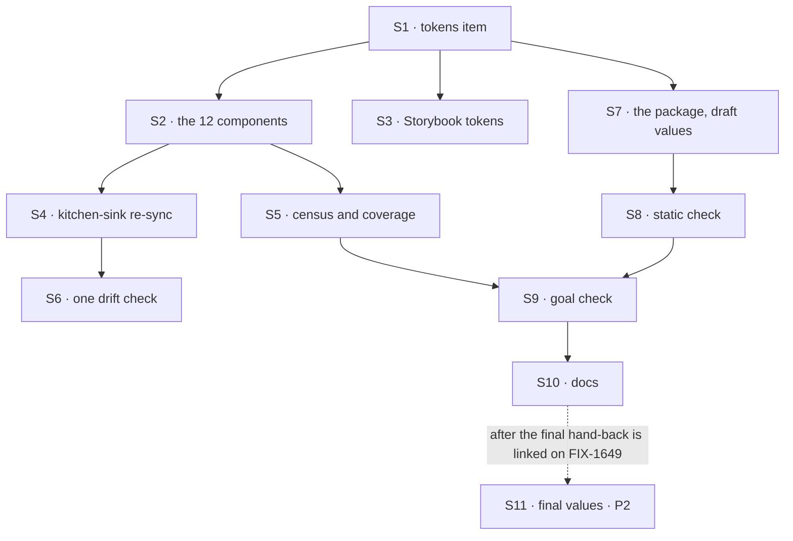

# FIX-1655 · Plan

[Spec](SPEC.md) · [Decisions](DECISIONS.md) · [Rules](BUSINESS-RULES.md) · **Plan** · [Docs](DOCS.md) · [Evolution](EVOLUTION.md)

Written for the implementing agent. IDs cross-reference [BUSINESS-RULES.md](BUSINESS-RULES.md)
(BR-n), [DECISIONS.md](DECISIONS.md) (D-n) and the epic's rules (ER-n). `tdd`. Two PRs: P1 now,
P2 after the final design hand-back.

## Surfaces

| ID | Package · role | Change | Rules |
|---|---|---|---|
| S1 | `ui` · a new registry item, `tokens` | Every semantic colour token the registry reads, with light and dark neutral defaults: the existing set (as kitchen-sink and Storybook define it today) plus `success`, `warning`, `info`, `attention`, each with `-foreground`. Default hues: green, amber, blue, yellow. Listed in `registry.json` and emitted by the registry build | BR-7 BR-8 |
| S2 | `ui` · the 12 registry components, and the manifest that installs them | **First, make each one installable** (below): only 5 of the 12 are `registry.json` items today. Then add `tokens` to the `registryDependencies` of every item that ships a file reading a status token. Then replace every fixed colour per the table below | BR-1 – BR-7 |
| S3 | `ui` · Storybook's preview stylesheet | Define the new tokens with the same defaults as S1 | BR-8 |
| S4 | kitchen-sink · stylesheet and copies | Add the new tokens to `app/globals.css`; re-sync the 12 copies byte-for-byte | BR-10 |
| S5 | `ui` · CI | Two assertions over two different sets, kept apart on purpose. **Census, over files:** the productionized form of `poc/palette-census/`, one rule module (palette classes, colour literals in registry files too, the planted control); walks **every** registry file (stories excluded), asserts the walked count, fails on any fixed palette class or colour literal (BR-1's transparent exception aside); every token utility a component uses is defined by S1. **Reachability, over items:** every relative import in an item's files resolves to a file that item or one of its dependencies ships, and every file reading a status token ships in an item whose dependency closure includes `tokens` | BR-1 BR-5 BR-6 BR-7 |
| S6 | the drift check | Keep `apps/kitchen-sink/test/registry-drift.test.ts` where it is, assertions unchanged. Extract its comparison (both directions, the count) into a function a second consumer can call. No consumer list: FIX-1662 calls the function for App Lab's folder when it installs components | BR-17 BR-18 |
| S7 | `labs/design-system` · new private package | `app-lab.css`: App Lab's light values on `:root`, dark under `.dark`, for every S1 token plus `--font-sans`, `--font-mono`, a display family and radii of 0; then `--fsd-nav-*` and `--fsd-panel-*` set from those tokens. **Draft values** in P1, headed as draft. README. Row in `labs/README.md` | BR-11 – BR-15 |
| S8 | `labs/design-system` · CI | Static check: read every colour and font value `app-lab.css` declares; search `packages/**` (excluding `node_modules`, build output); fail naming file and value. Plus: `attention` differs from `warning` in both variants; no import from `@flow-state-dev/workforce` | BR-14 BR-15 BR-16 |
| S9 | `goals/design-system/skins-reused-components-from-one-token-set/` | The goal check: a host page (the sweep in [SPEC.md](SPEC.md#the-goal-and-how-well-know-its-met)), installed by `fsdev ui add` of the items S2 names, from the local registry build, three passes in headless Chromium, `GOAL_CONTROL=hardcoded-accent` | goal |
| S10 | Docs | Publish [DOCS.md](DOCS.md) | — |
| S11 | P2 · `labs/design-system` | Replace draft values with the final hand-back's light and dark values; drop the draft header | ER-9 |

### How each of the 12 is installed (S2, before any recolour)

One rule, not a list: **a file another registry file imports ships in the importing item's
`files`; a file no registry file imports becomes its own item.** S5's reachability assertion
holds the rule, so a thirteenth file can't ship uninstallable.

| File | Installed by, today → after | Carries `tokens` via |
|---|---|---|
| `approval.tsx` · `tool.tsx` · `task-plan.tsx` · `audit-annotation.tsx` · `file-tree.tsx` | their own item → unchanged | that item |
| `debate.tsx` · `evented-actors.tsx` · `routed-specialists.tsx` | nothing; `chat-assistant` imports them and doesn't ship them → `chat-assistant`'s `files` | `chat-assistant` |
| `suspension-card-shell.tsx` · `form.tsx` · `question.tsx` | nothing; imported through `suspension-card.tsx`, which `chat-assistant` imports → `chat-assistant`'s `files`, with `suspension-card.tsx` and the rest of what it imports | `chat-assistant` |
| `stuck-request-banner.tsx` | nothing; no registry file imports it → a new item, `stuck-request-banner` | its item |

This also fixes a defect today's manifest has: `fsdev ui add chat-assistant` installs a file that
imports five files it doesn't install. Promoting a bundled file to its own item later is fine;
S5 checks reachability either way.

### Where each fixed colour goes (S2)

Re-derived by `poc/palette-census/`; re-run it before starting, since the table is only as good
as the tree it was read from.

| File | Today | Becomes |
|---|---|---|
| `approval.tsx` | green approve and approved receipt · red reject and rejected receipt · `text-white` · blue focus outline | `success` · `destructive` · `*-foreground` · `ring` |
| `suspension-card-shell.tsx` | green and red receipts · blue focus outline | `success` · `destructive` · `ring` |
| `tool.tsx` | yellow *awaiting* · green done · red error · orange *denied* | `attention` · `success` · `destructive` · `warning` |
| `task-plan.tsx` | blue *in progress* · amber *blocked* and its notes · cyan *parked* · green *completed* | `info` · `warning` · `attention` · `success` |
| `audit-annotation.tsx` | blue info · amber warning · red error, text and tinted panels | `info` · `warning` · `destructive` |
| `stuck-request-banner.tsx` | amber banner | `warning` |
| `debate.tsx` · `evented-actors.tsx` · `routed-specialists.tsx` | blue spinners and active turns · emerald winners · rose | `info` · `success` · `destructive` |
| `form.tsx` · `question.tsx` | blue focus outline · red field error | `ring` · `destructive` |
| `file-tree.tsx` | blue folder icons | `muted-foreground` |

Tints keep their opacity (`bg-success/10`); Tailwind v4 mixes a variable colour the same way.

## Sequence and PR plan



| Sub-PR | Delivers | depends_on |
|---|---|---|
| P1 | S1 – S10 | — |
| P2 | S11, and the goal check re-run on the final values | P1 · the final design hand-back committed under the epic's `assets/design/` and linked on FIX-1649 (external) |

## Checks

| ID | Runs after | Passes when |
|---|---|---|
| V1 | S1 | The built registry has a `tokens` item whose light and dark sets define every token S5 finds in use |
| V2 | S2 | Tool card and task plan: each state renders the token BR-2 to BR-4 name (D2's check: *awaiting* and *parked* on `attention`, *blocked* and *denied* on `warning`) |
| V3 | S5 | Census and reachability pass; **red first**: on today's tree the census names 12 files and reachability names `chat-assistant`'s unshipped imports and `stuck-request-banner`. A planted palette class in a temp copy fails the census; a planted import of an unshipped file fails reachability |
| V4 | S6 | Drift passes for kitchen-sink, as today; a planted one-byte change fails naming the file; the extracted function, called on a second temp folder, fails the same way |
| V5 | S8 | Static check passes; a planted App Lab value in a temp copy of a `packages/` file fails naming it (D3's check: both variants parse, and `.dark` flips every token) |
| VG | S9 | [The goal](SPEC.md#the-goal-and-how-well-know-its-met): `pnpm tsx goals/design-system/skins-reused-components-from-one-token-set/run.mts` PASSES a, b and c, after the same run FAILED b:themed under `GOAL_CONTROL=hardcoded-accent`, and after today's `main` FAILED it |
| V6 | S4 | Second path (BP-035): kitchen-sink with no theme, light and dark, screenshots before and after in the PR; hue unchanged per status |

## Pinned names

| Where | Name | Why pinned |
|---|---|---|
| Status tokens | `success`, `warning`, `info`, `attention`, each with `-foreground` (`--color-<name>` in CSS) | Public: every registry user types them (D1, D2) |
| Registry item | `tokens` | Public: `fsdev ui add tokens` |
| Package | `@flow-state-dev/design-system`, at `labs/design-system/`, `private: true` | FIX-1662 imports it by name |
| Stylesheet | `@flow-state-dev/design-system/app-lab.css` | The one line App Lab writes |
| Dark switch | the `.dark` class | The registry's `dark:` variant already reads it (D3) |

Everything else is yours to name.

## Guardrails

| Rule | Because |
|---|---|
| Every colour in a registry file goes through a token, and the census walks every file, never a list (tenet 5) | A list of 12 is how the thirteenth ships: the review note's grep found 11 |
| `attention` is chosen by what a state means, not by today's hue | D2 exists so yellow stops meaning two things; a mechanical amber-to-`warning` swap undoes it |
| No App Lab value, font name or Workforce word in any FSD package | The epic's layer rule; BR-16 is the check, and it reads its values from the package so it can't go stale |
| Copies are re-synced, never edited in a consumer | ER-6: a stale copy makes the goal check test the copy, not the skin |
| No new prop, provider or custom property on the navigator or panels | They already take the skin; the epic's D2 rejects a theme API in `react` |
| Final values only in P2 | ER-9: design pass 2 is still open |

## Docs

Reconcile [DOCS.md](DOCS.md) against what P1 ships and publish it in P1. P2 changes values only
and needs no docs change beyond dropping the README's draft note.

## Sketch · illustrative

```
registry tokens item     :root { --color-attention: <yellow>; … }   .dark { … }
component                className="text-attention"                  (was text-yellow-600)
app-lab.css              :root { --color-attention: <highlighter>; --color-warning: <red-ish>; … }
                         .dark { … }
                         :root { --fsd-nav-fg: var(--color-foreground); … }
```

**Draft values for P1**, from the Product Lead's notes on the issue and hand-back v1, not final:
light (*paper*) background `#f0ece1`, foreground `#1b1a15`, attention `#e8f551`, info `#2c4f8c`,
destructive `#a83e28`; dark (*night*) foreground `#ece7da` on the v1 sheet, attention `#e8f551`.
Success reads as ink, per the kit's state codes. Type: Space Grotesk, Archivo, IBM Plex Mono.

**POC:** `poc/palette-census/census.mjs` re-derives the fix scope. It showed 12 of 38 registry
files carry fixed colours (palette classes or literals; a fully transparent `#0000` is not a
colour) and the 15 chrome files carry none outside their custom properties; its `--control`
plants a 13th and fails. The premise held. S5 is its productionized form and the only
definition of "clean" CI runs; the POC stays as frozen spec-time evidence, which retained POCs
do (`spec-poc`), and nothing runs it as a gate.

## At implement time

- PR #2080 (open) edits `approval.tsx`'s header comment and the session-items context in both
  the registry and kitchen-sink. If it lands first, re-sync from its version.
- If FIX-1662 has already installed components into `labs/app-lab`, call S6's extracted
  comparison for its folder in P1; otherwise FIX-1662 does, and FIX-1663's QA confirms it.
- Confirm shadcn's CLI merges a registry item's CSS variables into a Tailwind v4 stylesheet the
  way S1 needs (`@theme` versus `:root` plus `@theme inline`); pick the form that makes
  `text-attention` resolve in kitchen-sink.
- Compare [EVOLUTION.md](EVOLUTION.md)'s claims with current code.

## Notes from review

Round 1 on #2425. Inputs, not instructions.

- "`attention` and `warning` both default to yellow or amber with no theme … the D2 split is then invisible … define `attention` as `var(--color-warning)` in the default `tokens` item, so unthemed apps carry one hue and a theme overrides the second variable. Worth confirming that the `tokens` item can express an alias in the form the shadcn CLI merges." — jhoffner ([review](https://github.com/fixpoint-labs/flow-state-dev/pull/2425#pullrequestreview-5360559695))
- "S1 + S3 + S4 triple-author the same neutral defaults … Consider folding S3/S4 into 'sync from S1 output' in the plan text." — cursor ([thread](https://github.com/fixpoint-labs/flow-state-dev/pull/2425#discussion_r4140070958))
- "V2 (per-state token assertions on tool + task plan) overlaps heavily with goal signal c:attention … keep V2 or c:attention as the semantic gate, not both." — cursor ([thread](https://github.com/fixpoint-labs/flow-state-dev/pull/2425#discussion_r4140070968))
- "V6 (manual before/after screenshots) largely duplicates VG a:neutral + BR-8 … consider demoting V6 to optional PR evidence." — cursor ([thread](https://github.com/fixpoint-labs/flow-state-dev/pull/2425#discussion_r4140070971))
- "I'd make the outcome of this spike [shadcn CSS-variable merge] a short DECISIONS 'decided' bullet (CLI-driven vs documented manual merge) before P1 coding starts." — cursor ([thread](https://github.com/fixpoint-labs/flow-state-dev/pull/2425#discussion_r4140070977))
- "If S6 drift already runs in CI, the goal should call that result (or skip re-walking) when VG runs in the same pipeline." — cursor ([thread](https://github.com/fixpoint-labs/flow-state-dev/pull/2425#discussion_r4140070983))
- "'Today's main must FAIL b:themed' is valuable once as baseline evidence … scope that to implementer verification / one-time capture in the implementation PR, not recurring VG." — cursor ([thread](https://github.com/fixpoint-labs/flow-state-dev/pull/2425#discussion_r4140070987))
- "The override example uses App Lab draft hex values … fictional hex or 'your brand' placeholders may read cleaner and reinforce the fence." — cursor ([thread](https://github.com/fixpoint-labs/flow-state-dev/pull/2425#discussion_r4140070996))
- "S8 implementation — one walk of `packages/**`, all needles from `app-lab.css` in a single pass … S9 placement — clarify whether the headless sweep is default `pnpm test` / GHA or completion evidence only." — cursor ([review](https://github.com/fixpoint-labs/flow-state-dev/pull/2425#pullrequestreview-5360569095))

## Follow-ups

- The kit's *draft* stock, if design pass 2 asks for it (D3).
- Status colour in the navigator and panels (worker dots) is not a token today; if FIX-1662
  needs it, that is a new `--fsd-*` property and a spec of its own (epic D2's mind-changer).
