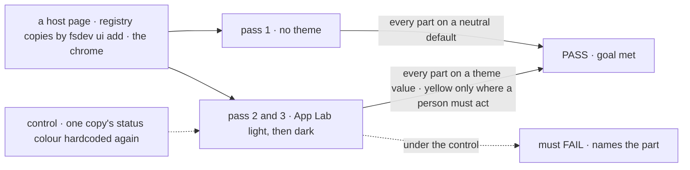
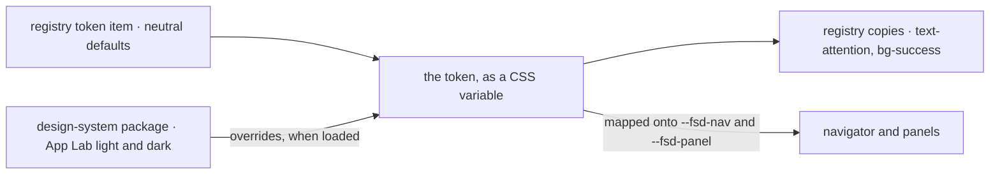

# FIX-1655 · Design system package + FSD component skinning

**Spec** · [Decisions](DECISIONS.md) · [Rules](BUSINESS-RULES.md) · [Plan](PLAN.md) · [Docs](DOCS.md) · [Evolution](EVOLUTION.md)

Feature · `ui` registry + a new private lab package · medium · 2 PRs, the second after the final
design hand-back · epic [FIX-1649](../../epics/FIX-1649/SPEC.md)

## Four teams, before and after

| A team that… | Today | After |
|---|---|---|
| **builds App Lab** (FIX-1662) | Would have to edit its copies of 12 registry components to get rid of their green, amber and blue, which the epic forbids | Loads one package; every reused component takes App Lab's light or dark look, and its copies stay unedited |
| **copies registry components into its own app** | Gets fixed status colours on approvals, tool calls, task plans and audit cards that no stylesheet can change | Sets a handful of named tokens (success, warning, info, attention, and the ones it already has) and every card follows |
| **installs a registry component for the first time** | Must already have the right token list in its stylesheet, copied from somewhere | Gets the token defaults added with the component |
| **runs kitchen-sink or another app with no theme** | Today's look | The same hues, one shade per meaning; nothing to change |

## The goal, and how we'll know it's met

**An app can dress every FSD component App Lab reuses in App Lab's light or dark look by
loading one package, while FSD ships only neutral defaults, and a component that hardcodes a
colour is caught.**

| Is it the right goal? | |
|---|---|
| **The real need** | The issue: *"Ship a design-system package … and make reused FSD components skin/theme-clean so App Lab is the first consumer."* The epic's [D2](../../epics/FIX-1649/DECISIONS.md#d2): one skin through the contracts FSD components already have, with skin gaps fixed at the source |
| **Smaller, and rejected** | "The theme file exists." Hittable while 12 registry components still paint colours no theme reaches, which leaves App Lab two choices the epic forbids: edit the copies, or ship green and amber |
| **Bigger, and not this issue's** | App Lab itself loading the package and every screen in the skin (FIX-1662, proved by the closure's leg c, FIX-1663) · final theme values, which wait for the final design hand-back ([ER-9](../../epics/FIX-1649/BUSINESS-RULES.md#how-the-set-is-run)) |
| **Not done if** | A registry component still carries a fixed colour class · the themed page passes only because the host styled a copy · kitchen-sink changed a status hue with no theme loaded (focus outlines moving to `ring` is the one accepted visible change) · a file reading a status token that no item installs · an App Lab value sits anywhere under `packages/` · final values merged before the final hand-back |



The check reads computed styles in a real browser, not class names. Under the control it must
fail, naming the part.

| How we verify | |
|---|---|
| **Goal check** | `goals/design-system/skins-reused-components-from-one-token-set/` · model `n/a` · real headless browser · run by the implementer at completion · verdict in the implementation PR |
| **Signal** | **a:neutral**: with no theme, every swept part's colour is a registry default. **b:themed**: under light and under dark, zero swept parts compute to a registry default or a fixed palette colour, and fonts and corners are the theme's. **c:attention**: under the theme, the attention colour is on every waiting-on-a-person part and on no warning part |
| **Input** | A host page that installs the sweep with `fsdev ui add`, through the items that ship it, from the local registry build and mounts the chrome with fixture data, in every state that carries a colour. The sweep is read from what the host installed, so a new component or state passes without editing the check |
| **Anti-game** | No asserting on class names or source text (that is CI's job). No host CSS aimed at a component. The host's copies are byte-identical to the registry, checked first |
| **Control that must fail** | `GOAL_CONTROL=hardcoded-accent` restores one fixed colour class in the host's copy of the tool card: **b:themed** must FAIL naming it. Today's `main` must FAIL **b:themed** on all 12 components |

**The sweep, pinned once:** the 12 registry components this issue fixes, the stream cards the
design shows (message, tool, approval, reasoning, code block, task plan), and the navigator,
roster, board panels and seat detail.

## What changes


The middle column is what FSD ships; the fence keeps App Lab's values out of it.

**A component's status colour, at its source:**

```diff
- awaiting: <ClockIcon className="size-4 text-yellow-600 dark:text-yellow-400" />,
+ awaiting: <ClockIcon className="size-4 text-attention" />,
- blocked:  { icon: PauseCircleIcon, iconClassName: "text-amber-500" },
+ blocked:  { icon: PauseCircleIcon, iconClassName: "text-warning" },
```

**An app skinning it:**

```diff
  fsdev ui add tool approval task-plan
+ # the token defaults arrive with the first component that needs them
  /* App Lab's stylesheet */
+ @import "@flow-state-dev/design-system/app-lab.css";
```

## How a colour reaches the screen



One variable per meaning; the package overrides it, and nothing downstream knows.

## What stays as it is

- The navigator's and panels' `--fsd-nav-*` and `--fsd-panel-*` properties and their
  fallbacks: already neutral, and not renamed ([EVOLUTION.md](EVOLUTION.md)).
- The registry's copy-in distribution and the existing semantic tokens (`background`,
  `muted-foreground`, `destructive` and the rest).
- Kitchen-sink's own mapping onto the navigator. Its copies are re-synced, not restyled.
- App Lab and its screens: FIX-1662 and FIX-1664. This issue ships no App Lab code.

## Sign off

**[The goal](#the-goal-and-how-well-know-its-met), at that size:** every reused part skinned
from one package, FSD neutral, a hardcoded colour caught. If wrong: App Lab edits copies, or
FSD ships App Lab's paint.

1. **[D1](DECISIONS.md#d1) · Status colours become named tokens, fixed at each component's
   source, with today's hues as the defaults.** If wrong: four public token names every
   registry user carries, for a skin only App Lab needed.
2. **[D2](DECISIONS.md#d2) · "A person must act" gets its own token, `attention`, apart from
   `warning`.** If wrong: a fifth word to maintain, or App Lab's yellow on things nobody must act on.
3. **[D3](DECISIONS.md#d3) · App Lab's theme ships light and dark, not the kit's third "draft"
   stock.** If wrong: draft arrives later as one more block of values.

**Open: none.** D2 is the one to weigh. Reasoning and what lost: [DECISIONS.md](DECISIONS.md).
The cases: [BUSINESS-RULES.md](BUSINESS-RULES.md).
