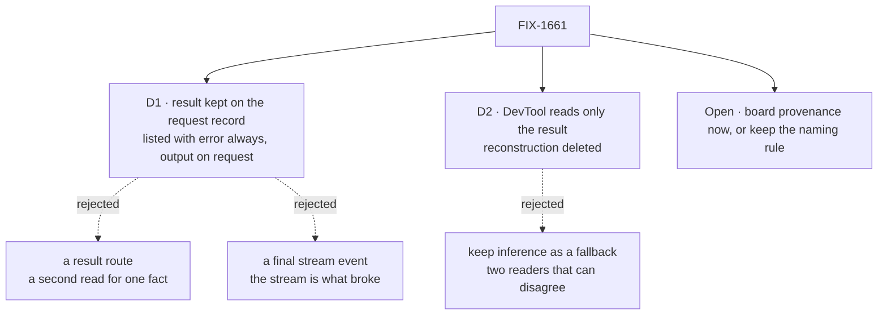

# FIX-1661 · Decisions

[Spec](SPEC.md) · **Decisions** · [Rules](BUSINESS-RULES.md) · [Plan](PLAN.md) · [Docs](DOCS.md) · [Evolution](EVOLUTION.md)

Two decisions to sign, one fork to call. The rest was decided and is listed so nobody
re-derives it.

## The tree

Solid edges are what you're signing. Dashed edges lost, and the label says why.

## D1 · The engine keeps each request's action result on its record; the request list carries the error always and the output on request

| | |
|---|---|
| **Instead of** | A new route that returns one request's result, or a final event on the live stream |
| **Because** | `runAction` already hands `output` and `error` to in-process callers at the moment it writes the final status. Putting the pair in that write gives HTTP callers the same answer (tenet 5: carry the decision, don't re-derive it). The list route returns stored records as they are and the stores keep the body whole, so no route or migration (tenet 3). A stream event would bring back the one-slot stream the reconstruction broke on. The listing stays a summary, as with items: `result.output` only on `include_result_output=true`, which the row poll sets |
| **Locks in** | Request history keeps each action's return value as long as the request is retained, including values stored nowhere today (a transient block, traces off). A default listing grows by a status-sized `result` per request; a poll that opts in ships every listed output, unbounded, each time (the DevTool row poll does). `result` and the flag are public surface clients will rely on |

It comes down to one place: the record already carries the final status; a route would be a second read.

**What would change my mind:** an app that marks an action's block transient, or turns traces
off, specifically to keep its return value out of storage. Then the result records only whether
the action refused or failed, not the value.

## D2 · The DevTool reads only that result. The trace reconstruction is deleted, with no fallback

| | |
|---|---|
| **Instead of** | Keeping the three-source inference as a fallback for servers that don't report a result |
| **Because** | Two readers of one fact disagree exactly in the cases that matter, and the fallback is the code twelve rounds kept finding holes in. The DevTool and the engine ship together through `fsdev dev`, so an older server is the rare case. Tenet 3: a change that supersedes a path deletes it |
| **Locks in** | A finished row action with no recorded result (an older server, or history from before the upgrade) reads "no result recorded for this request", never a guess. The hook filtering, reference walking and stream-log merging leave the DevTool for good |

It comes down to disagreement: a fallback keeps a second reader alive in exactly the broken cases.

## Open · Board provenance: add it to every action now, or keep the naming rule?

**Plain terms.** When a flow has several boards, the DevTool decides which board's rows offer an
action from its name: the ready-made task actions end in the board's name. Three of FIX-1629's
twelve review rounds were about that rule. The fix is a new optional field on every action,
saying which collection it acts on, returned with the action list.

**Trade-off.** Now: the rule goes, and an app can scope its own action to a board without a
naming convention, at the price of a permanent field every flow author sees, with one reader
today. Not now: the rule stays; a wrong guess offers an action on the wrong board, which then
refuses and writes nothing.

**Recommendation: not now.** The result half fixes a trust bug, a refusal that could read as
silence. The provenance half fixes a display guess whose worst case is a harmless refusal, at
the cost of framework surface nobody else asks for (tenet 3). File it and build it the day a
second reader wants it.

**What would change my mind:** if you expect apps to write their own board-scoped actions
(an `answer` per board, say) rather than use the ready-made set. Then the naming rule becomes a
convention we impose on them, and the field is worth it now.

**If wrong: low, and it surfaces fast.** Not now and you wanted it: a follow-up issue adds an
optional field, nothing breaks. Now and you didn't: a public field we'd have to keep.

It comes down to the worst case: a wrong guess is a refusal, not a wrong write.

## Decided, not asked

- **The field is `result: { output?, error? }`**, mirroring `ExecutionResult`'s `output` and
  `error`, so the in-process answer and the stored one use one vocabulary. `error` is stored as
  `{ code, message }`.
- **Absence is read by status** (BP-030). On `completed`, `incomplete` or `failed` it means no
  result was recorded (older server, pre-upgrade history); on `aborted` or `interrupted` it is
  expected; on running or suspended, not finished. A value that isn't JSON records
  `outputNotRecorded: true`, so "returned nothing" (`{}`) never reads as either.
- **A failed request keeps the action's answer when there was one.** A completion hook can fail
  a request after the action answered; the record carries both, as the row shows today.
- **The engine does not learn what a refusal is.** `{ ok: false }` is the task tools' convention;
  the DevTool keeps classifying the value (tenet 4).
- **The output is listed only on request.** The list handler already opts items in with
  `include_items`; `include_result_output` sits beside it and the handler drops `result.output`
  (leaving `hasOutput`) when it is off. No store adapter changes.
- **Not stored twice by intent.** Persisted items often hold the action's output already; D1
  is for when they don't (a transient block, traces off).
- **No change to `GET …/requests/:id/status`.** It is a liveness probe; one read path for results.
- **The row keeps polling the list** until its request ends.

## Considered and dropped

| Alternative | Why not |
|---|---|
| A `refused` request status in core | Teaches Layer 1 the task tools' return convention |
| Return the result on the dispatch response by waiting | An action can suspend or run for minutes; the row would block |
| Fix each new edge case in the DevTool, as FIX-1660 does | The twelve-round pattern. Each fix is correct and the next case is still there |

## How it got here

- **Draft** — Framed as "the engine already knows the answer; write it where the final status
  goes". Chose the record over a route or stream event, delete the reconstruction with no
  fallback, and recommend deferring board provenance. One PR.
