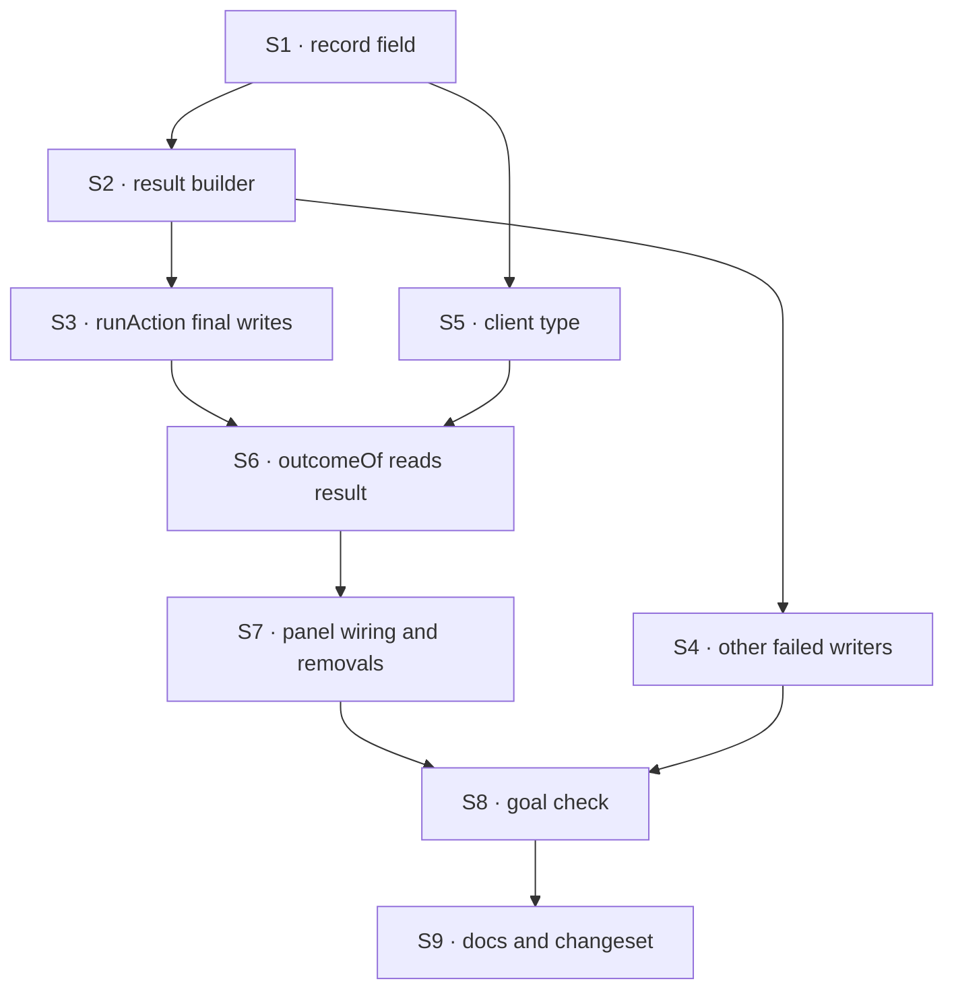

# FIX-1661 · Plan

[Spec](SPEC.md) · [Decisions](DECISIONS.md) · [Rules](BUSINESS-RULES.md) · **Plan** · [Docs](DOCS.md) · [Evolution](EVOLUTION.md)

Written for the implementing agent. IDs cross-reference [BUSINESS-RULES.md](BUSINESS-RULES.md)
(BR-n) and [DECISIONS.md](DECISIONS.md) (Dn). `tdd`. One PR.

## Surfaces

| ID | Package · role | Change | Rules |
|---|---|---|---|
| S1 | `engine` · `RequestRecord` (`stores/types.ts`) | Optional `result?: { output?: unknown; outputNotRecorded?: true; error?: { code: string; message: string } }` (`hasOutput` is list-only, S5), documented with the BP-030 absence rule. Decide whether `setFieldsIfStatus` may write it | BR-1, BR-12 |
| S2 | `engine` · one helper that builds `result` from an output and a `FlowError` | The convergence point: every final write of a request record goes through it | BR-1–BR-9 |
| S3 | `engine` · `runActionInternal` final writes | Success and `incomplete`: `result.output`. Capture the action's output **before** the completion hooks run, so a hook that throws leaves it on the failed record (BR-4). Failure: `result.error` from the normalized error it already computes. Abort / interrupt: none. Re-suspend: none | BR-1–BR-4, BR-6, BR-7, BR-10 |
| S4 | `engine` · the other writers of a `failed` request record | The setup-failure settle in `runAction.ts` and `terminateUnenqueuedRequest` in `createInboundTransportHost.ts`. Each passes its cause, if it has one, to S2 | BR-5 |
| S5 | `engine` list handler + `client` | `session-routes.ts` reads `include_result_output` beside `include_items` and drops `result.output` (setting `hasOutput`) when off. `SessionRequestSummary` adds `result`, `== null` guard documented; `listSessionRequests` adds `includeResultOutput` | BR-11, BR-11a, BR-12 |
| S6 | `devtool` · `lib/task-actions.ts` `outcomeOf` | Read `status` + `result` only. Keep the refusal and declined classifiers. **Remove** root-trace merging, hook detection, reference walking, `lastErrorItemMessage`, and the `no-trace` / `not-retained` reasons; `unknown` gets two reasons, `not-reported` and `output-not-recorded` | BR-13–BR-17, BR-21 |
| S7 | `devtool` · `DevToolPanel.tsx` | Rows get `{ requestId, status, result }` from the polled list, which sets `includeResultOutput: true`. **Remove** the stream-log cache (`streamRawItems`, `mergeRawItems`) if the row was its only reader; if the Stream tab needs it for transient traces, keep it and cut only the row's use. The row poll stays | BR-13, BR-18, BR-21 |
| S8 | `goals/devtool-workforce-visibility/reads-a-row-actions-result/` | New goal check with its own fixture host: a durable board, `taskToolActions`, and app actions shaped as the five row legs (the **api** leg reads the list response). Host flag `GOAL_CONTROL=no-result` strips `result` from list responses | goal |
| S9 | Docs and release notes | [DOCS.md](DOCS.md). One changeset, `patch`, for `engine` and `client` (additive optional field and flag, pre-1.0); `devtool` `patch` if it publishes | — |

## Sequence



## Checks

| ID | Runs after | Passes when |
|---|---|---|
| V1 | S3 | `run-action` tests: BR-1 to BR-4, BR-6 (suspend then same-request resume), BR-7, BR-9, BR-10, each asserting the stored record, not the returned value alone |
| V2 | S4 | One test per writer (BR-5), plus a **totality check** scoped to writes that set a terminal status (non-terminal writers such as `request-principal.ts`, `request-recovery.ts` and `abort-routes.ts` are out of scope). It fails on a terminal write not routed through S2; show it red by adding an unrouted one, then remove it. A typed settle helper (Notes from review) can replace it |
| V3 | S1 | Store conformance: `result` round-trips on memory, filesystem, sqlite and postgres, and a record written without it lists with it absent (BR-12) |
| V4 | S5 | Route test: the default listing carries `result.error` and `hasOutput` but no `result.output`; with `include_result_output=true` it carries the output (BR-11, BR-11a), with and without `include_items`; route table unchanged (BR-19) |
| V4a | S3 | `packages/integration-tests/src/scenarios/request-action-result.test.ts` via `testFlow`: an action that suspends lists with no `result`, and the same request's resume writes it once; a completion hook that fails after the action answered keeps both (BR-4, BR-6) |
| V5 | S6, S7 | `outcomeOf` table for BR-13 to BR-17. A grep test that the removed helpers and reasons are gone (BR-21). The FIX-1660 regression test passes or is replaced by one for BR-18 |
| VG | S8 | [The goal](SPEC.md#the-goal-and-how-well-know-its-met): `pnpm tsx goals/devtool-workforce-visibility/reads-a-row-actions-result/run.mts` PASSES, after the same run FAILED every leg under `GOAL_CONTROL=no-result`. Today's `main` FAILS **api** |
| V6 | all | `pnpm typecheck`, `pnpm test`; FIX-1629's `works-a-task-from-its-row` still PASSES |

One check per decision: D1 is V1 + V4 + V4a; D2 is V5 + the VG control. Second paths (BP-035): legacy
record (V3), suspended and resumed (V1, V4a), a hook that fails after success (V1, VG hook-fails).

## Pinned names

| Where | Name | Why pinned |
|---|---|---|
| Request record and `SessionRequestSummary` | `result`, with `output` and `error` inside | Public wire field; mirrors `ExecutionResult` (D1) |
| Row outcome | `unknown` with reasons `not-reported` and `output-not-recorded` | The states BR-17 and BR-17a promise |
| List flag | `include_result_output` / `includeResultOutput` | Public query flag beside `include_items` (D1) |
| BR-9 marker | `result.outputNotRecorded: true` | Wire state distinct from `{}` |

Everything else is yours to name.

## Guardrails

| Rule | Because |
|---|---|
| Every final write of a request record builds `result` through one helper (tenet 5) | Three places write a `failed` record today, plus the success path. Covered at one and not the others, the row shows a generic failure on exactly the paths nobody tested |
| The engine stores the value; it never classifies it (tenet 4) | Refusal is the task tools' convention. Core learning it is the Workforce-in-Layer-1 mistake one layer down |
| Write `result` in the same record write as the final status, never a second write | Two writes open a window where a poller sees `completed` with no result and shows *not reported* |
| No fallback to traces in the DevTool (D2) | A fallback keeps the reconstruction alive, and the VG control can't tell it's there unless it fails |
| `result` absent is not an error anywhere (BP-030) | Old records and old servers are real; the listing and the row must both read them |

## Docs

Reconcile and publish [DOCS.md](DOCS.md) after VG passes. It updates three pages and one
README; no new page.

## Sketch · pseudocode, illustrative, react to the shape

```
engine, at every final write:
    record ← { ...record, status, <timestamps>, items, result: build(output, error) }
    build: completed/incomplete → { output }   failed → { error, output if the action answered }

devtool, per row:
    req ← polled list entry for the row's request id
    open or absent              → pending
    aborted / interrupted       → that status, plainly (no result expected)
    failed / incomplete         → that status (req.result?.error?.message ?? "no result recorded", refusal named if output was one)
    completed, result absent    → unknown(not-reported)
    result.outputNotRecorded    → unknown(output-not-recorded)
    otherwise                   → classify(req.result.output)   ← refused | declined | ok, unchanged
```

**POC:** none. The premise that a new record field reaches the list response with no route or
store change was read directly: the list handler returns `ctx.stores.request.list(...)` records
as they are (`routes/session-routes.ts`), and the sqlite and postgres stores write the record
body as one JSON value (`updateDataStmt.run(JSON.stringify(next), …)`; postgres `data || $2::jsonb`).
V3 confirms it on every adapter. No counted facts, so no factual-base checker.

## At implement time

- **FIX-1660 lands first** (branch `fix/fix-1660`): it patches the stream-log fallback in
  `DevToolPanel.tsx` that S7 removes. Rebase over it; its regression test becomes BR-18's.
- Re-list the request-record writers of a final status in `packages/engine/src` before S4. The
  list above is what `main` had at `70f777def`; `createExecutionContext.ts` and
  `reactive-dispatch.ts` set `failed` on items and block results, not on the record.
- Check whether the Stream tab reads `streamRawItems` for transient traces before removing it (S7).

## Notes from review

From the Cursor review that approved the direction (review 5359480595). None changes the
design; weigh each at implement time.

- **V2 totality scan is heavy.** The scan over every `stores.request.set` / `patchRequestRecord`
  final-status write will fight refactors and largely duplicates S4's one-test-per-writer plus
  the implement-time re-list. Alternative: one exported builder used at the three known terminal
  writers (`runAction`, the setup-failure settle, `terminateUnenqueuedRequest`), each with a
  direct test; drop V2's grep/AST check or replace it with a one-line implementer checklist.
  If V2 is softened, update BR-5's "Proved by" cell to match so the two don't diverge.
- **V5 grep test.** A grep that the deleted reconstruction helpers are gone stacks with the
  `outcomeOf` table tests and the VG `GOAL_CONTROL=no-result` control, and the control is what
  actually proves D2. Consider dropping the grep requirement.
- **One named wire type.** `ExecutionResult` and `normalizeError` already exist on the terminal
  path. Consider a single exported type (e.g. `RequestActionResult`) in `engine`, re-exported on
  `client`, built via `normalizeError` → `{ code, message }`, instead of repeating
  `{ output?: unknown; error?: { code, message } }` inline in S1, S5 and the docs tables. Same
  pattern as `input` on `RequestRecord` / `SessionRequestSummary`.
- **Decision figures.** The D1 / D2 / Open SVGs in DECISIONS.md repeat the tables beneath them;
  the mermaid tree plus `what-changes.svg` may be enough for gate readers. Optional polish.
- **Row poll with `includeItems: false`.** Once rows read only `status` + `result` (S6), the
  DevTool row poll may not need `includeItems: true`, which is most of today's poll cost. A
  free perf win, not required for correctness; consider it alongside S7.
- **Oversized outputs.** Resolved in D1: the output is listed only on `include_result_output`.
  Storage stays uncapped; only an opted-in poll pays for a large value.

From the second-look review (PR comment 5900599873):

- **Totality as a type.** `runAction.ts` already funnels terminal writes through a local
  `patchRequestRecord` at four sites. Replace those free-form patches with
  `settleRequestRecord(stores, id, terminal)` taking a discriminated union
  (`completed{output} | failed{error, output?} | aborted | interrupted | suspended`), so a
  terminal write missing its result is a compile error. The writers outside `runAction.ts`
  (`createInboundTransportHost.ts`, the setup-failure settle) call it too. If adopted, V2's scan
  can go.

## Follow-ups

- Board provenance on the action list, if the open fork lands on *not now*: file as its own
  issue, parked until a second reader wants it.
- Other clients (the CLI's `run` summary, `useSession`) could show a request's result. Not asked
  for; flagged only.
