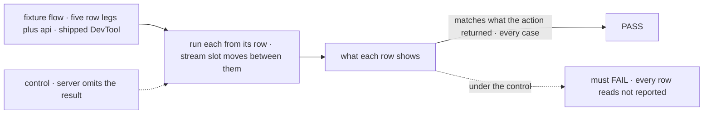
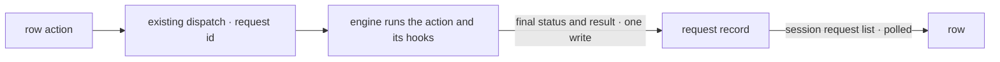

# FIX-1661 · Engine reports a flow action's result, so the DevTool stops reconstructing it

**Spec** · [Decisions](DECISIONS.md) · [Rules](BUSINESS-RULES.md) · [Plan](PLAN.md) · [Docs](DOCS.md) · [Evolution](EVOLUTION.md)

Feature · `engine` + `client` + `devtool` + `goals/` · medium · 1 PR · no epic · follows
[FIX-1629](../FIX-1629/SPEC.md) (PR #2347)

## Five people, before and after

| Someone who… | Today | After |
|---|---|---|
| **runs a task action from a DevTool row, and it refuses** | Sees it only if the DevTool finds the action's trace among hook traces, references and the live stream. Twelve review rounds each found a case where it couldn't | Sees the refusal in the action's own words, from what the engine recorded |
| **runs two row actions back to back** | The first row can lose its answer when the second takes the one live stream | Each row reads its own request's record. The stream plays no part |
| **runs an action that suspends, or whose block is marked transient** | The row waits on traces that may never be kept | The row shows pending while suspended, then the result once the request ends |
| **reads a session's history from their own client** | Sees that a request completed, not what it returned, short of walking its traces | Each listed request carries what the action returned, or why it failed |
| **points a new DevTool at a server from before this change** | n/a | The row says the server doesn't report action results. It never guesses, and never shows success |

The engine changes in this issue, on purpose. FIX-1629 ruled that out
([BR-22](../FIX-1629/BUSINESS-RULES.md#what-none-of-this-may-do)) to ship the rows without
touching Layer 1; the reconstruction was the cost. One field crosses the line, and core is
untouched ([Evolution](EVOLUTION.md)).

## The goal, and how we'll know it's met

**When a developer runs an action from a Tasks-tab row, the row shows what that action actually
came to (done, refused in its own words, or failed and why), in every case that broke the old
reconstruction, because the engine said so.**

| Is it the right goal? | |
|---|---|
| **The real need** | Jake, on the issue: *"Have the engine report a request's action result explicitly … so the DevTool reads it instead of inferring it."* The complaint was the review churn, and the churn was the reconstruction |
| **Smaller, and rejected** | "The engine writes the result on the record." Hittable while the DevTool keeps inferring, and the churn stays |
| **Bigger, and not this issue's** | Explicit board provenance on the action list. Evaluated here and recommended **not now** ([the open fork](DECISIONS.md#open)) |
| **Not done if** | The row passes because the old trace reading still runs underneath · it passes only on a request that kept the live stream · a server that doesn't report results shows success · the engine records a result on one failure path and not the others |



The check reads the screen against answers the fixture fixes. A DevTool still inferring from
traces would pass under the control, so the control must fail.

| How we verify | |
|---|---|
| **Goal check** | `goals/devtool-workforce-visibility/reads-a-row-actions-result/`, new. Chromium, shipped DevTool bundle, a fixture host with no model. The implementer runs it; verdict in the PR |
| **Signal** | Five row legs plus **api**. Each row leg is a row action whose answer the fixture fixes: **handover** (a transient action refuses, then another row's dispatch takes the stream), **hook** (a refusal under the flow's completion hooks), **ref** (a success whose value is held by reference), **suspend** (pending while suspended, then the answer after a resume), **hook-fails** (the action answered, then a hook failed it). Each row shows exactly its fixed answer. **api**: the session's request list carries the same result for all five, without asking for items |
| **Input** | The fixture's five actions and their held-out answers. Swapped answers must pass too |
| **Anti-game** | No reading the store for what the screen shows; rows found by task id; no reload; `outcomeOf` unit tests don't count |
| **Control that must fail** | `GOAL_CONTROL=no-result`: the host strips `result` from the list response. Every leg must FAIL, each row reading *not reported*. Today's `main` must FAIL **api** only; its rows pass by reconstruction, which is why `main` can't be the control |

## What changes


Three sources and a reconciler become one field the engine already knows the answer to.

**What a client reads from the request list:**

```diff
  const [req] = await sessions.listSessionRequests(sessionId);
  req.status;            // "completed"
+ req.result;            // { output: { ok: false, error: "task is cancelled, which is terminal" } }
+ // failed:             { error: { code, message } } — plus output when the action answered first
+ // absent:             not finished yet, or a server from before this change
```

## How the answer reaches the row



The result is written at the one place the engine already writes the final status. Nothing new
is streamed and no route is added.

## What stays as it is

- Every route, and the action dispatch. The list response already returns stored records.
- The stores: the record body is stored whole, so no migration.
- Which actions a row offers, including the board-suffix rule (FIX-1629 BR-10), unless you
  choose otherwise on the open fork.
- What counts as a refusal: `{ ok: false }` and a declined write, read by the DevTool. The
  engine does not learn that convention.

## Sign off

**[The goal](#the-goal-and-how-well-know-its-met), at that size:** the row shows what the engine
recorded, in every hard case, with the old inference gone. If wrong: the field ships and the
DevTool keeps guessing underneath it.

1. **[D1](DECISIONS.md#d1) · The engine keeps each request's action result on its record, and
   the session's request list returns it.** If wrong: every app's history now stores action
   return values, including ones that are stored nowhere today.
2. **[D2](DECISIONS.md#d2) · The DevTool reads only that result; the reconstruction is deleted,
   with no fallback.** If wrong: a new DevTool against an older server can't show refusals.

**Open: one** — [board provenance: add it to every action now, or keep the naming rule?](DECISIONS.md#open)
Number 1 is the one to weigh.
