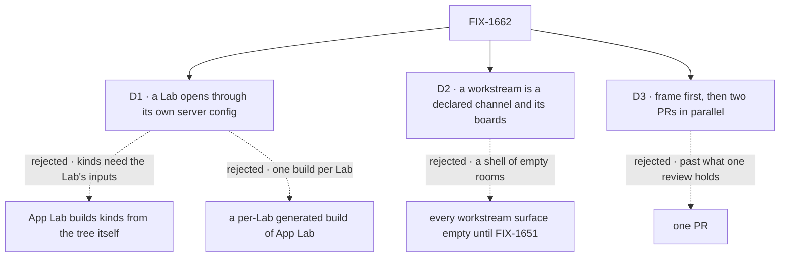

# FIX-1662 · Decisions

[Spec](SPEC.md) · **Decisions** · [Rules](BUSINESS-RULES.md) · [Plan](PLAN.md) · [Docs](DOCS.md)

Three decisions are the sign-off surface. The epic's D1 to D3 and ER-1 to ER-15
([FIX-1649](../../epics/FIX-1649/DECISIONS.md)) bind this issue and are not reopened here.

## The tree

Solid edges are what you're signing. Dashed edges lost, and the label says why.

## D1 · A Lab opens in App Lab through the server config it already needs; App Lab adds no code to it

| | |
|---|---|
| **Instead of** | App Lab reading the tree and building the Lab's kinds itself · a per-Lab `fsdev gen` build of App Lab |
| **Because** | A Lab's tree is not enough to run it. Its kinds are factories that take the Lab's own inputs: DevForce's `coder` takes a harness and a workspace, the pentest lab's seats take an answer block and a model. Only the Lab knows those, which is why both goal labs hand-assemble a host. The config `fsdev dev` serves is that host in the one shape the framework already loads (`goals/multi-seat-collab/lab/fsdev.config.mts` is one, with "no app, no wrapper, no route of the lab's own"). App Lab loads it and serves the same `FlowState` with its own pages, the way `fsdev dev` serves the devtool. The epic's runtime-loader option is what runs, inside the Lab's config; the tree is read at boot, never written down in App Lab (tenet 2: no new mechanism beside the one that exists) |
| **Locks in** | A Lab is its tree plus one host config that default-exports its `FlowState` and opens its inventory at boot. DevForce gains that file in this issue; the pentest lab gains it with the closure (FIX-1663), so App Lab never touches the tree leg b opens. App Lab ships as a static app plus the shipped Node host, so it runs where `fsdev dev` runs, not on a serverless host |

It comes down to the kinds' inputs: App Lab can't build a harness or a model it doesn't own.

**What would change my mind:** Workforce kinds becoming zero-argument modules a generated map can
import. Then a tree alone opens, and the config becomes optional.

## D2 · A workstream is a declared channel and the boards attached to it, until FIX-1650 and FIX-1651 say more

| | |
|---|---|
| **Instead of** | Every workstream surface showing an empty state until FIX-1651 ships |
| **Because** | FIX-1651's signed composition is "feature workstream = channel session + workstream boards", and FIX-1650 names "workstream-as-channel+flow". Both are shipped today: a `CHANNEL.md` with its members, its transcript, and the boards its `boards:` line attaches. Drawing them is reading what ships, not inventing a model (ER-5); leaving them empty would leave App Lab with nothing to use until two more epics land |
| **Locks in** | A workstream's address is its channel's id, and its Stream, Board and Brief are the channel's transcript (with its member seats' pending asks beside it), attached boards and charter. Progress, Results, task states and projects stay named empty states until their owner ships them. With no projects, the PROJECTS tree lists the Lab's workstreams directly, as the design says |

It comes down to day one: channels and boards ship now, so the stream and board can be real.

**What would change my mind:** FIX-1651's spec defining a workstream that isn't a channel. Then the
address changes and the surfaces stay.

## D3 · Four PRs: the frame first, then the workstream level and Inbox with Tasks in parallel, then the goal check

| | |
|---|---|
| **Instead of** | One PR carrying the frame, two levels, Inbox and Tasks |
| **Because** | The frame (serving, the org gate, the sidebar, the routes, the panel slot, the shared reads) is what FIX-1664 builds on and what both halves read through. After it, the workstream level and Inbox with Tasks share no file and can be reviewed apart |
| **Locks in** | FIX-1664's build can start once the frame merges, not after the whole issue. The goal check runs once, after both halves |

It comes down to review size: one PR of two levels and two destinations is past what a review holds.

## Decided, not asked

- **App Lab is a static app served by `@flow-state-dev/node`'s `serve()`** over the loaded config,
  as the devtool is. No Next.js: its server would be a second host beside the Lab's.
- **The first screen is Inbox**, since it answers "what waits on me".
- **The org gate is the Lab's own principal resolver.** App Lab's first read with no verified
  organization is refused, and App Lab shows its refusal screen, never a tree. No shipped route
  reports the principal without a read, so the gate is that first refusal.
- **The org switcher shows the verified organization** and lists no other until a shipped read
  lists more than one.
- **Board columns map shipped task statuses onto the design's five** in one table
  ([BR-12](BUSINESS-RULES.md#boards-and-tasks)); FIX-1651 may replace it. IN REVIEW holds nothing
  until FIX-1651 ships a review state.
- **Inbox, until FIX-1652, is the pending approvals and questions in the seat sessions the
  person can list**, drawn by the shipped approval and question renderers the stream uses, so one
  ask has one look. The session listing never widens past the caller, so another member's asks
  are not listed, and a parked row with no suspension is not an ask; both are FIX-1652's.
- **A workstream's Stream also draws its member seats' pending asks**, beside the transcript,
  with Inbox's card and resume ([BR-18](BUSINESS-RULES.md#workstreams-and-posting)). An ask lives
  in the seat's session, not the channel's, and nothing shipped moves one into the other, so the
  epic's "leaves Inbox and its card in the workstream's stream together" needs the Stream to read
  where Inbox reads. It is App Lab reading what S3 already loads; no Core or Engine change.
- **A post without `@` goes through the channel's own post action.** `@worker` goes through
  FIX-1664's named session write (ER-15); until FIX-1664 merges it is disabled with a line.
- **The task route and the right panel's slot are pinned here** ([PLAN](PLAN.md#pinned-names));
  FIX-1664 fills both and adds no route.
- **A board declared only in a kind's code is not a workstream's board.** Only `boards:` on a
  channel attaches one. DevForce's board is code-declared today, so its workstream shows the
  empty board ([Follow-ups](PLAN.md#follow-ups)).

## Considered and dropped

| Alternative | Why not |
|---|---|
| A per-Lab `fsdev gen` step into App Lab | One App Lab build per Lab, and it still can't supply a harness or a model. `goals/` isn't an app directory `fsdev gen` renders for |
| App Lab as a client of a separately running Lab server | Two processes and a cross-origin credential for no gain; the Lab's config is loadable in-process |
| Reuse `FlowNavigator` as the sidebar | It groups flow kinds and sessions; the design groups projects, workstreams and teams. It stays the devtool's |
| An org-wide ask list on the server | A new read in the engine, which this issue doesn't change. Session suspensions ship; FIX-1652 decides whether a list earns its place. Until then Inbox holds the person's own seat sessions' asks |

## How it got here

- **Draft**: framed as the place a Lab is used; opened through the Lab's own server config, read
  at runtime; workstreams drawn over shipped channels and boards; four PRs, frame first.
- **Review round 1**: Inbox narrowed to the asks in the seat sessions the person can list, because
  the shipped listing never widens past the caller and an org-wide read is rejected here; parked
  rows without a suspension left out of Inbox, matching the Inbox decision (ER-5).
- **Amendment after merge** (epic decision): the Stream draws its member seats' pending asks
  beside the transcript. As merged, BR-18 (Stream = the channel's transcript), BR-24 (Inbox =
  seat sessions) and BR-26 (answered in both places together) could not all hold for an ask in a
  seat's session, which is where the DevForce EM raises it
  ([FIX-1666](https://linear.app/fixpoint-labs/issue/FIX-1666), PR #2437). The epic's journey and
  FIX-1663's a1 need the card in the Stream. BR-18, BR-26, S3, S7, S10 and V7 amended. That seat is
  woken by a keyed dispatch, so its session is a dispatch run: S3's listing includes dispatch runs
  (BR-24) and V7 runs through the channel-notify path.

**Open: none.**
