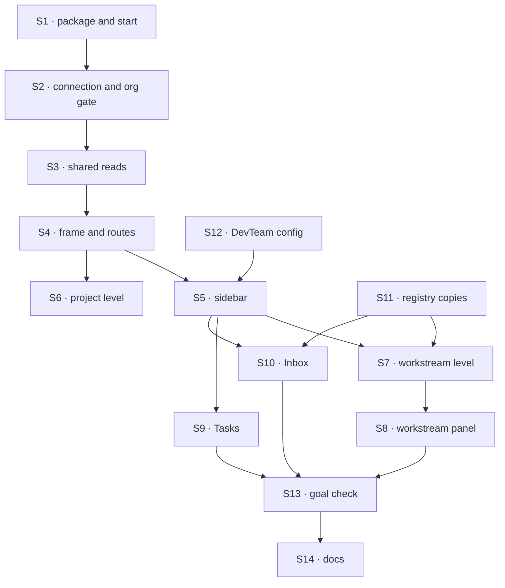

# FIX-1662 · Plan

[Spec](SPEC.md) · [Decisions](DECISIONS.md) · [Rules](BUSINESS-RULES.md) · **Plan** · [Docs](DOCS.md)

Written for the implementing agent. IDs cross-reference [BUSINESS-RULES.md](BUSINESS-RULES.md)
(BR-n), [DECISIONS.md](DECISIONS.md) (D-n) and the epic's rules (ER-n). `tdd`. Four PRs (D3).

## Surfaces

| ID | Where · role | Change | Rules |
|---|---|---|---|
| S1 | `labs/shift-manager/` · package | New private package `@flow-state-dev/shift-manager`: a Vite React app shaped like `apps/devtool`, plus a start script that loads a Lab's config with `@flow-state-dev/cli`'s `loadFsdevConfig` and hands it to `@flow-state-dev/node`'s `serve(flowstate, { staticDir })`, bound to loopback unless the Lab resolves a verified principal (the `fsdev serve` guard) | BR-1 BR-2 |
| S2 | `labs/shift-manager` · the connection | Reads user and credential the way the devtool shell does; a refused or org-less principal renders the refusal screen before any read | BR-3 ER-4 |
| S3 | `labs/shift-manager` · the shared reads | One module every surface reads through: the seat and channel inventory, each channel's attached boards, the person's listed seat sessions, their pending suspensions. The seat-session listing passes `include: "dispatch-runs"`: a seat woken by a channel post (the channel-notify dispatcher, `session: { key }`) runs in a dispatch-run session, which the default listing leaves out, so without it neither Inbox nor the Stream would see that seat's ask. One read per resource per refresh, shared by counts, badges and screens; per-seat reads batched. It also holds the one answer path (the session's shipped resume) that Inbox and the Stream both call. That resume goes through the flow the ask's session records as its owner (its `flowId`), never assumed to be the board's: a seat can hand off to another flow. The listing row already carries it (the engine returns each stored session record whole, and `SessionSummary.flowId` types it), so no extra read is made; a row with no `flowId` (a session written before instance ownership) is not resumed through the board's flow, and its card shows the answer as unavailable. Contract: it refreshes on boot, org switch, a successful resume and Retry, and for a task screen waiting for its run link, by a bounded re-read of that one board every 2 s, at most 30 times ([FIX-1664](https://github.com/fixpoint-labs/flow-state-dev/pull/2436) BR-3); not on every route or tab change; ask reads use the pending-ask projection (`react`'s `deriveSuspensions` over the listed sessions), not the full transcript per seat; Inbox and the Stream share its one cache | BR-4 BR-7 BR-8 BR-11 BR-26 |
| S4 | `labs/shift-manager` · the frame | Three columns; the routes and the right panel's slot ([pinned](#pinned-names)); tab in the URL; centre tabs mounted lazily | ER-1 BR-17 |
| S5 | `labs/shift-manager` · the sidebar | Org switcher, Jump to (⌘K, incl. resources), Inbox and Tasks with counts, PROJECTS (workstreams directly while no projects ship), TEAMS with workers below each team, footer | BR-6 to BR-11 |
| S6 | `labs/shift-manager` · the project level | Route and tabs Stream, Board, Workstreams, Brief, each its named empty state (FIX-1650); team strip from the inventory | BR-9 |
| S7 | `labs/shift-manager` · the workstream level | Stream (transcript, composer, member pending asks per BR-18), Board (shift-manager's own five-column grouping over BR-12's map; `react`'s `BoardColumns` draws one column per status and can't merge them, so it is not used for the board, and no FSD package changes), Brief (charter), Results (empty state) | BR-12 BR-13 BR-14 BR-18 to BR-22 BR-26 |
| S8 | `labs/shift-manager` · the workstream panel | Progress (empty state), Team (members, BR-8), Tasks grouped by column | BR-23 |
| S9 | `labs/shift-manager` · Tasks | The list over S3's board reads, grouped by State / Worker / Stream, Queued toggle, full width | BR-15 BR-16 BR-28 |
| S10 | `labs/shift-manager` · Inbox | List and detail pane; the detail uses the stream's approval and question renderers; Approve / Deny via S3's resume; reply through the ER-15 seam | BR-24 to BR-28 |
| S11 | `labs/shift-manager` · registry copies | `fsdev ui add` for the stream's cards (message, tool, approval, question, suspension card, request group); unedited; theme via tokens only | ER-6 |
| S12 | `goals/devteam-lab/lab/fsdev.config.mts` | New, host only: read the tree, hire (harness from env, the scripted stub by default), resolve the principal, open the channel and the inventory, default-export the `FlowState`. `host.mts` and the three checks untouched | D1 BR-1 |
| S13 | `goals/shift-manager/it-opens-a-lab/` | The goal check: `goal.md`, `run.mts`, both controls | the goal |
| S14 | Docs | [DOCS.md](DOCS.md): `labs/shift-manager/README.md`, `labs/README.md` row | ER-14 |

**Removed:** nothing. Kitchen-sink's `lib/workforce-shell.ts` stays; shift-manager mirrors
`apps/kitchen-sink/app/page.tsx`, `components/team-panel.tsx`, `components/seat-pane.tsx` and
`components/picked-session-panel.tsx` for shape and imports nothing from `apps/`.

## Sequence



### PR plan

| id | Deliverables | depends_on |
|---|---|---|
| `frame` | S1 to S6, S11, S12; the README without the level sentences | — |
| `workstream` | S7, S8 | `frame` |
| `inbox-tasks` | S9, S10 | `frame` |
| `goal` | S13, S14 | `workstream`, `inbox-tasks` |

`frame` is the merge FIX-1664 waits on. The final visual pass is not in this DAG: it follows the
final hand-back (ER-9) as its own PR.

## Checks

| ID | Runs after | Passes when |
|---|---|---|
| V1 | S1 | Starts over `goals/multi-seat-collab/lab/fsdev.config.mts`; a missing or non-`FlowState` config exits non-zero with the loader's message (BR-2) |
| V2 | S2 | An org-less principal's first read is refused; the refusal screen renders, nothing from the tree is drawn and no further read is made (BR-3). Negative: with the gate removed, the test fails |
| V3 | S3 | Counts, badges and screens share one read per resource; a failed read degrades only its section (BR-11). Second path: a Lab with no inventory (BR-4) |
| V4 | S5 | TEAMS equals the store's seats per team; BR-8's three states; BR-9 with no projects |
| V5 | S7, S9 | BR-12 for every shipped status, including the legacy `awaiting_review` read as parked; BR-13, BR-14, BR-15 |
| V6 | S7 | A post appears only after the transcript holds it; a refused post keeps the draft (BR-19, BR-20); `@worker` disabled until the seam is filled (BR-21) |
| V7 | S7, S10 | Through the real channel-notify dispatch path (a channel post wakes a member seat by `session: { key }`, not a session created directly), that seat's ask shows in Inbox and the Stream. Negative: with S3's listing on the default (no `dispatch-runs`), the ask is missing from both and the test fails. Approve and Deny resolve through the resume; an ask in a member seat's session shows in that workstream's Stream and in Inbox, and answering it in either clears both (BR-18, BR-25, BR-26). Positive: the Stream's asks are exactly the intersection of the BR-24 listing and the channel's member seats, and an ask whose seat is on two channels shows on both Streams. Negative: an ask in a seat that is not the channel's member is not drawn in its Stream. Cross-flow: an ask in a member seat's session owned by another flow than the board's resumes through that session's `flowId`; resuming it through the board's flow fails the check |
| V8 | S1 to S11 | Static: no literal colour in shift-manager's styles outside token definitions; no seat, channel, board, team or kind name from either tree in `labs/shift-manager/src` (BR-5); registry copies byte-equal their source |
| VG | S13 | [The goal](SPEC.md#the-goal-and-how-well-know-its-met) PASSES on both trees, after `GOAL_CONTROL=static-names` and `GOAL_CONTROL=optimistic-post` each FAILED at their named signal |
| V9 | D1 | Leg-b readiness: shift-manager starts over a config it has never seen (a temp copy of multi-seat-collab's) with no change to `labs/shift-manager` |

## Pinned names

| Where | Name | Why pinned |
|---|---|---|
| Task route | `/tasks/:boardRef/:taskId/:tab`, `:tab` ∈ `session · diff · checks · brief` | FIX-1664 fills it (epic seam) |
| Right panel slot | the level's panel region: workstream → this issue's panel, task → FIX-1664's inspector, others → none | FIX-1664 fills it |
| Workstream route | `/w/:channelId/:tab`, `:tab` ∈ `stream · board · brief · results` | D2; a link opens the same view |
| Project route | `/p/:projectId/:tab`, `:tab` ∈ `stream · board · workstreams · brief` | Epic structure; FIX-1650 fills the meaning |
| Start command | `pnpm --filter @flow-state-dev/shift-manager start --config <path>` | README and the closure run it |
| Controls | `GOAL_CONTROL=static-names`, `GOAL_CONTROL=optimistic-post` | The goal check names them |

Everything else is yours to name.

## Guardrails

| Rule | Because |
|---|---|
| shift-manager's source names nothing from a tree | The second Lab is the whole point; a name written in is `workforce-shell.ts` again (D1, BR-5) |
| No FSD package changes. A part that won't take the skin is reported to FIX-1655 | Paint and fixes live at the source (ER-2, ER-6) |
| Styles reference token names only, from FIX-1655's spec; no literal colours; ship on the neutral defaults | Leg c reads shift-manager with no theme; final values wait for the hand-back (ER-3, ER-9) |
| Each empty state's copy is a prop at the surface, naming its owner | The sibling fills it later without touching the surface (ER-5) |
| One live stream per open session; centre tabs load when opened; sidebar reads shared, not per row | A Lab with dozens of seats must not open dozens of streams to draw a badge |
| Nothing is drawn as sent, answered or done before the store says so | ER-15's "the session's answer, not the shell's hope" |

## Docs

Reconcile [DOCS.md](DOCS.md) against the running app and publish it in the `goal` PR, through
`docs-writer` then `docs-editor`. The task-level sentences are FIX-1664's.

## Sketch · pseudocode, illustrative, react to the shape

```
start:   config ← load the Lab's fsdev config        (the Lab's own host; D1)
         serve(config's FlowState, shift-manager's built pages)
browser: principal ← as the devtool shell does; no org → refusal
         reads  ← inventory, attached boards, seat sessions, pending asks   (one shared module)
         route  → sidebar + centre(level, tab) + panel slot(level)
post:    channel's own post action → wait for the transcript → draw the line
```

**POC:** none. The one premise the design rests on, that a Lab's config can be loaded and served
beside another app's pages, is what `fsdev dev` does with the devtool today.

## At implement time

- Re-read FIX-1655's and FIX-1664's merged or in-review specs for the token names and the session
  write; use them as named, and raise a conflict rather than picking your own.
- Check whether FIX-1651 or FIX-1652 shipped anything; a shipped read replaces its empty state.
- Confirm `loadFsdevConfig` and `serve`'s `staticDir` still have the shapes S1 assumes.

## Follow-ups

- **DevTeam's board is declared in its kinds' code, not attached to its channel.** Its
  workstream shows the empty board (BR-14), so the closure's journey "Tasks or the board → a task"
  can't run on the DevTeam tree until the board is channel-attached (FIX-1385's direction).
  No child owns it; raised to the epic coordinator.
- **The pentest lab needs its host config for leg b.** Owned by FIX-1663, host only, following S12.
- **The final visual pass** after the final hand-back (ER-9).

## Notes from review

Recorded for implementation, not baked into the design. Accept or decline each against the code.

- **Cursor (PLAN, PR plan):** "D3's value is review-sized chunks; this row still puts **S6 (full
  project level)** and **S11 (all registry copies + V8 byte-equal gate)** in `frame` before
  workstream/Inbox exist. Consider deferring S11 to `workstream`/`inbox-tasks` and trimming S6 to
  route + tab shells + empty copy props unless ER-1 forces more here — otherwise `frame` is still a
  whole-product merge."
- **Cursor (review body):** default to virtualized lists and one in-memory task index feeding BR-8, Tasks counts and TEAMS status;
  TanStack Query or the devtool's client cache pattern over a one-off refresh layer.
- **Cursor (PLAN, Removed):** "Naming four kitchen-sink files to mirror invites file-by-file drift.
  A shorter 'shape reference' (three columns + panel slot + channel post semantics) plus **react**
  primitives (`Roster`, `SeatDetail`, `BoardColumns`) and `workforce/browser` transcript types is
  probably enough — implementer shouldn't re-wire `SHELL_BOARDS`-style static maps." (`BoardColumns`
  can't draw BR-12's merged columns; see S7.)
- **Cursor (PLAN, S5):** "`cmdk` is already in the repo (`packages/ui`, kitchen-sink) — plan could
  nudge implementers to reuse that command palette pattern rather than a one-off search UI, with
  index built once per S3 refresh (debounce + result cap)."
- **Cursor (review body):** mark which checks are PR-local CI and which are goal-only, so one
  assertion isn't built into two harnesses (e.g. the board status matrix once, navigation breadth
  in VG).
- **Second-look (PR comment):** "V9 restarts shift-manager over a temp copy of the multi-seat-collab
  config … Drop V9." VG's `static-names` control and V8 already cover it; V1 covers startup over
  multi-seat-collab.
