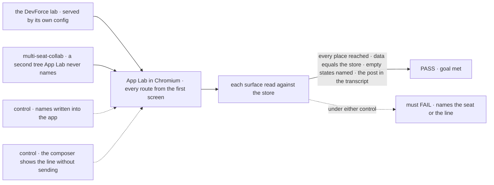
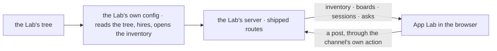

# FIX-1662 · App Lab shell: sidebar, project and workstream views, and the contextual panel over a Lab's Workforce tree

**Spec** · [Decisions](DECISIONS.md) · [Rules](BUSINESS-RULES.md) · [Plan](PLAN.md) · [Docs](DOCS.md)

Feature · new private app `labs/app-lab` · no FSD package changes · large · 4 PRs · epic
[FIX-1649](../../epics/FIX-1649/SPEC.md) (PR #2421) · beside [FIX-1655](https://linear.app/fixpoint-labs/issue/FIX-1655)
and [FIX-1664](https://linear.app/fixpoint-labs/issue/FIX-1664)

## Five people, before and after

| Someone who… | Today | After |
|---|---|---|
| **uses a Lab day to day** | Runs it from a goal script or `fsdev dev`, and watches it in the devtool, a debugger | Starts App Lab over the Lab and works in one browser tab: an Inbox of what waits on them, every task in flight, each workstream's stream, board and brief, each team with its workers |
| **builds the next Lab** | Writes a host, then a UI, and writes down in the UI the names the host already knows (kitchen-sink's `workforce-shell.ts`) | Writes the one server config any Lab already needs for the devtool. App Lab reads the rest from the running Lab |
| **posts in a workstream** | Has no screen for it outside kitchen-sink's one channel | Types in the stream's composer; the line appears once the channel has it, never before |
| **opens a surface a sibling epic hasn't shipped** | n/a | Sees where it will be and a sentence naming what arrives, never made-up rows |
| **builds the task screen** (FIX-1664) | Nothing to hang it on | Fills a route and a right-panel slot this issue names and owns |

## The goal, and how we'll know it's met

**A person starts App Lab over a Lab and, in a browser under that Lab's organization, reaches
every place the shell promises, sees the Lab's real teams, workstreams, boards and asks wherever
Workforce ships a read, sees a named empty state wherever it doesn't, and can post in a
workstream's stream.**

| Is it the right goal? | |
|---|---|
| **The real need** | "Nowhere to *use* a Lab" (the issue), and the epic's goal: every surface reached, a second Lab with no shell code ([FIX-1649](../../epics/FIX-1649/SPEC.md#the-goal-and-how-well-know-its-met)) |
| **Smaller, and rejected** | "The screens render." Met by a page of fixtures, or by names written into the app, which is the kitchen-sink pattern a second Lab could not reuse |
| **Bigger, and not this issue's** | The task screen (FIX-1664) · the skin (FIX-1655) · what projects, tasks and asks mean (FIX-1650, 1651, 1652) · the second-Lab and no-App-Lab-paint legs (FIX-1663) |
| **Not done if** | A surface shows rows the store doesn't hold · a seat, channel or board name is written in App Lab's code · a post shows as sent before the channel holds it · a Lab opens with no organization · a reused FSD component was edited or restyled |



The check grades the screen against what the store holds, never against a fixture or the app's
own state.

| How we verify | |
|---|---|
| **Goal check** | `goals/app-lab/it-opens-a-lab/` · model n/a (the DevForce lab on its scripted harness; multi-seat-collab is deterministic) · real Chromium · run by the implementer at completion · verdict in the implementation PR |
| **Signal** | From the first screen, every sidebar section, Inbox, Tasks, every tab at the project and workstream levels, the workstream's right panel and the task route's frame are reached, each `aria-selected` or in view. TEAMS lists exactly the store's seats per team; each workstream is exactly one declared channel; each board row, Tasks row and Inbox item equals a store row; every surface with no shipped read shows its named empty state. A composer post is in the channel's stored transcript before the stream shows it |
| **Input** | `goals/devforce-lab/lab/` through a new host-only `fsdev.config.mts`, and `goals/multi-seat-collab/lab/` through its existing one, which carries a board with a parked row. Kitchen-sink's tree stands in for neither |
| **Anti-game** | No assertion on App Lab's own state or a mocked server. No App Lab code names either tree. Text found *somewhere* on the page doesn't count: rows are read by id |
| **Control that must fail** | `GOAL_CONTROL=static-names`: App Lab reads a names list compiled in for DevForce. It must FAIL on multi-seat-collab at *TEAMS equals the store's seats*, naming the missing seat. `GOAL_CONTROL=optimistic-post`: the composer draws the line without sending. It must FAIL at *the post is in the stored transcript*. Today's `main` fails everything |

## What changes


One Lab config, two things that can serve it. The top row is today; the bottom is App Lab
reading everything from the running Lab rather than from a list in its own code.

**What a Lab author writes, beside the tree:**

```diff
+ // goals/devforce-lab/lab/fsdev.config.mts: the host config fsdev dev already accepts
+ const flows = await hireLab({ tree: await readLabTree(), harness: stubOrReal() });
+ const flowstate = createFlowState({ flows, stores, resolvePrincipal });
+ await openInventory(flowstate, …);         // what App Lab's sidebar reads
+ export default flowstate;
```

**And how a person opens it:**

```diff
+ pnpm --filter @flow-state-dev/app-lab start --config goals/devforce-lab/lab/fsdev.config.mts
```

## How a screen reaches the Lab



Everything App Lab shows comes through routes the Lab's server already serves; App Lab's server
side is the shipped static host, nothing more.

## What stays as it is

- **Every FSD package.** App Lab imports the `react` chrome and copies registry components in
  unedited; a part that won't take the skin goes to FIX-1655.
- **Kitchen-sink** stays the teach surface, and **the devtool** stays the debugger, one link
  away from a task.
- **The goal labs' own checks**: the DevForce config is new beside `host.mts`, which is
  unchanged.
- **What a project, a task state or an ask means**: the siblings'.

## Sign off

**[The goal](#the-goal-and-how-well-know-its-met), at that size:** every place reached, real data
where a read ships, a named gap where it doesn't, a post that is real. If wrong: we ship a shell
of empty rooms, or one that only knows the Lab it was built beside.

1. **[D1](DECISIONS.md#d1) · A Lab opens in App Lab through the server config it already needs;
   App Lab adds no code to it.** If wrong: every Lab gains a small config file, and a Lab that
   wants to open from Markdown alone has to wait for zero-argument kinds.
2. **[D2](DECISIONS.md#d2) · A workstream is a declared channel and the boards attached to it,
   until FIX-1650 and FIX-1651 say more.** If wrong: FIX-1651 defines a workstream that isn't a
   channel, and App Lab's workstream addresses move.
3. **[D3](DECISIONS.md#d3) · Four PRs: the frame first, then the workstream level and Inbox with
   Tasks in parallel, then the goal check.** If wrong: more merges than the work needs.

**Open: none.** D1 is the one to weigh. Reasoning and what lost: [DECISIONS.md](DECISIONS.md).
The cases: [BUSINESS-RULES.md](BUSINESS-RULES.md).
