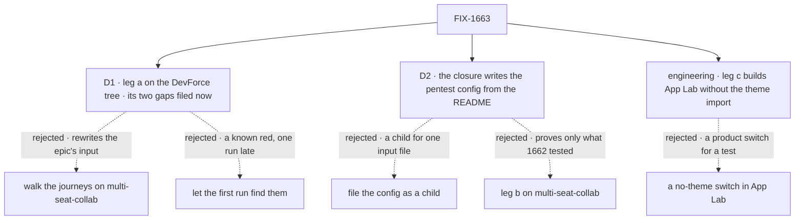

# FIX-1663 · Decisions

[Spec](SPEC.md) · **Decisions** · [Rules](BUSINESS-RULES.md) · [Plan](PLAN.md) · [Docs](DOCS.md)

The [closure rule](../../../docs/contributing/orchestration.md#the-closure-issue-every-epic-ends-in-qa)
fixes what the plan contains and in what order, and the epic fixes the legs, their inputs and
leg c's control ([FIX-1649 → How we verify](../../epics/FIX-1649/SPEC.md#the-goal-and-how-well-know-its-met),
[ER-12, ER-13](../../epics/FIX-1649/BUSINESS-RULES.md#the-closure)). These cards are the calls
left open. D1 and D2 are the sign-off; the rest are decided so nobody decides them on the day.

## The tree

Solid edges are what was chosen. Dashed edges lost, and the label says why.

## D1 · Leg a stays on the DevForce tree; the two journeys it can't produce today are filed now as children of FIX-1649 that block this issue

| | |
|---|---|
| **Instead of** | (a) Walking the design's two journeys on a tree that can produce them, such as `goals/multi-seat-collab/lab/`, which has a board with a parked row. (b) Leaving them for the first closure run to find |
| **Because** | The epic pins leg a's input to the DevForce tree and names both journeys as its signal. As the tree stands on `main`, neither can run on it: no seat, flow or stub in `goals/devforce-lab/lab/` raises an approval, so Inbox → Approve & run has nothing to answer; and its board is declared in the `coder` kind's code, not attached to the feature channel, so the workstream's Board and Tasks are empty (FIX-1662 flags this in its [PLAN → Follow-ups](https://github.com/fixpoint-labs/flow-state-dev/pull/2424) and gives it no owner). (a) passes leg a by rewriting the epic's input, which the Architect's guidance names as an invent-kill. (b) costs a full run to learn what we know now, and the fixes would start after every child has merged instead of beside them |
| **Locks in** | On approval, two children of FIX-1649 filed through `issue-manager`, each blocking this issue: **the DevForce tree raises an ask a person can approve**, and **the DevForce feature channel carries the board its rows sit on** (FIX-1385's channel-attached direction). They change the goal lab's tree only, and its three existing checks stay green (part 3). Neither is DevForce the product. If FIX-1662 or FIX-1664 closes either gap first, that child is closed with a pointer |

**What would change my mind:** the owner saying the DevForce tree is evidence that must not grow,
and leg a's journeys may run on a second tree. Then the epic's input changes by amendment, not
here.

**What being wrong costs:** two small children the epic didn't plan, one of which may prove
unnecessary.

It comes down to the epic's input: moving leg a to a tree that already works is a change only the
epic can make.

## D2 · The closure writes the pentest Lab's host config, following App Lab's README and nothing else

| | |
|---|---|
| **Instead of** | (a) Filing the config as a child of FIX-1649. (b) Running leg b on multi-seat-collab, whose config already exists |
| **Because** | A Lab opens in App Lab through the one server config it already needs ([FIX-1662 D1](https://github.com/fixpoint-labs/flow-state-dev/pull/2424)), and FIX-1662 hands the pentest one to this issue. Writing it from the README is the "builds the next Lab" team's journey: if a person following the README can open a Lab App Lab has never seen, the promise holds; if they can't, the README is the finding. (a) is a child for one input file, and loses the journey. (b) proves only the tree FIX-1662's own check already ran on |
| **Locks in** | `goals/pentest-lab/lab/fsdev.config.mts`, host only, written from App Lab's README with the spec closed. Every step taken that the README does not say, and every line that differs from DevForce's config for a reason other than the tree, is reported and filed. `labs/app-lab` is untouched. The pentest lab's two existing checks stay green |

**What would change my mind:** the README naming a generator (`fsdev gen` or similar) that writes
the config. Then the closure runs the generator instead of writing the file.

**What being wrong costs:** a file written by the check it feeds, which could smooth over a gap in
the README; the report's list of unstated steps is what guards against that.

It comes down to the README: writing the file from it is the only way leg b tests what a Lab
author reads.

## Decided, not asked

- **Leg c builds App Lab a second time with only the theme import removed** (engineering call).
  Removing a stylesheet at the network fails once the bundler inlines it, and a no-theme switch
  in App Lab is product code written for a test. The patch is applied to a scratch copy of the
  commit, never committed, and its diff is in the report. If App Lab cannot build or render
  without that one import, that is a finding against FIX-1662.
- **The control `hardcoded-accent` plants App Lab's accent as a literal colour in App Lab's copy
  of the tool card**, in the same scratch way. It borrows FIX-1655's name so a reader knows it;
  the drift check going red under it too is reported, not graded.
- **Leg c reads light and dark.** With no theme, the neutral defaults' dark values must carry no
  App Lab value either.
- **Leg c's value list is read from the design-system package**, every colour and font the
  App Lab theme declares in both variants, as FIX-1655's static check reads it, so it can't go
  stale.
- **The sweep is read from what App Lab installed**, plus the named chrome and the devtool trace
  page. A component App Lab adds later is swept without editing the check.
- **A real-model leg is never retried.** A missing turn, a missing answer or an ask that never
  shows is a finding, not flake.
- **The run waits for the final design hand-back** to be linked on FIX-1649 ([epic
  ER-9](../../epics/FIX-1649/BUSINESS-RULES.md#how-the-set-is-run)). Before it, the run is
  blocked, not failed.
- **FIX-1664's goal check and controls are read off its merged spec.** It has none yet; this plan
  names no switch for it.
- **Docs get a smoke-follow:** App Lab's README by leg b, the token section by part 2. Corpus
  polish is the epic's wrap.

## Considered and dropped

| Alternative | Why not |
|---|---|
| Kitchen-sink's tree for either leg | A teach surface; the epic and the Architect rule it out |
| Leg c by stripping CSS rules in the page after load | Grades a page the app never shipped; a rule left behind looks like a pass |
| Skip a child's check because a leg covers it | "Covers" becomes a judgement nobody can check |
| Fix a small gap inside the closure PR | A gap is a child of the epic, on its own route |

## Open / Settled

**Open: none.** Settled: none. No POC: the one premise the legs need but the children don't
prove, that the DevForce tree can't produce the two journeys, is read off the tree (the grep is
in [PLAN.md → At implement time](PLAN.md#at-implement-time)).

## How it got here

- **Draft** — the epic's legs on the trees it pins, one commit, one real-model leg; the two
  DevForce gaps FIX-1662 surfaced filed now rather than found late; the pentest config written
  from the README as the next-Lab team's journey.
