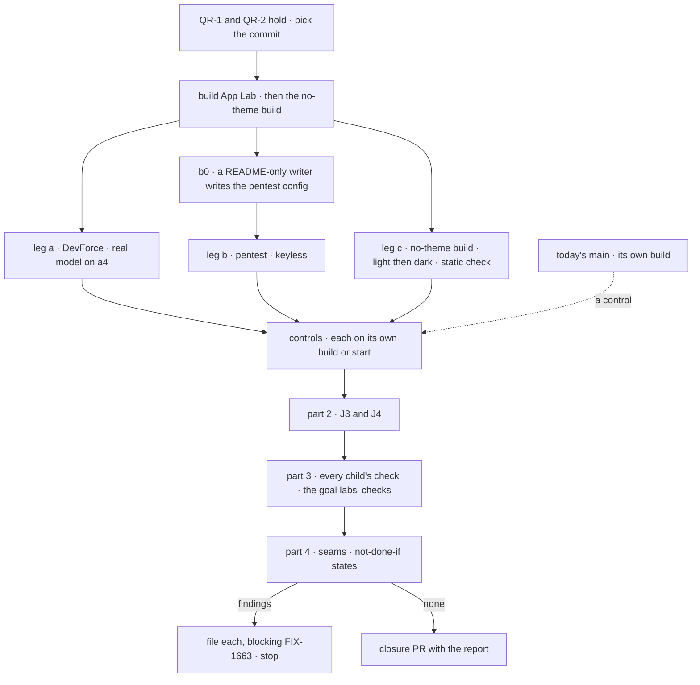

# FIX-1663 · Plan

[Spec](SPEC.md) · [Decisions](DECISIONS.md) · [Rules](BUSINESS-RULES.md) · **Plan** · [Docs](DOCS.md)

Written for the closure worker; it owns the leg definitions. It starts when QR-1 and QR-2 hold,
and adds only the goal check and the pentest config. Names from the children are read off their
**merged** specs: FIX-1662's are in review as
[#2424](https://github.com/fixpoint-labs/flow-state-dev/pull/2424), FIX-1655's as
[#2425](https://github.com/fixpoint-labs/flow-state-dev/pull/2425), FIX-1664 has no spec yet.
Where a merged spec renames something below, the merged spec wins.

## Surfaces

| ID | Where | Change |
|---|---|---|
| S1 | `goals/app-lab/a-lab-is-worked-through-one-skinned-shell/` | `goal.md` from [SPEC.md's goal](SPEC.md#the-goal-and-how-well-know-its-met) in the `goals/README.md` format; `run.mts`: builds App Lab from the commit, starts it over each Lab's config, drives Chromium through the [Sequence](#sequence). Page helpers lifted from FIX-1662's and FIX-1664's checks |
| S2 | `goals/pentest-lab/lab/fsdev.config.mts` | New, host only, written from App Lab's README ([D2](DECISIONS.md#d2)). `host.mts` and the two checks untouched |
| S3 | S1's scratch builds | The no-theme build (leg c) and the `hardcoded-accent` build: each a patch on a scratch copy of the commit, never committed, its diff printed in the report |
| S4 | The closure PR | Only after a run that files nothing: S1 with its verdict log, S2, the report as its body. No changeset |

## Sequence

## Checks

Every row read on the page is compared by id with what the running Lab's store returns through
its shipped routes, never with App Lab's own state.

| ID | Passes when |
|---|---|
| a1 | **The Inbox journey.** A DevForce seat raises an ask through [D1](DECISIONS.md#d1)'s first child's deterministic path; no model decides to ask. From App Lab's first screen: Inbox shows it with its kind and workstream; select it; the detail pane shows the same card the workstream's stream shows; **Approve & run**. The ask leaves Inbox and its stream card changes together, and the seat's session shows the resume |
| a2 | **The task journey.** A row on the DevForce feature board (through D1's second child). From Tasks, then again from the workstream's Board: open the task; its Session tab shows the seat's live harness session, and the task inspector sits in the right panel with the devtool trace link. Opening the link lands on that run's trace |
| a3 | **Every surface ([epic ER-1](../../epics/FIX-1649/BUSINESS-RULES.md#what-a-team-gets-and-what-it-doesnt)).** The org switcher, Jump to (finding a workstream, a worker, a task and a declared resource), Inbox, Tasks, PROJECTS with the feature workstream, TEAMS with `eng` and its three workers; every tab at the project, workstream and task levels; the right panel at a workstream and at a task. Each is reached by clicking from the first screen, is `aria-selected` or in view, and shows store rows or its named empty state. TEAMS lists exactly the store's seats |
| a4 | **The `@worker` turn.** In the feature workstream's composer, `@coder` plus a fresh token. The token is in `eng.coder`'s session as a person's turn before the stream shows it as delivered, and the seat answers in that session. The answer is the one step graded on the real model |
| b0 | **Open the pentest Lab from the README.** An isolated sub-agent that sees only App Lab's README and `goals/pentest-lab/lab/` (not these specs, not DevForce's config) writes S2 and returns it with every step it had to guess. The closure worker then lists every line that differs from DevForce's config other than for the tree. Start App Lab over it with the README's command |
| b | **Leg b.** The same reach as a3 on the pentest tree: TEAMS lists `pentest` and `audit` with exactly the store's seats, the `findings` workstream opens with every tab, and its composer's post is in the channel's stored transcript before the stream shows it. `git diff` of `labs/app-lab` against the commit is empty, and no file there names a pentest seat, team or channel. Opening either Lab with no org is refused with a message, not an empty app |
| c | **Leg c.** On the no-theme build, for each theme pass (light, then `.dark`): visit every surface a3 reaches, and read the computed colour, background, border and font of every swept part against every value the design-system package's App Lab theme declares (both variants, normalised). Zero matches. Then FIX-1655's static check over `packages/**` finds none |

**Leg c's sweep, by name.** The `@flow-state-dev/react` chrome App Lab mounts: the navigator,
the roster, the board panels, the seat detail. Every `@flow-state-dev/ui` registry component App
Lab copied in, read from its install list at run time; on today's specs at least the message,
tool, approval, reasoning, code block and task plan cards and the twelve FIX-1655 fixes. And the
devtool page the task inspector's trace link opens. Each must render at least once per pass
(QR-13).

## Controls

Each must fail its leg at its own signal and leave the rest green. One that fails at setup,
reddens another leg, or is missing from the commit is a finding. Today's `main` is the exception:
App Lab is absent, and that is its expected red.

| Control | Removes | Must fail | Stays green | Named by |
|---|---|---|---|---|
| Today's `main` | App Lab | a · b | c's static half | Epic goal |
| `hardcoded-accent` | The tool card's token: App Lab's accent as a literal, in App Lab's copy (S3) | c, naming the tool card | a · b | Epic goal; name shared with FIX-1655 |
| `GOAL_CONTROL=static-names` | Reading the tree: DevForce's names compiled in | b, at TEAMS, naming a pentest seat | a · c | FIX-1662 |
| `GOAL_CONTROL=optimistic-post` | The send: the composer draws the line without posting | a4, at the turn in the session · b's post step, at the stored transcript | a1 to a3 · b's reach · c | FIX-1662 |
| FIX-1664's control(s) | As its merged spec names | As its merged spec names, mapped onto a2 or a4 | The rest | FIX-1664 |

`optimistic-post` removes the send on both trees, so its signal is the pair: a4 and b's post
step fail together. Either failing alone, or anything else reddening, is a finding.

## Part 2 · the teams the legs don't walk

| ID | Team | Passes when |
|---|---|---|
| J3 | **Reuses FSD UI in its own app** | In a fresh scaffold outside App Lab and kitchen-sink: `fsdev ui add` two status-bearing components from the commit's registry, follow the token section of `apps/docs/docs/workforce/ui.md` as written, then change one status token: both components follow; the copies are byte-identical to the registry |
| J4 | **Owns a sibling epic** | Every surface in the [epic's ownership table](../../epics/FIX-1649/DECISIONS.md#who-owns-what) opens by its address on a fresh load, and shows either store rows (where the sibling has shipped a read) or its named empty state naming what arrives. None hidden, none blank, none invented |

Leg a walks the day-to-day user and leg b with b0 the next Lab's builder.

## Part 3 · every child's check

| ID | Passes when |
|---|---|
| P3.1 | FIX-1655's `goals/design-system/skins-reused-components-from-one-token-set/` with `hardcoded-accent` failing b:themed; its drift check with App Lab listed; its static check and census in CI |
| P3.2 | FIX-1662's `goals/app-lab/it-opens-a-lab/` with both controls; FIX-1664's goal check with its controls; each D1 child's check |
| P3.3 | The goal labs the set touched stay green: `goals/devforce-lab/`'s three checks, `goals/pentest-lab/`'s two, and `goals/multi-seat-collab/`'s. `pnpm typecheck` and `pnpm test` on the commit |

## Part 4 · gap sweep

Only what parts 1 to 3 don't grade. Each seam is the epic's
[coordination seams](../../epics/FIX-1649/PLAN.md#coordination-seams-to-watch).

| Check | Passes when |
|---|---|
| **Token names** | No literal colour under `labs/app-lab/` source: no hex, `rgb()`, `hsl()`, fixed palette class or arbitrary colour value |
| **The task route and panel slot** | App Lab's route table is FIX-1662's pinned routes; FIX-1664 added none |
| **One session write path (ER-15)** | Read off the source: App Lab writes to a session only through the operation FIX-1664's spec names. Run: a reply from Inbox's composer lands as a turn in the asking seat's session |
| **One ask rendering** | Inbox's detail pane and the stream's card render through the same component per ask kind |
| **Layer fence (ER-7, ER-8)** | The set's changes to `core`, `engine`, `client` and `react` add no Agent, Team, Channel, MessageBoard or Project noun; the design-system package imports nothing from `@flow-state-dev/workforce`; no `CHANNELS.md` or `kind:` frontmatter was added |
| **Final visuals (ER-9)** | The App Lab theme's final values merged after the final hand-back's commit |
| **Docs smoke (ER-14)** | `labs/README.md` lists App Lab; App Lab's README says how to open a Lab and what each level shows (b0 and a3 follow it) |

A doc gap follows [QR-20](BUSINESS-RULES.md#what-happens-to-a-finding).

## Pinned names

| Where | Name |
|---|---|
| Goal check | `goals/app-lab/a-lab-is-worked-through-one-skinned-shell/` |
| Pentest config | `goals/pentest-lab/lab/fsdev.config.mts` |
| Legs | `a1` to `a4`, `b0`, `b`, `c`; journeys `J3`, `J4` |
| Controls | `hardcoded-accent` (a scratch patch, no switch), FIX-1662's `static-names` and `optimistic-post`, FIX-1664's as it names them |

Everything else is yours to name.

## Guardrails

| Rule | Because |
|---|---|
| No product change, no new control switch in App Lab or any package | The closure proves what shipped; a switch written for a test is product code |
| Scratch patches are applied to a copy of the commit and printed in full | A patch that removes more than it says is how leg c passes hollow |
| Every row compared by id against the store, never App Lab's state | A shell that draws its own rows passes a check that reads the shell |
| Every check on the one commit; today's `main` only as a control | A pass elsewhere proves nothing about the set |
| Findings are filed, never fixed here | The closure rule |

## Docs

No reader-facing change. [DOCS.md](DOCS.md) says what the run follows.

## At implement time

- Re-read FIX-1655's, FIX-1662's and FIX-1664's merged specs and their amendments; take every
  name from them.
- Confirm D1's gaps still exist before the first run, and whether its children closed them:
  `grep -rniE "approv|needsApproval" goals/devforce-lab/lab` (no hit on `main` at 904c81b78) and
  `goals/devforce-lab/lab/workforce/teams/eng/channels/feature/CHANNEL.md` (no board at that commit).
- Build once for the legs; one extra build per scratch patch; restart the server per `GOAL_CONTROL`.
- Leg a needs a key and a model that can run the DevForce `coder` kind; the report names both.

## Notes from review

- "QR-11–QR-16 restate PLAN parts 1–4 almost verbatim. Consider dropping this table and linking to `PLAN.md` check IDs for execution, keeping BUSINESS-RULES for when a run may start (QR-1–4), environment (QR-5–10), and findings/PR (QR-17–23)." — cursor ([thread](https://github.com/fixpoint-labs/flow-state-dev/pull/2426#discussion_r4140117590))
- "Recommend stating explicitly that S1 is the contract (`goal.md` + verdict log) while Parts 2–4 are invoked via subprocess (`pnpm tsx goals/.../run.mts`) from a thin driver — especially P3.1–P3.2 so closure does not duplicate a3 navigation and static/drift checks." — cursor ([thread](https://github.com/fixpoint-labs/flow-state-dev/pull/2426#discussion_r4140117596))
- "J4 overlaps a3 surface reach + ER-5. If the intent is only 'sibling surfaces open with named empties,' consider narrowing to address resolution + copy on one fresh load rather than full tab parity with a3." — cursor ([thread](https://github.com/fixpoint-labs/flow-state-dev/pull/2426#discussion_r4140117598))
- "P3.3 re-runs full `pnpm typecheck` and `pnpm test` after QR-1 already requires CI green on `main`. Consider 'CI passed on pinned SHA' as the default proof line, with optional local re-run. Child goal subprocesses should share a cached App Lab build artifact to avoid N+1 production builds." — cursor ([thread](https://github.com/fixpoint-labs/flow-state-dev/pull/2426#discussion_r4140117601))
- "Leg c: avoid nested loops over every swept element × every declared theme value. Collect normalized computed styles once per pass and fail if any value ∈ theme set. Reuse one navigation module for a3 surfaces across legs a, b, and c." — cursor ([thread](https://github.com/fixpoint-labs/flow-state-dev/pull/2426#discussion_r4140117603))
- "Clarify QR-8: rebuild only when the tree changes (no-theme, `hardcoded-accent`, pre–FIX-1662 `main`); restart server for env-only controls." — cursor ([thread](https://github.com/fixpoint-labs/flow-state-dev/pull/2426#discussion_r4140117605))
- "Consider folding Part 2 into 'reported journeys' without new automated legs, or cross-linking to child checks so implementers do not build a second full browser suite." — cursor ([thread](https://github.com/fixpoint-labs/flow-state-dev/pull/2426#discussion_r4140117609))
- "The two blocking children mean most of Parts 1–4 cannot run until they merge — you could shorten narrative that assumes a first full run before D1 lands, since QR-1 already blocks that." — cursor ([thread](https://github.com/fixpoint-labs/flow-state-dev/pull/2426#discussion_r4140117613))
- "Leg c: pick one primary source of truth (runtime install list + epic-pinned chrome/devtool, with child goal owning the static half via subprocess)." · "Part 4 could be an explicit 'cite failing P3.x / a3 / ER-*' appendix instead of a second execution pass." — cursor ([review](https://github.com/fixpoint-labs/flow-state-dev/pull/2426#pullrequestreview-5360626912))
- "The real added value [of leg c] is that it runs on App Lab's actual sweep with the theme removed, which FIX-1655's host page doesn't do. Say so explicitly, and consider dropping the part-4 'Token names' row unless FIX-1655's static check demonstrably doesn't cover `labs/app-lab/`." — second-look ([comment](https://github.com/fixpoint-labs/flow-state-dev/pull/2426#issuecomment-5902591536))
- "S1's lifted page helpers would be a third copy; `goals/lib` exists for shared goal-check code. Hoist them, or import rather than copy, keeping FIX-1662's and FIX-1664's checks green." — second-look ([comment](https://github.com/fixpoint-labs/flow-state-dev/pull/2426#issuecomment-5902591536))
- "Allow an explicitly non-authoritative dry run of a1–a4/b/J4 once FIX-1662 and FIX-1664 merge, before the hand-back. Findings file normally, but no report or PR comes out of it; leg c and part 4's visuals row wait for the hand-back." — second-look ([comment](https://github.com/fixpoint-labs/flow-state-dev/pull/2426#issuecomment-5902591536))

These are inputs, not instructions. Adopt, adapt, or discard; you owe no justification for
discarding one.

## Follow-ups

None raised. D1's two children are filed on approval by the epic coordinator.
