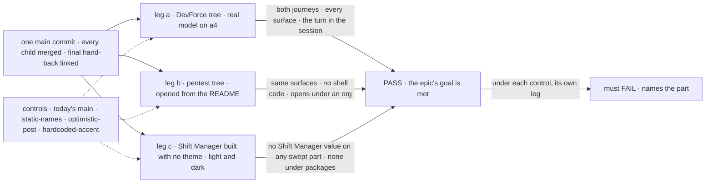

# FIX-1663 · Closure: a Lab is reached and worked through one skinned shell

**Spec** · [Decisions](DECISIONS.md) · [Rules](BUSINESS-RULES.md) · [Plan](PLAN.md) · [Docs](DOCS.md) · [Evolution](EVOLUTION.md)

Improvement · closure (QA) · `goals/` only · medium, repeats per finding · 1 PR after a clean
run · epic [FIX-1649](../../epics/FIX-1649/SPEC.md) (review PR
[#2421](https://github.com/fixpoint-labs/flow-state-dev/pull/2421)), closure · required · runs
after FIX-1655, FIX-1662 and FIX-1664 merge and the final design hand-back is linked · amended
after merge for Shift Manager and FIX-1690 ([How it got here](DECISIONS.md#how-it-got-here),
[Evolution](EVOLUTION.md))

## Five people, before and after

| Someone who… | Today | After this closes |
|---|---|---|
| **decides whether the epic is done** | Three children, each green on its own commit, each on its own fixture | One report on one `main` commit: legs a to c, each control's FAIL, every team's journey, every child's check, each finding and its retest |
| **uses a Lab day to day** | No app to use one in | Proven on the DevForce tree with a real model: an ask answered from Inbox, a task opened to its session, a message to a worker landing in its running task session |
| **builds the next Lab** | Nothing tells them what to write | Proven: the pentest Lab opened by following Shift Manager's README, with the one config any Lab needs and no shell code |
| **reuses FSD UI in its own app** | Twelve registry parts paint colours no token reaches | Proven twice: Shift Manager with no theme shows no Shift Manager value, and a fresh app follows the token docs as written |
| **owns a sibling epic** (FIX-1650 to 1652) | No screen to fill | Proven: every surface they will fill opens by its address and names them in its empty state |

## The goal, and how we'll know it's met

**On one `main` commit with every child merged, the epic's goal holds in a real browser: a person
works the DevForce Lab through Shift Manager, reaching every surface the shell promises and walking
both of the design's journeys; the pentest Lab opens in the same shell with no shell code of its
own; and with no Shift Manager theme loaded, no reused FSD component carries a Shift Manager value. Every
team's journey and every child's own check pass on that commit.**

| Is it the right goal? | |
|---|---|
| **The real need** | The [epic's goal](../../epics/FIX-1649/SPEC.md#the-goal-and-how-well-know-its-met) on the assembled set, as the [closure rule](../../../docs/contributing/orchestration.md#the-closure-issue-every-epic-ends-in-qa) asks: "nothing else uses the finished whole the way a person would" (the issue) |
| **Smaller, and rejected** | "Re-run each child's check on one commit." FIX-1662's check runs on a scripted harness and on multi-seat-collab; FIX-1655's on a host page. Neither walks a real Lab with a real model, nor a tree Shift Manager was never tested against |
| **Bigger, and not this issue's** | What projects, workstreams and asks mean (FIX-1650 to 1652) · the DevForce Lab product · the smoke in CI · docs polish (the epic's wrap) |
| **Not done if** | A leg ran on kitchen-sink's tree, or on a tree other than the one the epic pins · checks ran on different commits · a journey was skipped because the tree could not produce it · a swept part was never rendered in leg c · a control never failed, or failed at setup · the pentest Lab needed a step its README did not say · a finding was fixed in the closure PR, or deferred |

Every leg reads the page against what the running Lab's store holds, and each control breaks
exactly one leg at its own signal.

| How we verify | |
|---|---|
| **Goal check** | `goals/shift-manager/a-lab-is-worked-through-one-skinned-shell/`, real Chromium on a production build of the one commit, legs a to c then the controls. Verdict in the closure PR |
| **Model** | Leg a under a real org with a real model set, as the epic's input says. Only a4, the seat answering in its running task session, rests on the model; a1 to a3 raise their ask and board row through D1's children's deterministic paths. Legs b and c keyless, on each Lab's scripted harness |
| **Signal** | Per leg in [PLAN.md → Checks](PLAN.md#checks): a1 the Inbox journey, a2 the task journey, a3 every surface of [ER-1](../../epics/FIX-1649/BUSINESS-RULES.md#what-a-team-gets-and-what-it-doesnt), a4 the `@worker` turn · b the same reach on the pentest tree, and every Lab opens under an org the switcher names · c computed styles on every swept part, in light and dark, against every value the Shift Manager theme declares, plus the static check over `packages/` |
| **Input** | `goals/devforce-lab/lab/` for leg a, opened as Shift Manager's DevTeam profile (`--team devteam`); `goals/pentest-lab/lab/` for leg b, which Shift Manager has never been tested against. Kitchen-sink's tree stands in for neither |
| **Anti-game** | No assertion on a child's own output, Shift Manager's own state or a mocked server. Rows read by id against the store. No Shift Manager source under `src/` names either tree; its `teams/devteam` profile is the one file that points at the DevForce tree. Leg c's no-theme build removes only the theme import, and the diff is in the report. A swept part leg c never rendered is a finding |
| **Control that must fail** | `hardcoded-accent`: Shift Manager's copy of the tool card given Shift Manager's accent as a literal. Leg c must FAIL naming the tool card. Today's `main` fails legs a and b; FIX-1662's `static-names` fails b, its `optimistic-post` fails a4 ([PLAN.md → Controls](PLAN.md#controls)) |

Part 2 walks the two teams the legs don't: someone reusing FSD UI in their own app, and a sibling
epic's owner. Part 3 re-runs every child's check; part 4 sweeps the epic's seams. All on the
same commit.

## What changes

Read the commit line: today each check sits on its own commit and its own fixture; after, all sit
on one, on real Lab trees, and a finding sends the whole stack round again.

## What stays as it is

- **No product work.** A gap becomes a child of FIX-1649 that blocks this issue, fixed on its
  own route; the closure PR carries the goal check and the report only.
- **No input is added either.** The pentest Lab's host config is on `main` since #2529; b0's
  writer writes its own copy from Shift Manager's README to scratch, and the run compares it
  with the committed file ([D2](DECISIONS.md#d2), as amended).
- **Every child's acceptance** stands as its spec wrote it; a child's check that fails is a
  finding, never a rewrite.

## Sign off

**[The goal](#the-goal-and-how-well-know-its-met), at that size:** the epic's three legs on the
trees it pins, one real-model run, every team's journey, one commit. If wrong: the epic wraps on
fixtures that never met a real Lab, or waits on a bar nobody asked for.

1. **[D1](DECISIONS.md#d1) · Leg a stays on the DevForce tree. The two journeys that tree can't
   produce today (an ask to answer, a board a task sits on) are filed now as children of FIX-1649
   that block this issue.** If wrong: two small children the epic didn't plan, or a first run
   that fails on gaps we already knew about.
2. **[D2](DECISIONS.md#d2) · The closure writes the pentest Lab's host config, by following Shift
   Manager's README and nothing else, through a writer that sees only the README and the pentest
   tree; a step it had to guess is a finding.** *(Amended after merge: the file is on `main`
   since #2529, so the writer's copy goes to scratch and is compared with it.)* If wrong: the
   check that proves "no shell code" wrote the one file a Lab author needs, and could hide what
   the README leaves out.

**Open: none.** D1 is the one to weigh. Reasoning and what lost: [DECISIONS.md](DECISIONS.md).
The cases: [BUSINESS-RULES.md](BUSINESS-RULES.md).
