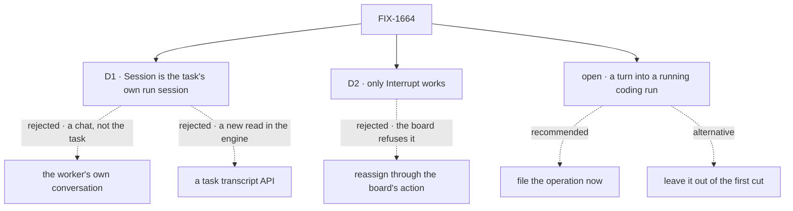

# FIX-1664 · Decisions

[Spec](SPEC.md) · **Decisions** · [Rules](BUSINESS-RULES.md) · [Plan](PLAN.md) · [Docs](DOCS.md)

Two decisions and one open fork are the sign-off surface. The epic's D1 to D3 and ER-1 to ER-15
([FIX-1649](../../epics/FIX-1649/DECISIONS.md)) bind this issue and are not reopened here.

## The tree

Solid edges are what you're signing. Dashed edges lost, or are the fork's two answers.

## Open · Send a turn into a running coding run: file the operation now, or leave it out of this epic's first cut?

**In plain terms.** The design's composer says *"Sent to claude-code as your turn."* Nothing
does that today. Claude Code, Codex and Cursor runs start with one prompt and run to the end. A
coding session hears more only when a later attempt continues it with a new prompt, which is how
an answered question reaches a parked run (LAB-162's ask, park, answer, continue). No operation
lets a person do that with their own words, so the task composer, `@worker` to a coding worker
and an Inbox reply to a coding run have nothing shipped to call (ER-15).

**The trade-off.** Filing it now costs one more issue, framework work in the harness manager
where resume lives, and the closure waits on it; the epic then delivers the design's most
prominent control. Leaving it out closes the epic sooner with a watch-and-stop task screen, and
the composer stays grey until someone files it.

**Recommendation: file it now**, as a child of FIX-1649, under the epic's own split trigger (a
level that needs an operation nothing ships splits out rather than inventing it). Its shape:
stop the run, then continue the same coding session with the person's message as the next
prompt. FIX-1664 ships the composer disabled, naming that issue, and wires it in a small PR when
it merges. Building it inside FIX-1664 is not an option: what a turn does to a run's attempt
count, its board row and its checkout is framework meaning, not shell.

**What would change my mind:** you see the first cut as a place to watch, and steering as
attention and inspect's (FIX-1652) to design. Then leave it out and amend the closure's turn step.

**If wrong:** filing it when nobody uses it yet costs a medium issue of harness work. Leaving it
out when you needed it means the issue's first sentence, steer without a terminal, stays unmet.

It comes down to steering: without the operation, the task screen watches and stops, nothing more.

## D1 · The Session tab is the task's own run session, found by its dispatch key, shown live

| | |
|---|---|
| **Instead of** | The assigned worker's own conversation session · a new "task transcript" read in the engine |
| **Because** | A handed-off row runs in a child session the dispatch seam keys on the board and the task, and the session listing already returns dispatch runs with that key. Reading it is reading what ships (ER-5), and the live stream FIX-1609 shipped (`useSession` with `live`) follows it with no reload. The worker's own conversation is where it talks, not where this task ran. A transcript read would be a second API over the item log, which the Architect named an invent-kill |
| **Locks in** | A task's screen is exactly one run's session. Every attempt of the task is in it, in order, because a per-task key re-enters the same child. A board whose seat uses a per-worker or custom session key shares one session across tasks; its Session tab says so rather than filtering by guess |

It comes down to truth about the task: the worker's chat can't say what this run did.

**What would change my mind:** FIX-1651 defining a task as something other than a board row a
seat runs. Then the key moves, and the tab stays.

## D2 · Of the four controls only Interrupt works; Hand off, reassign and Open PR are disabled and name FIX-1651

| | |
|---|---|
| **Instead of** | Calling the board's reassign action for Hand off and reassign · building a hand-off or a PR step inside App Lab |
| **Because** | Interrupt has a shipped operation: the abort route on the run's request, which records the intent and stops the run wherever it runs. The rest don't. A board that hands rows off freezes each row's assignee, because the child's address is derived from it, so the reassign action refuses every task this screen exists for. Opening a PR has no operation at all. A shell hand-off would be the HandOff noun the Architect's list forbids (ER-8, ER-15) |
| **Locks in** | Day one: a person can watch and stop a run, and nothing else changes a task from this screen. Each disabled control names FIX-1651 and fills when it ships a hand-off or a PR step; the surface and its address stay |

It comes down to the freeze: the board refuses to reassign a row it has handed off.

**What would change my mind:** FIX-1651 shipping a hand-off that moves a row between seats. Then
the button calls it, with no change to the screen.

## Decided, not asked

- **Diff and Checks are named empty states** naming FIX-1651: no read returns a run's diff or
  checks. Edits already show inline in the Session.
- **Brief is the row's own fields**; acceptance criteria are a named gap (FIX-1651).
- **The plan and files are what the harness recorded** on the run session (Claude Code records
  both), else a line saying this harness records none. Files show created or edited, no line counts.
- **Started is the row's; tokens, cost and harness come from the run's reported handle**, a dash
  until then, as FIX-1662's BR-7 draws harness. **Branch** has no client read and is omitted.
- **Linked** is the row's dependencies and its dependents; *review by* names FIX-1651.
- **The trace link opens the devtool App Lab was started with** (`--devtool <url>`), with the
  run's session id beside it: the devtool can't open a session from its address yet.
- **For FIX-1662's `@worker`:** a turn into a worker's own session, not a task run, is the worker
  kind's public message action where the kind declares one (the default agent kind's `run`). A
  coding worker declares none; that is the open fork.
- **After Interrupt, the row's next state is the board's.** App Lab never cancels or settles a row.

## Considered and dropped

| Alternative | Why not |
|---|---|
| Find the run through the harness manager's run record | Not client-readable by design; its read surface is a lab's own `status` action |
| Find the run through its parent session's children | The parent is the session that drained the board, which the client can't learn: the row's claim coordinate is server-only |
| Cancel the row as well as abort the run on Interrupt | A shell-written board change; what an interrupted row becomes is FIX-1651's |
| Fold the task level back into FIX-1662 (epic D1's mind-changer) | It reads a run session, a harness's records and a request, none of which the workstream level reads |

## How it got here

- **Draft**: framed as watching and steering one run; the Session reads the task's own run
  session; only Interrupt ships; the turn into a coding run found unshipped and put as the open
  fork.

**Open: one** — [above](#open).
