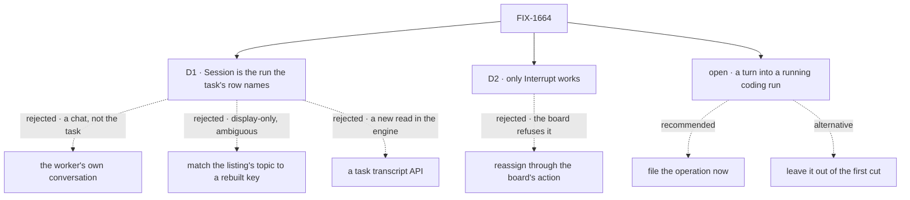

# FIX-1664 · Decisions

[Spec](SPEC.md) · **Decisions** · [Rules](BUSINESS-RULES.md) · [Plan](PLAN.md) · [Docs](DOCS.md)

Two decisions and one open fork are the sign-off surface. The epic's D1 to D3 and ER-1 to ER-15
([FIX-1649](../../epics/FIX-1649/DECISIONS.md)) bind this issue and are not reopened here.

## The tree

Solid edges are what you're signing. Dashed edges lost, or are the fork's two answers.

## Open · Send a turn into a running coding run: file the operation now, or leave it out of this epic's first cut?

**In plain terms.** The design's composer says *"Sent to claude-code as your turn."* Nothing
does that today. Claude Code, Codex and Cursor runs start with one prompt and run to the end. A
coding session hears more only when a later attempt continues it with a new prompt, which is how
an answered question reaches a parked run (LAB-162's ask, park, answer, continue). No operation
lets a person do that with their own words, so the task composer, `@worker` to a coding worker
and an Inbox reply to a coding run have nothing shipped to call (ER-15).

**The trade-off.** Filing it now costs one more issue, framework work in the harness manager
where resume lives, and the closure waits on it; the epic then delivers the design's most
prominent control. Leaving it out closes the epic sooner with a watch-and-stop task screen, and
the composer stays grey until someone files it.

**Recommendation: file it now**, as a child of FIX-1649, under the epic's own split trigger (a
level that needs an operation nothing ships splits out rather than inventing it). Its shape:
stop the run, then continue the same coding session with the person's message as the next
prompt. FIX-1664 ships the composer disabled, naming that issue, and wires it in a small PR when
it merges. Building it inside FIX-1664 is not an option: what a turn does to a run's attempt
count, its board row and its checkout is framework meaning, not shell.

**What would change my mind:** you see the first cut as a place to watch, and steering as
attention and inspect's (FIX-1652) to design. Then leave it out and amend the closure's turn step.

**If wrong:** filing it when nobody uses it yet costs a medium issue of harness work. Leaving it
out when you needed it means the issue's first sentence, steer without a terminal, stays unmet.

It comes down to steering: without the operation, the task screen watches and stops, nothing more.

## D1 · The Session tab is the run the task's own row names, shown live

| | |
|---|---|
| **Instead of** | The assigned worker's own conversation session · rebuilding the dispatch key and matching it against the session listing's `topic` · a new "task transcript" read in the engine |
| **Because** | Only the run itself knows, for certain, which session it is in. A handed-off attempt enters its run session through the board's claim gate, whatever the seat's session policy and whichever conversation drained the board, so the gate is the one place that can write down *this task's attempt N is running in session S, request R*. Rebuilding the key from outside can't do that: the listing's `topic` is display-only, the run's session id also folds in the parent session and its lineage (so a re-drain from another conversation makes a second run with the same topic), and a per-worker or custom policy never produces a per-task key at all. So the association is **a small new field on the task row, stamped by the gate** in `@flow-state-dev/orchestration` (Layer 2, the substrate that already owns the row and the gate), filed as its own child of FIX-1649 under the epic's split trigger: [the task-run link](PLAN.md#the-task-run-link). The row already reaches App Lab through FIX-1662's board read, so the link arrives with it; the live stream FIX-1609 shipped (`useSession` with `live`) follows the session with no reload. The worker's own conversation is where it talks, not where this task ran. A transcript read would be a second API over the item log, which the Architect named an invent-kill |
| **Locks in** | A task's screen is the run its row names, and Interrupt aborts the request the row names. A session shared across tasks (a per-worker or custom policy) shows only the items stamped with this task's id, which every item a task's worker emits carries from the moment the gate marks the scope; the screen says the session is shared. **FIX-1664's build waits on the task-run link**; nothing in Core or Engine changes |

It comes down to truth about the task: only the run can say where it ran, so the run writes it down.

**What would change my mind:** FIX-1651 defining a task as something other than a board row a
seat runs. Then the link moves to whatever it runs, and the tab stays.

**If wrong:** one small orchestration field nobody else reads, and FIX-1664 a child issue later
than it would otherwise be. Getting the lookup wrong instead shows another task's work, or
aborts another task's run, as this one's.

## D2 · Of the four controls only Interrupt works; Hand off, reassign and Open PR are disabled and name FIX-1651

| | |
|---|---|
| **Instead of** | Calling the board's reassign action for Hand off and reassign · building a hand-off or a PR step inside App Lab |
| **Because** | Interrupt has a shipped operation: the abort route on the run's request, which records the intent and stops the run wherever it runs. The rest don't. A board that hands rows off freezes each row's assignee, because the child's address is derived from it, so the reassign action refuses every task this screen exists for. Opening a PR has no operation at all. A shell hand-off would be the HandOff noun the Architect's list forbids (ER-8, ER-15) |
| **Locks in** | Day one: a person can watch and stop a run, and nothing else changes a task from this screen. Each disabled control names FIX-1651 and fills when it ships a hand-off or a PR step; the surface and its address stay |

It comes down to the freeze: the board refuses to reassign a row it has handed off.

**What would change my mind:** FIX-1651 shipping a hand-off that moves a row between seats. Then
the button calls it, with no change to the screen.

## Decided, not asked

- **Diff and Checks are named empty states** naming FIX-1651: no read returns a run's diff or
  checks. Edits already show inline in the Session.
- **Brief is the row's own fields**; acceptance criteria are a named gap (FIX-1651).
- **The plan and files are what the harness recorded** on the run session (Claude Code records
  both), else a line saying this harness records none. Files show created or edited, no line counts.
- **Started is the row's. Harness, tokens and cost are a named gap owned by FIX-1652.** The
  run reports them in its return value, which the client never sees; a detached run keeps no
  session-state log of it; and the harness manager's run record, which does hold them, is
  deliberately not client-readable. No shipped read carries them, so the inspector says so
  rather than drawing a dash that looks like *not reported yet* ([the gap registry](BUSINESS-RULES.md#gap-registry)).
  **Branch** has no client read and is omitted.
- **Linked** is the row's dependencies and its dependents; *review by* names FIX-1651.
- **The trace link opens the devtool App Lab was started with** (`--devtool <url>`), with the
  run's session id beside it: the devtool can't open a session from its address yet.
- **For FIX-1662's `@worker`:** a turn into a worker's own session, not a task run, is the worker
  kind's public message action where the kind declares one (the default agent kind's `run`). A
  coding worker declares none; that is the open fork.
- **After Interrupt, the row's next state is the board's.** App Lab never cancels or settles a row.

## Considered and dropped

| Alternative | Why not |
|---|---|
| Find the run through the harness manager's run record | Not client-readable by design; its read surface is a lab's own `status` action. It also covers only boards the harness manager runs, and keys by the lab's own topic, not board and task |
| Find the run through its parent session's children | The parent is the session that drained the board, which the client can't learn: the row's claim coordinate is server-only |
| Rebuild the dispatch key and match the session listing's `topic` (the approved draft) | `topic` is display-only; the run's id also folds in the parent session and lineage, so two runs can share a topic; a per-worker or custom policy never yields the per-task key. It can show or abort the wrong run, or find none |
| Expose the row's claim coordinate (`claimedBy`) | Server-only by design, and it names the session that **claimed** the row, which on a handed-off board is the drain's, not the run's: the child never claims |
| Publish the harness's tokens and cost through a new projection now | A second read of the same numbers, for three inspector fields, with no second consumer. FIX-1652 owns inspecting a run and can shape it once |
| Cancel the row as well as abort the run on Interrupt | A shell-written board change; what an interrupted row becomes is FIX-1651's |
| Fold the task level back into FIX-1662 (epic D1's mind-changer) | It reads a run session, a harness's records and a request, none of which the workstream level reads |

## How it got here

- **Draft**: framed as watching and steering one run; the Session reads the task's own run
  session; only Interrupt ships; the turn into a coding run found unshipped and put as the open
  fork.
- **Amendment after merge** (review on PR #2428, Codex): the run lookup by rebuilt key and
  `topic` was ambiguous and couldn't serve a shared session, so D1 now reads a link the gate
  stamps on the row, split out as the task-run link; and harness, tokens and cost had no
  client-readable source, so they became a named gap. The goal, D2 and the open fork are
  unchanged.
- **Aligned with FIX-1668's spec** (PR #2440): the run's flow is read off the session the link
  names (its `flowId`), since the link carries no flow and a seat can hand off to another flow;
  the goal check gains that seat and the `board-flow` control. `run_linked` reaches only the
  run's own session stream, so a row waiting for its link is re-read on a bounded timer (BR-3)
  rather than assumed to be pushed. D1 is unchanged.

**Open: one** — [above](#open).
