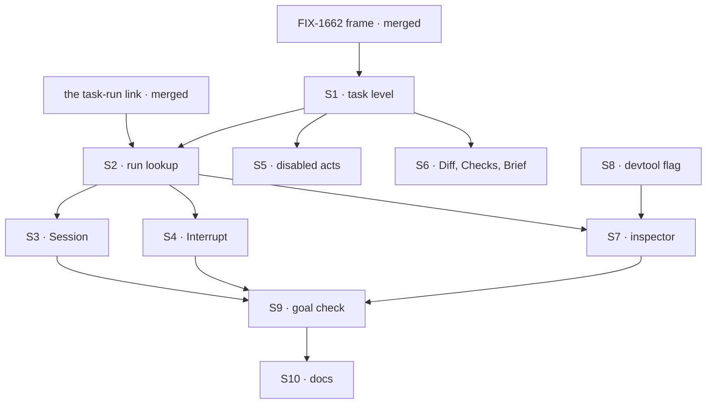

# FIX-1664 · Plan

[Spec](SPEC.md) · [Decisions](DECISIONS.md) · [Rules](BUSINESS-RULES.md) · **Plan** · [Docs](DOCS.md)

Written for the implementing agent. IDs cross-reference [BUSINESS-RULES.md](BUSINESS-RULES.md)
(BR-n), [DECISIONS.md](DECISIONS.md) (D-n) and the epic's rules (ER-n). `tdd`. One PR, branched
after FIX-1662's `frame` PR **and [the task-run link](#the-task-run-link)** merge; it uses the
frame's route, panel slot, shared reads and registry copies, and the link on the row.

## The task-run link

**A dependency, filed as [FIX-1668](https://linear.app/fixpoint-labs/issue/FIX-1668), a child of FIX-1649, not built here** (D1; the epic's split
trigger: a level that needs a read nothing ships splits it out). It is small and lives in
`@flow-state-dev/orchestration`, the Layer 2 substrate that owns the row and the claim gate.
Nothing in Core or Engine changes (ER-7).

| | |
|---|---|
| **What it adds** | When a handed-off attempt passes the board's claim gate in its run session, the gate stamps the row with that attempt's run: the session id, the request id, and the attempt number. The next attempt replaces it. FIX-1664 looks things up by two of them: the session (the Session tab) and the request (Interrupt, and the recorded plan and files). The attempt is informational, shown in the header, and never used to find anything |
| **Why there** | The gate runs in the run's own session for every handed-off attempt, whatever the seat's session policy and whichever conversation drained the board, so it is the one writer that knows the answer rather than rebuilding it |
| **Its rules** | Server-written only, absent from the fields a caller or model can set, like `claimedBy`. Client-visible, unlike `claimedBy`: it names a session, and reading that session still passes the server's owner check (BR-9, BP-031). Optional and `== null`-guarded, so rows stored before it read as *no run linked* (BP-030, BR-3). Written by [FIX-1668](https://github.com/fixpoint-labs/flow-state-dev/pull/2440)'s own fenced write at the claim gate, made before the worker starts. "Never a second write" is about timing, not about counting CAS operations: the write must not be able to fail after the worker starts |
| **What FIX-1664 needs from it** | The field on the row FIX-1662's board read returns, and its three values. The name is that issue's to choose |

## Surfaces

| ID | Where · role | Change | Rules |
|---|---|---|---|
| S1 | `labs/app-lab` · the task level | Fill FIX-1662's task route: header, the four tabs (lazy), the states of BR-2 and BR-3 | BR-1 to BR-4 |
| S2 | `labs/app-lab` · the run | Read the run's session id, request id and attempt off the row's [task-run link](#the-task-run-link); no listing, no key rebuilt. Then read the session the link names (`client.getSession(id)`, `GET /api/flows/sessions/:id`, owner-checked) and take its `flowId` as the run's flow: a seat can hand off to another flow than the board's, and only the session records its owner. The flow is deliberately not on the link (FIX-1668: Layer 2 names stay out of Core and Engine, and the claim gate can't see its flow id). Resolved once per open and held. No link per BR-3; owner-refused per BR-9. Hand the ids and the flow to S3, S4 and S7, which use that flow for `useSession`, the abort and the request reads, never the board's | D1 BR-3 BR-5 BR-9 |
| S3 | `labs/app-lab` · Session | `useSession(runSession, { live: true })`, **mounted only while the Session tab is open**, over the registry item components FIX-1662 copied in; add any item component a harness run emits that `frame` didn't copy, by `fsdev ui add`, unedited. A shared session (BR-8) keeps only items stamped with this task's id, through the attribution helper the substrate and the UI already share, never a copy | D1 BR-5 to BR-8 BR-10 ER-6 |
| S4 | `labs/app-lab` · Interrupt | The shipped abort route on the request S2 read; Esc binds to it; state drawn from the request record only | D2 BR-11 to BR-14 |
| S5 | `labs/app-lab` · the disabled acts | Hand off, reassign, Open PR, the composer and *also post*: disabled, each with its owner line as a prop, from the [gap registry](BUSINESS-RULES.md#gap-registry) | D2 BR-15 BR-16 ER-5 |
| S6 | `labs/app-lab` · Diff, Checks, Brief | Two named empty states; Brief from the row | BR-17 BR-24 |
| S7 | `labs/app-lab` · the inspector | Fills the right panel's task slot: worker, team, started, the harness-tokens-cost gap, acceptance gap, plan and files from the harness's recorded collections on the run session under S2's request id (one-shot reads, loaded once per open, no stream), linked, trace link | BR-18 to BR-23 |
| S8 | `labs/app-lab` · start script | Optional `--devtool <url>`, passed to the page for S7's link | BR-23 |
| S9 | `goals/app-lab/it-shows-and-stops-a-task-run/` | The goal check, both controls, and its input tree ([at implement time](#at-implement-time)) | the goal |
| S10 | Docs | [DOCS.md](DOCS.md): the README's task sentences and task section | ER-14 |

**Removed:** nothing. App Lab mirrors `apps/kitchen-sink/components/picked-session-panel.tsx`
for the live session's shape and imports nothing from `apps/`.

## Sequence



One PR; no PR plan. If the open fork is answered *file it*, wiring the composer to that issue's
operation is a later, separate PR after it merges, not part of this DAG.

## Checks

| ID | Runs after | Passes when |
|---|---|---|
| V1 | S2, S3 | The screen opens the session and request the row's link names, among several sessions of the same seat and a second run with the same board and task drained from another conversation; a row with no link yields BR-3, and an `in_progress` row with no link is re-read every 2 s until the link appears (then the Session opens with no reload) or 30 re-reads pass (then it stops, with Retry), and a row in any other status is not re-read; a run whose session names another flow is streamed, aborted and read through that flow, and through the board's flow the check fails; an unreachable session yields BR-9; a shared session shows only this task's stamped items (BR-8). Negative: reading the seat's latest session instead of the link picks the wrong one and fails |
| V2 | S3 | Items render in stored order across two attempts (BR-7); a stored item appears live (BR-6); parked shows the reason and the Inbox link (BR-10) |
| V3 | S4 | Abort is called with the in-progress request id; *interrupted* renders only after the record reads `aborted` (BR-11); 409 and refusal paths (BR-12, BR-13); no board write on any path (BR-14) |
| V4 | S5, S6 | Every disabled control and empty tab carries its gap line from the registry: the owner named, or *not planned in the first cut* where the registry says so; a control with neither fails (BR-15 to BR-17) |
| V5 | S7 | BR-18's gap line with its registry owner, whatever the run reported; BR-19 against a seeded recorded plan and file-op rows; BR-20 with none; BR-22 both directions; BR-23 with and without `--devtool` |
| V6 | S1 to S8 | Static: no literal colour outside token definitions; no tree name in `labs/app-lab/src`; registry copies byte-equal their source; no write call except the abort |
| VG | S9 | [The goal](SPEC.md#the-goal-and-how-well-know-its-met) PASSES, after `GOAL_CONTROL=worker-session`, `GOAL_CONTROL=optimistic-interrupt` and `GOAL_CONTROL=board-flow` each FAILED at their named signal |

## Pinned names

| Where | Name | Why pinned |
|---|---|---|
| Goal check | `goals/app-lab/it-shows-and-stops-a-task-run/` | The closure runs it |
| Controls | `GOAL_CONTROL=worker-session`, `GOAL_CONTROL=optimistic-interrupt`, `GOAL_CONTROL=board-flow` | The goal names them; `board-flow` matches FIX-1668's control of the same name |
| Start flag | `--devtool <url>` | The README and the closure type it |
| Task route and panel slot | FIX-1662's, unchanged | Epic seam; this issue adds no route |

Everything else is yours to name.

## Guardrails

| Rule | Because |
|---|---|
| The abort is the only write this screen makes | ER-15; D2. Anything else is a model the shell invented |
| A state changes on screen only when the store says so | *Interrupted* before the record says so is the shell's hope, not the run's answer |
| The run is the one the row's link names, never found by key, topic, time, title or "latest session of this seat" | A near-miss shows, or aborts, another task's run as this one's, silently (D1) |
| Every gap's copy is a prop at the surface, naming its owner from the [gap registry](BUSINESS-RULES.md#gap-registry) | The sibling fills it later without touching the surface (ER-5), and one table changes when it does |
| At most one live stream, and only while the Session tab is open; the inspector's recorded collections load once per open | A Lab with many running tasks must not open a stream per row, and a person reading Brief pays nothing for the Session |
| No paging through a listing to find something; a truncated answer shows *more than shown* with Retry | A silent wrong answer is worse than a named partial one |
| The run is resolved once per open task and held: bound to the session and request in the row's link and the flow its session names, and updated whenever the shared board read delivers a new row (including BR-3's bounded re-read). The session is re-read for its flow only when the link names a new session. It is never frozen at first paint, and a tab switch never re-reads it | Correctness. A re-read on a tab switch goes looking for the run again instead of reading the row, and can land the screen's tabs on different attempts partway through a read. The row is the only thing that says the run changed |
| No FSD package changes; a part that won't take the skin goes to FIX-1655 | ER-2, ER-6 |

## Docs

Reconcile [DOCS.md](DOCS.md) against the running app and publish it in this PR, through
`docs-writer` then `docs-editor`, after VG passes.

## Sketch · pseudocode, illustrative, react to the shape

```
open task(board, id):
    row      ← FIX-1662's board read
    run      ← row's task-run link: { session, request, attempt }         (D1; none → BR-3)
               in_progress, no link → re-read the row every 2 s, ≤ 30 times (BR-3)
    run.flow ← getSession(run.session).flowId                             (once per open, held;
               the run's flow, not the board's; refused → BR-9)
    session  ← live items of run.session through run.flow,
               while the Session tab is open                               (Session)
               shared session → only items stamped with id                (BR-8)
    inspector← row fields + recorded plan and files under run.request, through run.flow
interrupt:  abort(run.flow, run.request) → wait for the record → redraw    (D2)
everything else: disabled or empty, with its owner's line from the gap registry
```

**POC:** none. The premises are read off code, not argued: the claim gate runs in the run's
own session on every handed-off attempt and marks the task scope, so every item the worker emits
carries the task's id (`packages/orchestration/src/task-board/task-entry.ts`,
`packages/contracts/src/items/task-attribution.ts`); the row's claim coordinate is server-only
and names the drain, not the run (`tasks/schema/task.ts`, `task-board/hand-off.ts`); the recorded
plan and files are keyed by the run's request id (`packages/claude-code/src/sdk/agent.ts`); the
assignee freeze on a handed-off board (`define-task-collection.ts`); the abort route
(`packages/engine/src/routes/abort-routes.ts`). V1 and V3 exercise them first.

## At implement time

- **The input tree.** The goal needs a channel-attached board whose rows hand off to a coding run.
  DevForce's board is declared in code today (FIX-1662's follow-up). If it is channel-attached by
  then, use DevForce; otherwise S9 carries a small fixture tree built from DevForce's kinds, and
  the stub gains a hold-until-aborted script. Either way the tree needs a seat whose dispatcher
  hands off to another flow than the board's, for the goal's third row and `board-flow`.
- Confirm the session read still returns the owning `flowId` for a dispatched run's session
  (FIX-1668's BR-20 rests on the same read). If it doesn't, raise it; don't fall back to the
  board's flow silently.
- Re-read FIX-1662's merged spec and `frame` PR for the route, slot and shared-read names.
- Read the task-run link's merged spec for the field's name and shape, and confirm FIX-1662's
  board read returns it.
- Confirm what the board does with an aborted attempt. If it re-queues and restarts, report that
  to FIX-1651 as what an interrupt means for a row; don't cancel from the shell.
- Any listing the screen still reads (the recorded plan and files, the board's rows for *Blocks*)
  that answers truncated follows the failure taxonomy: *more than shown* with Retry, no paging.
- Check whether FIX-1651 or FIX-1652 shipped anything; a shipped read replaces its gap in the
  [registry](BUSINESS-RULES.md#gap-registry), and only there.

## Follow-ups

- **The turn operation**, if the open fork is answered *file it*: a child of FIX-1649, then a
  small PR wiring the composer.
- **A devtool address for a session**, so the trace link lands on the run. Devtool, not App Lab.
- **Earlier attempts in other sessions** (BR-7): the link names the current attempt's run only.
  A per-attempt history on the row would let the Session reach them. Not asked for yet.
- **Harness, tokens and cost for a client** (BR-18): a read of what the run reported belongs to
  FIX-1652's inspecting of a run, shaped once there, never a second copy of the harness
  manager's record.

## Notes from review

Below the spec-review bar; for the implementer. From Cursor's review of PR #2428:

- Merge the ten surfaces into four or five for the sequence (run and session and interrupt;
  gaps and empty tabs; inspector and the devtool flag), keeping the S and V ids as check ids.
- *Decided, not asked* in DECISIONS overlaps the BRs; the BRs are canonical where they differ.
- Hand off, reassign and Open PR could be one disabled group with one owner line, unless the
  closure needs them apart.
- Tier the BRs as core (BR-5, BR-6, BR-11, BR-14 and the goal) and edge (BR-8 to BR-10, BR-12,
  BR-13) when writing tests, so the watch-and-stop path is proved first.
- *Blocks* (BR-22) from one board read, never one read per dependency.
- Elapsed time (BR-4) from the row and a clock, not a polling loop.
- Mirror kitchen-sink's `background-work-panel` for the Session body and `picked-session-panel`'s
  request settling for Interrupt, without importing from `apps/`. Use FIX-1662's shared
  named-gap primitive if `frame` ships one, rather than new markup.
