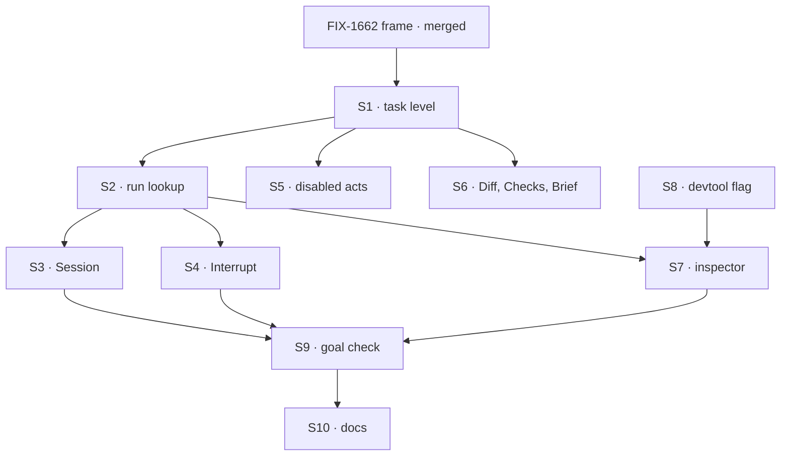

# FIX-1664 · Plan

[Spec](SPEC.md) · [Decisions](DECISIONS.md) · [Rules](BUSINESS-RULES.md) · **Plan** · [Docs](DOCS.md)

Written for the implementing agent. IDs cross-reference [BUSINESS-RULES.md](BUSINESS-RULES.md)
(BR-n), [DECISIONS.md](DECISIONS.md) (D-n) and the epic's rules (ER-n). `tdd`. One PR, branched
after FIX-1662's `frame` PR merges; it uses that PR's route, panel slot, shared reads and
registry copies.

## Surfaces

| ID | Where · role | Change | Rules |
|---|---|---|---|
| S1 | `labs/app-lab` · the task level | Fill FIX-1662's task route: header, the four tabs (lazy), the states of BR-2 and BR-3 | BR-1 to BR-4 |
| S2 | `labs/app-lab` · the run lookup | From board id and task id, derive the dispatch seam's per-task key with core's own helper (never re-spelled), list the assigned seat's dispatch runs, pick the one whose topic matches; hand its id and latest request id to S3 to S5. Owner-refused and shared-key cases per BR-8, BR-9 | D1 BR-5 BR-8 BR-9 |
| S3 | `labs/app-lab` · Session | `useSession(runSession, { live: true })` over the registry item components FIX-1662 copied in; add any item component a harness run emits that `frame` didn't copy, by `fsdev ui add`, unedited | D1 BR-5 to BR-7 BR-10 ER-6 |
| S4 | `labs/app-lab` · Interrupt | The shipped abort route on S2's in-progress request; Esc binds to it; state drawn from the request record only | D2 BR-11 to BR-14 |
| S5 | `labs/app-lab` · the disabled acts | Hand off, reassign, Open PR, the composer and *also post*: disabled, each with its owner line as a prop | D2 BR-15 BR-16 ER-5 |
| S6 | `labs/app-lab` · Diff, Checks, Brief | Two named empty states; Brief from the row | BR-17 BR-24 |
| S7 | `labs/app-lab` · the inspector | Fills the right panel's task slot: worker, team, harness, started, tokens, cost, acceptance gap, plan and files from the harness's recorded collections on the run session, linked, trace link | BR-18 to BR-23 |
| S8 | `labs/app-lab` · start script | Optional `--devtool <url>`, passed to the page for S7's link | BR-23 |
| S9 | `goals/app-lab/it-shows-and-stops-a-task-run/` | The goal check, both controls, and its input tree ([at implement time](#at-implement-time)) | the goal |
| S10 | Docs | [DOCS.md](DOCS.md): the README's task sentences and task section | ER-14 |

**Removed:** nothing. App Lab mirrors `apps/kitchen-sink/components/picked-session-panel.tsx`
for the live session's shape and imports nothing from `apps/`.

## Sequence



One PR; no PR plan. If the open fork is answered *file it*, wiring the composer to that issue's
operation is a later, separate PR after it merges, not part of this DAG.

## Checks

| ID | Runs after | Passes when |
|---|---|---|
| V1 | S2 | Per-task key finds exactly the run's child session among several; per-worker key yields the shared case (BR-8); an unreachable session yields BR-9. Negative: with the key match removed, the test picks the wrong session and fails |
| V2 | S3 | Items render in stored order across two attempts (BR-7); a stored item appears live (BR-6); parked shows the reason and the Inbox link (BR-10) |
| V3 | S4 | Abort is called with the in-progress request id; *interrupted* renders only after the record reads `aborted` (BR-11); 409 and refusal paths (BR-12, BR-13); no board write on any path (BR-14) |
| V4 | S5, S6 | Every disabled control and empty tab carries its owner line (BR-15 to BR-17) |
| V5 | S7 | BR-18 dashes before a handle, values after; *estimated* on an estimated cost; BR-19 against a seeded recorded plan and file-op rows; BR-20 with none; BR-22 both directions; BR-23 with and without `--devtool` |
| V6 | S1 to S8 | Static: no literal colour outside token definitions; no tree name in `labs/app-lab/src`; registry copies byte-equal their source; no write call except the abort |
| VG | S9 | [The goal](SPEC.md#the-goal-and-how-well-know-its-met) PASSES, after `GOAL_CONTROL=worker-session` and `GOAL_CONTROL=optimistic-interrupt` each FAILED at their named signal |

## Pinned names

| Where | Name | Why pinned |
|---|---|---|
| Goal check | `goals/app-lab/it-shows-and-stops-a-task-run/` | The closure runs it |
| Controls | `GOAL_CONTROL=worker-session`, `GOAL_CONTROL=optimistic-interrupt` | The goal names them |
| Start flag | `--devtool <url>` | The README and the closure type it |
| Task route and panel slot | FIX-1662's, unchanged | Epic seam; this issue adds no route |

Everything else is yours to name.

## Guardrails

| Rule | Because |
|---|---|
| The abort is the only write this screen makes | ER-15; D2. Anything else is a model the shell invented |
| A state changes on screen only when the store says so | *Interrupted* before the record says so is the shell's hope, not the run's answer |
| The run is found by the dispatch key, never by time, title or "latest session of this seat" | A near-miss shows another task's work as this one's, silently (D1) |
| Every gap's copy is a prop at the surface, naming its owner | The sibling fills it later without touching the surface (ER-5) |
| One live stream per open task; the inspector's recorded collections load once per open | A Lab with many running tasks must not open a stream per row |
| No FSD package changes; a part that won't take the skin goes to FIX-1655 | ER-2, ER-6 |

## Docs

Reconcile [DOCS.md](DOCS.md) against the running app and publish it in this PR, through
`docs-writer` then `docs-editor`, after VG passes.

## Sketch · pseudocode, illustrative, react to the shape

```
open task(board, id):
    row      ← FIX-1662's board read
    key      ← the dispatch seam's per-task key(board, id)
    run      ← the assigned seat's dispatch runs, where topic = key       (D1)
    session  ← live items of run                                          (Session)
    inspector← row fields + run's recorded plan and files + reported handle
interrupt:  abort(run's in-progress request) → wait for the record → redraw   (D2)
everything else: disabled or empty, with its owner's line
```

**POC:** none. The premises are read off code, not argued: the per-task key and the topic on the
listing (`packages/core/src/types/dispatch.ts`, the session record's `topic`), the assignee
freeze on a handed-off board (`define-task-collection.ts`), the abort route
(`packages/engine/src/routes/abort-routes.ts`). V1 and V3 exercise them first.

## At implement time

- **The input tree.** The goal needs a channel-attached board whose rows hand off to a coding run.
  DevForce's board is declared in code today (FIX-1662's follow-up). If it is channel-attached by
  then, use DevForce; otherwise S9 carries a small fixture tree built from DevForce's kinds, and
  the stub gains a hold-until-aborted script.
- Re-read FIX-1662's merged spec and `frame` PR for the route, slot and shared-read names.
- Confirm the session listing still returns dispatch runs with `topic` and `latestRequestId`, and
  what the board does with an aborted attempt. If it re-queues and restarts, report that to
  FIX-1651 as what an interrupt means for a row; don't cancel from the shell.
- Check whether FIX-1651 or FIX-1652 shipped anything; a shipped read replaces its gap.

## Follow-ups

- **The turn operation**, if the open fork is answered *file it*: a child of FIX-1649, then a
  small PR wiring the composer.
- **A devtool address for a session**, so the trace link lands on the run. Devtool, not App Lab.
- **Finding a run filters after listing** (BP-033): a topic filter on the listing at the source
  is engine work. Flagged, not in scope.
