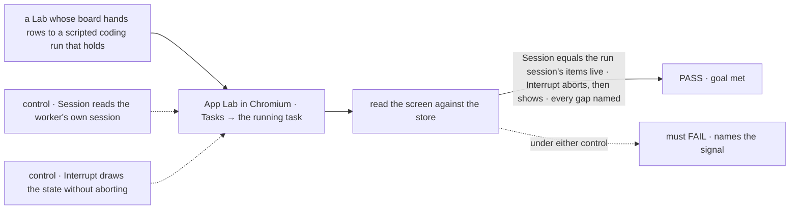
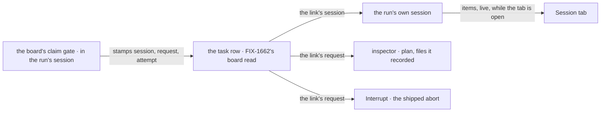

# FIX-1664 · App Lab task view: a task's session, diff, checks and inspector

**Spec** · [Decisions](DECISIONS.md) · [Rules](BUSINESS-RULES.md) · [Plan](PLAN.md) · [Docs](DOCS.md)

Feature · private app `labs/app-lab` · no FSD package changes here, one small orchestration field
split out ([the task-run link](PLAN.md#the-task-run-link)) · medium · 1 PR, after FIX-1662's
`frame` PR and that link · epic [FIX-1649](../../epics/FIX-1649/SPEC.md) (PR #2421) · beside
[FIX-1662](https://linear.app/fixpoint-labs/issue/FIX-1662) (PR #2424) and
[FIX-1655](https://linear.app/fixpoint-labs/issue/FIX-1655) (PR #2425)

## Five people, before and after

| Someone who… | Today | After |
|---|---|---|
| **opens a running task** | Finds its run in the devtool by guessing which child session is which | Clicks a row in Tasks or a board card and watches that run's own steps arrive: narration, tool calls, edits, test runs, with no reload |
| **wants a run to stop** | Aborts the request with curl, if they know its id | Presses **Interrupt** (or Esc). The view says *interrupted* once the run's request says so, never before |
| **wants to hand a task to another worker, open its PR, or type to the worker** | Can't | Sees each control disabled with a line naming what arrives and who ships it, or saying it is *not planned in the first cut* ([D2](DECISIONS.md#d2), [the open fork](DECISIONS.md#open)) |
| **reads the task inspector** | n/a | Worker and team, started, the plan and files the harness recorded, linked tasks and the devtool link from shipped reads; harness, tokens and cost as a named gap, because nothing a client can read carries them yet |
| **builds the closure check** (FIX-1663) | Nothing to walk to | A task route whose every tab, action and inspector value is either real or carries its gap line |

## The goal, and how we'll know it's met

**A person opens one task in App Lab and watches that task's own run live, can stop it, and
sees every other act and value the design draws either working from a shipped read or
operation or saying what arrives and who ships it, or that it is not planned in the first
cut.**

| Is it the right goal? | |
|---|---|
| **The real need** | The issue: *"see the worker actually doing it … steer it by sending a turn, interrupting it or handing it off, without leaving the app"*. The epic's leg a: a task's Session with the inspector beside it, and a message to a worker arriving as its turn ([FIX-1649](../../epics/FIX-1649/SPEC.md#the-goal-and-how-well-know-its-met)) |
| **Smaller, and rejected** | "The four tabs render." Met by a page of fixtures, or by showing the worker's chat instead of the run, which is where a person would be misled about what the task did |
| **Short of the need, and asked** | **Sending a turn.** Nothing ships that delivers a person's message into a running coding run, so this goal promises a disabled composer, not a working one. Whether to file that operation now is [the open fork](DECISIONS.md#open), and it is the hardest line on the sign-off |
| **Bigger, and not this issue's** | What a hand-off, a check, acceptance or a harness plan *means* (FIX-1651, FIX-1652) · the frame, routes and Tasks (FIX-1662) · the skin (FIX-1655) |
| **Not done if** | The Session shows items from any session but the task's run · *interrupted* shows before the request record is aborted · a disabled control has no gap line (what arrives and who ships it, or *not planned in the first cut*) · an inspector value shows a number no shipped read returned |



The check grades what the screen shows against the run's stored session and request, never
against App Lab's own state.

| How we verify | |
|---|---|
| **Goal check** | `goals/app-lab/it-shows-and-stops-a-task-run/` · model n/a (the scripted harness stub, made to hold until aborted) · real Chromium · run by the implementer at completion · verdict in the implementation PR |
| **Signal** | Reached from Tasks by clicking, never by a typed URL: the Session tab's items equal, by id and in order, the items stored for the task's run session, and a new one appears within 2 s of being stored with no reload. Interrupt: the run's request record reads `aborted` before the view shows *interrupted*. Every tab, action and inspector field shows a value equal to the store or its named state. Diff, Checks, Hand off, reassign, Open PR and the composer are disabled or empty with their gap line from the [gap registry](BUSINESS-RULES.md#gap-registry): the owner named, or *not planned in the first cut* where the registry says so |
| **Input** | A tree whose channel-attached board hands a row to a coding run on the scripted stub. A second row, on another seat, must pass too |
| **Anti-game** | No assertion on App Lab's own state or a mocked server. Text found somewhere on the page doesn't count: items and rows are read by id |
| **Control that must fail** | `GOAL_CONTROL=worker-session`: the Session tab reads the worker seat's own session. Must FAIL at *items equal the run session's*. `GOAL_CONTROL=optimistic-interrupt`: the view shows *interrupted* without calling abort. Must FAIL at *the request reads aborted first*. Today's `main` fails everything |

## What changes


The top row is today's empty frame. The bottom row is everything the task screen reads or
writes: the row, the run its link names, one shipped write, and the gaps named where they sit.
Every owner is in one place, the [gap registry](BUSINESS-RULES.md#gap-registry).

No person edits a file for this: a Lab opens as FIX-1662 already describes. The one addition
a person types is where the devtool is, so the trace link can open it:

```diff
  pnpm --filter @flow-state-dev/app-lab start --config goals/devforce-lab/lab/fsdev.config.mts
+   --devtool http://localhost:4000
```

## How the screen reaches the run



The run is the one place that knows which session it's in, so it writes that on the row as it
starts, and App Lab reads it there. Nothing is rebuilt or matched from outside: a key rebuilt
by the shell can name a different run (the same task drained from another conversation) or no
run at all (a worker that shares one session across tasks). The link is a small field in the
orchestration package, filed as its own issue ([D1](DECISIONS.md#d1)); App Lab changes nothing
else outside itself.

## What stays as it is

- **Every FSD package, but for the task-run link**, which is its own issue in the orchestration
  package. Nothing in Core or Engine. Session items render through the registry copies FIX-1662
  brings in, unedited.
- **The board, the run and the harness.** App Lab changes a task only by aborting its run; what
  the board then does with the row is the board's.
- **FIX-1662's frame**: the route, the right-panel slot and the shared reads are used, not
  re-made.
- **The devtool** stays the debugger, one link away.

## Sign off

**[The goal](#the-goal-and-how-well-know-its-met), at that size:** watch the run, stop it, and
a named gap for everything else, with the composer disabled until the open fork is answered.
If wrong: the owner can't steer a run from the app, which is the issue's own problem.

**Open: one, and it is the one to weigh.** [Send a turn into a running coding run: file the
operation now, or leave it out of this epic's first cut?](DECISIONS.md#open) Recommended: file
it now as a child of FIX-1649; the composer ships disabled and is wired when it merges.

1. **[D1](DECISIONS.md#d1) · The Session tab is the run the task's own row names, shown live;
   the row learns it from a small field the run stamps as it starts, filed as its own issue
   that this one waits on.** Changed after merge: the approved draft matched a rebuilt key, which
   could show or stop the wrong run. If wrong: one small orchestration field and a later start
   for this issue.
2. **[D2](DECISIONS.md#d2) · Of the four controls only Interrupt works; Hand off, reassign and
   Open PR are disabled and name FIX-1651.** If wrong: you expected hand-off to work on day
   one, and it needs a board rule changed first.

Also changed after merge, decided rather than asked: harness, tokens and cost are a named gap
owned by FIX-1652, since nothing a client can read carries them
([Decided, not asked](DECISIONS.md#decided-not-asked)).

Reasoning and what lost: [DECISIONS.md](DECISIONS.md). The cases:
[BUSINESS-RULES.md](BUSINESS-RULES.md).
