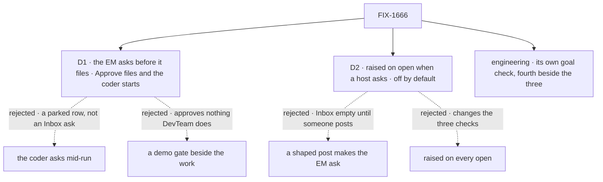

# FIX-1666 · Decisions

[Spec](SPEC.md) · **Decisions** · [Rules](BUSINESS-RULES.md) · [Plan](PLAN.md) · [Docs](DOCS.md)

The issue fixes the fences: the goal lab's tree only, no model in the path that raises the ask,
no approval model in the framework or shift-manager, the three checks green. FIX-1662 fixes what Inbox
reads: pending approvals and questions in the seat sessions the session listing returns to this
person ([its BR-24 to BR-27](https://github.com/fixpoint-labs/flow-state-dev/pull/2424)), and
what a workstream's Stream draws (its BR-18). These are the calls left open.

## The tree

Solid edges are what was chosen. Dashed edges lost, and the label says why.

## D1 · The EM asks a person before it files a feature; Approve files the row and the coder starts, Deny files nothing

| | |
|---|---|
| **Instead of** | (a) The coder asking mid-run through harness-manager's question channel. (b) A standalone demo gate, a copy of kitchen-sink's `requestApproval`, that approves nothing the lab does |
| **Because** | Inbox lists pending suspensions in seat sessions. (a) raises a durable question row and parks the task with no suspension behind it, which FIX-1662's BR-27 says is not an Inbox item, and it is a question rather than an approval. (b) puts an item in Inbox, but "Approve & run" would run nothing, so the closure's a1 would pass on a toy. The EM is the seat whose job is deciding that work starts ("files the work, never does it"), so an approval in front of filing is the one ask that means something on this tree. It uses the stock `human_approval` suspension, so no approval model is added anywhere (tenet 2: refine with what exists) |
| **Locks in** | One durable action on the EM kind: ask, then on Approve file the row through the same code the other two doors use and run the board, so the coder seat's run starts. On Deny, nothing is filed and the EM says so. The EM still declares no task entry and names no harness |

**What would change my mind:** FIX-1652 ruling that the first ask a Lab shows must be a worker's
question mid-task. Then the ask moves to the coder, and that needs a suspension harness-manager
does not raise today, which is framework work outside this issue.

**What being wrong costs:** one action and one check in a goal lab, rewritten. FIX-1652 may
point at this as the example of an ask, which is why it is worth getting the step right.

It comes down to the first row: only an ask in front of real work makes "Approve & run" mean
anything.

## D2 · The ask is raised when a host opens the lab with it turned on; off by default

| | |
|---|---|
| **Instead of** | (a) A post on the feature channel in a shape that makes the EM ask instead of filing. (b) Raising it on every open |
| **Because** | The issue asks that *opening* the tree shows the ask. (a) needs a person to post first, so Inbox is empty on open, and it changes the channel door the third check drives. (b) adds a pending request and, after any answer, a row to every check that opens the lab, so all three change shape. The lab already carries this pattern: its channel door is an option on open, absent by default, because "an entry that is only there to do nothing is worse than none" |
| **Locks in** | The raise is one step of the lab's, called by whichever host turns the ask on: it runs once, as the lab's person, in the EM seat's session, over a flow state with durable execution on. The lab's open takes one option, absent by default, that turns durable on and calls it. shift-manager's DevTeam config (FIX-1662's S12) builds its own flow state rather than opening through the lab's host, so it turns durable on and calls the same step after it hires; whichever of the two lands second adds those two lines |

**What would change my mind:** shift-manager gaining a way to raise a Lab's asks itself (FIX-1652's
call). Then the config's call moves there; the rule that it is off by default stands.

**What being wrong costs:** a missing line in shift-manager's config, found by the closure's a1 as an
empty Inbox.

It comes down to the first row: only raising on open makes the ask appear without anyone acting.

## Decided, not asked

- **Its own goal check, a fourth under `goals/devteam-lab/`** (engineering call). Widening one
  of the three would change what it proves, the reason the channel door got its own. The
  directory is outside `lab/` but inside the goal lab, which the issue's fence covers.
- **Answered only through the engine's resume route**, over the lab's door with its bearer. A
  lab helper that resolved the ask would prove a path shift-manager never takes.
- **Durable execution is on only when the ask is.** The three checks run with it off, as today.
- **Raised once per feature, and a Deny is final for that store.** A second open finds any
  asking request for the feature in the EM's session, pending, approved or denied, or the row
  another door filed, and raises nothing. The guard reads the request history the engine already
  keeps, so a Deny needs no record of its own. Retrying on reopen was rejected: it would put an
  ask the person already declined back in their Inbox on every restart, and "asked once" is the
  simpler promise to state.
- **The ask stays in the EM seat's own session; shift-manager's Stream draws it from there.** Inbox
  reads seat sessions (FIX-1662 BR-24) and a workstream's Stream reads the channel's session
  (BR-18), and no shipped mechanism puts one session's suspension in another's stream. Of the two
  sessions, the ask belongs in the seat's: FIX-1663's a1 is "a DevTeam seat raises an ask", and
  the resume, the kind and the one-session rule (BR-26) all follow the session it is in. So
  FIX-1662's Stream draws, beside the transcript, the pending asks in the sessions of the
  channel's member seats, which its shared read already loads for Inbox, with the same card and
  resume. The EM is a declared member of the feature channel, which is the link. That is an App
  Lab read over shipped routes; nothing moves into Core or Engine, and it is FIX-1662's to amend
  ([PLAN.md → Follow-ups](PLAN.md#follow-ups)).
  **Which session:** the seat's own session, `s_<seat id>`, the one the lab's file and drain
  doors already run in and whose children the lab reads as what the seat dispatched. It is
  top-level. It is not the dispatch-run session a channel post wakes the seat in through the
  notify dispatcher (`session: { key }`), which carries a parent and exists only once a post has
  woken the seat. The POC shows the same shape: it dispatches the ask into a top-level session it
  names, not through notify. Inbox lists with dispatch runs included (FIX-1662 BR-24, as amended
  in [#2439](https://github.com/fixpoint-labs/flow-state-dev/pull/2439)), so it reads this session
  and any dispatch run alike; leg 1 lists the same way.
- **Run as the lab's person** (`u_devforce_lab` in `org_devforce_lab`), the identity the lab's
  door resolves. If FIX-1662's config resolves a different person, the ask follows that person.
- **No `WORKER.md` changes.** Their tokens are held-out evidence for the first check.
- **No model, no key.** The action is handlers and the stock suspension; the coder runs the
  scripted stub in this check.

## Considered and dropped

| Alternative | Why not |
|---|---|
| Walk the journey on `goals/multi-seat-collab/lab/` | FIX-1663 D1 rejected it: it rewrites the epic's input |
| Lift kitchen-sink's escalation or ask API into the lab or a package | The Architect names it an invent-kill; the stock suspension already does it |
| Seed a suspension record directly in the store | Not a run a person can repeat; resume would have no request to continue |
| Make `onPost` ask before filing | Changes the third check's door and its evidence |
| Approve files the row and stops; the existing drain action starts the coder | Leaner, and needs no drain inside a resumed request. But "Approve & run" would run nothing until a second call, which is the demo gate D1 rejects. The premise it would avoid is settled below |
| Raise the ask in the feature channel's session, so the Stream shows it as is | The shipped channel kind has no action that can suspend, so the lab would rebuild a framework kind. And the ask would then belong to the channel, not a seat: Inbox reads seat sessions and a1 names a seat |
| Run the ask in a child session of the channel, as the post door does | Inbox would see it, since it lists dispatch runs (FIX-1662 BR-24). But that session exists only once a post wakes the seat, so raising the ask would mean posting first, which D2 rejects, and the coder's run would land under the channel's run rather than under the EM's own session |

## Open / Settled

**Open: none.**

**Settled · the drain runs inside the approved branch of a durable request** (confirmed,
2026-09-30, by [`poc/durable-drain/`](poc/durable-drain/README.md)). On the stock pieces, with
the answer sent through the engine's resume route: the ask suspends with no row; resume answers
`202` before the coder runs; after Approve the request completes, one row is filed and settles,
the coder runs once in a child session under the EM's session; after Deny nothing is filed. The
`no-gate` control fails as it must. So D1 stands as written, and Approve never holds a person's
click for the length of a run.

## How it got here

- **Draft** — the missing ask framed as a gap in what the EM does, not in the shell; the EM made
  to ask before it files using the stock approval, raised on open only when a host asks, and
  proved by its own model-free check with a control that removes the gate. One PR, lab tree only.
- **Review round 1** — the ask stays in the EM's session and FIX-1662's Stream draws member
  seats' pending asks (it only drew the transcript, so the card would not show there); a Deny now
  counts toward "raised once", read from the engine's request history, so a reopen does not ask
  again. The raise became its own step any host calls, because FIX-1662's merged config builds
  its own flow state rather than opening through the lab's host (D2's change-my-mind fired). The
  durable-drain premise was settled by a POC rather than left to implement time.
