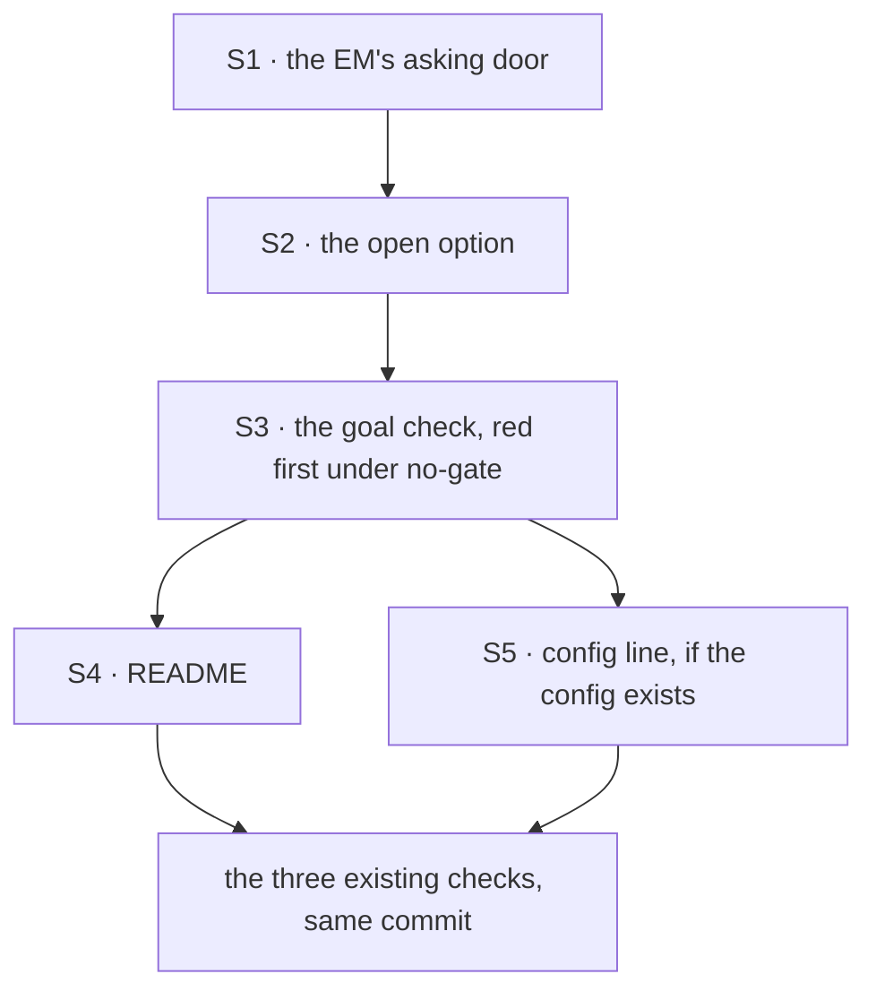

# FIX-1666 · Plan

[Spec](SPEC.md) · [Decisions](DECISIONS.md) · [Rules](BUSINESS-RULES.md) · **Plan** · [Docs](DOCS.md)

Written for the implementing agent. One PR, `goals/devforce-lab/` only. Directional: names below
are pinned only where the Pinned names table says so.

## Surfaces

| ID | Where | Change | Rules |
|---|---|---|---|
| S1 | `lab/workforce/flows/workers/em.mts` | A third door: a durable action that prepares the feature, suspends on a stock `human_approval` naming it, then on approve files the row through the existing `addRow` and runs `board.drain`; on reject files nothing and says so. `addRow` stays the one row writer for all three doors | AR-2, AR-8, AR-10, AR-12, AR-14 |
| S2 | a new module beside `lab/notify.mts`, and `lab/host.mts` | The raise as its own exported step: given a durable flow state, the EM seat and the feature, it runs the asking door once in the EM seat's own session (`s_<seat id>`, where `file` and `drain` run; not a notify dispatch run) as the lab's person until it suspends. Once per feature means: skip if the EM's session already holds an asking request for that feature, whatever its answer (pending, approved or denied), or the row exists. `openLab` gains one option carrying the feature, absent by default; when present it sets `durable: true` and calls the step, and the open fails, naming the step, if the ask could not be raised. Absent: byte-for-byte today's behaviour. The host keeps the option and one call, not the logic | AR-1, AR-2, AR-5, AR-6 |
| S3 | `goals/devforce-lab/it-waits-for-a-person-before-it-files/` | `goal.md` from [SPEC.md's goal](SPEC.md#the-goal-and-how-well-know-its-met) in the `goals/README.md` format; `run.mts` with legs 0 to 5; `fixtures/input.json` held-out | AR-1 to AR-16 |
| S4 | `lab/README.md` | The fourth check's row, and a short section on the ask door, per [DOCS.md](DOCS.md) | — |
| S5 | FIX-1662's `goals/devforce-lab/lab/fsdev.config.mts` | That config builds its own flow state and does not call `openLab` (FIX-1662's merged SPEC sketch and S12). So it turns the ask on with two lines: `durable: true` on its `createFlowState`, and a call to S2's step after it hires. Added here **only if** that config is on `main` when this PR opens; otherwise FIX-1662's S12 carries them (coordinator note) | D2 |

**Removed:** nothing. The `file` and `onPost` doors are unchanged.

## Sequence



## Checks

`S3`, scripted stub harness, in-memory stores, no key. Every read goes through the lab's HTTP door
with the verified bearer (the same door the first check's leg 7 uses). The answer goes through
`POST /:flowKind/requests/:requestId/resume`.

| Leg | What | Signal |
|---|---|---|
| 0 | Open without the ask | No request in the EM's session; flow state not durable. Then the three existing checks run green (AR-1, AR-15) |
| 1 | Open with the ask | `GET /sessions?include=dispatch-runs` as the lab's person, the listing Inbox reads (FIX-1662 BR-24), lists the EM's own session; its requests hold exactly one `suspended`, one pending `human_approval` whose message carries both held-out strings; the feature channel's declared members include the EM seat; `rows()` is empty; `dispatched(em)` is empty; stub runs 0; no key in env (AR-2 to AR-4, AR-7) |
| 2 | Approve | Resume with `approve` → the request completes; `rows()` holds exactly one row, id derived from the held-out slug; `dispatched(em)` names the coder seat by `flowId`, not the reviewer; stub reached once; row `completed`; no pending approval left. Negative half first: a resume with no bearer, and one with `submit`, are refused and it stays pending (AR-8, AR-9, AR-11, AR-13) |
| 3 | Deny, fresh open | Resume with `reject` → completes; `rows()` empty; no dispatch; output says nothing was filed (AR-10, AR-11) |
| 4 | Re-open, same store | After leg 1's state, after leg 2's and after leg 3's: no second approval raised, pending or otherwise; no second row; and after leg 3's, still no row (AR-5) |
| 5 | Control `GOAL_CONTROL=no-gate` | The EM's asking door files before suspending. The check must FAIL on leg 1, naming "a row existed before any approval" (AR-16) |

CI: AR-6 (open fails, naming the step) and AR-12 (row already exists) as vitest beside the lab if
the goal check can't reach them cheaply; otherwise legs of S3.

## Pinned names

| Name | Value | Why pinned |
|---|---|---|
| The check directory | `it-waits-for-a-person-before-it-files` | The closure and FIX-1663's part 3 name it |
| The control | `GOAL_CONTROL=no-gate` | Named in `goal.md` and the verdict log |
| Suspension reason | `human_approval` | The reason Inbox and the stock renderer read as an approval |

The action name and the option name are the implementer's.

## Guardrails

- **One row writer.** All three doors file through `addRow`, because a second copy is how the
  asked-for door comes to file a subtly different row than the direct one (the file already says
  so about `onPost`).
- **Absent means absent.** With the option off, no durable provider, no request, no new store
  write, because the three checks count rows, runs and dispatches and would change meaning.
- **Resolve only through the engine's resume.** No lab helper answers the ask, because App Lab
  can only take that route and a check that doesn't is proving a different path.
- **Nothing under `packages/`.** A finding that needs a framework change is filed under the epic,
  not fixed here, because the issue fences the lab tree.
- **No model on the path.** The asking door is handlers and the suspension, because a miss on the
  closure's a1 must be a shell or tree finding, never model behaviour.

## Docs

[DOCS.md](DOCS.md): the lab README only. No site docs.

## Sketch

```text
em kind, third door (durable):
  prepare(feature)          -> { issue, goal }          # replayed on resume, not re-run
  gate                      -> suspend(human_approval, "File <issue>: <goal> and start the coder?")
  tapIf approved            -> addRow(issue, goal) ; board.drain
  tapIf rejected            -> say "nothing filed: <reason>"

raiseAsk(flowstate, emSeat, { issue, goal }):      # its own module; any host calls it
  if EM session holds an asking request for issue (pending, approved or denied),
     or the row exists                                         -> skip
  else run the asking door as the lab's person, in the EM's session, until it suspends

openLab({ ask }):         flow state durable ; raiseAsk(...)        # the goal checks
fsdev.config (FIX-1662):  createFlowState({ durable: true, ... }) ; raiseAsk(...)   # App Lab
```

POC: [`poc/durable-drain/`](poc/durable-drain/README.md) settled the one premise the sketch
rested on; see [DECISIONS.md → Settled](DECISIONS.md#open--settled). Run it with
`pnpm exec tsx specs/issues/FIX-1666/poc/durable-drain/check.mts`. No factual-base checker: the
spec rests on no counted or enumerated facts.

## At implement time

1. Re-run the POC on the implementing commit before S1's shape is final. It is the stock-pieces
   shape; if the lab's own board or hire changes it, **stop and return a blocker** rather than
   fall back to filing without running, which would make "Approve & run" run nothing (D1).
2. Read which person FIX-1662's config resolves; the ask runs as that person (DECISIONS →
   Decided, not asked).
3. Read FIX-1667's merged spec, if any, for where the board is declared; `addRow` and the drain
   follow it.

## Notes from review

Review round 1's approach findings (where the Stream finds the ask; a Deny surviving a reopen;
the raise as a step App Lab's config calls) are folded into DECISIONS, the rules and the legs
above. The rest is recorded verbatim for the implementer:

- **Cursor, on the sketch (PR #2437):** "**Reuse existing approval gate shape.** The sketch here
  matches `apps/kitchen-sink/flows/chat-agent/approval-gate.ts` (prepare → suspend
  `human_approval` → `.tapIf` branches). Consider pointing implementers at that file +
  `goals/suspension/completes-via-the-resume-endpoint/` explicitly so S1 doesn't become a one-off
  durable sequencer — that's the main "3rd party / established pattern" win for this issue."
- **Cursor, summary (PR #2437):** "**Reuse, don't reinvent:** durable gate shape from
  `approval-gate.ts`; HTTP grading from `goals/suspension/completes-via-the-resume-endpoint/`;
  goal scaffolding from `goals/devforce-lab/it-wakes-the-seat-a-file-declared/`."
- **Second look (PR #2437), minor:** "`addRow`'s doc comment says "Shared by the two doors
  below"; with a third door this becomes stale. Fold into S1 so the file doesn't drift
  (BP-034)."

## Follow-ups

- **FIX-1662 S12** passes this option (coordinator note for cross-spec review).
- **FIX-1662 S7** draws, in a workstream's Stream beside the transcript, the pending asks in its
  member seats' sessions, with the same card and resume Inbox uses. Its BR-18 names only the
  transcript today, so this is an amendment there, not work here
  ([DECISIONS.md → Decided](DECISIONS.md#decided-not-asked)). Coordinator note for cross-spec review.
- **FIX-1652** may take this ask as its example of an approval; nothing here decides what an ask
  means beyond this lab.
