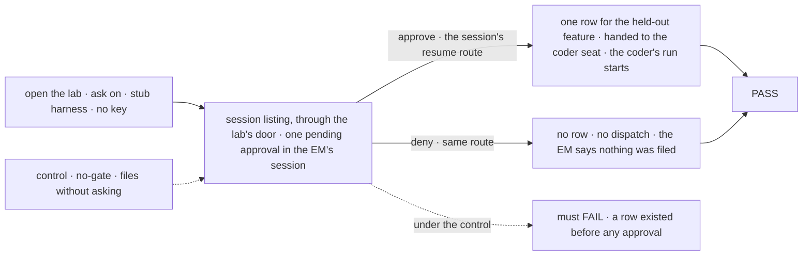

# FIX-1666 · DevForce goal lab raises an ask a person can approve, on a deterministic path

**Spec** · [Decisions](DECISIONS.md) · [Rules](BUSINESS-RULES.md) · [Plan](PLAN.md) · [Docs](DOCS.md)

Feature · `goals/devforce-lab/` only · small · 1 PR · epic [FIX-1649](../../epics/FIX-1649/SPEC.md)
(review PR [#2421](https://github.com/fixpoint-labs/flow-state-dev/pull/2421)) · filed from
[FIX-1663 D1](../FIX-1663/DECISIONS.md#d1) · blocks FIX-1663

## Four people, before and after

| Someone who… | Today | After |
|---|---|---|
| **runs the closure** (FIX-1663, leg a1) | Opens the DevForce Lab in App Lab and finds Inbox empty: nothing on that tree ever asks a person anything | Inbox holds one approval from the EM seat, the same one every run, raised with no model |
| **answers it** | Nothing to answer | **Approve & run**: the EM files the feature and the coder seat starts on it. **Deny**: nothing is filed, and the EM says so |
| **re-runs the lab a year from now** | Three checks, none touching approval | A fourth check proves the ask, both answers and the control that removes the gate, with no model and no key |
| **maintains the three existing checks** | Green | Green and unchanged: the ask is off unless a host asks for it |

## The goal, and how we'll know it's met

**When a host opens the DevForce goal lab with the ask turned on, the EM seat's session holds one
pending approval, raised the same way every run with no model; approving it through the
session's own resume files the feature and starts the coder seat on it, and denying it files
nothing.**

| Is it the right goal? | |
|---|---|
| **The real need** | "Opening the DevForce goal lab's tree in App Lab shows an ask a person can approve, and approving it lets the run continue … It does not depend on a model choosing to ask" (the issue), so the closure's "Inbox → Approve & run" journey can run on the tree the epic pins |
| **Smaller, and rejected** | A gate that approves nothing (a copy of kitchen-sink's demo gate). Inbox would have an item, but "& run" would run nothing DevForce does, and the closure would prove the shell against a toy |
| **Bigger, and not this issue's** | What an ask means across an org, or whether a parked row is one (FIX-1652) · App Lab's Inbox itself (FIX-1662) · the board on the feature channel (FIX-1667) |
| **Not done if** | The ask needs a model or a key · it lives anywhere Inbox does not read (a parked row, a lab-only list) · it is resolved by anything but the session's resume · approval completes the request but files nothing · a row exists before anyone approved · one of the three existing checks changed or went red · anything under `packages/` changed |

The check reads what a person's client would read, through the lab's own door, and answers
through the same route App Lab uses.

| How we verify | |
|---|---|
| **Goal check** | `goals/devforce-lab/it-waits-for-a-person-before-it-files/`, scripted stub harness, no key |
| **Signal** | Before any answer: the session listing for the lab's person returns the EM seat's session with exactly one pending approval naming the held-out feature, and the board holds no row. After Approve: exactly one row, for that feature, dispatched to the coder seat by id, and the stub reached once. After Deny, on a fresh open: no row, no dispatch. A second open over the same store raises no second ask, whether the first is pending, approved or denied |
| **Input** | A held-out fixture: the feature's issue slug and one-line goal |
| **Anti-game** | Every read goes through the lab's HTTP door with its verified bearer. The answer goes through the engine's resume route, never a lab helper. Rows are enumerated, not looked up |
| **Control that must fail** | `GOAL_CONTROL=no-gate`: the EM files without suspending. The check must FAIL on "a row existed before any approval" |

## What changes

Read the middle column: the new door waits for a person, and after Approve it joins the path the
other two already take.

**How:** the EM kind gets one more action that pauses on a stock approval before filing; the
lab's open raises it once when a host asks. Both are in the lab's tree. No framework change.

## What stays as it is

- **The EM still declares no task entry and names no harness.** The new action files and hands
  off; the coder does the work, as today.
- **The three existing checks** open the lab exactly as before, with the ask off.
- **App Lab, the framework, and kitchen-sink** are untouched. The ask is the framework's stock
  suspension, which Inbox already reads. The workstream's Stream shows it once FIX-1662 draws its
  member seats' pending asks beside the transcript, an amendment there
  ([DECISIONS.md → Decided](DECISIONS.md#decided-not-asked)).

## Sign off

**[The goal](#the-goal-and-how-well-know-its-met), at that size:** an ask that gates real
DevForce work, not a demo gate. If wrong: the closure proves Inbox against an ask that runs
nothing, or waits on work it didn't need.

1. **[D1](DECISIONS.md#d1) · The EM asks before it files a feature. Approve files the row and
   the coder starts; Deny files nothing.** If wrong: the one ask on the tree gates the wrong
   step, and FIX-1652 inherits it as the example.
2. **[D2](DECISIONS.md#d2) · The ask is raised when a host opens the lab with it turned on, off
   by default; App Lab's DevForce config turns it on.** If wrong: Inbox is empty on open unless a
   person does something first, or the three checks change shape.

**Depends on FIX-1662** drawing a member seat's pending ask in the workstream's Stream; without
it the card shows in Inbox but not in the Stream, and FIX-1663's a1 fails there.

**Open: none.** D1 is the one to weigh. Reasoning and what lost: [DECISIONS.md](DECISIONS.md).
The cases: [BUSINESS-RULES.md](BUSINESS-RULES.md).
