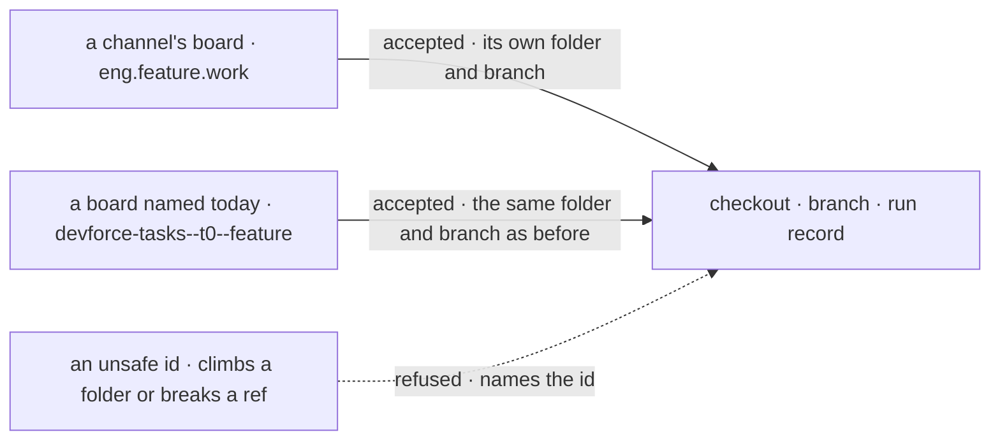

# FIX-1667 · Business rules

[Spec](SPEC.md) · [Decisions](DECISIONS.md) · **Rules** · [Plan](PLAN.md) · [Docs](DOCS.md) · [Evolution](EVOLUTION.md)

The cases, written as rules. Each says what a person or the system does and what happens. The
*proved by* column is the check the plan runs.

## Where the board lives

| # | When | Then | Proved by |
|---|---|---|---|
| BR-1 | The tree is read | The feature channel's file names the board by a plain local name; no file in the tree writes the board's full id, which the framework mints from where the channel sits | Goal check leg 0 |
| BR-2 | The channel is read | It lists exactly the boards its file declares, by name | Goal check |
| BR-3 | A line is posted on the channel in the filing shape | Exactly one row lands on the channel's board, with the issue-and-phase id the EM's filing returns | Goal check · the product check, unchanged |
| BR-4 | The coder seat's run settles that row | The channel's board shows that same row at its settled status. No other ledger holds a copy: the kinds' old ledger is gone | Goal check, with its control |
| BR-5 | A run fails and is retried, or spends its attempts | The channel's board shows each status as it happens: back to pending, then errored once the attempts are spent | The contract gate's existing failure leg, reading the channel's board |
| BR-6 | The same issue is filed twice | The existing row is returned; no second row, no second run | The contract gate, unchanged |

## Who can see it

| # | When | Then | Proved by |
|---|---|---|---|
| BR-7 | Someone reads the board through the HTTP door with the lab's verified bearer | They get the rows of the lab's organization, and only its fields a browser may see: title, goal, status, assignee and the like, never input or output | Goal check |
| BR-8 | Someone reads it through the HTTP door with no verified organization | Refused before anything is read | Goal check · the contract gate's existing door leg |
| BR-9 | The channel was never opened (the two older checks) | The board still holds the row, since it lives in the organization's storage | Contract gate and honesty check, green |

## What does not change

| # | When | Then | Proved by |
|---|---|---|---|
| BR-10 | A row is handed off | It reaches the declared coder seat in its own flow instance; the reviewer seat on the same kind is never woken; the EM seat names no harness | The contract gate, unchanged, with its controls |
| BR-11 | The seats are hired | No warning names the channel's board as unattended | Contract gate: stderr carries no warning naming it |

## The coding-run manager

| # | When | Then | Proved by |
|---|---|---|---|
| BR-12 | The manager runs a row on a channel's board | It derives a checkout folder, a branch and a run record from that board's id, and runs | `harness-manager` CI · the goal check |
| BR-13 | Two different boards, one a channel's and one not, could spell the same partition | They never share a checkout folder or a branch | `harness-manager` CI, on a pair built to collide |
| BR-14 | A board id the manager accepts today | Derives byte for byte the same checkout folder and branch as before this change | `harness-manager` CI, against today's derivation recorded before the change |
| BR-15 | A board id that could climb out of a folder or break a git ref (`..`, a trailing `.`, `.lock`, a separator) | Still refused, naming the id | `harness-manager` CI |

Two kinds of name cross the line, and each keeps its own lane on the far side, which is BR-13.
The stopped path is BR-15. The mermaid below is the same three paths by name.

## Failure taxonomy

A tree that declares a bad board name fails at load, before anything is hired, as the framework
does today. A board the manager cannot derive a partition for fails the attempt at the row, as
an unusable id does today. Nothing new retries.

## Acceptance criteria this issue owns

[The goal](SPEC.md#the-goal-and-how-well-know-its-met): a post on the DevForce feature channel
ends as one completed row on the channel's own board, read back through the channel and through
the browser's door, and the same run fails under `GOAL_CONTROL=kind-ledger`. The lab's three
existing checks stay green with their controls still failing.
