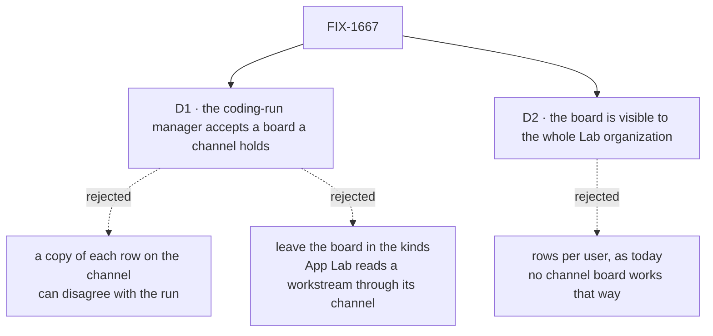

# FIX-1667 · Decisions

[Spec](SPEC.md) · **Decisions** · [Rules](BUSINESS-RULES.md) · [Plan](PLAN.md) · [Docs](DOCS.md) · [Evolution](EVOLUTION.md)

What was considered, what was chosen, why, and what each choice locks in. Two decisions are the
sign-off surface. Everything else here is context for them.

## The tree

Solid edges are what you're signing. Dashed edges lost, and the label says why.

## D1 · The fix steps outside the lab once: the coding-run manager accepts a board a channel holds

| | |
|---|---|
| **Instead of** | (a) Staying inside the lab: the kinds keep their own ledger and the lab writes a copy of each row onto the channel's board. (b) Leaving the board in the kinds and having App Lab read it there |
| **Because** | A channel names its board `<channel>.<board>`, with dots, and the manager refuses any board whose name has a dot, because it builds checkout folders and git branches from that name ([Settled](#settled)). So the one row cannot sit on the channel inside the lab's fence. A copy can: it is two writes that can disagree, and the case where they disagree (a run that failed, a retry) is the case a person opens the board to see. (b) cannot show anything: App Lab finds a workstream's board through its channel and names nothing from a tree ([FIX-1662 D2](https://github.com/fixpoint-labs/flow-state-dev/pull/2424)). The fence was written before the refusal was known, and the change adds no noun and touches neither `core` nor `engine` (epic [ER-7](../../epics/FIX-1649/BUSINESS-RULES.md)) |
| **Locks in** | A patch release of `@flow-state-dev/harness-manager`, with a changeset. Every board it runs today derives the same checkout folders and branches, so nobody's work moves. Any app's channel board can now back a supervised coding run, so channel boards become the answer for the next coding Lab too |

It comes down to whether the row App Lab shows is the row the run settled: a copy can say
*running* after the run failed.

**What would change my mind:** the owner holding the lab-only fence as hard. Then the manager
patch is filed as its own issue that blocks this one, and this issue shrinks to the lab's half.

**What being wrong costs:** a small patch to a published package for one lab's benefit, easy to
reverse, since existing boards derive exactly what they did.

## D2 · The board is visible to the whole Lab organization, as every channel's board is

| | |
|---|---|
| **Instead of** | Keeping rows per user, as the kinds' own ledger keeps them today |
| **Because** | A workstream is shared by the people working in it, and a channel's board is kept per organization by the framework ([FIX-1385](https://linear.app/fixpoint-labs/issue/FIX-1385)); there is no per-user channel board to choose. App Lab reads a board as the reading person's organization |
| **Locks in** | Anyone in the DevForce Lab's organization sees each row's title, goal, status and assignee. Never the row's input or output: the framework publishes a fixed list of fields to a browser |

It comes down to a shared workstream: per-user rows would show each person a different board.

**What would change my mind:** a DevForce row that carries something one person in the org must
not see. Nothing in the lab does today.

## Decided, not asked

- **The board's local name is `work`.** A name a person reads in App Lab; any plain name serves.
- **The EM keeps filing through its own board onto the channel's ledger**, not through the
  channel's `fileTask`. The manager requires a row id derived from the issue and phase, and
  `fileTask` mints its own.
- **The cross-flow hand-off and the coder's second declaration stay**, both pointing at the
  channel's ledger. This issue moves only the ledger; the tax has no open owner (FIX-1408 closed with it in place), flagged in the plan's follow-ups.
- **The channel is opened only when asked, as today.** The board exists either way, since its
  rows live in the organization's storage, not in the channel's session.
- **The three checks read rows where they now live.** Their claims, legs and controls do not
  change.
- **Hire is handed the tree's board ids**, so a kind that stops declaring the board warns.
- **The manager uses a channel's board id as is.** Its grammar widens by one thing: a single dot
  may join the parts it accepts today (letters and digits, joined by `-` or `_`). Nothing is
  translated, so every id accepted today derives exactly what it does now (the old set sits inside
  the new one), and two boards share a folder or branch only if their ids are the same after the
  case fold the manager already applies.
- **The manager checks its board's id when it is built, not when a row is claimed.** A channel
  accepts a board named `lock`, which mints `eng.feature.lock`, and git refuses a branch part
  ending in `.lock`. Refused at build, that tree fails before anything is hired. Refused at the
  row, the row is claimed, the checkout fails, and the retries are spent on a name no retry fixes.

## Considered and dropped

| Alternative | Why not |
|---|---|
| A copy of each row on the channel, kept in step by the lab | Two writes that disagree exactly when a run fails or retries. The rejected half of D1 |
| Leave the board in the kinds; App Lab reads it there | App Lab reads a workstream through its channel and names nothing from a tree. The rejected (b) of D1 |
| A new manager option that lets the caller name the checkout partition | Hands every caller an identity to invent, and two boards given the same one would share checkouts, the collision the manager's derivation exists to prevent |
| Translate the dots (to `-`, `_`, or an encoding) | Collides with ids that are legal today: `eng.feature.work` becomes `eng-feature-work`, which a board may already be called, and the case fold widens the set. Using the id as is has no mapping to prove |
| Refuse `lock` and other ref-breaking names in the channel's board-name rule | That rule is the workforce package's and covers boards no coding run touches. What the manager can run is the manager's to say, at its own door |
| Rebuild onto the channel's `fileTask` and a plain drain, as FIX-1385's own check does | Loses the issue-and-phase row id the manager requires, and changes what the three checks prove |
| Walk App Lab's board journey on another tree | Rejected by [FIX-1663 D1](../FIX-1663/DECISIONS.md#d1): the epic pins the DevForce tree |

## Settled

- **The manager refuses a board a channel holds** — **CONFIRMED** by running its grammar. The
  manager checks the board's id against `DERIVED_IDENTITY` before deriving a checkout or branch
  (`packages/harness-manager/src/workspace.ts`, `locationSegments`); that pattern allows letters,
  digits, `-` and `_` only (`packages/harness-manager/src/identity.ts`). Run against both ids:
  today's `devforce-tasks--t0--feature` → accepted; the channel's `eng.feature.work` → refused.
  Command:
  `node -e 'const R=/^[A-Za-z0-9]+(?:[_-]+[A-Za-z0-9]+)*$/; for (const s of ["eng.feature.work","devforce-tasks--t0--feature"]) console.log(s, R.test(s))'`
  → `false`, `true`.

## How it got here

- **Draft** — framed as the channel holding the one ledger the EM files onto and the coder's
  run settles; the manager's refusal of dotted board names found in research and fixed at its
  source rather than mirrored around; one PR.

**Open: none.**
