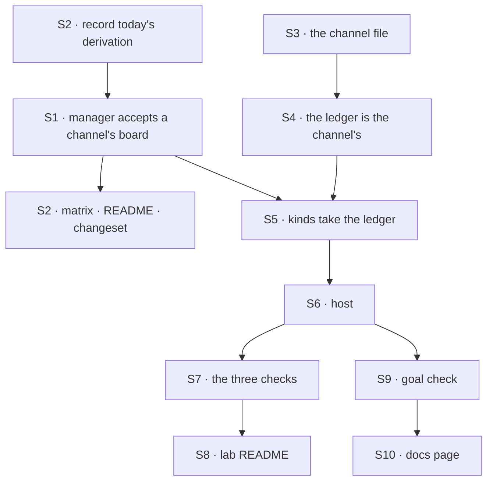

# FIX-1667 · Plan

[Spec](SPEC.md) · [Decisions](DECISIONS.md) · [Rules](BUSINESS-RULES.md) · **Plan** · [Docs](DOCS.md) · [Evolution](EVOLUTION.md)

Written for the implementing agent. IDs cross-reference [BUSINESS-RULES.md](BUSINESS-RULES.md)
(BR-n) and [DECISIONS.md](DECISIONS.md) (D-n). `tdd`. One PR.

## Surfaces

| ID | Package · role | Change | Rules |
|---|---|---|---|
| S1 | `harness-manager` · the run partition (`DERIVED_IDENTITY`, `locationSegments`, the run topic) and `harnessManager`'s construction | Widen the accepted id grammar to allow a single interior dot; refuse `..`, a leading or trailing `.` and a case-insensitive `.lock` ending. Use the id as is, with no translation. Check the id when the manager is built, not only at the attempt (D1) | BR-12 to BR-15 |
| S2 | `harness-manager` · tests, README, changeset | The derivation matrix of S1, including a recorded snapshot of today's derivation taken **before** S1 lands; the README line from [DOCS.md](DOCS.md); a `patch` changeset | BR-13 BR-14 |
| S3 | `goals/devforce-lab/lab/workforce/teams/eng/channels/feature/CHANNEL.md` | `boards: [work]` | BR-1 BR-2 |
| S4 | `goals/devforce-lab/lab/board.mts` | The shared ledger is the channel's, resolved with `channelBoard` from the channel id and board name the host reads off the tree. **Remove** `featureLedger()`, `LEDGER_ID` and the user-scoped ledger. Rewrite the header: the board belongs to the channel; the recipient's second declaration stays, labelled as the framework's tax (FIX-1408 closed without removing it) | BR-1 BR-4 |
| S5 | `goals/devforce-lab/lab/workforce/flows/workers/em.mts`, `coder.mts` | Take the ledger as an option rather than building one; the manager's board is that ledger and its id. Filing, hand-off and the no-harness EM unchanged | BR-3 BR-6 BR-10 |
| S6 | `goals/devforce-lab/lab/host.mts` | Find the channel whose file declares a board and read its first board off the tree; build the ledger; hire with the tree's board ids; `row` and `rows` read the organization's storage under the minted id; expose the board's name and id on the lab handle so checks never spell them | BR-4 BR-9 BR-11 |
| S7 | The three checks under `goals/devforce-lab/` | Wherever one names the old ledger or reads user-scoped rows, read through the lab handle instead. No leg, claim or control changes | BR-5 BR-6 BR-8 BR-9 BR-10 |
| S8 | `goals/devforce-lab/lab/README.md` | The tree listing, the `board.mts` row and "What it works around", per [DOCS.md](DOCS.md) | — |
| S9 | `goals/devforce-lab/it-keeps-its-rows-on-the-channels-board/` | The goal check: `goal.md`, `run.mts`, the `kind-ledger` control | the goal |
| S10 | `apps/docs/docs/orchestration/harness-manager.md` | Per [DOCS.md](DOCS.md) | — |

**Removed:** the kinds' own user-scoped ledger and its id, and the README's claim that boards
are declared in code by design.

## Sequence



## Checks

| ID | Runs after | Passes when |
|---|---|---|
| V1 | S1 | **Tracer, first.** One row filed on a channel board in a vitest host runs through the manager to `completed`, on an org-scoped ledger. This is the premise the spec did not run (see POC); if it fails, stop and surface it |
| V2 | S2 | BR-13, BR-14 against the snapshot recorded before S1, BR-15 |
| V3 | S7 | `it-wakes-the-seat-a-file-declared` PASSES and each of its controls still FAILS at its named leg (BR-5, BR-6, BR-8, BR-10, BR-11) |
| V4 | S7 | `it-ships-an-artifact-a-person-can-open` PASSES with its reread; its controls still FAIL (BR-3, BR-9) |
| V5 | S7 | `it-commits-from-the-seats-own-file` PASSES on a real agent where credentials exist. Where they don't, the PR says it did not run and why; it is never reported green |
| VG | S9 | [The goal](SPEC.md#the-goal-and-how-well-know-its-met) PASSES, after `GOAL_CONTROL=kind-ledger` FAILED naming the empty channel board, and today's `main` FAILED naming no board listed |
| V6 | all | Diff gate: every changed path is under `goals/devforce-lab/`, `packages/harness-manager/`, `apps/docs/docs/orchestration/harness-manager.md`, `.changeset/` or this spec |

## Pinned names

| Where | Name | Why pinned |
|---|---|---|
| Board | `work`, on the feature channel | App Lab shows it; D-not-asked |
| Goal check | `goals/devforce-lab/it-keeps-its-rows-on-the-channels-board/` | The spec and the closure cite it |
| Control | `GOAL_CONTROL=kind-ledger` | The goal names it |

Everything else is yours to name.

## Guardrails

| Rule | Because |
|---|---|
| One ledger, one row. Nothing writes a row anywhere but the channel's board | A copy is exactly what D1 rejected; a mirror in a helper is still a mirror |
| Every board id reaches the checkout and the branch through the one derivation (tenet 5) | The run record, the branch and the folder partition together; fixing one path and missing the run topic splits a run's state |
| Today's derivation is recorded before S1, and compared after (BP-030, BP-003) | Existing checkouts and branches on people's disks are persisted state; a derivation that drifts strands them silently |
| Names are read off the tree, never spelled in lab code or checks | The goal check's leg 0 and the lab's "no file named in code" claim both depend on it |
| The three checks change only where they read rows | Their verdict logs are the lab's evidence; a leg edited to pass is a lost proof |

## Docs

Reconcile and publish [DOCS.md](DOCS.md) after VG passes. The harness-manager README and docs
page describe shipped behaviour only; the lab README follows S4 to S7.

## Sketch · pseudocode, illustrative, react to the shape

```
host:  channel ← the tree's channel whose file declares boards
       ledger  ← channelBoard(channel.id, channel's first board)       (read off the tree)
       em  kind ← built on ledger · files rows onto it · hands off across flows
       coder kind ← built on ledger · second declaration (the tax) · manager(ledger.id)
       hire(workers, channelBoards = the tree's board ids)
manager: partition ← derive(board id)      ← accepts a channel's dotted id (D1)
                                              ids accepted today → unchanged
check: post → drain → channel.read().boards · channel.readBoard(name) · the door read
```

**POC:** none built. The premise that the manager refuses a channel's board was settled by
running its grammar ([Settled](DECISIONS.md#settled)). The premise that, once accepted, it runs
and settles a row on an organization-scoped ledger is **not** run: the lab's ledger is per user
today and no repository test puts the manager on an org-scoped board. V1 is that premise, built
first.

## At implement time

- **FIX-1662's `goals/devforce-lab/lab/fsdev.config.mts`** (its S12) may have landed. If it
  hires on its own rather than through `openLab`, give it the same ledger and board ids.
- **FIX-1662's BR-14 leg on DevForce** asserts the workstream's board is *empty*. Whichever
  merges second reconciles it; tell the epic coordinator in the PR.
- **FIX-1664's PLAN** picks DevForce for its check if the board is channel-attached by then.
- **The cross-flow tax** may have been removed by then. If `defineFlow` no longer needs the recipient's second declaration, drop it here too.
- Check `packages/harness-manager` for any other place a board id becomes a path or ref
  (inbox topics, run-record keys) and route it through S1's derivation.

## Notes from review

Recorded for implementation, not baked into the design. Read them against the code.

- **Round 1, owner's second-look pass** ([comment](https://github.com/fixpoint-labs/flow-state-dev/pull/2438#issuecomment-5915950099)), finding 3: "`boardCollectionId` also feeds `RESERVED_ACCESSORS`, `collectionRef` in `run-record.ts`, the `harness-manager:<id>` block name and `epic: boardCollectionId` at several call sites. The plan's last "At implement time" bullet already says to grep for this. V1 (tracer first) will catch most of it. I'd keep the grep as an explicit step, since `runTopic` sits outside `workspace.ts`."
- **Round 1, same pass**, architecture note: "One risk is the FIX-1662 BR-14 leg asserting DevForce's board is *empty*, which the plan already flags. Whichever PR merges second should own the reconcile, so name which one in the PR."
- **Round 1, Cursor** ([thread](https://github.com/fixpoint-labs/flow-state-dev/pull/2438#discussion_r4147236359)), on S6: "Consider matching `goals/multi-seat-collab/lab/host.mts`: resolve `channelBoard(channel.id, boardName)` where `boardName` comes from that channel's `CHANNEL.md`, instead of scanning for "any channel with boards" and taking the first. Same anti-gaming properties, less open-ended host logic for implementers to generalize."
- **Round 1, Cursor** ([thread](https://github.com/fixpoint-labs/flow-state-dev/pull/2438#discussion_r4147236371)): "The fence is described three ways (SVG, "mermaid below is the same…", and the mermaid). One visual + the BR-12–15 table would carry the same proof obligations with less maintenance drift."
- **Round 1, Cursor** (review summary), runtime: "Once rows live on an org-scoped channel board, App Lab workstream + task chrome need a clear *invalidation* story (push/`resource_change` vs polling)... The goal check's channel + HTTP door + storage triangulation should stay CI-only, not a product read pattern."

## Follow-ups

- **Flag to the epic:** the recipient's second board declaration has no open owner. FIX-1408, which the lab's code names as its home, is Done with the tax in place.
