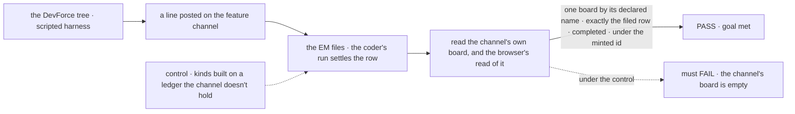

# FIX-1667 · DevForce feature channel carries the board its rows sit on

**Spec** · [Decisions](DECISIONS.md) · [Rules](BUSINESS-RULES.md) · [Plan](PLAN.md) · [Docs](DOCS.md) · [Evolution](EVOLUTION.md)

Feature · the DevForce goal lab, plus one patch to `@flow-state-dev/harness-manager` · small to
medium · 1 PR · epic [FIX-1649](../../epics/FIX-1649/SPEC.md) (review PR
[#2421](https://github.com/fixpoint-labs/flow-state-dev/pull/2421)) · filed from
[FIX-1663 D1](../FIX-1663/DECISIONS.md#d1), blocks FIX-1663

## Five people, before and after

| Someone who… | Today | After |
|---|---|---|
| **opens the DevForce feature workstream in App Lab** | Board and Tasks are empty, though the EM filed a row and a coding run settled it | Sees the channel's board and the row on it, at the status the coding run left it |
| **runs the epic's closure** (FIX-1663) | The journey "the board → a task → its session" can't run on the DevForce tree the epic pins | Can |
| **builds a Lab whose coding seat works a channel's board** | The coding-run manager refuses any board a channel holds, because its name carries a dot | The manager runs it, and every board it runs today keeps its checkouts and branches |
| **reads the DevForce lab to learn the convention** | The board is declared inside two worker kinds, labelled interim | The board is declared in the channel's file, as FIX-1385 settled. Only the cross-flow hand-off tax stays labelled interim |
| **keeps the lab's three checks** | Green | Green, with the same claims and the same controls |

## The goal, and how we'll know it's met

**Anyone in the DevForce Lab's organization who opens the feature channel's workstream sees the
board that channel holds and every row on it, at the status its coding run left it, with no
second copy of the row anywhere.**

| Is it the right goal? | |
|---|---|
| **The real need** | "Opening the DevForce feature channel's workstream in App Lab shows its board and the tasks on it. The board belongs to the channel" (the issue), so FIX-1663's leg a can walk "Tasks or the board → a task" on the DevForce tree ([FIX-1663 D1](../FIX-1663/DECISIONS.md#d1)) |
| **Smaller, and rejected** | "The channel file declares a board." True the moment one line is added, while the rows the EM files still land on the kinds' own ledger and the board App Lab opens stays empty |
| **Bigger, and not this issue's** | Walking it in App Lab in a browser: FIX-1662 builds the screen and FIX-1663's leg a walks it. What a workstream's board *means*: FIX-1650 and FIX-1651. Removing the cross-flow declaration tax: no open owner, flagged |
| **Not done if** | The row is visible only because a copy was written to the channel · the channel lists the board but reading it returns nothing · the row's status on the board lags or disagrees with its run · any of the three existing checks was edited to weaken a claim · a board the manager ran before this derives a different checkout |



The check reads what the channel serves, the same reads App Lab makes, never the run's own
report. The control keeps the run working and moves only where its row lives.

| How we verify | |
|---|---|
| **Goal check** | `goals/devforce-lab/it-keeps-its-rows-on-the-channels-board/`, model n/a (the lab's scripted harness), run by the implementer at completion, verdict in the implementation PR |
| **Signal** | The channel's read lists exactly the boards its file declares; reading the board returns exactly one row, with the id the EM's filing returned, `completed`, assignee `coder`; the same row comes back through the HTTP door a browser uses under the lab's bearer, and from org storage under the minted id; no file in the tree writes that id |
| **Input** | The DevForce tree as it stands. Renaming the channel's folder or the board must still pass: every assertion reads names off the tree |
| **Anti-game** | No assertion on the drain's report, the run record or the EM's output: all three are green while the row sits on another ledger |
| **Control that must fail** | `GOAL_CONTROL=kind-ledger`: the kinds build on a ledger of their own, as today. The run still completes; the check must FAIL naming *the channel's board returned no rows*. Today's `main` must FAIL on *the channel lists no board* |

## What changes


Follow the row: today it never passes through the channel; after, it sits in the channel's box
and every reader meets it there.

**What an author of the tree writes:**

```diff
  ---
  description: Where this team talks about the feature it is building.
  members: [eng.em, eng.coder, eng.reviewer]
+ boards: [work]
  ---
```

**And what a Lab author gains**, in any app whose coding seat works a channel's board:

```diff
+ const work = channelBoard("eng.feature", "work");
  harnessManager({
-   boardCollectionId: "my-board",       // a channel's board was refused here
-   boardCollection: myOwnLedger,
+   boardCollectionId: work.id,          // "eng.feature.work", now accepted
+   boardCollection: work,
    ...
  });
```

## What stays as it is

- **How work starts and who does it.** Post → EM files → hand-off to the declared coder seat;
  the reviewer is never woken; the EM names no harness. The three checks prove the same things.
- **The cross-flow declaration tax.** The coder kind still declares the board a second time;
  only the ledger it points at moves. Removing it is a framework change, flagged in the plan.
- **App Lab.** No change to FIX-1662 or FIX-1664.

## Sign off

**[The goal](#the-goal-and-how-well-know-its-met), at that size:** the rows App Lab would show
are the real rows, proved on the reads App Lab makes, one post to one settled row. If wrong: a
workstream that shows a board nobody's work lands on, or a spec held open for the browser walk
FIX-1663 already owns.

1. **[D1](DECISIONS.md#d1) · The fix steps outside the lab once: the coding-run manager accepts
   a board a channel holds.** The issue fenced this to the lab; no lab-only path avoids a second
   copy of each row. If wrong: a published package changes for one lab, or App Lab shows a copy
   that can disagree with the run.
2. **[D2](DECISIONS.md#d2) · The board is visible to the whole Lab organization, as every
   channel's board is.** Today the rows are per user. If wrong: a person in the org sees a row's
   title and status they shouldn't.

**Open: none.** D1 is the one to weigh. Reasoning and what lost: [DECISIONS.md](DECISIONS.md).
The cases: [BUSINESS-RULES.md](BUSINESS-RULES.md).
