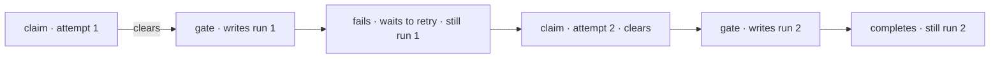

# FIX-1668 · Business rules

[Spec](SPEC.md) · [Decisions](DECISIONS.md) · **Rules** · [Plan](PLAN.md) · [Docs](DOCS.md)

The cases, written as rules. Each says what a person or the system does and what happens. The
*proved by* column is the check the plan runs. A human reviews this page; the plan turns it into
work.

## Writing the link

| # | When | Then | Proved by |
|---|---|---|---|
| BR-1 | A handed-off attempt passes the claim gate in its run's session | Before the worker's first step, the row's link names that session, that request, and the row's current `attempts`. One `task-change` of kind `run_linked` | CI · goal check |
| BR-2 | The seat's session policy is per-task, per-worker, or a custom key | The link always names the session the run is actually in. Two tasks in one per-worker session name the same session and different requests | CI · goal check |
| BR-3 | The same board is drained from a second conversation | A row that drain hands off names that drain's run, not the first conversation's | Goal check |
| BR-4 | The gate refuses the dispatch: no row, other attempt, recreated row, not `in_progress`, other seat, or a lapsed lease someone else took | No link is written. The row is exactly as it was | CI, one case per arm |
| BR-5 | The link write is declined (the claim moved between the gate's read and its write) | The attempt stops as a stale claim (`stale-task-claim`); the worker never runs; the link is unchanged | CI |
| BR-6 | The link write throws (the store fails), or it commits and then the gate's remaining setup throws, or its change item can't be published | The attempt stops before the worker runs, like any gate failure. The row is handled as that gate failure is today: a failure before the claim is on the gate's state leaves it claimed for the board's lapse path, within its abandonment bound. A link that committed stays: it names the run the attempt entered, whose request reads failed. Nothing rolls it back; the next claim clears it (BR-13) | CI, a failure before and after the link commits |
| BR-7 | A lapsed lease is taken back at the gate | The link names the attempt that took it back. Whether it rides the renewal write or follows it is the implementer's; either way it lands before the worker runs. If it rides the renewal write, which emits no `task-change`, the link must still reach the change stream (BR-15): the combined write emits `run_linked`, or a follow-up write does | CI |
| BR-8 | A worker runs inline, not handed off | No link is written, and the claim still clears any old one | CI |

## Who can write it

| # | When | Then | Proved by |
|---|---|---|---|
| BR-9 | A caller or a model adds, updates, or patches a task, including through `metadata` or the model-facing task tools | They cannot set or change the link. It is absent from every write surface a caller reaches, as `claimedBy` is | CI · type test and a runtime attempt |
| BR-10 | A task is created with a link in its input | The link is dropped or refused, never stored | CI |

## How long it lasts

| # | When | Then | Proved by |
|---|---|---|---|
| BR-11 | The attempt completes, errors, is cancelled, or is parked for review | The link stays, naming the run that did the work | CI |
| BR-12 | A failed attempt is put back to pending for a retry | The link stays, naming the failed run, until the next claim | CI |
| BR-13 | The board claims the task for a new attempt, by the drain or by recovery of a lapsed row | That same write clears the link. Between hand-off and the next run's start the row reads *no run linked* | CI |
| BR-14 | A row was stored before this shipped, or by a writer that drops unknown fields | Reads as *no run linked*. Nothing is inferred from `claimedBy`, the topic, or anything else | CI · legacy row fixture |

Read left to right. The link exists only between a gate and the next claim, and that span covers
the whole time a person would want to open the run.

## Who can read it

| # | When | Then | Proved by |
|---|---|---|---|
| BR-15 | A UI follows a `task-change` stream | Every item's row carries the link when the row has one. `run_linked` publishes on the run's own session stream, as every write the run makes does; the session that drained the board gets no copy. A board view in any other session sees the link on its next read of the row | CI, both sessions' streams |
| BR-16 | A browser reads a channel board directly | Each row carries the link. The browser list stays a subset of the model list | CI · the existing subset test |
| BR-17 | A model reads a channel board with `readBoard` | Each row carries the link | CI |
| BR-18 | Someone uses the link to open a session or abort a request they don't own | Refused by the same owner check as without the link | Existing suite (engine routes), cited not re-run |
| BR-19 | `claimedBy` is read on any of those paths | Still absent. Its meaning and its server-only status are unchanged | CI · the existing redaction test |
| BR-20 | A reader opens a run whose seat hands off to another flow | The session read of the link's session names that session's owning flow; the run opens through it. Opened through the board's flow instead, it doesn't | CI · goal check |

## Failure taxonomy

Nothing here fails a task. A refused or failed link write stops one attempt before it does any
work, and the board's existing recovery hands the row out again, bounded as today. A link that
committed before the attempt stopped is left in place, because it is true. A missing link
is a normal state readers are told to expect, never an error.

## Acceptance criteria this issue owns

[The goal](SPEC.md#the-goal-and-how-well-know-its-met): on a real host, every row read back through
the browser read, the model read and the run's own change stream names the session and request
its own worker recorded from inside its run, across a per-task seat, a per-worker seat, a seat on
another flow and a re-drain from a second conversation; the cross-flow run opens through its
session's owner; and the same run fails under `stamp-at-claim`, `server-only` and `board-flow`.
