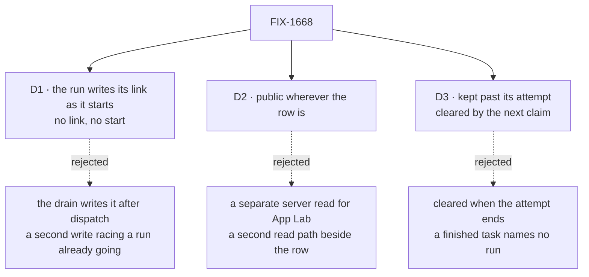

# FIX-1668 · Decisions

[Spec](SPEC.md) · **Decisions** · [Rules](BUSINESS-RULES.md) · [Plan](PLAN.md) · [Docs](DOCS.md)

What was considered, what was chosen, why, and what each choice locks in. Three decisions are the
sign-off surface. Everything else here is context for them.

## The tree

Solid edges are what you're signing. Dashed edges lost, and the label says why.

## D1 · The run writes its own link, as it starts; an attempt that can't write it doesn't start

| | |
|---|---|
| **Instead of** | The drain writing it after the hand-off returns, since the hand-off already reports the session and request the dispatch became |
| **Because** | Only the run knows for certain which session it is in, whatever the seat's session policy and whichever conversation drained the board ([FIX-1664 D1](../FIX-1664/DECISIONS.md)). The claim gate runs in that session on every handed-off attempt and already re-reads the row before the worker's first step, so the link is one fenced write in a place that exists. A drain-side write lands *after* the run started, so it can arrive after the run finished, and it can fail with the work already under way: exactly the write FIX-1664's plan ruled out. The fence makes the write refuse a stale attempt the same way the gate's checks do. Stamp at source, as the reverse-dispatch reply stamp does (FIX-1312) |
| **Locks in** | One more store write per handed-off attempt. If the store refuses it or fails at that moment, the attempt stops before doing any work and the board re-dispatches it later, within its existing abandonment bound. A task is never worked by a run that isn't on its row |

It comes down to when the write lands: the drain's write can arrive after the run has finished.

**What would change my mind:** a store where one extra write per attempt is a measurable cost.
Handed-off attempts are coarse units, a coding run each, so none is known.

## D2 · The link is public wherever the row is: the change stream, the browser read and the model read

| | |
|---|---|
| **Instead of** | Keeping it server-only, like `claimedBy`, and giving App Lab its own server read |
| **Because** | App Lab reads a channel board the way every browser does, through the board's browser read; a UI already following the run's own session sees it on that session's change stream. A second read path beside the row is the "Lab-only mirror" the Architect's fence forbids. The ids grant nothing: opening the session still passes the server's owner check (BP-031), and the link carries no tenant and no claiming session. A channel board's browser list must stay a subset of its model list (a test holds that), so the model read gets it too |
| **Locks in** | Anyone who can read a board, and any model that reads it with `readBoard`, sees the session and request id of each task's run. The two channel publication lists stop saying "no execution coordinates"; they say "one: the run link". Taking it back later breaks App Lab |

It comes down to how App Lab reads a board: server-only means building a second read beside it.

**What would change my mind:** a model or browser flow that can act on a bare session or request
id without an owner check. None exists; the session read, the stream and abort all check.

## D3 · The link outlives its attempt: kept when the task finishes, fails or waits to retry; cleared only by the next claim

| | |
|---|---|
| **Instead of** | Clearing it when the attempt ends, as `claimedBy` is cleared |
| **Because** | A person opens a finished or failed task to see what its run did, and that is FIX-1664's Session tab. The claim that starts the next attempt clears it in the same write that advances `attempts`, so the gap between hand-off and the run's start reads *no run linked*, which is FIX-1664's BR-3, and a link never names a run older than the latest claim |
| **Locks in** | A link is a fact about the latest attempt that started, not a sign that work is live. Whether it is live is the row's status and the run's request, read separately. A retrying task shows its failed run until the next claim |

It comes down to a finished task: cleared-on-end leaves it naming no run at all.

## Decided, not asked

- **Only handed-off attempts are linked.** An inline worker runs inside the drain's own request,
  in the seat's own session; there is no separate run to name. Linking inline attempts is a
  follow-up if a reader needs it.
- **The link carries session, request and attempt, and nothing else.** No tenant, no board id, no
  seat: the row already has the seat, and a tenant is the server's to know (BP-031).
- **No flow on the link; a reader gets the run's flow from its session.** A seat may hand off to
  another flow, so the board's flow is not always the run's. The session record already stores its
  owning flow instance, and the flow-agnostic, owner-checked session read returns it (`flowId`, the
  same field the React docs tell a dispatch-run reader to use). The gate can't write it without
  reaching down: a block's context hides its own flow instance by design. A copy on the row would
  be a second record of a fact the engine owns.
- **The link's `task-change` publishes on the run's own session**, like every write the run makes
  to the row, its settlement included. Nothing pushes it to the session that drained the board. A
  board view sees the link on its next read of the row.
- **A link that landed stays, even when the gate fails after it.** If the gate's remaining setup
  throws, or the change item can't be published after the write committed, the attempt stops
  before the worker, as BR-6. The link still names the run the attempt entered, and that run's
  request reads failed, so a reader who opens it sees why. The next claim clears it. No rollback
  write: it could fail too, and the link it would remove is true.
- **The write is a new fenced verb on the collection**, same guards as lease renewal (terminal,
  recreated row, lost claim), and emits a `task-change` of kind `run_linked`. On a lapsed lease the
  gate may fold it into the renewal it already makes; the implementer's call.
- **A declined link write is a stale claim** (`StaleTaskClaimError`), the gate's existing stop.
  A thrown one fails the gate as any other gate error does.
- **Rows stored before this read as *no run linked*.** Optional field, `== null` guard, no
  backfill (BP-030). Nothing could backfill it honestly.

## Considered and dropped

| Alternative | Why not |
|---|---|
| Rebuild the run's session id from the task (topic or key derivation) | The id also folds in the parent session and lineage; a re-drain from another conversation makes a second run with the same topic. The guess the issue exists to end |
| Make `claimedBy` client-visible | It names the claiming conversation, not the run: on a handed-off row it holds the parent's session. And it carries a tenant |
| Stamp the task id on the run instead | A different field locus (FIX-1514's direction); the Architect left it as an open wall, not needed to unblock FIX-1664 |
| A per-attempt history of runs | Out of the issue's scope; the link names the latest attempt only |
| A new task status for "has a run" | Invent-kill: a run link is attribution, not lifecycle |

## How it got here

- **Draft** — framed as the run naming itself on the task row; one fenced write at the claim gate,
  published on the row's existing reads, kept until the next claim; one PR across orchestration
  and workforce's two channel lists.
- **Codex review of 29a40095** — three gaps closed without changing D1 to D3. A run on another
  flow is opened through its session's recorded owner, and the goal check gains a cross-flow seat.
  `run_linked` is scoped to the run's own session stream; board views read the row. A link that
  lands before a later gate failure stays, because it is true.

**Open: none.**
