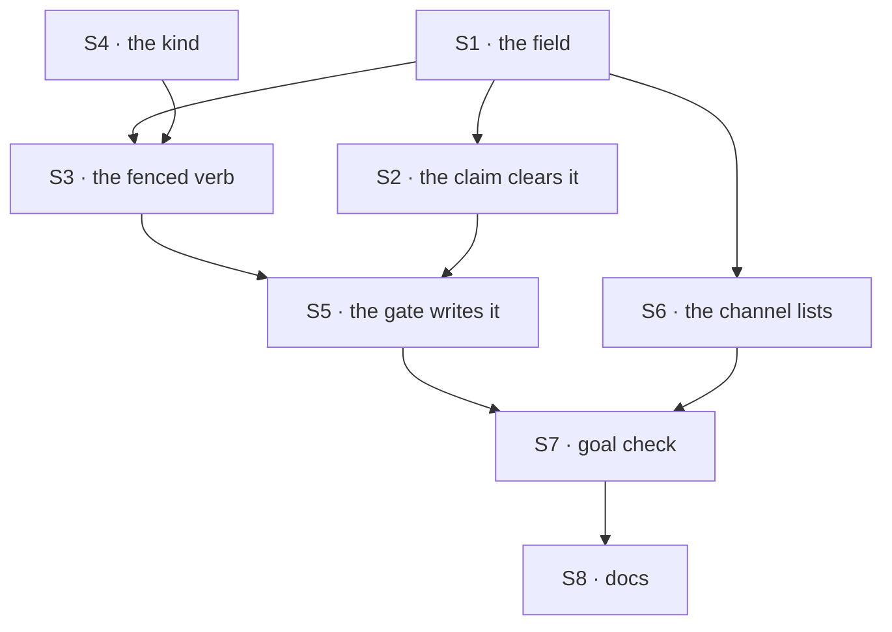

# FIX-1668 · Plan

[Spec](SPEC.md) · [Decisions](DECISIONS.md) · [Rules](BUSINESS-RULES.md) · **Plan** · [Docs](DOCS.md)

Written for the implementing agent. IDs cross-reference [BUSINESS-RULES.md](BUSINESS-RULES.md)
(BR-n) and [DECISIONS.md](DECISIONS.md) (D-n). `tdd`. One PR, from fresh `main` after this spec
merges. No dependency to wait on. FIX-1664's build waits on this PR.

## Surfaces

| ID | Package · role | Change | Rules |
|---|---|---|---|
| S1 | `orchestration` · the task schema | Add the optional `run` field (`sessionId`, `requestId`, `attempt`). Declared on the schema, not added by a backing, or the durable envelope strips it. Absent from `TaskInit` and every patch type | BR-9 BR-10 BR-14 |
| S2 | `orchestration` · the shared claim patch (`applyClaimToTask`) | Clear `run` in the claim write, unconditionally, beside `claimedBy`. The one convergence point for both backings' claims and recovery. Settlement and abandonment patches leave it alone (D3) | BR-8 BR-11 BR-12 BR-13 |
| S3 | `orchestration` · the collection ref | A new ticket-fenced verb that writes only `run` on an `in_progress` row, with renewal's guards (terminal, recreated row, lost claim), emitting `task-change` of kind `run_linked`. Both backings. Required on the interface | D1 BR-1 BR-5 |
| S4 | `orchestration` · the change kinds | Add `run_linked` to the kind union | BR-1 BR-15 |
| S5 | `orchestration` · the claim gate (`task-entry.ts`) | After every read arm and any lapse takeover, and **before** the claim ticket is put on state: write the link from `ctx.session.identity.id`, `ctx.request.identity.id` and the held row's `attempts`. Declined → `StaleTaskClaimError`. Thrown → propagate | D1 BR-1 to BR-7 |
| S6 | `workforce` · the two channel-board lists | Add `run` to the model list (`channelBoardRowSchema`) and the browser list (`CHANNEL_BOARD_CLIENT_FIELDS`). Reword both headers from "no execution coordinates" to "one: the run link, and why" | D2 BR-16 BR-17 |
| S7 | `goals/task-run-link/it-names-the-run-working-each-task/` | The goal check, its fixture tree and both controls | the goal |
| S8 | Docs | [DOCS.md](DOCS.md): four updates; changesets | — |

**Removed:** nothing. `claimedBy` and the devtool's topic match stay (see Follow-ups).

## Sequence



## Checks

| ID | Runs after | Passes when |
|---|---|---|
| V1 | S1 | A durable round trip keeps `run`; a legacy row without it parses and reads *no run linked* (BR-14). `TaskInit` and the patch types reject it at compile time and at runtime (BR-9 BR-10) |
| V2 | S2 | A claim clears a present link on both backings, including a recovery claim of a lapsed row; complete, fail, retry, cancel, park and abandonment settlement keep it (BR-11 to BR-13). Second path: a claim with no identity clears it too |
| V3 | S3 | The verb records on the holder, declines `terminal`, `not-my-task` and `lost-claim`, emits one `run_linked`, and throws on a missing ticket. Both backings (D1) |
| V4 | S5 | Gate tests beside the existing hand-off suite: link equals the run's session and request under per-task, per-worker and key seats (BR-1 BR-2); each refusal arm writes nothing (BR-4); a declined write stops the worker with `stale-task-claim` (BR-5); a throwing write stops it before the worker, and the row is **not** settled errored (BR-6); the lapse takeover path (BR-7); an inline board writes none (BR-8) |
| V5 | S6 | `readBoard` and the browser read both return `run`; the existing subset test in `cross-org-collection-read.test.ts` still passes; `claimedBy` is still absent from all three reads (BR-16 BR-17 BR-19) |
| V6 | S5 | The emitted `task-change` item carries `run` and not `claimedBy` (BR-15 BR-19), through the existing `toEmittedTask` path |
| VG | S7 | [The goal](SPEC.md#the-goal-and-how-well-know-its-met): `goals/task-run-link/it-names-the-run-working-each-task/run.mts` PASSES, after the same run FAILED under `GOAL_CONTROL=stamp-at-claim` and under `GOAL_CONTROL=server-only`, each at its named signal |

One check per decision: D1 is V3 and V4, D2 is V5 and V6, D3 is V2.

## Pinned names · the only two

| Where | Name | Why pinned |
|---|---|---|
| The task field | `run: { sessionId, requestId, attempt }` | Public. FIX-1664 reads it, and so will any UI |
| The change kind | `run_linked` | Public. A stream consumer switches on it |

Everything else, the verb included, is yours to name.

## Guardrails

| Rule | Because |
|---|---|
| The claim clears `run` in `applyClaimToTask`, and nowhere else clears it (tenet 5) | One convergence point for every claim on both backings and on recovery. A second clear site is how one path forgets |
| The gate writes the link before the claim ticket is on state | A thrown write must stop the attempt without the gate's rescue settling the row errored. With the ticket on state, the error recorder would fail a task over a store blip |
| The link comes from `ctx`, never from the dispatch envelope or the worker's input (BP-031) | The envelope is caller-shaped. The run's own context is the only trusted source of *where am I* |
| `run` is optional and read through one `== null` guard; no backfill (BP-030) | Old rows exist on durable boards, and nothing can reconstruct their run honestly |
| Don't add `run` to `SERVER_ONLY_TASK_FIELDS`, and don't move `claimedBy` off it | D2 publishes one coordinate; the other stays private for its own reasons |
| No Core or Engine change; no new status | The Architect's fence. If the gate turns out to lack an id it needs, raise it; don't reach down |

## Docs

Reconcile [DOCS.md](DOCS.md) against the shipped behaviour and publish it in this PR, through
`docs-writer` then `docs-editor`. Changesets: `minor` for `@flow-state-dev/orchestration` (a new
field, kind and required collection verb), `patch` for `@flow-state-dev/workforce` (two lists
widened).

## Sketch · pseudocode, illustrative, react to the shape

```
claim write (both backings, recovery too):
    row.run ← absent                                   (D3; beside claimedBy)

claim gate, in the run's session, after its read arms and any lapse takeover:
    ticket ← minted from the held row                  (as today)
    verdict ← board.<link verb>(row, { sessionId: ctx.session, requestId: ctx.request,
                                       attempt: held.attempts }, ticket)
    declined → stale claim, stop                       (D1)
    then:    ticket onto state, task scope, lease renewal, worker   (as today)
```

**POC:** none. The two premises the design rests on are in the code and its docs, not open
questions: the gate runs as the child's own action root, so its context carries the run's session
and request; and a handed-off row's `claimedBy` holds the claiming parent's session
(`task-board/hand-off.ts`, `docs/architecture/dispatched-work.md`). The goal check's
`stamp-at-claim` control re-proves the second at build time.

**Factual base:** the three places a channel board row is published (change stream, browser list,
model list) came from reading every use of the task schema and of `toEmittedTask` outside the
orchestration schema file. No checker ships with the spec; V5 and V6 cover all three by test.

## At implement time

- Re-read FIX-1664's merged spec for any name it assumed; the pins here win, and a conflict is
  raised, not picked.
- Confirm FIX-1662's App Lab reads a channel board through the browser read. If it reads another
  way, that read needs `run` too; raise it rather than adding a path here.
- Re-grep for new publishers of a task row since this was written (a new allowlist, a new
  `pick` of the task schema) and cover each in V5.
- FIX-1629 (devtool Tasks tab) is in review and touches the devtool's task mirror. If it lands
  first, check whether its accordion should show `run`; that is its call, not this PR's.

## Follow-ups

- **Retire or keep the devtool's topic match** between tasks and dispatch runs, now a recorded
  link exists. The Architect's open wall; raised to the epic coordinator.
- **Link inline attempts**, if a reader turns out to need it.
- **Stamp the task on the run** (the inverse direction), if a run view needs to find its task.
