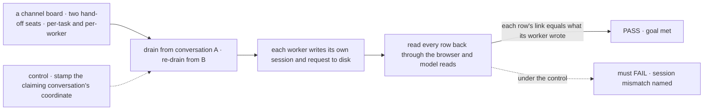
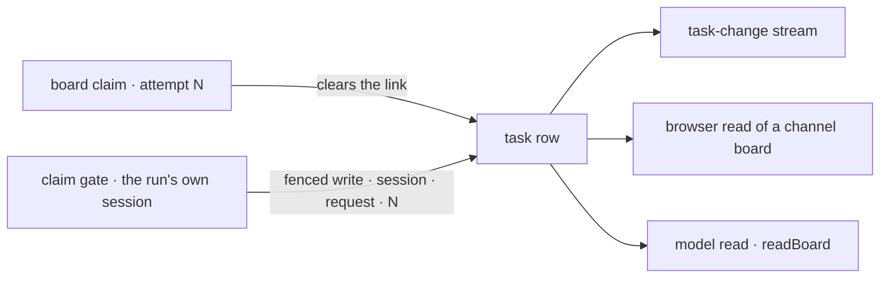

# FIX-1668 · Task board records which run is working each task (the task-run link)

**Spec** · [Decisions](DECISIONS.md) · [Rules](BUSINESS-RULES.md) · [Plan](PLAN.md) · [Docs](DOCS.md)

Feature · `@flow-state-dev/orchestration` (the field, the stamp) and `@flow-state-dev/workforce`
(two publication lists) · small · 1 PR · epic [FIX-1649](../../epics/FIX-1649/SPEC.md) (PR #2421) ·
unblocks [FIX-1664](../FIX-1664/SPEC.md) (App Lab task view), whose
[plan](../FIX-1664/PLAN.md#the-task-run-link) asked for it

## Five people, before and after

| Someone who… | Today | After |
|---|---|---|
| **opens a task in App Lab to watch it** | Nothing on the task says which run is working it. The run's session id can't be rebuilt from the task: it also depends on the conversation that drained the board | The task's row names its run: the session, the request and the attempt. App Lab opens exactly that |
| **drains the same board from a second conversation** | The second drain makes a run with the same display topic as the first, so a match by topic can pick the wrong one | Each row names the run that actually took it, whichever conversation drained it |
| **runs several tasks through one worker session** | Can't tell which request in that session was this task's | The row names the session and this task's own request |
| **looks at a task that finished, failed, or is waiting to retry** | n/a | The row still names the run of its last attempt, so they can see what happened. The next attempt's claim clears it, and that run's start replaces it |
| **reads a row stored before this ships** | n/a | Reads *no run linked*. Nothing breaks, nothing is guessed |

The run is the one thing that knows, for certain, which session it is in. A handed-off attempt
enters that session through the board's claim gate every time, so the gate writes it down.

## The goal, and how we'll know it's met

**Someone looking at a task on a board can open exactly the run working it, or the run that last
worked it, and never another task's run or a guess.**

| Is it the right goal? | |
|---|---|
| **The real need** | The issue: App Lab's task view *"has to open the exact run behind a task"*, and *"anything else that has to tie a task to its run gets the same answer instead of a guess"*. FIX-1664's build waits on it ([D1 there](../FIX-1664/DECISIONS.md)) |
| **Smaller, and rejected** | "The field exists on the task schema." Passes with the parent's session written in (which is what the claim's own coordinate already holds), or with the field stripped on the way to the browser, and App Lab still opens nothing |
| **Bigger, and not this issue's** | A history of every attempt's run, and a transcript read (issue scope, invent-kills). The task id stamped on the run itself (an open wall the Architect left). Retiring the devtool's topic match (FIX-1514's leftover, a follow-up) |
| **Not done if** | The link names the session of the conversation that drained the board rather than the run's · it reaches the server but not the reads App Lab uses · two tasks in one shared worker session name the same request · a second drain from another conversation leaves a row naming the first drain's run |



The check compares what a reader gets from the board with what each worker saw from inside its
own run, never with what the board says it did.

| How we verify | |
|---|---|
| **Goal check** | `goals/task-run-link/it-names-the-run-working-each-task/` · model n/a (model-free: a row is handed off, a run starts, or it doesn't) · run by the implementer at completion · verdict in the implementation PR |
| **Signal** | For every row: `run.sessionId` and `run.requestId` equal the ids the worker recorded from inside its run, and `run.attempt` equals the row's `attempts`, on the browser read, the model read and the last `task-change` item alike. Two tasks on the per-worker seat name one session and two different requests. A row drained from conversation B names B's run |
| **Input** | A file-declared channel with one board and two seats that hand off. Rename the team, channel or board, or swap which seat is per-worker, and a correct build still passes: the harness reads names off the tree |
| **Anti-game** | Proof is a file the worker writes from its own context, outside the board. No assertion on the board's report, on a unit-level collection, or on the ids the hand-off returned to the drain, which is a neighbour of the claim, not the claim |
| **Control that must fail** | `GOAL_CONTROL=stamp-at-claim`: the link is filled from the claiming conversation's coordinate. Must FAIL at *session equals the worker's*. `GOAL_CONTROL=server-only`: the field joins the server-only list. Must FAIL at *link present on the browser read*. Today's `main` fails every leg |

## What changes


Left is today: the only coordinate on the row is the claiming conversation's, and it never
leaves the server. Right is the link, written from inside the run and published wherever the row
already is.

**What a reader gets on the row:**

```diff
  { id: "task_7f2", status: "in_progress", attempts: 2, assignee: "coder",
+   run: { sessionId: "sess_run_91c…", requestId: "req_4ab…", attempt: 2 },
    … }
```

Nobody writes this field. It is absent from everything a caller or a model can set.

## How it reaches the reader



The gate already re-reads the row before the worker runs; it now writes one fenced field before
the worker's first step. A gate that can't write it stops the attempt the way a stale claim does.

## What stays as it is

- Core and Engine. The session's owner check: naming a session opens nothing a reader couldn't
  already open.
- `claimedBy` stays server-only and keeps its meaning (where the claim was made).
- Task statuses. A run link is not a status.
- Boards whose workers run inline. They get no link; their run is the drain itself.
- The devtool's topic match between tasks and runs. Retiring it is a follow-up.

## Sign off

**[The goal](#the-goal-and-how-well-know-its-met), at that size:** the exact run, on every read
App Lab uses, including re-drains and shared worker sessions. If wrong: App Lab ships a task view
that opens the right run only in the easy case.

1. **[D1](DECISIONS.md#d1) · The run writes its own link, as it starts, and an attempt that can't
   write it doesn't start.** If wrong: one more store write per handed-off attempt, and a store
   hiccup at that moment costs a retry.
2. **[D2](DECISIONS.md#d2) · The link is public wherever the row is: the change stream, the
   browser read and the model read.** If wrong: session and request ids of runs are visible to
   anyone, and any model, that can read the board.
3. **[D3](DECISIONS.md#d3) · The link outlives its attempt: kept when the task finishes, fails or
   waits to retry; cleared only by the next claim.** If wrong: a finished task's screen opens a
   run that is over, which is the intent, or readers mistake a past run for a live one.

**Open: none.** D2 is the one to weigh. Reasoning and what lost: [DECISIONS.md](DECISIONS.md).
The cases: [BUSINESS-RULES.md](BUSINESS-RULES.md).
