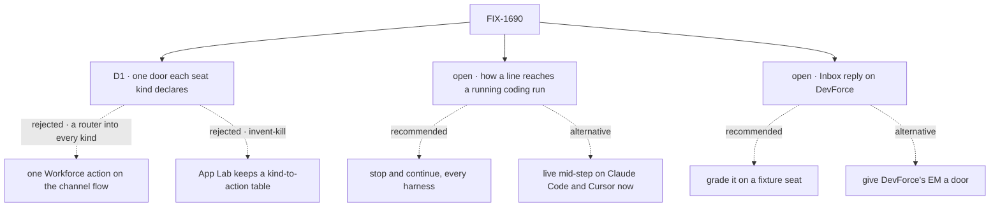

# FIX-1690 · Decisions

[Spec](SPEC.md) · **Decisions** · [Rules](BUSINESS-RULES.md) · [Plan](PLAN.md) · [Docs](DOCS.md) · [Evolution](EVOLUTION.md)

Two open forks and one decision are the sign-off surface. The epic's D1 to D3 and ER-1 to ER-15
([FIX-1649](../../epics/FIX-1649/DECISIONS.md)) bind this issue; ER-15's owner moves here from
FIX-1664 ([EVOLUTION.md](EVOLUTION.md)).

## The tree

Solid edges are what you're signing. Dashed edges lost, or are a fork's two answers.

## Open · Live delivery mid-step, or stop-and-continue for every harness first?

**In plain terms.** A coding run works in long stretches. To hear a person mid-run, either the
harness takes the line while it works, or we stop the run and continue its session with the line
as the next prompt. Claude Code's SDK can take a line mid-run (`streamInput`); Cursor's local
runtime can on runs that offer `steer`, and may hand it back as *send it next instead*; Codex
can't: one prompt per turn. Stop-and-continue works on all three today, because all three already
resume a session by id, and it is the fallback live delivery would need anyway.

**The trade-off.** Live delivery keeps the step the run is on; stop-and-continue cuts that step
and costs a restart of a few seconds. Live delivery also needs a second generic hook in Core and
Engine (a turn handed to a running request, across processes, like abort), a change to Claude
Code's main loop, and a Cursor change: about two more PRs, and the closure waits on them.

**Recommendation: stop-and-continue now, for every harness.** Live delivery is filed as a
follow-up that plugs into the same door, so nothing here is thrown away and no composer changes
when it lands.

**What would change my mind:** you treat losing the current step as unacceptable for the design's
main control, or the closure's real-model a4 shows the restart confuses the model.

**If wrong:** runs restart on every message until the follow-up lands; a person sees a brief stop
each time. Choosing live now when stop-and-continue was enough costs two PRs and a riskier change
to the Claude Code harness before the closure can run.

It comes down to the fallback: live delivery needs stop-and-continue anyway, and only covers two harnesses.

## Open · DevForce's only asking worker takes no message: grade Inbox's reply elsewhere, or give DevForce's EM a door?

**In plain terms.** Inbox's reply goes into the asking worker's session, through that worker's
door. In DevForce the only worker that asks is the EM, a scripted kind with no model: it files
work and asks before filing, and nothing in it could read a message. So on DevForce the reply box
can only say *"this worker takes no message"*. The closure's Part 4 expects a reply to land as a
turn in the asking seat's session, which can't pass there as written.

**The trade-off.** Grading the reply on a fixture seat that takes messages proves the path in
this issue's own check and keeps DevForce honest, but the owner won't see a working reply in
DevForce itself. Giving the EM a door makes the closure pass as written, with a door that stores
a line nothing ever reads: the person is told the EM heard them.

**Recommendation: grade it on a fixture seat**, in this issue's goal check, and amend FIX-1663's
Part 4 run line to *"the reply is disabled with its line where the asking kind has no door, and
lands as a turn where it has one (this issue's check)"*.

**What would change my mind:** DevForce's EM is meant to converse. Then it needs a model and a
real door, which is DevForce product work, not a scripted stub.

**If wrong:** DevForce's Inbox shows a disabled reply until its EM learns to talk. Choosing the
stub door instead ships a reply that is *delivered* and never read, the dishonesty ER-15 exists
to prevent.

It comes down to honesty: a door on the scripted EM would say *delivered* to a worker that can't read.

## D1 · One door: each seat kind declares the public action that takes a person's message, and all three composers call it into the session they target

| | |
|---|---|
| **Instead of** | One Workforce action on the channel flow that takes a seat, a task or an ask and resolves the target itself · App Lab keeping a table from kind to action, as kitchen-sink's `SEAT_ASKS` does |
| **Because** | What a turn *does* is the target kind's to say: a conversation takes it as its next turn, a coding run has to stop and continue. A channel action would still dispatch into each kind's own action and add a router in front of it, and an Inbox ask or a task run isn't a channel's to route. A table in App Lab names Lab kinds, which App Lab never does, and folding `SEAT_ASKS` into a package is an invent-kill. Core already marks the action a person's message enters through: `userMessage` on an action writes the line into the session as a user item before the block runs. So the door is **the kind's one public action that declares `userMessage` and takes `{ message }`**, Workforce publishes it per seat in the inventory, and App Lab calls it on the target session. Workforce's policy, Core's existing hook (tenet 2: no new mechanism beside the one that exists) |
| **Locks in** | A kind takes messages by declaring one such action; two is a hire problem, none means the composers say so. The built-in agent kind's `run` is its door unchanged. The harness manager ships a door for coding kinds. The only Core and Engine addition is generic: a block may stop another running request in its own session, under the abort route's rules |

It comes down to who knows what a turn means: only the target's kind does, so the kind declares the door.

**What would change my mind:** a second consumer that must send a turn without knowing the target
session. Then a Workforce action that resolves it server-side earns its place in front of the doors.

## Decided, not asked

- **`@worker` addresses the worker's current task run in this workstream**, as the design's
  *"sent into PAY-14"* line says: its rows on the channel's boards that are running, parked, or
  waiting with a linked run. One → that run. Several → the composer asks which, naming each task.
  None → Send is disabled: *"coder has no task in this workstream to message."* A seat's own
  conversation outside a task is not a target in this issue.
- **Delivered means the session says so**: the door's request completed and the target session
  holds its user item. A refused door leaves the line in the session with the refusal after it,
  and the composer keeps the draft with the reason.
- **A turn never spends the task's retry budget.** The budget prices failures, not conversation;
  a person who writes three times must not make the run fail sooner. This needs the board to
  re-queue a row parked for a turn without charging the next claim: a small `orchestration`
  change.
- **A turn to a row that is parked on its own question, or pending with a linked run**, is kept
  in the session and folded into the next attempt. It does not unpark a question.
- **Turns get their own collection (S4) rather than being read back from session history.** The
  next attempt may run in another session than the one the line landed in; retention evicts old
  requests; and a refused door leaves a user item too, so history can't tell a kept turn from a
  refused one. The harness manager's `inbox/` keeps answers the same way.
- **The door checks the run's owner** as the harness manager's `answer` does: the person must be
  the run's principal (BP-031).
- **A harness that can't resume** (the cloud `claude-code/cli-remote` door reports only
  *dispatched*) takes no turn; the door refuses and the composer says why.
- ***Also post to the workstream* stays a named gap**: a door send plus a channel post is two
  writes, and composing them is FIX-1474's.
- **The stream shows a sent `@worker` line as a receipt** (*sent into PAY-14*, linked) while the
  page is open. The line itself lives in the run's Session.

## Considered and dropped

| Alternative | Why not |
|---|---|
| Implement Core's reserved `restart` concurrency policy for the door | It aborts the running request before the door runs, so the run can't tell a person's turn from an Interrupt, and there is nowhere to keep the line first |
| The running attempt polls a harness-manager collection for turns | A request that is busy awaiting its harness would need its own timer over a resource the registry caches per request; the engine already delivers abort across processes |
| App Lab calls the abort route, then the door | Two client calls, a race between them, and not one operation (ER-15) |
| Charge the turn like an answered question is charged today | A chatty person exhausts the retry budget. The answer path's charge is flagged as a follow-up, not copied |
| Treat `@worker` as a channel post that wakes the seat | The Architect's invent-kill: a channel peer post hoping fan-out looks like a turn |

## How it got here

- **Draft**: framed as the operation FIX-1664's open fork left unfiled; one door per seat kind
  over Core's existing `userMessage`; a running coding run reached by stop-and-continue through
  one generic stop hook; four PRs.
- **Review round 1** (Cursor): S3 cut to wiring over the existing `unpark`; S4 kept with its
  reason recorded; `seat-door` folded into `lab`, three PRs.

**Open: two** — [live delivery](#open-live) and [Inbox's reply on DevForce](#open-inbox).
