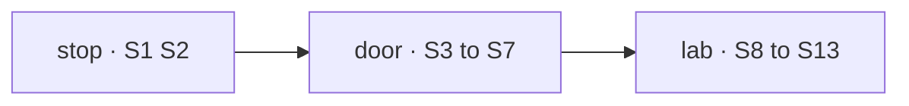

# FIX-1690 · Plan

[Spec](SPEC.md) · [Decisions](DECISIONS.md) · [Rules](BUSINESS-RULES.md) · **Plan** · [Docs](DOCS.md) · [Evolution](EVOLUTION.md)

Written for the implementing agent. IDs cross-reference [BUSINESS-RULES.md](BUSINESS-RULES.md)
(BR-n), [DECISIONS.md](DECISIONS.md) (D-n) and the epic's rules (ER-n). `tdd`. Four PRs. Built
on FIX-1662 (shift-manager frame), FIX-1664 (task screen) and FIX-1668 (the task-run link, the row's
`run` field), all on `main`. This plan is written for the recommended answer to both forks; if
[the first](DECISIONS.md#open-live) goes the other way, add the follow-up's PR before `lab`.

## Surfaces

| ID | Where | What | Traces to |
|---|---|---|---|
| S1 | `@flow-state-dev/core` · the stop hook's type | A block may stop another running request **in its own session**, by request id. Returns *stopped*, *already finished*, or *not in this session*. Generic: no Workforce, task or harness word | D1 BR-7 BR-11 |
| S2 | `@flow-state-dev/engine` · the stop hook | Implements S1 with the abort route's own path: the fenced `abortRequested` write on an `in_progress` record, the in-process controller fired when local, the heartbeat pickup when not. Refuses a request of another session or tenant. Shares one helper with the route rather than copying its checks | D1 BR-7 BR-11 · failure taxonomy |
| S3 | `@flow-state-dev/orchestration` · a turn's re-entry is not a retry | Wiring over what exists: a park-for-turn reason, then the existing `unpark` and drain, which already spare `maxTotalRetries`. The one addition is a discount term in `shouldRetryOnFail` beside `readAbandonments`, counting re-entries after a turn, because every claim still adds to `attempts`. Recoveries and failures charge exactly as today | BR-9 |
| S4 | `@flow-state-dev/harness-manager` · the turn record | A durable, create-only collection of person turns keyed by issue, phase and the attempt they're for, owner-scoped like the inbox. Written by the door, read by the next attempt's prompt, never deleted by a replay | BR-7 BR-8 BR-10 BR-12 BR-13 |
| S5 | `@flow-state-dev/harness-manager` · the door | A public action block, exported for a coding kind to declare: `{ message }` in, `userMessage` declared. Reads its task from the run session, checks the row and the owner (BR-5, BR-6, BR-14 to BR-16), keeps the turn (S4), stops the running attempt (S1) when `in_progress`, then re-queues it (S3) and drains so the next attempt runs. Returns what it did: *continuing*, *kept for the next attempt*, or a named refusal | D1 BR-3 to BR-17 |
| S6 | `@flow-state-dev/harness-manager` · the attempt | On a stop with an untaken turn, park *for a person's turn* instead of failing. On the next attempt, the prompt is the kept turns (oldest first, marked as the person's), resumed through the existing `resume` feed. Separate channel from `feedback` and from `answers`, for the reason those two are already separate | BR-7 BR-8 BR-10 BR-17 |
| S7 | `goals/harness-manager/a-persons-turn-continues-its-session/` | Real Claude Code, modelled on `answered-run-continues-its-session`: attempt 1 is given a fact to hold and told to wait; a person's turn says *write down what you were given*; attempt 2's prompt never contains the fact. Signals: same session id, the fact file in the checkout, retry standing unchanged | BR-8 BR-9 |
| S8 | `@flow-state-dev/workforce` · the seat's door | At hire, find the kind's one public action with `userMessage` and a `{ message }` input; publish it on the seat's inventory row (`null` when none, a problem when two). Browser-safe read of it. The built-in agent kind needs no change | D1 BR-1 BR-2 |
| S9 | `goals/devteam-lab/lab/` · the coder kind | Declares the harness manager's door as its `message` action (the SPEC's diff). The EM kind gains nothing ([the second fork](DECISIONS.md#open-inbox)) | BR-18 BR-22 |
| S10 | `labs/shift-manager` · the send | One call site every composer uses: the target session, its flow (from the session's `flowId`), the door from the inventory, the draft. It owns *sending → delivered* per BR-4 by watching the target session for the door request's user item, never the HTTP answer alone | BR-3 BR-4 BR-5 ER-15 |
| S11 | `labs/shift-manager` · the three composers | Task composer (BR-18), `@worker` with its picker and receipt (BR-19, BR-20), Inbox's reply box (BR-21, BR-22). *Also post* stays disabled (BR-23). The gap registry loses `task.composer` and `addressWorker`, gains BR-14 to BR-16 and BR-22's lines | BR-18 to BR-23 |
| S12 | `goals/shift-manager/it-sends-a-turn-into-a-seat-session/` | The goal check, both controls, and a fixture tree under it with one scripted seat whose kind has a door and raises an ask ([at implement time](#at-implement-time)) | the goal |
| S13 | Docs | [DOCS.md](DOCS.md) | ER-14 |

**Removed:** shift-manager's two gap lines for the composer and `@worker`; FIX-1664's registry row for
the composer; nothing in a package.

## Sequence



| PR | Deliverables | Depends on |
|---|---|---|
| `stop` | S1, S2, with the engine's abort tests extended to the hook | — |
| `door` | S3 to S7, the harness manager's README and docs page | `stop` |
| `lab` | S8 to S13, workforce README and inventory page, shift-manager's README | `door` |

The three run in order. FIX-1663's closure run waits on `lab`.

## Checks

| ID | Covers | Check |
|---|---|---|
| V1 | S1 S2 | Stop from a block: a running request in the same session reads `aborted` and its signal fires, in process and through the heartbeat on a second process; one in another session or tenant is refused as *not in this session*; a terminal one returns *already finished*. Negative: remove the session fence and the cross-session case must fail |
| V2 | S3 | A row parked for a turn, unparked and re-claimed keeps its retry standing (`attempts` minus discounted re-entries) and leaves `maxTotalRetries` untouched; a failure after it charges one; a recovery still counts an abandonment (BR-9). Negative: drop the discount term and a row at `maxAttempts - 1` must fail on the re-claim |
| V3 | S4 to S6 | With the stub harness: a turn to an `in_progress` row stops it, parks it for a turn, re-queues it, and the next attempt's prompt holds the turn and its resume id is the previous session id (BR-7, BR-8). Two turns, one stop (BR-10). The race of BR-11, both outcomes. Parked-on-question, pending-with-link, pending-without, settled, cli-remote and foreign-owner rows each give their rule (BR-12 to BR-16, BR-6). Interrupt and turn together (BR-17) |
| V4 | S7 | The real-model goal: same session id, the fact file, retry standing unchanged. The fact never appears in attempt 2's prompt |
| V5 | S8 | Agent kind publishes `run`; a kind with none publishes `null`; a kind with two is a named problem (BR-1, BR-2) |
| V6 | S10 S11 | *Delivered* only after the session holds the item (BR-4); refusal keeps the draft (BR-5); `@worker` with one, several and no live task (BR-19); Inbox reply enabled and disabled (BR-21, BR-22) |
| V7 | S10 S11 | Static: no session-item write in `labs/shift-manager/src`; no Lab kind or action name in it; every send goes through S10 |
| V8 | S12 | The goal check, its two controls failing at their named signals |

## Pinned names

| Name | Value | Why pinned |
|---|---|---|
| The door's input | `{ message: string }` | shift-manager builds it without knowing the kind; the agent kind's `run` already takes it |
| DevTeam's door action | `message` | The Lab's README names it |
| Goal checks | `goals/shift-manager/it-sends-a-turn-into-a-seat-session/`, `goals/harness-manager/a-persons-turn-continues-its-session/` | FIX-1663 cites the first |
| Controls | `GOAL_CONTROL=optimistic-turn`, `GOAL_CONTROL=fresh-session` | The closure maps them onto a4 |

## Guardrails

- **The stop hook is the convergence point for stopping a request from code.** The abort route
  and S2 share one fenced write; neither re-implements the incarnation fence or the terminal
  check, because a second copy is how one of them learns to overwrite a finished request. For
  implementers: the abort route stops a request a client names; the stop hook stops one a block
  names from inside the same session. Same write, two callers.
- **The door is the only writer of a person's turn.** Every composer reaches it through S10;
  nothing in shift-manager, the channel or the manager writes a user item another way (ER-15). V7 is
  its static half.
- **Turns, answers and feedback stay three channels.** A turn is not an answer (it never unparks
  a question) and not feedback (it never says the last attempt failed); each prompt section says
  which it is, because a model told *"your last attempt stopped because: fix the tests"* reads a
  person's instruction as a failure.
- **The door decides from server state only** (BP-031): the task comes from the run session the
  request arrived in, the row from the board, the owner from the principal. Nothing in `{ message }`
  picks a run.
- **Keep the line before the stop.** The turn is durable before the running attempt is told to
  stop, so a crash between the two leaves a kept turn and a running attempt, never a stopped
  attempt with nothing to continue with.
- **Nothing Workforce-shaped enters Core or Engine** (ER-7): S1 speaks of requests and sessions.

## Docs

[DOCS.md](DOCS.md) holds the draft: the harness manager's docs page and README gain *Talking to a
run*; the Workforce inventory page and README gain the door; Core's action docs gain the stop
hook; shift-manager's README replaces its composer sentences. Changesets: `core`, `engine`,
`orchestration`, `harness-manager`, `workforce` (minor). Labs and goals get none.

## Sketch · pseudocode, illustrative, react to the shape

```text
door(message, ctx):                       # public action on a coding kind, userMessage declared
  task  = the task this run session is for          # from the manager's own run state
  row   = the board's row for task
  refuse unless the caller is the run's principal   # BR-6
  refuse if row is settled / never started / harness can't resume
  keep turn(task, row.attempts, message)            # durable first
  if row is in_progress:
    r = stop(row.run.request)                       # the generic hook, same session
    if r is already-finished: re-read row; refuse or keep (BR-11)
    wait until the attempt has parked for a turn    # bounded
    requeue without charging; drain
  return continuing | kept-for-next-attempt

attempt(on stop):
  if an untaken turn exists: park "for a person's turn"; return   # not a failure
next attempt prompt:
  resume = previous coding session id
  prompt = the kept turns, marked as the person's words
```

**POC:** none. The premise it would test (every harness resumes by id) is already proved by
`goals/harness-manager/answered-run-continues-its-session/` on Claude Code, and by the Codex and
Cursor harnesses' own `resume` feeds.

## At implement time

- **Who drains after the re-queue.** On a handed-off board the drain that dispatched the
  attempt may still be waiting on it, or may have exited (park-exit). Read which, and let the door
  drain only when no drain is waiting; two drains of one row is the failure to avoid.
- **How long the door waits for the park.** Bounded, and a timeout is a refusal the person sees,
  never a silent *delivered*.
- **The fixture seat for S12.** A scripted kind under the check's own folder, with an ask that
  suspends and a door whose step answers with the line it took, so the reply is heard, not just
  stored. It is a test fixture, not a Lab, and shift-manager names nothing in it.
- **Where the attempt learns it was stopped for a turn.** Reading the turn record on the abort
  is enough; if the rescue path can't read it, say so before inventing a reason field on the
  request.

## Follow-ups

- **Live delivery mid-step** on Claude Code (`streamInput`) and Cursor (`steer`, with its
  *send it next instead* answer), falling back to this issue's stop-and-continue. Needs a second
  generic hook: a turn handed to a running request, delivered across processes like abort.
  Filed only if [the first fork](DECISIONS.md#open-live) goes the recommended way.
- **An answered question charges an attempt today.** It probably shouldn't, for BR-9's reason.
  Not changed here.
- **Spec bulk.** The figures repeat their CSS, *Decided, not asked* overlaps BR rows, and BR-12
  to BR-16 would read better as one state matrix. Left as is here; not restyled.
- **A seat's own conversation as an `@worker` target**, for kinds that talk outside tasks.
- **FIX-1663's Part 4 and a4 wording**, amended per [the second fork](DECISIONS.md#open-inbox)
  and to read *"`eng.coder`'s running task session"* for a4's target.

## Notes from review

- **Round 1 (Cursor, simplify).** S3 shrank to wiring: `unpark` already spares the board budget,
  so only the per-task discount is new. S4 stays; why is now in
  [Decided, not asked](DECISIONS.md#decided-not-asked). `seat-door` folded into `lab`: three PRs.
  D1 agreed. The stop-hook-versus-abort sentence went into Guardrails. Spec bulk noted as a
  follow-up.
