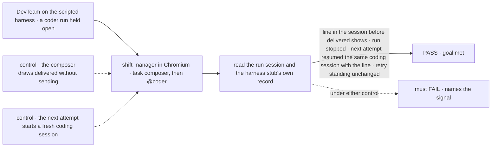
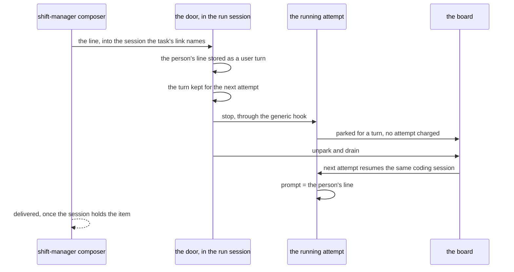

# FIX-1690 · A person can't send a message into a worker's session from shift-manager

**Spec** · [Decisions](DECISIONS.md) · [Rules](BUSINESS-RULES.md) · [Plan](PLAN.md) · [Docs](DOCS.md) · [Evolution](EVOLUTION.md)

Feature · `@flow-state-dev/core` and `engine` (one generic hook), `harness-manager`,
`orchestration`, `workforce`, private `labs/shift-manager` and `goals/devteam-lab` · large · 3 PRs ·
epic [FIX-1649](../../epics/FIX-1649/SPEC.md) · blocks [FIX-1663](../FIX-1663/SPEC.md) a4 and
Part 4's one-write-path row · answers [FIX-1664's open fork](../FIX-1664/DECISIONS.md#open)

## Five people, before and after

| Someone who… | Today | After |
|---|---|---|
| **types `@coder …` in a workstream's composer** | Send is disabled: *"Addressing one worker with @ isn't built yet"* | The line goes into the coder's current task run in this workstream. The stream shows *delivered* once that run's session holds it, and the run's next step starts from it |
| **types in a task's composer while its run works** | The composer is disabled | The run stops where it is, and continues **the same coding session** with the person's words as its next prompt. Its edits on disk and the harness's memory of the conversation both carry over |
| **replies from an Inbox item** | Approve or Reject only | A reply box sends into the asking worker's session, through the same door. Where that worker's kind takes no message (DevTeam's EM), the box says so and sends nothing ([the second fork](DECISIONS.md#open-inbox)) |
| **talks to a worker that is between attempts, or parked on its own question** | n/a | The line is kept in the run's session and handed to its next attempt. It never answers the question for it; answering stays the ask's own path |
| **talks to a task that has finished** | n/a | Send is disabled with a line: a finished task takes no message. Reopening one is FIX-1651's |

## The goal, and how we'll know it's met

**A person's line, from any of shift-manager's three composers, arrives as a turn in the session of
the worker it addresses, including a coding run that is working right now, and the run acts on
it; the app shows it as delivered only once that session holds it.**

| Is it the right goal? | |
|---|---|
| **The real need** | The issue's *Done when*: *"a shipped operation delivers a person's line into a seat's session, and the stream shows it as delivered only when the session says so. The workstream `@worker`, the task composer and Inbox's reply all go through that one operation."* The epic's leg a: *"a message to `@worker` in a workstream's composer arrives in that worker's session as a turn"* |
| **Smaller, and rejected** | "The line is stored in the session." A door that writes the item and never reaches the harness passes it, and a person is told a run heard them when it didn't. So the check also reads what the next attempt was prompted with |
| **Short of the need, and asked** | **Live delivery mid-step.** This goal reaches a running coding run by stopping it and continuing its session, on all three harnesses. Hearing a line without stopping is possible on Claude Code and Cursor only. Whether to build that now is [the first fork](DECISIONS.md#open-live) |
| **Bigger, and not this issue's** | Answering an ask (FIX-1671) · filing work with a notify (FIX-1474) · a seat's own conversation outside a task · reopening a finished task (FIX-1651) · Inbox listing a coding run's questions (FIX-1652) |
| **Not done if** | A composer draws *delivered* before the target session holds the line · the next attempt starts a fresh coding session instead of continuing the old one · the next attempt's prompt lacks the line · a turn spends the task's retry budget · shift-manager writes a session item or names a Lab's kind · a turn reaches a run the person can't reach |



The check reads the store and what the stub harness was handed, never shift-manager's own state.

| How we verify | |
|---|---|
| **Goal check** | `goals/shift-manager/it-sends-a-turn-into-a-seat-session/` · model n/a (the scripted stub, held open until stopped) · real Chromium · run by the implementer at completion · verdict in the last implementation PR. The real-model half is FIX-1663's a4 |
| **Signal** | A fresh token, typed in the task composer and then as `@coder <token>` in the feature workstream: (1) the run session named by the task's link holds a user message item with the token, and the composer shows *delivered* only after it does; (2) the running attempt's request reads `aborted`; (3) the stub records a next attempt whose prompt contains the token and whose resume id equals the previous attempt's coding session id; (4) the row's retry standing (`attempts` minus discounted re-entries) is unchanged by the turn. Inbox: on the fixture seat, a reply's token is in the ask's session; on DevTeam's EM ask, the box is disabled with its line |
| **Input** | `goals/devteam-lab/lab/` on its scripted stub with one coder row held running; a second row on the same coder for the picker; a fixture seat whose kind takes messages and asks, under the check's own folder |
| **Anti-game** | No assertion on shift-manager state or a mocked server. The resume id and prompt come from the stub's own record on disk, not from the manager's |
| **Control that must fail** | `GOAL_CONTROL=optimistic-turn`: the composer draws *delivered* without calling the door. Must FAIL at (1). `GOAL_CONTROL=fresh-session`: the manager's resume feed returns nothing on a turn attempt. Must FAIL at (3), naming the resume id. Today's `main` fails everything |

## What changes


Three composers, one door. Each picks which session it means; the session's own kind decides
what a turn does there.

What a Lab author writes, on a kind whose rows run coding work:

```diff
  return defineFlow({
    kind: CODER_KIND,
    actions: {
      [DRAIN_ENTRY]: { block: board.drain },
+     message: manager.messageDoor,   // declares userMessage; the seat's door
    },
    task: { actions: { [WORK_ENTRY]: { block: manager } } },
  });
```

The built-in agent kind needs no line: its `run` already is its door.

## How a line reaches a running coding run



The ask path already runs this shape backwards: a run parks on its own question, a person's
answer unparks it, and the next attempt resumes its session with the answer folded in. A turn
is the same trip, started by the person.

## What stays as it is

- **The ask.** Approve, Reject and a coding run's question keep their own paths (FIX-1671, the
  harness manager's `answer`). A turn never answers one.
- **Every harness package.** Claude Code, Codex and Cursor already resume a session by id; none
  changes in this issue.
- **Core and Engine carry no Workforce word.** The one addition is a block stopping another
  request in its own session, the abort route's rule reached from code.
- **The channel.** `@worker` posts nothing to the channel's transcript; the line lives in the
  run it went to.
- **Interrupt** stays FIX-1664's, unchanged.

## Sign off

**[The goal](#the-goal-and-how-well-know-its-met), at that size:** every composer reaches the
session it names, a running coding run included, by stop-and-continue. If wrong: a person is
told a run heard them when it didn't, which is the one thing ER-15 forbids.

**Open: two. The first is the one to weigh.**

1. **[Live delivery mid-step, or stop-and-continue for every harness first?](DECISIONS.md#open-live)**
   Recommended: stop-and-continue now, on all three harnesses; live delivery on Claude Code and
   Cursor as a follow-up that reuses this door.
2. **[DevTeam's only asking worker takes no message: grade Inbox's reply elsewhere, or give
   DevTeam's EM a door?](DECISIONS.md#open-inbox)** Recommended: grade it on a fixture seat that
   takes messages, and amend the closure's Part 4 run line to match.

3. **[D1](DECISIONS.md#d1) · One door: each seat kind declares the public action that takes a
   person's message, and all three composers call it into the session they target.** If wrong:
   a kind author learns one more convention, and a kind with two such actions fails its hire.

Reasoning and what lost: [DECISIONS.md](DECISIONS.md). The cases:
[BUSINESS-RULES.md](BUSINESS-RULES.md).
