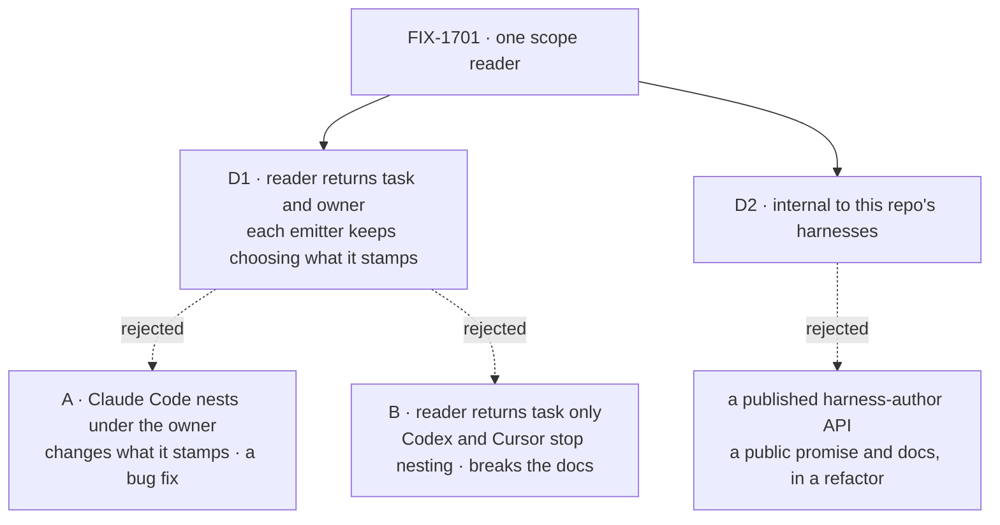

# FIX-1701 · Decisions

[Spec](SPEC.md) · **Decisions** · [Rules](BUSINESS-RULES.md) · [Plan](PLAN.md) · [Docs](DOCS.md)

Two decisions are the sign-off surface. Everything else here is context for them.

## The tree

Solid edges are what you're signing. Dashed edges lost, and the label says why.

## D1 · The reader returns the task id and the owner; each emitter keeps deciding which it stamps. Claude Code's missing container nesting is a separate bug

| | |
|---|---|
| **Instead of** | **(A)** Claude Code also stamps the runtime owner on its top-level items, as Codex and Cursor do. **(B)** The reader returns the task id only, and Codex and Cursor stop stamping the owner |
| **Because** | Both A and B change what a harness stamps, and this desk refactors only. They are also not equal: the documented contract (`docs/architecture/streaming.md` → "Container Ownership", `apps/docs/docs/streaming/emitting-items.md`) says every item inside a container carries its owner. Codex and Cursor keep that promise; Claude Code's top-level items break it. So A is a bug fix, and B would break a documented promise in two packages to match the one that breaks it. Neither belongs in a behaviour-preserving extract |
| **Locks in** | Until the bug ships, a Claude Code run inside a container shows its top-level steps outside that container. The characterization pins today's divergence by name, so the bug fix flips one assertion in one package and the reader itself does not change |

It comes down to what gets stamped: the chosen option changes nothing, and each alternative changes a harness.

**What would change my mind:** the product owner wanting the Claude Code nesting fixed in the
same change. Then this stops being a refactor; it moves to a bug-fix desk with a test that runs
Claude Code inside a real owned container.

## D2 · The reader is internal to this repo's harnesses, not a published harness-author API

| | |
|---|---|
| **Instead of** | Publishing it as the documented way any harness author reads task scope |
| **Because** | The field it reads is itself marked internal on the block context. Publishing a reader over an internal field promises a stable shape we have not promised for the field, and adds reader-facing docs and a release note to a change whose whole point is that nothing changes |
| **Locks in** | A harness written outside this repo keeps reading the runtime field by hand. Publishing later is additive: drop the internal marker, add a README line and a release note |

It comes down to the promise: publishing commits us to a shape over a field we never made public.

## Decided, not asked

- **Placement: core, in the module that types the runtime identity** (`types/block.ts`, beside
  `_blockIdentity`), exported through `@flow-state-dev/core/types` like `asRuntime`. Not
  Workforce, orchestration, a lab, or a new package (the architect's brief; core is the one
  layer all three harnesses already import).
- **Name: `itemScope(ctx)` returning `{ taskId?, ownedBy? }`**, a key present only when the
  identity carries it. That is Codex and Cursor's exact rule today, so their call sites spread
  it unchanged.
- **Presence means `!== undefined`, never truthiness.** All three copies test that today; a
  truthiness test would drop an empty string the runtime might hand over.
- **Core's own emit sites are not converted.** They write `ownedBy: undefined` as a present
  key; converting them would change object shape in memory and widen the refactor past the
  issue's three emitters. Flagged in [PLAN → Follow-ups](PLAN.md#follow-ups).
- **The item `taskId` is not the task-run link (FIX-1668).** The reader reads the item's
  task scope only; it knows nothing of sessions, requests or attempts.
- **Characterization first, in its own commit, green on today's code.** See
  [PLAN → Checks](PLAN.md#checks) V0.

## Considered and dropped

| Alternative | Why not |
|---|---|
| A reader that returns task id only, with Codex and Cursor reading the owner themselves | Leaves two of three emitters still reading the runtime field by hand, which is the drift the issue exists to end |
| A reader that takes a "stamp owner?" flag | Moves Claude Code's divergence into the shared reader, where the next harness inherits a knob instead of a decision. The emitter's own call site is the honest place for it |
| Also extracting provenance derivation, which is copied three times too | Real, but not this issue. A separate deepening, flagged in the plan |
| Merging POC #2534 | It was Claude Code-only, folded into #2531, and closed unmerged. Main's `itemFields` is its shape; this issue builds on it |

## How it got here

- **Draft** — framed as a behaviour-preserving extract of three scope copies into one core
  reader; the owner question scoped out to a Claude Code bug because the docs make it one;
  one PR, characterization first.

**Open: none.**
