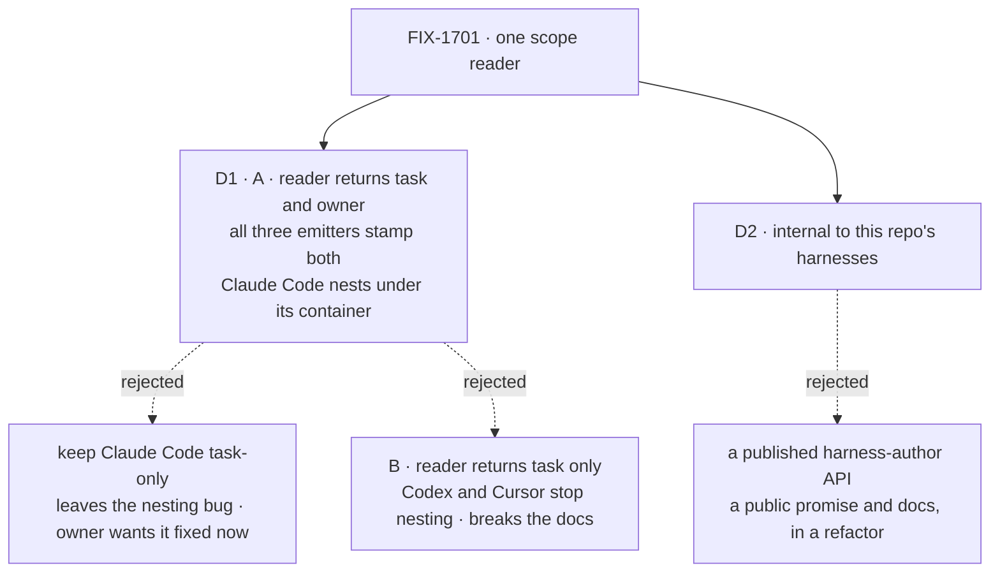

# FIX-1701 · Decisions

[Spec](SPEC.md) · **Decisions** · [Rules](BUSINESS-RULES.md) · [Plan](PLAN.md) · [Docs](DOCS.md)

Two decisions are the sign-off surface. Everything else here is context for them.

## The tree

Solid edges are what you're signing. Dashed edges lost, and the label says why.

## D1 · The reader returns the task id and the owner, and all three emitters stamp both, so Claude Code's top-level items now nest under their owning container

**The owner chose A** ([comment](https://github.com/fixpoint-labs/flow-state-dev/pull/2549#issuecomment-5923400136):
*"The Claude bug fix should happen as part of this change or before. Then seems like A would be
best."*). It ships **in this same change**, one implementation PR, as its own step after the
characterization.

| | |
|---|---|
| **Instead of** | **(Draft choice)** Claude Code keeps stamping the task only and the nesting bug ships separately. **(B)** The reader returns the task id only, and Codex and Cursor stop stamping the owner |
| **Because** | The documented contract (`docs/architecture/streaming.md` → "Container Ownership", `apps/docs/docs/streaming/emitting-items.md`) says every item inside a container carries its owner. Codex and Cursor keep that promise; Claude Code's top-level items break it. A brings Claude Code into line. B would break the promise in two packages to match the one that breaks it, so it stays rejected. The draft choice kept the refactor pure, at the price of leaving the bug open; the owner priced that differently |
| **Locks in** | Claude Code runs inside a container show their top-level steps inside it. The reader still decides nothing: Claude Code's call site lets a sub-agent's own owner win for items inside that sub-agent, and takes the runtime owner for everything else. The change is no longer behaviour-preserving for Claude Code, so it carries a patch changeset |

![D1: who decides which owner a Claude Code item gets. Chosen: A, all three emitters stamp the runtime owner, Claude Code nests under its container. Instead of: keeping Claude Code task-only and fixing the bug later, or B, the reader returns the task only. It comes down to Claude Code in a container: A nests it now; the draft choice leaves it outside until a later fix; B puts all three outside. Locks in: one behaviour change, isolated in its own step with its own test. Flips if: the owned-container test shows the nesting breaks a renderer](figures/d1-owner.svg)

It comes down to Claude Code in a container: A nests it now, and both alternatives leave it outside.

**What would change my mind:** the owned-container test showing that nesting Claude Code's
top-level items hides something a reader relies on (a renderer that suppresses owned items it
should not). Then the fix needs its own design, and this change falls back to the pure extract
with the bug filed separately.

## D2 · The reader is internal to this repo's harnesses, not a published harness-author API

| | |
|---|---|
| **Instead of** | Publishing it as the documented way any harness author reads task scope |
| **Because** | The field it reads is itself marked internal on the block context. Publishing a reader over an internal field promises a stable shape we have not promised for the field, and adds reader-facing docs and a release note to a change whose whole point is that nothing changes |
| **Locks in** | A harness written outside this repo keeps reading the runtime field by hand. Publishing later is additive: drop the internal marker, add a README line and a release note |

It comes down to the promise: publishing commits us to a shape over a field we never made public.

## Decided, not asked

- **Placement: core, in the module that types the runtime identity** (`types/block.ts`, beside
  `_blockIdentity`), exported through `@flow-state-dev/core/types` like `asRuntime`. Not
  Workforce, orchestration, a lab, or a new package (the architect's brief; core is the one
  layer all three harnesses already import).
- **Name: `itemScope(ctx)` returning `{ taskId?, ownedBy? }`**, a key present only when the
  identity carries it. That is Codex and Cursor's exact rule today, so their call sites spread
  it unchanged.
- **Presence means `!== undefined`, never truthiness.** All three copies test that today; a
  truthiness test would drop an empty string the runtime might hand over.
- **Claude Code's sub-agent container item takes the runtime owner; the items inside it keep
  the sub-agent's.** The documented nested-container rule says so ("the inner ContainerItem
  itself has `ownedBy = outer.instanceId`"). On `main` that container item carries no owner at
  all, so it flips with the other top-level items. Derived from the docs, not asked.
- **Core's own emit sites are not converted.** They write `ownedBy: undefined` as a present
  key; converting them would change object shape in memory and widen the refactor past the
  issue's three emitters. Flagged in [PLAN → Follow-ups](PLAN.md#follow-ups).
- **The item `taskId` is not the task-run link (FIX-1668).** The reader reads the item's
  task scope only; it knows nothing of sessions, requests or attempts.
- **Characterization first, in its own commit, green on today's code; then the nesting fix as
  its own step.** See [PLAN → Checks](PLAN.md#checks) V0 and V5.

## Considered and dropped

| Alternative | Why not |
|---|---|
| A reader that returns task id only, with Codex and Cursor reading the owner themselves | Leaves two of three emitters still reading the runtime field by hand, which is the drift the issue exists to end |
| A reader that takes a "stamp owner?" flag | Moves a per-emitter choice into the shared reader, where the next harness inherits a knob instead of a decision. Under A every emitter stamps the owner anyway |
| A separate bug PR for the nesting fix, merged first | The owner allowed "as part of this change or before"; the coordinator chose one PR. The dedicated step and its own test keep the behaviour change reviewable inside it |
| Also extracting provenance derivation, which is copied three times too | Real, but not this issue. A separate deepening, flagged in the plan |
| Merging POC #2534 | It was Claude Code-only, folded into #2531, and closed unmerged. Main's `itemFields` is its shape; this issue builds on it |

## How it got here

- **Draft** — framed as a behaviour-preserving extract of three scope copies into one core
  reader; the owner question scoped out to a Claude Code bug because the docs make it one;
  one PR, characterization first.
- **Revised** — the product owner chose A on the PR
  ([comment](https://github.com/fixpoint-labs/flow-state-dev/pull/2549#issuecomment-5923400136)),
  and the coordinator put it in this same change. D1 now stamps both fields from all three
  emitters; the plan adds a dedicated nesting-fix step after V0 with an owned-container test,
  and a patch changeset. D2 unchanged.

**Open: none.**
