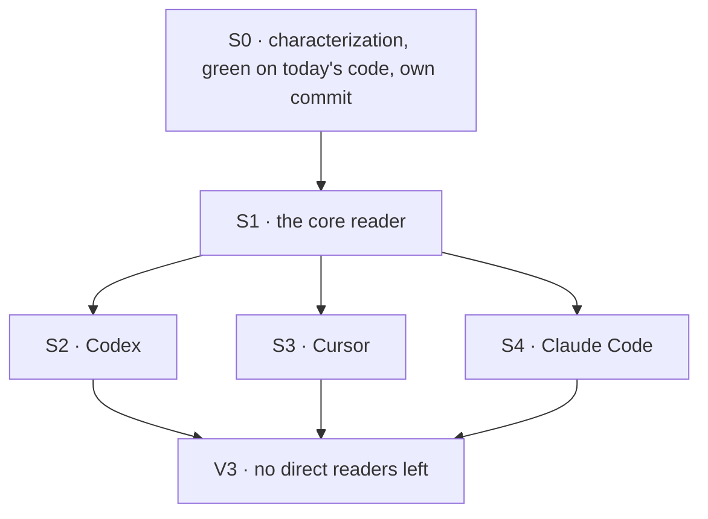

# FIX-1701 · Plan

[Spec](SPEC.md) · [Decisions](DECISIONS.md) · [Rules](BUSINESS-RULES.md) · **Plan** · [Docs](DOCS.md)

Written for the implementing agent. IDs cross-reference [BUSINESS-RULES.md](BUSINESS-RULES.md)
(BR-n) and [DECISIONS.md](DECISIONS.md) (D-n). `tdd`, in its refactor form: the characterization
is the red-green harness, and it goes green on today's code first. One PR. No changeset (D2:
nothing a consumer can see changes).

## Surfaces

| ID | Package · role | Change | Rules |
|---|---|---|---|
| S0 | `claude-code`, `codex`, `cursor` · each package's emit spec | **Characterization only, no source change.** Extend each package's existing emit spec to pin `taskId` and `ownedBy` presence and value on every item kind and every close path, across the identity matrix in V0. Committed alone, green on today's code | BR-1 – BR-10 |
| S1 | `core` · the module that types the runtime identity (`types/block.ts`) | Add `itemScope(ctx)`: returns `{ taskId?, ownedBy? }`, each key present only when the identity's field is `!== undefined`. Marked `@internal`; exported through `@flow-state-dev/core/types` (D2) | BR-11 |
| S2 | `codex` · the emitter | **Remove** its private scope reader and the scope type beside it; every former use spreads `itemScope(ctx)` | BR-1 – BR-5, BR-9, BR-10, BR-12 |
| S3 | `cursor` · the emitter | Same as S2 | same |
| S4 | `claude-code` · the emitter's shared item-fields stamp | Read the task id through `itemScope(ctx)` and stamp it as today. A comment at the call site says why the owner is not taken (D1, BR-6) | BR-1 – BR-3, BR-6 – BR-10, BR-12 |

Removed by this issue: the Codex and Cursor scope readers and their scope types, and Claude
Code's inline task-id cast. Provenance derivation stays copied in all three (follow-up).

## Sequence



S0 is the seam that matters: its commit touches test files only, and no later commit edits a V0
assertion.

## Checks

| ID | Runs after | Passes when |
|---|---|---|
| V0 | S0, and again after every later surface | Per package, for identity ∈ {none · task only · owner only · task and owner · empty-string task}, every item kind the emitter makes (message, reasoning, tool open and close, error; Claude Code also streamed-message and streamed-reasoning closes, turn-boundary flush, sub-agent container open and close, and items inside a sub-agent) carries exactly the scope keys BR-1 – BR-10 name, asserted on the item's key list, not only on values. Green on today's `main` **before** S1 |
| V0-ctl | S2 – S4 | Two temporary mutations of the reader, each reverted, each shown red in the PR: (a) never return `taskId` → V0 fails in all three packages on BR-1; (b) Claude Code's stamp spreads the whole reader → V0 fails in `claude-code` on BR-6. A V0 that stays green under either has verified nothing |
| V1 | S1 | Core unit test: no identity, neither field, task only, owner only, both, empty-string task → exactly the present keys (BR-11) |
| V2 | S4 | The existing sub-agent nesting tests in `claude-code` and the task-scope test driven through the real block (`_markTaskScope`) pass unchanged (BR-7, BR-1) |
| V3 | S2 – S4 | `AFTER=1 node specs/issues/FIX-1701/poc/scope-readers/check.mjs` passes: no emitter reads the task or owner off the identity itself, and every other identity reader outside core and engine is still classified (BR-12). It fails on today's `main`, which is its red state |
| V4 | all | `pnpm typecheck`, and the four packages' test suites, green |

No goal check: a pure refactor has no new outcome. V0 unchanged plus V0-ctl red is what proves
the goal ([SPEC](SPEC.md#the-goal-and-how-well-know-its-met)).

## Pinned names

| Where | Name | Why pinned |
|---|---|---|
| Core reader | `itemScope` | The issue names it; three packages import it |
| Return shape | `{ taskId?: string; ownedBy?: string }`, absent keys omitted | Codex and Cursor's call sites spread it unchanged, which is what makes their extract byte-identical |

Everything else is yours to name.

## Guardrails

| Rule | Because |
|---|---|
| V0 lands first, alone, and green on unmodified source | A characterization written after the extract describes the new code, not the old, and pins nothing |
| No V0 assertion changes in this PR | A changed assertion is a changed stamp; this desk ships none |
| The reader decides nothing about which owner to stamp | D1: the choice lives at each emitter's call site, so the Claude Code bug fix flips one line there and the reader stays put |
| Presence is `!== undefined` | All three copies use it today; truthiness silently drops an empty-string task (BR-3) |
| Don't touch core's own emit sites, provenance derivation, or the task-run link | Out of the issue's three emitters; each would move shape or meaning, not just location |
| Assert on key lists, not only values | `expect(item.ownedBy).toBeUndefined()` passes for a key set to `undefined`; BR-2 and BR-5 are about the key being absent |

## Docs

No reader-facing documentation changes; see [DOCS.md](DOCS.md) for the justification. Re-check it
after S4: if the reader ended up exported publicly after all, D2 has been broken and the spec
needs amending before the PR merges.

## Sketch · pseudocode, illustrative, react to the shape

```
core, beside the identity type:
    itemScope(ctx) → for each of task, owner: include it if the identity defines it

codex / cursor, the per-item base:     … ts, …itemScope(ctx)          (as today)
claude-code, the shared item stamp:    task ← itemScope(ctx).task       (owner: its sub-agent's, D1)
```

**POC:** `poc/scope-readers/check.mjs` re-derives the counted base this spec rests on. On
today's `main` it finds six identity readers outside core and engine, classifies all six (three
emitters in scope; Claude Code's agent, the task-board worker and one goal fixture out, with
reasons), and confirms Claude Code reads only the task while Codex and Cursor read both.
`PLANT=1` adds an unclassified reader and the check fails; `AFTER=1` fails on today's `main`.
The premise held: three emitters, two shapes, nothing else to fold in.

## At implement time

- Re-run the checker on fresh `main`. A new harness package, or a new identity reader, since
  this was written must be classified before S1.
- Claude Code's `itemFields` (the POC #2534 shape, folded into #2531) is the stamp S4 edits. If
  it has moved, S4 follows it; it does not re-spread scope at each close.
- If a Claude Code container-nesting bug has been filed and landed first, V0's BR-6 row is
  already flipped on `main`. Characterize what `main` does, not what this spec says.

## Follow-ups

- **Claude Code top-level items do not nest under an enclosing container** — a bug against the
  documented contract (D1). Not filed from here: this desk has no Linear write. Bug route, with
  a test that runs Claude Code inside a real owned container.
- Provenance derivation is copied in all three emitters, and core's own emit sites read the
  scope fields inline. Deepening opportunity; `improve-codebase-architecture`.
- The goal fixture `goals/app-lab/it-shows-and-stops-a-task-run/lab/lab.mts` hand-reads the task
  id as a stand-in harness. It could call the reader; left alone as a fixture.
