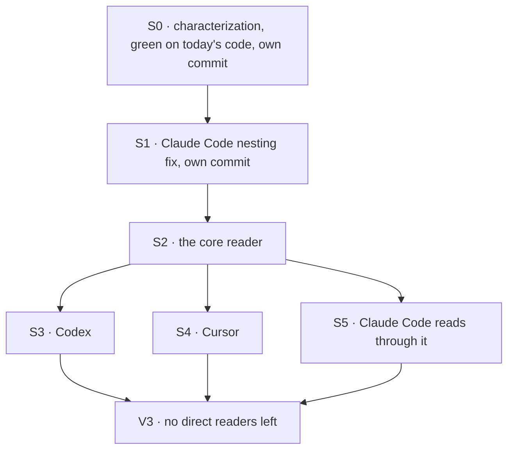

# FIX-1701 · Plan

[Spec](SPEC.md) · [Decisions](DECISIONS.md) · [Rules](BUSINESS-RULES.md) · **Plan** · [Docs](DOCS.md)

Written for the implementing agent. IDs cross-reference [BUSINESS-RULES.md](BUSINESS-RULES.md)
(BR-n) and [DECISIONS.md](DECISIONS.md) (D-n). `tdd`, in its refactor form: the characterization
is the red-green harness, and it goes green on today's code first. Then one dedicated step makes
the only behaviour change (D1: Claude Code nests under its container), with its own red test.
One PR. One patch changeset for `@flow-state-dev/claude-code` (S6); the reader itself adds none
(D2).

## Surfaces

| ID | Package · role | Change | Rules |
|---|---|---|---|
| S0 | `claude-code`, `codex`, `cursor` · each package's emit spec | **Characterization only, no source change.** Extend each package's existing emit spec to pin `taskId` and `ownedBy` presence and value on every item kind and every close path, across the identity matrix in V0. Pins today's output **including Claude Code's missing top-level `ownedBy`** (BR-6, BR-8 as on `main`). Committed alone, green on unmodified `main` | BR-1 – BR-10 |
| S1 | `claude-code` · the emitter · **the nesting fix, its own commit** | Claude Code stamps the runtime owner on every top-level item and on its sub-agent container items; items inside a sub-agent keep the sub-agent's owner (that owner wins). Flips **only** V0's Claude Code BR-6 and BR-8 owner assertions, and adds V5. No other V0 assertion changes, in any package | BR-6, BR-7, BR-8 |
| S2 | `core` · the module that types the runtime identity (`types/block.ts`) | Add `itemScope(ctx)`: returns `{ taskId?, ownedBy? }`, each key present only when the identity's field is `!== undefined`. Marked `@internal`; exported through `@flow-state-dev/core/types` (D2) | BR-11 |
| S3 | `codex` · the emitter | **Remove** its private scope reader and the scope type beside it; every former use spreads `itemScope(ctx)` | BR-1 – BR-5, BR-9, BR-10, BR-12 |
| S4 | `cursor` · the emitter | Same as S3 | same |
| S5 | `claude-code` · the emitter's shared item-fields stamp | Read the task id and the owner through `itemScope(ctx)` instead of S1's direct read. Pure refactor against S1's behaviour | BR-1 – BR-3, BR-6 – BR-10, BR-12 |
| S6 | `.changeset/` | A `patch` fragment for `@flow-state-dev/claude-code` naming FIX-1701: Claude Code runs inside a container now show their top-level steps inside it. Nothing for `core`, `codex` or `cursor` (BP-022: no consumer-visible change there) | — |

Removed by this issue: the Codex and Cursor scope readers and their scope types, and Claude
Code's inline scope cast. Provenance derivation stays copied in all three (follow-up).

## Sequence



Two seams matter. S0's commit touches test files only. S1's commit is the only one that edits a
V0 assertion, and only Claude Code's top-level owner rows. After S1, V0 as flipped plus V5 is
the truth, and S2 – S5 are a pure refactor against it: no later commit edits V0 or V5.

## Checks

| ID | Runs after | Passes when |
|---|---|---|
| V0 | S0, and again after every later surface | Per package, for identity ∈ {none · task only · owner only · task and owner · empty-string task}, every item kind the emitter makes (message, reasoning, tool open and close, error; Claude Code also streamed-message and streamed-reasoning closes, turn-boundary flush, sub-agent container open and close, and items inside a sub-agent) carries exactly the scope keys BR-1 – BR-10 name, asserted on the item's key list, not only on values. Green on today's `main` **before** S1, with Claude Code's top-level items pinned as owner-less. In S1 only those Claude Code owner rows flip; green again after |
| V5 | S1, and every later surface | **The goal check.** Claude Code's agent block runs as a step of a sequencer that declares a `container`, through the real block (`testBlock`), with a scripted SDK that emits a message, reasoning, a tool call and result, an error, and a sub-agent with one inner tool call. Every top-level item and the sub-agent container item carry the container's owner; the sub-agent's inner item carries the sub-agent's owner. **Fails on `main`** (shown red in the PR), passes after S1 |
| V0-ctl | S3 – S5 | Two temporary mutations, each reverted, each shown red in the PR: (a) the reader never returns `taskId` → V0 fails in all three packages on BR-1; (b) Claude Code's stamp drops the runtime owner → V5 goes red, and V0 fails in `claude-code` on BR-6. A check that stays green under either has verified nothing |
| V1 | S2 | Core unit test: no identity, neither field, task only, owner only, both, empty-string task → exactly the present keys (BR-11) |
| V2 | S1, S5 | The existing sub-agent nesting tests in `claude-code` and the task-scope test driven through the real block (`_markTaskScope`) pass unchanged (BR-7, BR-1) |
| V3 | S3 – S5 | `AFTER=1 node specs/issues/FIX-1701/poc/scope-readers/check.mjs` passes: no emitter reads the task or owner off the identity itself, and every other identity reader outside core and engine is still classified (BR-12). It fails on today's `main`, which is its red state |
| V4 | all | `pnpm typecheck`, and the four packages' test suites, green; the S6 changeset present and naming FIX-1701 |

V5 proves the behaviour change; V0 as flipped in S1, unchanged afterwards, plus V0-ctl red proves
the extract moved nothing else ([SPEC](SPEC.md#the-goal-and-how-well-know-its-met)).

## Pinned names

| Where | Name | Why pinned |
|---|---|---|
| Core reader | `itemScope` | The issue names it; three packages import it |
| Return shape | `{ taskId?: string; ownedBy?: string }`, absent keys omitted | Codex and Cursor's call sites spread it unchanged, which is what makes their extract byte-identical |
| Changeset | `patch` on `@flow-state-dev/claude-code`, text names FIX-1701 | A published package's stream output changes; pre-1.0, a bug fix is a patch |

Everything else is yours to name.

## Guardrails

| Rule | Because |
|---|---|
| V0 lands first, alone, and green on unmodified source | A characterization written after the change describes the new code, not the old, and pins nothing |
| Only S1 edits V0, and only Claude Code's BR-6 and BR-8 owner rows | Any other changed assertion is an unplanned changed stamp |
| After S1, the flipped rows and V5 are the truth | Nothing after S1 may restore today's missing owner, and no later commit edits V0 or V5 |
| The reader decides nothing about which owner wins | D1: the sub-agent-over-runtime precedence lives at Claude Code's call site; the reader returns what the identity carries |
| Presence is `!== undefined` | All three copies use it today; truthiness silently drops an empty-string task or owner (BR-3) |
| Don't touch core's own emit sites, provenance derivation, or the task-run link | Out of the issue's three emitters; each would move shape or meaning, not just location |
| Assert on key lists, not only values | `expect(item.ownedBy).toBeUndefined()` passes for a key set to `undefined`; BR-2 and BR-5 are about the key being absent |

## Docs

No reader-facing documentation changes; see [DOCS.md](DOCS.md) for the justification. The S6
changeset is the release note for the behaviour change. Re-check after S5: if the reader ended up exported publicly after all, D2 has been broken and the spec
needs amending before the PR merges.

## Sketch · pseudocode, illustrative, react to the shape

```
core, beside the identity type:
    itemScope(ctx) → for each of task, owner: include it if the identity defines it

codex / cursor, the per-item base:     … ts, …itemScope(ctx)                    (as today)
claude-code, the shared item stamp:    task, owner ← itemScope(ctx)
claude-code, each item:                ownedBy ← subAgentOwner(parentCallId) ?? owner
claude-code, a sub-agent container:    ownedBy ← owner                          (nested-container rule)
```

**POC:** `poc/scope-readers/check.mjs` re-derives the counted base this spec rests on. On
today's `main` it finds six identity readers outside core and engine, classifies all six (three
emitters in scope; Claude Code's agent, the task-board worker and one goal fixture out, with
reasons), and confirms Claude Code reads only the task on `main` while Codex and Cursor read both (the
asymmetry S1 removes).
`PLANT=1` adds an unclassified reader and the check fails; `AFTER=1` fails on today's `main`.
The premise held: three emitters, two shapes, nothing else to fold in.

## At implement time

- Re-run the checker on fresh `main`. A new harness package, or a new identity reader, since
  this was written must be classified before S1.
- Claude Code's `itemFields` (the POC #2534 shape, folded into #2531) is the stamp S1 and S5
  edit. If it has moved, they follow it; the owner precedence still applies at each item, and
  each close keeps the owner its open had.
- Characterize what `main` does, not what this spec says. If Claude Code already stamps the
  runtime owner by then, S1 has nothing to flip: say so in the PR and keep V5.

## Follow-ups

- Provenance derivation is copied in all three emitters, and core's own emit sites read the
  scope fields inline. Deepening opportunity; `improve-codebase-architecture`.
- The goal fixture `goals/shift-manager/it-shows-and-stops-a-task-run/lab/lab.mts` hand-reads the task
  id as a stand-in harness. It could call the reader; left alone as a fixture.
