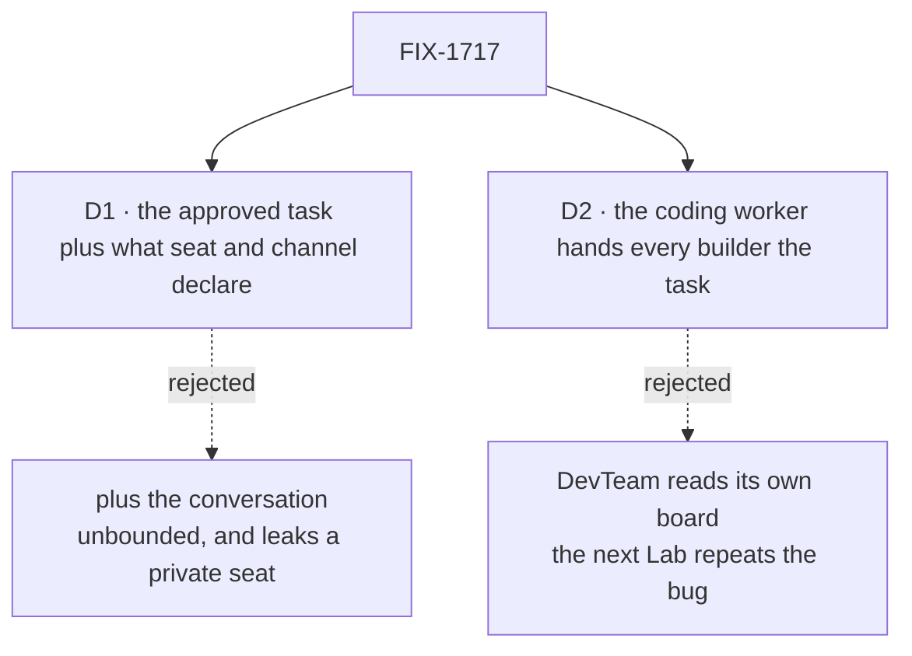

# FIX-1717 · Decisions

[Spec](SPEC.md) · **Decisions** · [Rules](BUSINESS-RULES.md) · [Plan](PLAN.md) · [Docs](DOCS.md) · [Evolution](EVOLUTION.md)

What was considered, what was chosen, why, and what each choice locks in. Two decisions are the
sign-off surface. Everything else here is context for them.

## The tree

Solid edges are what you're signing. Dashed edges lost, and the label says why.

## D1 · A run is handed the approved task plus what its seat and channel declare, never the conversation

| | |
|---|---|
| **Instead of** | Also handing the run the conversation around the task: the coordinator seat's session, or the channel's recent transcript |
| **Because** | The task is the brief. The board already carries one: a goal, and optionally a title, a context the filer writes for the worker, and the outputs of tasks it depends on. That is the explicit hand-off FIX-1394 settled with the owner on 2026-09-15: a required brief, channel context only where both seats share the channel, opt-in named packs, no parent history by default. A transcript is unbounded and changes daily, so two runs of one task would see different jobs (tenet 1). The coordinator's session is private to that seat |
| **Locks in** | A run knows only what is written on its task and its seat. Context reaches a run by being written on the task, never by having been said nearby. The DevTeam coordinator files a goal only, so that is all a DevTeam run gets beyond its seat's files and charter |

It comes down to what the run sees: a transcript makes the job whatever was said nearby that day.

**What would change my mind:** runs that keep failing for lack of something only the conversation
held. Then the next step is FIX-1394's opt-in, token-capped summary, written onto the task by the
filer, not a transcript dump.

## D2 · The coding worker every Lab uses hands its prompt builder the task it claimed

| | |
|---|---|
| **Instead of** | Fixing only DevTeam: its prompt builder reads the row back off its own board by id |
| **Because** | The worker is already handed the whole task by the board, goal included, and drops everything but the id before calling the builder. Every Lab that codes writes a builder, and the documented example builds its prompt from the id alone, so the next Lab would ship the same bug. Passing on what it already holds is the owning-layer fix (tenet 5), and it adds no concept: a task is task-board vocabulary, not a Workforce one |
| **Locks in** | A promise to anyone using `@flow-state-dev/harness-manager`: the prompt builder sees the task exactly as the board packed it, on every attempt. Additive, with a minor release note. Removing it later is a breaking change |

It comes down to the next Lab: with a DevTeam-only fix it builds from the row id again.

## Decided, not asked

- **DevTeam's builder puts the task first**, then the seat's instructions, its standing brief, its
  conventions, the charter, and the run's terms. Where the task and the brief disagree, the task
  is the job and the brief is how the team works. The coder's `WORKER.md` stops saying the brief
  is "what the feature is".
- **The charter rides only when the working seat is a declared member** of the channel whose board
  holds the task. That is the lean's "shared channel" test, read off the tree the Lab already loads.
- **Assembly stays in the Lab, not in Shift Manager's pages.** Shift Manager knows no Lab and sends
  only an approval or a post. A prompt assembled in a browser would be caller-controlled input
  (BP-031).
- **No harness adapter changes.** Claude Code, Codex and Cursor keep taking one prompt string.
- **The coordinator files nothing new.** It already puts the approved goal on the row. Giving the
  row a context the person never wrote would invent a brief.
- **The run's terms stay in the prompt; session policy does not.** Which session a run continues is
  the worker's resume feed, not prompt text.
- **Each optional task field is an absent key when the row lacks it**, as the board packs it.

## Considered and dropped

| Alternative | Why not |
|---|---|
| Change only DevTeam's builder to read the row off the board | Smallest diff. Lost to D2: it leaves the documented example and every other Lab building from the id |
| A context-pack helper or package beside the worker | A new concept for what one field carries. Invent-killed by the Architect: no second prompt bus, no L1 context package |
| Put the goal into the seat's brief document at filing time | Writes task data into a shared, org-scoped document. Two tasks would overwrite each other |
| Have Shift Manager send the context with the approval | The page would author the prompt. Caller-controllable, and Shift Manager is Lab-agnostic by design |

## Settled

- **The approved goal is dropped before the prompt** — **CONFIRMED** on `main` `85caed1e4`. The POC
  approved the held-out night-mode feature through the resume route. The row held the goal, and
  the prompt held the seat's tokens but neither the goal nor the charter
  ([`poc/approved-goal/`](poc/approved-goal/run.mts)).

## How it got here

- **Draft** — framed as a dropped goal, not thin text: the board hands the worker the approved task and the worker passes on only its id; the fix passes the task to every prompt builder and DevTeam's builder leads with it plus the shared charter; one PR with a two-leg goal check.

**Open: none.**
