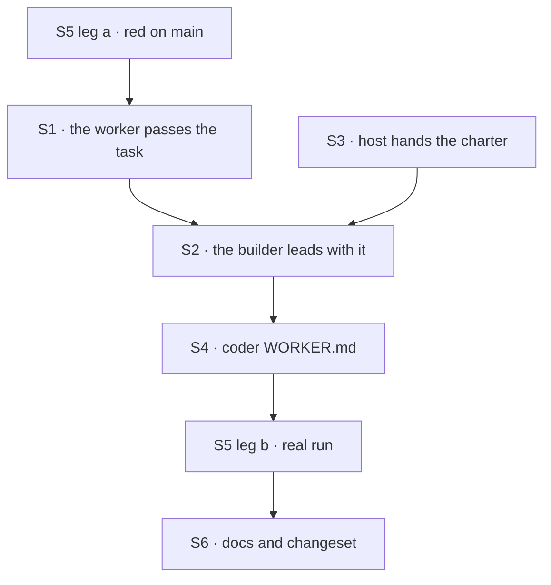

# FIX-1717 · Plan

[Spec](SPEC.md) · [Decisions](DECISIONS.md) · [Rules](BUSINESS-RULES.md) · **Plan** · [Docs](DOCS.md) · [Evolution](EVOLUTION.md)

Written for the implementing agent. IDs cross-reference [BUSINESS-RULES.md](BUSINESS-RULES.md)
(BR-n) and [DECISIONS.md](DECISIONS.md) (Dn). `tdd`. One PR.

## Where the goal is dropped today (`main` `85caed1e4`)

| Step | Where | What it holds |
|---|---|---|
| The coordinator files the approved feature | `goals/devforce-lab/lab/workforce/flows/workers/em.mts:300-308` → `addRow` `:181-188` | `goal` = the approved line; `input: { issue, phase }`. No title, no context |
| The board packs the worker's input | `packages/orchestration/src/task-board/blocks/worker-step.ts:135-147` (`packWorkerInput`) | `goal`, and `title`, `context`, `input`, `deps`, `priorWork` when present |
| The worker builds the builder's run context | `packages/harness-manager/src/manager.ts:1338-1352` (in `prepare`, input schema at `:1308`) | **Drops** the goal, title, context, input and prior outputs; keeps `attempts` and `feedback`. `PhaseRunContext` (`:112`) and `PromptRunContext` (`:159`) have no task field |
| DevTeam's builder | `goals/devforce-lab/lab/phase.mts:61-105` | Seat instructions, the seat's document, its skills, then `# This row` (`:96-100`): id, phase, attempt, checkout, branch |
| The coder's own file | `goals/devforce-lab/lab/workforce/teams/eng/workers/coder/WORKER.md:9-11` | Tells the run the brief document is "what the feature is" |

The channel record, charter included (`ChannelManifest.body`), is already in `openLab`'s hands at
`goals/devforce-lab/lab/host.mts:413` and never reaches the coder kind (`:457`).

## Surfaces

| ID | Package · role | Change | Rules |
|---|---|---|---|
| S1 | `harness-manager` · the builder's run context | Add `task` to `PhaseRunContext`: `goal`, plus `title`, `context`, `input`, `deps`, `priorWork` each only when the worker input has it. Filled in `prepare` from the input it already validated. `isDone` gets it too, at no cost (D2) | BR-2 BR-10 BR-11 BR-12 |
| S2 | DevTeam Lab · `phase.mts` builder | Lead with a task section from `run.task`. Keep the seat's three sections. Add the charter section when given one and the seat is a member. Replace `# This row`'s id-only line with the run's terms, naming the acceptance check when the phase requires it. **Remove** the id as the task's only description | BR-1 BR-3 BR-4 BR-6 |
| S3 | DevTeam Lab · `host.mts` | Hand the phase the channel record the host already resolved: id, charter, members. The membership test reads the woken seat's own id at run time | BR-3 BR-4 |
| S4 | DevTeam Lab · coder `WORKER.md` | **Remove** "Read your own feature brief for what the feature is". Say the row's task is the job and the brief is the team's standing contract. Keep `CODER-INSTRUCTIONS-B42D9` | BR-1 |
| S5 | Goal check · `goals/shift-manager/it-hands-a-run-the-work-it-approved/` | New. Leg a model-free with the lab's stub, leg b a real coding harness, control `drop-task`. Boots through `openLab` with the ask and the channel door on, as the `devteam` profile does. Leg a also files a second held-out feature by a post | BR-1 BR-3 BR-4 BR-6 BR-7 BR-8 BR-13 |
| S6 | Docs | [DOCS.md](DOCS.md) operations · one `minor` changeset for `@flow-state-dev/harness-manager` | — |

## Sequence



Write leg a first and watch it FAIL on `main` on "the prompt does not carry the approved goal".

## Checks

| ID | Runs after | Passes when |
|---|---|---|
| V1 | S1 | `harness-manager` spec: a builder sees `run.task.goal` on the first attempt, on a retry with feedback, and on the attempt after a person's message; optional fields present only when the row has them (BR-2 BR-10 BR-11) |
| V2 | S1 | Every existing `harness-manager` and `labs/conductor` test passes unchanged (BR-12) |
| V3 | S2 S3 | Goal leg a, including BR-4 on a tree copy with the coder removed from the channel's `members` |
| V4 | S4 | The four `devforce-lab` checks and `it-waits-for-a-person-before-it-files` PASS on the same head (BR-5) |
| VG | S5 | [The goal](SPEC.md#the-goal-and-how-well-know-its-met): both legs PASS, after both FAILED under `GOAL_CONTROL=drop-task` and leg a FAILED on `main` |
| V5 | S6 | `pnpm typecheck` and `pnpm --filter @flow-state-dev/harness-manager test` green; no diff under `packages/claude-code`, `codex`, `cursor`, `core`, `engine` (BR-13) |

## Pinned names

| Where | Name | Why pinned |
|---|---|---|
| The builder's run context | `task` | Public on a published package (D2). Its fields keep the board's own names: `goal`, `title`, `context`, `input`, `deps`, `priorWork` |
| Goal check control | `drop-task` | The spec's control; the PR must show its FAIL |

Everything else is yours to name.

## Guardrails

| Rule | Because |
|---|---|
| The task reaches the builder only through the worker's validated input, never a board read | The board already packed it; a second read can disagree with the claimed row (tenet 5) |
| Nothing in core or engine changes, and `harness-manager` gains no seat, channel or roster word | The owner's layer rule: Workforce concepts stay out of L1 |
| The charter is the only channel content in a prompt | D1. A transcript is unbounded and the lean forbids it |
| Membership is read off the declared tree and the seat's own id, never off the row or a request | Who may see a channel is not caller-controlled data (BP-031) |
| Optional fields are absent keys, never `undefined` values | The board's hand-off crosses process boundaries, where a present `undefined` is refused (FIX-982) |
| Every attempt rebuilds the task section | Retries and a person's turn re-enter the builder (BP-035) |

## Docs

Reconcile and publish [DOCS.md](DOCS.md) after VG passes. Three updates, no new page.

## Sketch and POC

```
worker, while preparing an attempt:
    run.task ← the brief fields of the input the board handed over   ← the whole framework change
DevTeam's builder:
    the task (goal; title, context, prior outputs when present)
    the seat's instructions · its standing brief · its conventions
    the channel's charter, if this seat is a member
    the run's terms: checkout, branch, what counts as done
    why the last attempt stopped, when it did
```

**POC:** [`poc/approved-goal/run.mts`](poc/approved-goal/run.mts) drives Shift Manager's own
approval path, model-free, and prints the prompt the run was handed. On `main` `85caed1e4` it
reports CONFIRMED: the row holds the approved goal, the prompt holds the seat's instructions token
(the positive control) but neither the goal nor the charter token. `AFTER=1` grades the target
state and FAILS today. It is the draft of S5's leg a.

## At implement time

- Re-read `PromptRunContext` and `prepare` on `main`. A sibling may have touched them; FIX-1701's
  open POC (#2570) does not.
- The `devteam` profile's ask fixture names night mode while its scratch repository and brief are
  about a greeting module. That's fine for leg a. Leg b's fixture should name one file and one token, so
  the commit is gradable without judging the model's code.

## Follow-ups

- Shift Manager's task screen shows "a task's context and input" as not planned. Showing a person
  what a run was handed is its own issue; this spec only makes the handed content correct.
- `labs/conductor`'s implement phase builds from the Linear id by design. Left as is.
