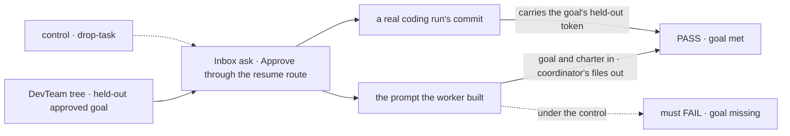
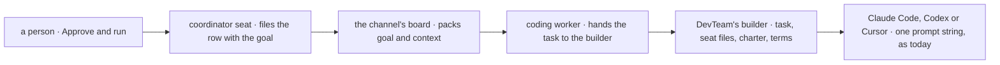

# FIX-1717 · Shift Manager coding runs get only thin task text — harnesses need real work context to do the job

**Spec** · [Decisions](DECISIONS.md) · [Rules](BUSINESS-RULES.md) · [Plan](PLAN.md) · [Docs](DOCS.md) · [Evolution](EVOLUTION.md)

## Who feels this, before and after

| Someone who… | Today | After |
|---|---|---|
| **approves a feature in Shift Manager's Inbox** (Approve & run) | The coding run never sees what they approved. It is told to build whatever the coder seat's standing brief describes: approve a night-mode toggle and the run is pointed at a greeting module | The run's prompt opens on the task they approved, word for word |
| **posts `slug: what to build` on a workstream** | The same: the line files a row, and the row's goal never reaches the run | The same fix: the run starts from the goal the post filed |
| **writes a team's channel charter** | The charter shapes nothing the coding run sees | A coder seat that is a member of the channel holding the task gets the charter. A seat that isn't, doesn't |
| **keeps notes and asks in the coordinator seat's session** | They stay out of the run | Still out. The run never gets the coordinator's session or the channel transcript ([D1](DECISIONS.md#d1)) |
| **builds the next Lab on the coding worker** | Its prompt builder is handed the row's id and must read the board itself to learn what the task is. The documented example doesn't | Its prompt builder is handed the task as the board packed it ([D2](DECISIONS.md#d2)) |

The approved goal isn't thin, it's dropped. It reaches the coding worker on the row, and the
worker builds a prompt naming the row by id only. A POC drove Shift Manager's own approval path on
today's `main` and printed what the run got ([PLAN → POC](PLAN.md#sketch-and-poc)).

## The goal, and how we'll know it's met

**A coding run started from Shift Manager is handed the work a person approved, with the context
its seat and channel declare and nothing private to another seat, and a real run does that
work.**

| Is it the right goal? | |
|---|---|
| **The real need** | "When a person starts/approves work from Shift Manager into a coding harness … the harness receives a complete, honest context pack so it can actually execute — not a stub line" ([FIX-1717](https://linear.app/fixpoint-labs/issue/FIX-1717), *Desired outcome*), under the explicit-handoff lean from FIX-1394 |
| **Smaller, and rejected** | "The prompt contains the goal." Hittable with a model-free stub while no real run ever does the approved work, and while the charter and the run's terms still never arrive |
| **Bigger, and not this issue's** | Showing a person, in Shift Manager, what a run was handed: the task screen's "context and input" placeholder. Answering a run's question (FIX-1671, FIX-1673). Which environment keys a run inherits (FIX-1716) |
| **Not done if** | Only the stub saw the goal · the goal reaches the prompt by another route than the board's hand-off · the coordinator's own instructions or document appear in the run's prompt · the seat's own files stopped reaching it · the real-model leg was skipped |



Both legs read what the run received or produced, never the row. Under the control both must fail.

| How we verify | |
|---|---|
| **Goal check** | `goals/shift-manager/it-hands-a-run-the-work-it-approved/` · leg a model-free, leg b a real coding harness · run by the implementer at completion · verdict in the implementation PR |
| **Signal** | Leg a: the stub's recorded prompt carries the held-out goal and the charter's token, still carries the coder seat's own tokens, and carries none of the coordinator seat's tokens or a held-out line posted on the channel. Leg b: the run's commit carries the held-out token the goal names |
| **Input** | A held-out feature in a fixture: a slug and a goal naming one file and one token, spelled in no lab code. A different valid feature must pass too |
| **Anti-game** | Never assert on the row, on `lab.file`, or on a builder called by the check. The approval goes through the engine's resume route with the lab's bearer, as Shift Manager sends it |
| **Control that must fail** | `GOAL_CONTROL=drop-task`: leg a FAILS on "the prompt does not carry the approved goal", leg b on "the commit does not carry the goal's token". Today's `main` FAILS leg a the same way |

## What changes


The two green boxes are new. Everything below the fence stays out, before and after.

**What a phase's prompt builder writes:**

```diff
  buildPrompt: (run) =>
-   `Implement ${run.issue} in ${run.workspacePath}.`,
+   `${run.task.goal}\n\nWork in ${run.workspacePath}, on branch ${run.branch}.`,
```

`run.task` is the row as the board handed it over: its goal, plus title, context, input and prior
outputs when the row has them.

## How it reaches the run



The goal already reaches the worker. The worker now passes it on, and the Lab's builder puts it
first.

## What stays as it is

- Claude Code, Codex and Cursor: the prompt is still one string, in the format each accepts.
- The board, the hand-off and what the coordinator files. Shift Manager's pages send nothing new.
- A person's message to a running task (FIX-1690) still arrives after the prompt, marked as theirs.
- `@flow-state-dev/core` and `@flow-state-dev/engine`: no change, and no seat or channel vocabulary.

## Sign off

**[The goal](#the-goal-and-how-well-know-its-met), at that size:** the approved work, the declared
context, nothing private, and a real run doing it. If wrong: we ship a prompt that looks right in
a stub while no run ever builds what was approved, or hold the issue for a Shift Manager screen it
was never meant to build.

1. **[D1](DECISIONS.md#d1) · A run is handed the approved task plus what its seat and channel
   declare, never the conversation.** If wrong: runs fail for want of something said only in
   chat, and the fix is writing it on the task until a capped summary exists.
2. **[D2](DECISIONS.md#d2) · The coding worker every Lab uses hands its prompt builder the task.**
   If wrong: one additive field on a published type we could have kept inside DevTeam.

**Open: none.** D1 is the one to weigh. Reasoning and what lost: [DECISIONS.md](DECISIONS.md).
The cases: [BUSINESS-RULES.md](BUSINESS-RULES.md).

Feature · `harness-manager` + the DevTeam Lab (`goals/devforce-lab/lab`) + docs · small · 1 PR · trails epic FIX-1649, not nested
